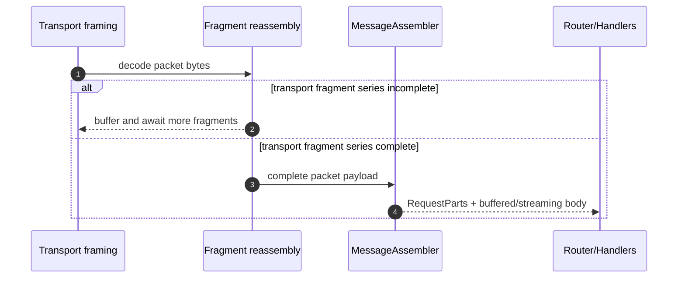

# ADR 0002: Streaming requests and shared message assembly

## Status

Proposed (2025-12-12)

## Deciders

- Wireframe maintainers

## Context

Wireframe already provides protocol-agnostic support for streaming responses
(`Response::Stream`) and multi-packet responses, with back-pressure emerging
from the connection actor’s ownership of the outbound write loop.[^streaming]
Wireframe also has a protocol-agnostic fragmentation and reassembly layer that
can transparently reconstruct logical messages before routing.[^fragmentation]

Downstream protocol implementations still end up writing substantial bespoke
plumbing for large inbound messages and multi-frame requests:

- inbound request payloads must be fully buffered and reassembled before
  dispatch, even when a handler could process the body incrementally;
- many protocols share similar “fixed header + total size + per-frame chunk
  size + continuation frames” patterns, but each crate re-implements the
  buffering, limit enforcement, and continuity checks; and
- memory limits and early-abort policies are often pushed into each protocol
  crate, leading to inconsistent back-pressure and denial-of-service (DoS)
  behaviour across the ecosystem.

This is in tension with Wireframe’s 1.0 philosophy: provide a protocol-agnostic
“duplex frame highway” where cross-cutting hardening and ergonomics are solved
centrally, with clear extension points for protocol-specific
rules.[^philosophy] The production resilience guidance also emphasises explicit
resource caps, timeouts, and early termination at the framework layer, rather
than ad hoc per-protocol handling.[^hardening]

## Decision

Wireframe will add first-class, protocol-agnostic support for streaming
requests and shared multi-frame message assembly. The design is additive and
opt-in: existing handlers and protocols continue to work unchanged.

### 1) First-class streaming request bodies

Wireframe will expose a handler-facing request shape that can separate metadata
from the payload, so handlers can choose between buffered and streaming
consumption.

The handler-facing shapes are:

```rust,no_run
use bytes::Bytes;
use futures_core::stream::Stream;
use std::{pin::Pin, result::Result};

/// Request metadata extracted outwith the request body.
pub struct RequestParts {
    /// Protocol-specific packet or message identifier used for routing.
    pub id: u32,
    /// Correlation identifier, if present.
    pub correlation_id: Option<u64>,
    /// Protocol-defined metadata bytes (for example headers) required to
    /// interpret the body.
    pub metadata: Vec<u8>,
}

/// Streaming request body.
pub type RequestBodyStream =
    Pin<Box<dyn Stream<Item = Result<Bytes, std::io::Error>> + Send + 'static>>;
```

- Handlers MAY receive `RequestParts` plus `RequestBodyStream` rather than a
  fully reassembled `Vec<u8>`.
- Wireframe MAY expose an `AsyncRead` adaptor for `RequestBodyStream` so
  protocol crates can reuse existing parsers.
- The default remains “buffered request” to preserve Wireframe’s existing
  transparent assembly ergonomics for small messages and simple protocols.

This decision is symmetrical with `Response::Stream`, but applies the same
capability-maturity constraints as existing features: opt-in, explicit, and
safe by default.[^philosophy]

### 2) A generic multi-frame message assembler abstraction

Wireframe will provide a generic message assembly hook (conceptually a
`MessageAssembler`) so protocol crates can supply protocol-specific parsing and
continuity rules, while Wireframe supplies the shared buffering machinery and
limit enforcement.

#### Composition with transport-level fragmentation and reassembly

`MessageAssembler` is not a replacement for transport-level fragmentation and
reassembly. The features operate at different layers:

- Transport fragmentation/reassembly reconstructs a *single* logical packet
  whose payload was split across transport fragments, and is intended to be
  transparent to routing and handlers.[^fragmentation]
- `MessageAssembler` reconstructs (or streams) a *protocol message* whose body
  is split across *multiple protocol packets* (for example, an initial header
  packet plus N continuation packets).

When both are enabled, Wireframe applies them in the following order:

1. Decode one packet from the transport framing (for example a
   length-delimited codec).
2. Apply transport reassembly if the packet is a fragment; yield a complete
   packet payload once the fragment series is complete.
3. Apply `MessageAssembler` to complete packets to produce either:
   - one buffered request body, or
   - a streaming request body that the handler consumes incrementally.
4. Route and invoke handlers.

This ordering ensures protocol crates migrating to `MessageAssembler` do not
need to special-case transport fragments: the assembler only sees complete
packet payloads and focuses on protocol continuity rules.

For screen readers: the following sequence diagram shows the decode → fragment
reassembly → message assembly → handler pipeline.



At a minimum, the hook must allow a protocol to provide:

- a per-frame header parser (including “first frame” versus “continuation
  frame” handling);
- a message key for multiplexing interleaved assemblies;
- declared or inferred expected total size (when available);
- per-fragment length expectations; and
- continuity validation (ordering, missing fragments, duplicate fragments).

Wireframe will provide, centrally:

- buffering and assembly state management;
- enforcement of maximum total message size, maximum fragment size, timeouts,
  and “max in-flight bytes”; and
- a clear failure mode (back-pressure where safe, early abort where required).

This generalises the intent of the existing fragmentation adapter design
without introducing protocol-specific assumptions.[^fragmentation]

#### Failure modes and cleanup semantics

Wireframe will make budget failures explicit and deterministic so protocol
implementers can rely on the behaviour across crates:

- **Soft budget pressure (back-pressure):** when inbound buffering approaches
  the per-connection in-flight cap, Wireframe MUST stop reading further packets
  from the socket until buffered bytes fall below the cap. For streaming bodies
  backed by bounded queues, this naturally suspends the reader when the queue
  is full.
- **Hard cap exceeded during assembly (pre-handler):** if accepting a fragment
  or continuation packet would exceed the configured per-message or per-
  connection cap, Wireframe MUST:
  - abort that in-flight assembly immediately;
  - drop and free the partial buffers for the affected message key; and
  - surface `std::io::ErrorKind::InvalidData` from the inbound processing
    path, applying the same decode-failure policy as other invalid inbound
    frames.

  No handler is invoked for the aborted message. Wireframe does not attempt to
  synthesise a protocol error response at this stage; clients observe a closed
  connection unless the protocol itself provides an earlier, explicit error
  path.
- **Hard cap exceeded during handler body streaming:** `RequestBodyStream` MUST
  yield a `std::io::Error` (with `std::io::ErrorKind::InvalidData`) and then
  terminate.

  Wireframe MUST record the request as failed for observability and MUST
  release any remaining buffered bytes for the message key. Wireframe MUST
  continue processing subsequent requests on the connection unless the protocol
  crate chooses to close the connection as part of its error handling.

  If the handler ignores the error, it does so with incomplete data:
  `RequestBodyStream` has terminated, so the handler cannot recover the
  remaining bytes. The handler MAY still translate the error into a protocol
  response.

These rules ensure partial assemblies never linger after a limit is exceeded,
and that “bytes buffered” accounting returns to a consistent state promptly.

### 3) Configurable per-connection memory budgets and back-pressure

Wireframe will standardise memory budgeting for inbound assembly and buffering
at the connection layer, so protocols do not need to implement their own
resource accounting to remain safe.

#### Configuration surface and precedence

Budgets will be configured on the connection’s `WireframeApp` instance. Because
`WireframeServer` constructs a fresh `WireframeApp` from the factory closure
per accepted connection, these settings are naturally per-connection.

- Wireframe will add a `WireframeApp` builder method (for example
  `memory_budgets(...)`) to explicitly set budgets.
- Wireframe MAY also expose optional global budget caps on `WireframeServer` so
  operators can bound total buffered bytes across all connections.
- If budgets are not set explicitly, defaults MUST be derived from
  `buffer_capacity` in the same way fragmentation defaults are derived today
  (for example, scaling a maximum message size from the per-connection frame
  budget).[^hardening]
- If both transport fragmentation and `MessageAssembler` are enabled, the
  effective message cap is whichever guard triggers first. Operators SHOULD set
  the fragmentation `max_message_size` and the message assembly per-message cap
  to compatible values to avoid surprising early termination.

Precedence is:

1. Per-connection budgets set on the `WireframeApp` instance.
2. Optional global budget caps (if enabled).
3. Derived defaults based on `buffer_capacity` (and, where appropriate, the
   configured fragmentation settings).

#### Budget enforcement

- Budgets MUST cover: bytes buffered per message, bytes buffered per
  connection, and bytes buffered across in-flight assemblies.
- When budgets are approached, Wireframe SHOULD apply back-pressure by pausing
  further reads / assembly work rather than eagerly buffering more data.
- When a hard cap is exceeded, Wireframe MUST abort early and release partial
  state.

This aligns with the existing hardening guidance and extends it beyond
fragmentation to cover streaming request bodies and other assembly
paths.[^hardening]

### 4) A “write from reader/stream” transport helper

Wireframe will provide a transport-level helper (conceptually
`send_streaming(frame_header, body_reader)`) that:

- reads from an `AsyncRead` or byte stream;
- emits frames using a configured chunk size (with protocol-provided headers);
- handles flushing and timeouts consistently; and
- integrates with the existing connection actor, instrumentation, and hooks.

This reduces duplicate “read N bytes, stamp header, write frame” loops across
protocol implementations while keeping header semantics protocol-defined.

Timeouts MUST fail the current send operation and MUST not emit a partial frame.

If a timeout occurs, `send_streaming` MUST return
`std::io::ErrorKind::TimedOut` to the caller and MUST stop emitting further
frames for that operation. The connection actor SHOULD treat this as a
transport-level write failure and terminate the connection, because the peer
may have observed a truncated frame on the wire.

Retries MUST be treated as non-idempotent unless the protocol header semantics
make duplication safe.

`send_streaming` MUST not perform automatic retries. Callers MUST assume the
operation may have been partially successful: any frames sent before the error
remain sent.

### 5) Testkit utilities for fragmentation and streaming

Wireframe will publish official test utilities that can:

- feed partial frames / fragments into an in-process app;
- simulate slow readers and writers to exercise back-pressure; and
- assert emitted frames and reassembly outcomes deterministically.

These utilities should build on the existing `wireframe_testing` companion
crate, and may be re-exported as `wireframe::testkit` behind a dedicated
feature to keep the core crate lightweight.[^testing]

## Consequences

- Wireframe gains an explicit “streaming request body” surface alongside the
  existing streaming response surface, with clear opt-in semantics.
- The fragmentation / reassembly implementation is factored so its buffering
  and limit enforcement can be reused for other multi-frame assembly patterns.
- Connection configuration must grow to represent per-connection memory
  budgets, and the connection actor must consistently apply those budgets for
  inbound buffering and assembly.
- Transport code gains a reusable “write from reader/stream” helper, reducing
  duplicated protocol implementations and making timeout and chunking behaviour
  consistent.
- The test helper story becomes first-class, enabling downstream protocol crates
  to write behavioural tests for fragmentation and streaming without
  re-building bespoke harnesses.

[^streaming]:
    See `docs/multi-packet-and-streaming-responses-design.md` and
    [ADR 0001](0001-multi-packet-streaming-response-api.md).

[^fragmentation]:
    See `docs/generic-message-fragmentation-and-re-assembly-design.md`.

[^philosophy]:
    See `docs/the-road-to-wireframe-1-0-feature-set-philosophy-and-capability-maturity.md`.

[^hardening]:
    See `docs/hardening-wireframe-a-guide-to-production-resilience.md`.

[^testing]:
    See `docs/wireframe-testing-crate.md`.
