# Comprehensive Design: Asynchronous Outbound Messaging

## 1. Introduction & Philosophy

The initial versions of `wireframe` established a robust, strictly
request-response communication model. While effective for many RPC-style
protocols, this model is insufficient for the rich, bidirectional conversations
common in modern network services like database clients, message brokers, and
real-time applications.

This document details the design for a first-class, asynchronous outbound
messaging feature. The core philosophy is to evolve `wireframe` from a simple
request-response router into a fully **asynchronous, duplex message bus**. This
will be achieved by providing a generic, protocol-agnostic facility that allows
any part of an application—a request handler, a background timer, a separate
worker task—to push frames to a live connection at any time.

Earlier releases spawned a short-lived worker per request. This approach made
persistent state awkward and required extra synchronisation when multiple tasks
needed to write to the same socket. The new design promotes each connection to
a **stateful actor** that owns its context for the lifetime of the session.
Actor state keeps sequencing rules and push queues local to one task,
drastically simplifying concurrency while enabling unsolicited frames.

This feature is a cornerstone of the "Road to Wireframe 1.0" and is designed to
be synergistic with the planned streaming and fragmentation capabilities,
creating a cohesive and powerful framework for a wide class of network
protocols.

### Implementation Status

An initial connection actor with its biased write loop is implemented in
`src/connection.rs`. The remaining sections explain the rationale behind this
design and possible refinements. See
[Section 3](#3-core-architecture-the-connection-actor) for details.

## 2. Design Goals & Requirements

The implementation must satisfy the following core requirements:

| ID | Requirement                                                                                                                                            |
| --- | ------------------------------------------------------------------------------------------------------------------------------------------------------ |
| G1 | Any async task must be able to push frames to a live connection.                                                                                       |
| G2 | Ordering-safety: Pushed frames must interleave correctly with normal request/response traffic and respect any per-message sequencing rules.            |
| G3 | Back-pressure: Writers must block (or fail fast) when the peer cannot drain the socket, preventing unbounded memory consumption.                       |
| G4 | Generic—independent of any particular protocol; usable by both servers and clients built on wireframe.                                                 |
| G5 | Preserve the simple “return a reply” path for code that does not need pushes, ensuring backward compatibility and low friction for existing users.     |

## 3. Core Architecture: The Connection Actor

The foundation of this design is the **actor-per-connection** model, where each
network connection is managed by a dedicated, isolated asynchronous task. This
approach serializes all I/O for a given connection, eliminating the need for
complex locking and simplifying reasoning about concurrency.

In previous iterations, a connection's logic lived in short-lived worker tasks
spawned per request. Converting those workers into long-running actors allows
`wireframe` to maintain per-connection state—such as sequence counters, command
metadata, and pending pushes—without cross-task sharing. Handlers now send
commands back to the actor instead of writing directly to the socket,
centralizing all output in one place.

### 3.1 Prioritised Message Queues

To handle different classes of outbound messages, each connection actor will
manage two distinct, bounded `tokio::mpsc` channels for pushed frames:

1. `high_priority_push_rx: mpsc::Receiver<F>`: For urgent, time-sensitive
   messages like heartbeats, session control notifications, or protocol-level
   pings.

2. `low_priority_push_rx: mpsc::Receiver<F>`: For standard, non-urgent
   background messages like log forwarding or secondary status updates.

The bounded nature of these channels provides an inherent and robust
back-pressure mechanism. When a channel's buffer is full, any task attempting
to push a new message will be asynchronously suspended until space becomes
available.

### 3.2 The Prioritised Write Loop

The connection actor's write logic will be implemented within a
`tokio::select!` loop. Crucially, this loop will use the `biased` keyword to
ensure a strict, deterministic polling order. This prevents high-volume yet
critical control messages from being starved by large data streams.

The polling order will be:

1. **Graceful Shutdown Signal:** The `CancellationToken` will be checked first
   to ensure immediate reaction to a server-wide shutdown request.

2. **High-Priority Push Channel:** Messages from `high_priority_push_rx` will be
   drained next.

3. **Low-Priority Push Channel:** Messages from `low_priority_push_rx` will be
   processed after all high-priority messages.

4. **Handler Response Stream:** Frames from the active request's
   `Response::Stream` will be processed last.

```rust
// Simplified pseudo-code for the actor's write loop
loop {
    tokio::select! {
        biased;

        // 1. Highest priority: Graceful shutdown
        _ = shutdown_token.cancelled() => {
            tracing::info!("Shutdown signal received, terminating connection.");
            break;
        },

        // 2. High-priority server pushes
        Some(frame) = high_priority_push_rx.recv() => {
            send_frame(frame).await?;
        },

        // 3. Low-priority server pushes
        Some(frame) = low_priority_push_rx.recv() => {
            send_frame(frame).await?;
        },

        // 4. Standard response stream for the current request
        Some(result) = resp_stream.next() => {
            let frame = result?;
            send_frame(frame).await?;
        },

        // All sources are idle or complete
        else => { break; }
    }
}
```

#### 3.2.1 Fairness for low-priority frames

Continuous bursts of urgent messages can prevent the low-priority queue from
ever being drained. To mitigate this without removing the deterministic bias,
each `ConnectionActor` tracks how many high-priority frames have been processed
in a row. After a configurable threshold (`max_high_before_low`), the actor
checks `low_priority_push_rx.try_recv()` and, if a frame is present, processes
it and resets the counter.

An optional time slice (for example 100 µs) can also be configured. When the
elapsed time spent handling high-priority frames exceeds this slice, and the
low queue is not empty, the actor yields to a low-priority frame. Application
builders expose `with_fairness(FairnessConfig)` where `FairnessConfig` groups
the counter threshold and an optional `time_slice`. The counter defaults to 8
while `time_slice` is disabled. Setting the counter to zero disables the
threshold logic and relies solely on `time_slice` for fairness, preserving
strict high-priority ordering otherwise.

This fairness mechanism ensures low-priority traffic continues to progress even
under sustained high-priority load.

<!-- markdownlint-disable MD033 -->

The flow diagram below summarises the fairness logic.

<description>The diagram shows how the actor yields to the low-priority queue
after N high-priority frames.</description>

<!-- markdownlint-enable MD033 -->
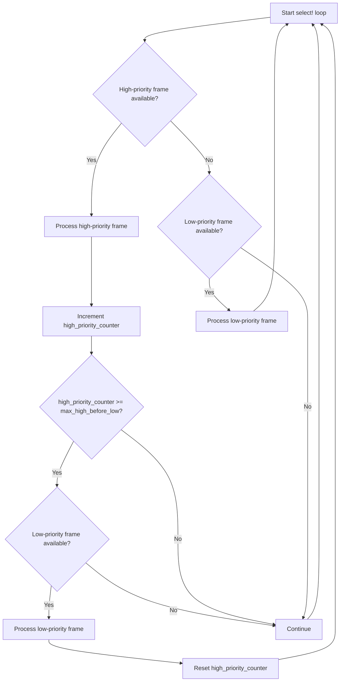

The following sequence diagram illustrates the runtime behaviour:

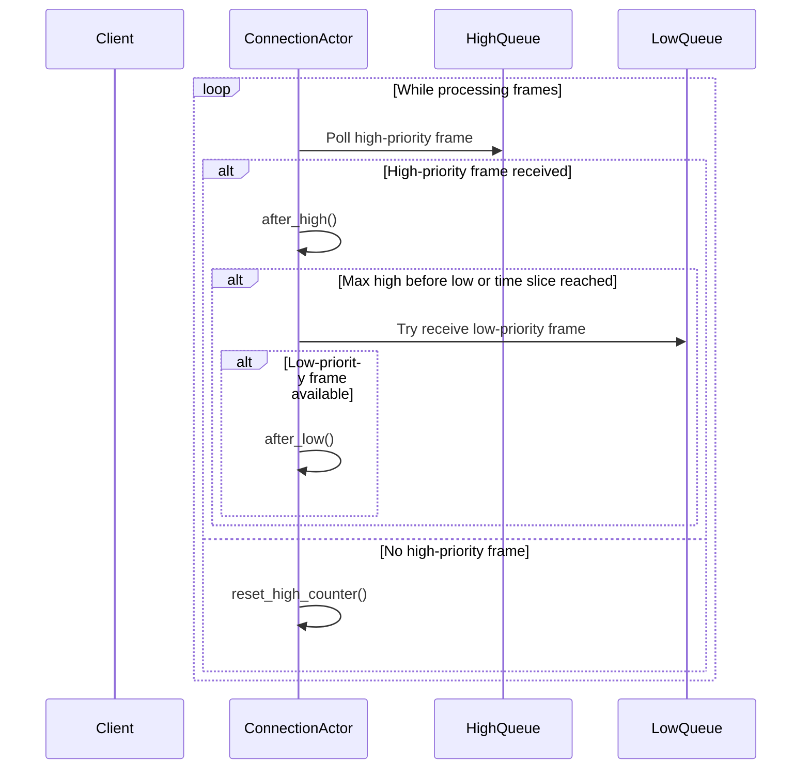

### 3.3 Connection Actor Overview

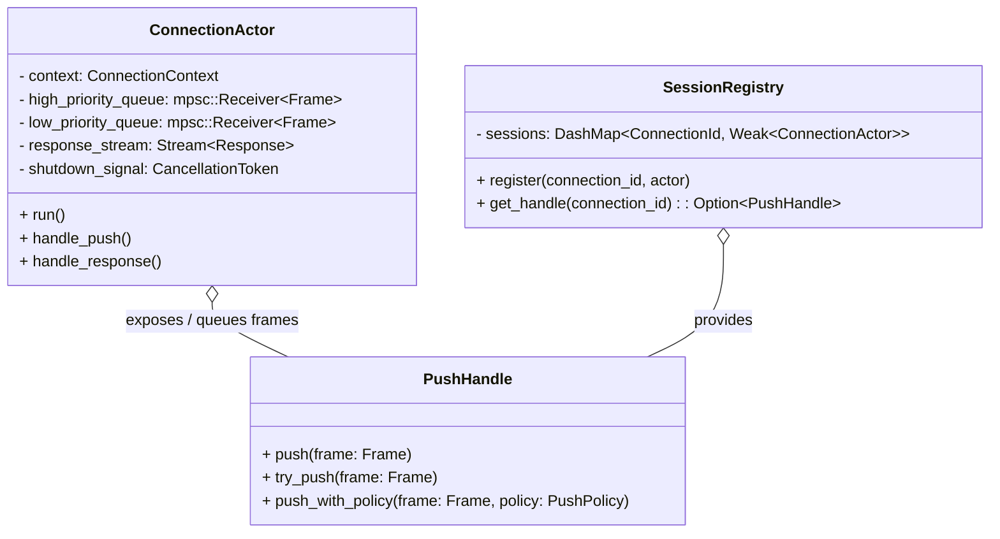

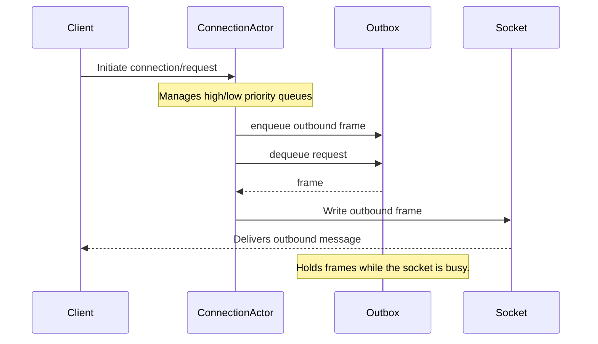

### 3.4 Actor state management

The connection actor polls four sources: a shutdown token, high- and
low-priority push channels, and an optional response stream. Earlier drafts
tracked a boolean for each source, leading to verbose state updates. The actor
now stores each receiver as an `Option` and counts how many sources have closed.

```rust
enum RunState {
    Active,
    ShuttingDown,
    Finished,
}

struct ActorState {
    run_state: RunState,
    closed_sources: usize,
    total_sources: usize,
}
```

`total_sources` is calculated when the actor starts. Whenever a receiver
returns `None`, it is set to `None` and `closed_sources` increments. When
`closed_sources == total_sources` the loop exits. This consolidation clarifies
progress through the actor lifecycle and reduces manual flag management.

## 4. Public API Surface

The public API is designed for ergonomics, safety, and extensibility.

### 4.1 The `PushHandle`

The primary user-facing primitive is the `PushHandle`, a cloneable handle that
provides the capability to send frames to a specific connection.

```rust
// The internal state, managed by an Arc for shared ownership.
struct PushHandleInner<F> {
    high_prio_tx: mpsc::Sender<F>,
    low_prio_tx: mpsc::Sender<F>,
    // Other shared state like rate limiters can be added here.
}

// The public, cloneable handle.
#[derive(Clone)]
pub struct PushHandle<F>(Arc<PushHandleInner<F>>);

pub enum PushPolicy {
    ReturnErrorIfFull,
    DropIfFull,
    WarnAndDropIfFull,
}

impl<F: FrameLike> PushHandle<F> {
    /// Push a high-priority frame. Awaits if the queue is full.
    pub async fn push_high_priority(&self, frame: F) -> Result<(), PushError>;

    /// Push a low-priority frame. Awaits if the queue is full.
    pub async fn push_low_priority(&self, frame: F) -> Result<(), PushError>;

    /// Push a frame according to a specific policy for when the queue is full.
    pub fn try_push(
        &self,
        frame: F,
        priority: PushPriority,
        policy: PushPolicy,
    ) -> Result<(), PushError>;
}
```

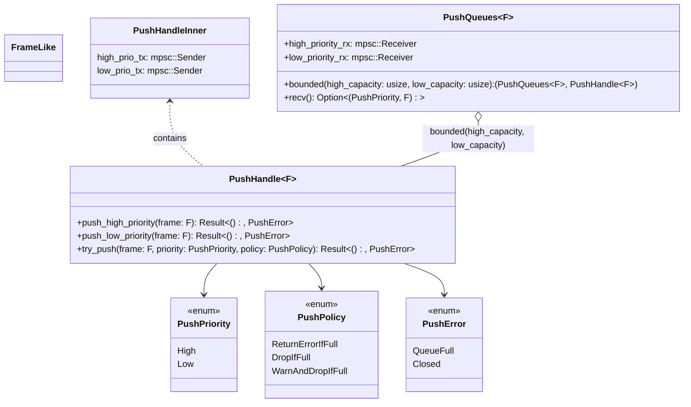

The diagram uses `~F~` to represent the `<F>` generic parameter because Mermaid
treats angle brackets as HTML.

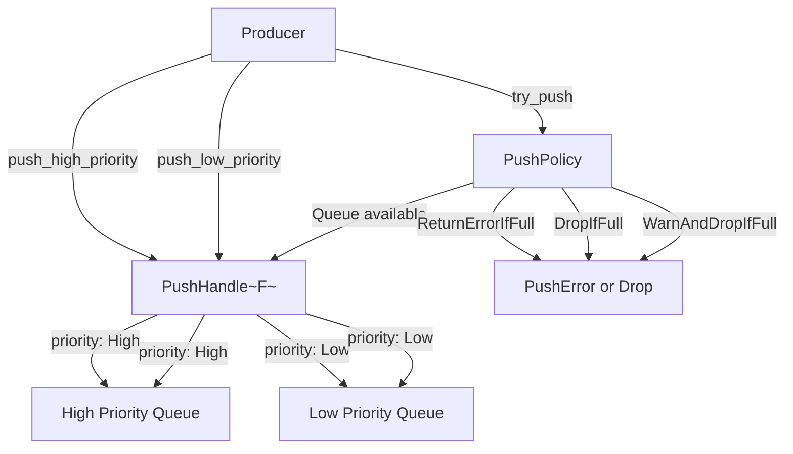

This API gives developers fine-grained control over both the priority and the
back-pressure behaviour of their pushed messages.

### 4.2 The `SessionRegistry`

To allow background tasks to discover and message active connections, a
`SessionRegistry` will be provided. To prevent memory leaks, this registry
**must** be implemented using non-owning `Weak` references.

```rust
use dashmap::DashMap;
use std::sync::{Arc, Weak};

// The registry stores Weak pointers, preventing it from keeping connections alive.
pub struct SessionRegistry<F>(DashMap<ConnectionId, Weak<PushHandleInner<F>>>);

impl<F> SessionRegistry<F> {
    /// Attempts to retrieve a live PushHandle for a given connection.
    /// Entries whose handles have been dropped are removed lazily.
    pub fn get(&self, id: &ConnectionId) -> Option<PushHandle<F>> {
        let guard = self.0.get(id);
        let handle = guard.as_ref().and_then(|w| w.upgrade());
        drop(guard);
        if handle.is_none() {
            self.0.remove_if(id, |_, weak| weak.strong_count() == 0);
        }
        handle.map(PushHandle)
    }

    /// Inserts a new handle into the registry.
    pub fn insert(&self, id: ConnectionId, handle: &PushHandle<F>) {
        // Downgrade the Arc to a Weak pointer for storage.
        let weak_ref = Arc::downgrade(&handle.0);
        self.0.insert(id, weak_ref);
    }

    /// Removes a handle, typically called on connection teardown.
    pub fn remove(&self, id: &ConnectionId) {
        self.0.remove(id);
    }

    /// Returns all live session handles for broadcast or diagnostics.
    pub fn active_handles(&self) -> Vec<(ConnectionId, PushHandle<F>)> {
        let mut handles = Vec::new();
        self.0.retain(|id, weak| {
            if let Some(inner) = weak.upgrade() {
                handles.push((*id, PushHandle(inner)));
                true
            } else {
                false
            }
        });
        handles
    }
}
```

The diagram below summarises the data structures and how they interact when
storing session handles. `SessionRegistry` maps `ConnectionId`s to weak
references of `PushHandleInner<F>` so closed connections do not stay alive.

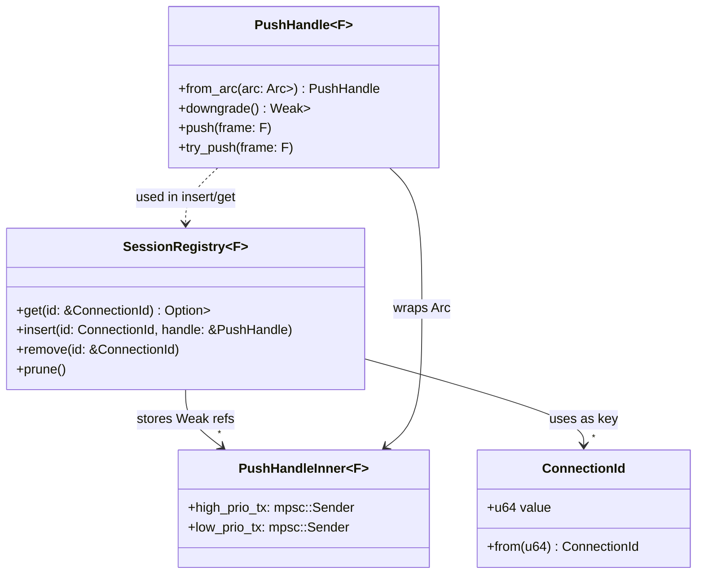

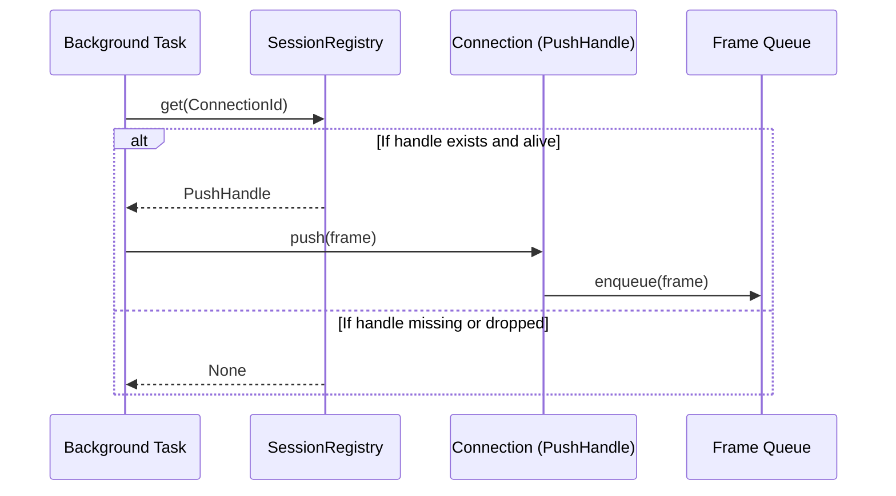

### 4.3 Configuration via the `WireframeProtocol` Trait

To provide a clean, organised, and extensible configuration API, all
protocol-specific logic and callbacks will be encapsulated within a single
`WireframeProtocol` trait. This is a significant ergonomic improvement over
using a collection of individual closures.

```rust
pub trait WireframeProtocol: Send + Sync + 'static {
    type Frame: FrameLike;
    type ProtocolError;

    /// Called once when a new connection is established.
    /// This is the ideal place to store the PushHandle in a SessionRegistry.
    fn on_connection_setup(
        &self,
        handle: PushHandle<Self::Frame>,
        ctx: &mut ConnectionContext
    );

    /// Called just before any frame (pushed or response) is written to the socket.
    /// Allows for last-minute mutations, like setting sequence IDs.
    fn before_send(&self, frame: &mut Self::Frame, ctx: &mut ConnectionContext);

    /// Called after a request/response command cycle is complete.
    fn on_command_end(&self, ctx: &mut ConnectionContext);

    // Other protocol-specific callbacks can be added here in the future.
}

// The application builder becomes clean and declarative.
WireframeApp::new().with_protocol(MySqlProtocolImpl);
```

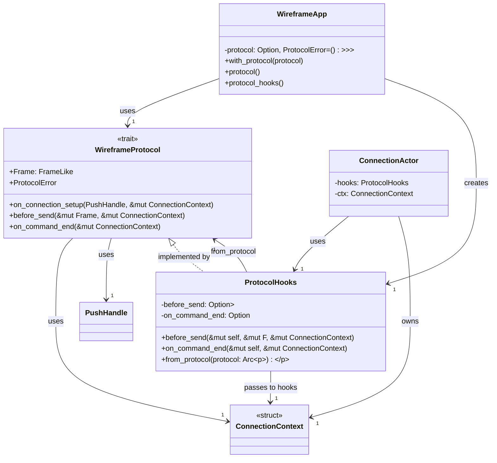

`ConnectionContext` is intentionally empty today. It offers a stable extension
point for per-connection data without breaking existing protocol
implementations.

## 5. Error Handling & Resilience

### 5.1 `BrokenPipe` on Connection Loss

The primary error condition for a `PushHandle` is the termination of its
associated connection. When the connection actor terminates (due to a socket
error, clean shutdown, or graceful cancellation), the receiving end of the
internal `mpsc` channels will be dropped. Any subsequent attempt to use a
`PushHandle` will fail with an error analogous to `io::ErrorKind::BrokenPipe`,
clearly signalling to the producer task that the connection is gone.

### 5.2 Optional Dead Letter Queue (DLQ) for Critical Messages

For applications where dropping a message is unacceptable (e.g., critical
notifications, audit events), the framework will support an optional Dead
Letter Queue.

**Implementation:** The `WireframeApp` builder will provide a method,
`with_push_dlq(mpsc::Sender<F>)`, to configure a DLQ. If provided, any frame
that would normally be dropped by the `PushPolicy::DropIfFull` or
`WarnAndDropIfFull` policies will instead be sent to this channel. A separate
part of the application is then responsible for consuming from the DLQ to
inspect, log, and potentially retry these failed messages.

The following sequence diagram illustrates how frames are routed when a DLQ is
configured:

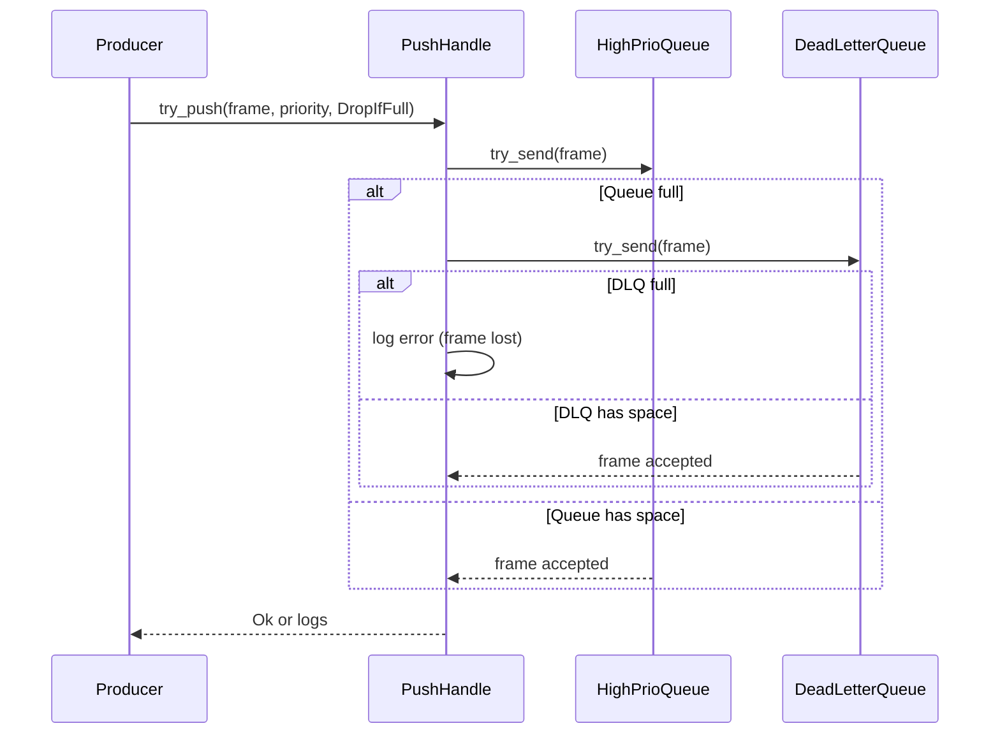

### 5.3 Typed protocol errors

`WireframeError` distinguishes transport failures from protocol logic errors. A
`WireframeError::Protocol(e)` returned from a handler will be forwarded to the
`handle_error` callback on the installed `WireframeProtocol`. This allows the
protocol implementation to serialize a domain-specific error frame before the
current command is terminated.

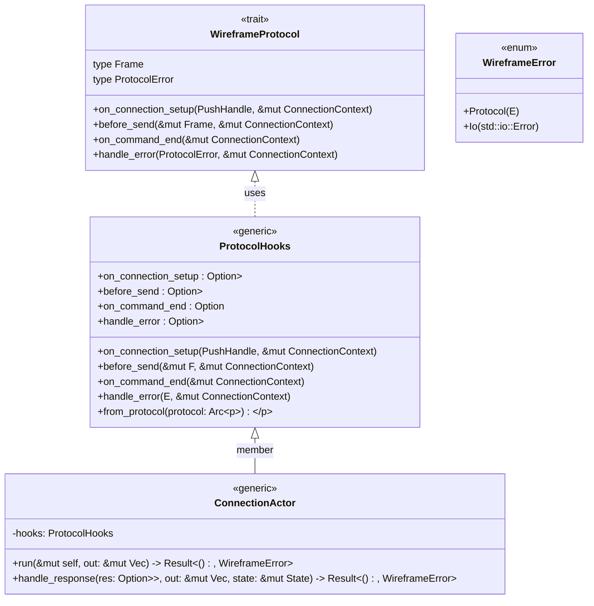

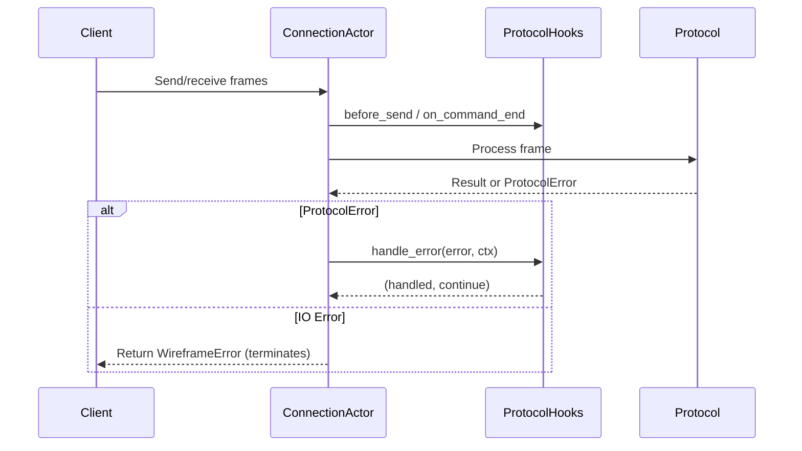

## 6. Synergy with Other 1.0 Features

This design is explicitly intended to work in concert with the other major
features of the 1.0 release.

- **Streaming Responses:** The prioritised write loop (Section 3.2) naturally
  handles the interleaving of pushed messages and streaming responses, ensuring
  that urgent pushes can interrupt a long-running data stream.

- **Message Fragmentation:** Pushes occur at the *logical frame* level. The
  `FragmentAdapter` will operate at a lower layer in the `FrameProcessor`
  stack, transparently splitting any large pushed frames before they are
  written to the socket. The `PushHandle` and the application code that uses it
  remain completely unaware of fragmentation.

## 7. Use Cases

### 7.1 Server-Initiated MySQL Packets

MariaDB may spontaneously push packets while a client is idle. Two notable
examples are an `OK` packet with session tracker data and a `LOCAL INFILE`
request. The design presented here enables these packets without changing the
existing request/response model.

Each connection task owns an mpsc outbox channel and exposes a `PushHandle`
through a registry or the `on_connection_setup` hook. Any async task can call
`push_high_priority()` or `push_low_priority()` on this handle to queue a frame
for delivery. Sequence IDs reset to zero on command completion to maintain
protocol integrity.

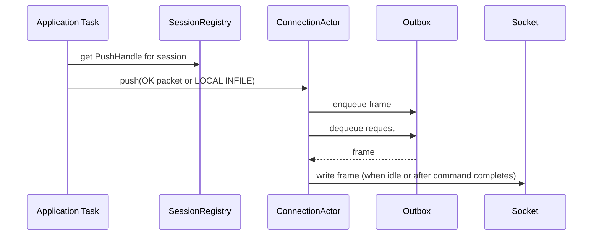

### 7.2 Heart-beat Pings (WebSocket)

A background timer can periodically send Ping frames to keep a WebSocket
connection alive. `push_high_priority()` ensures these heart-beats are written
even while a large response stream is in progress.

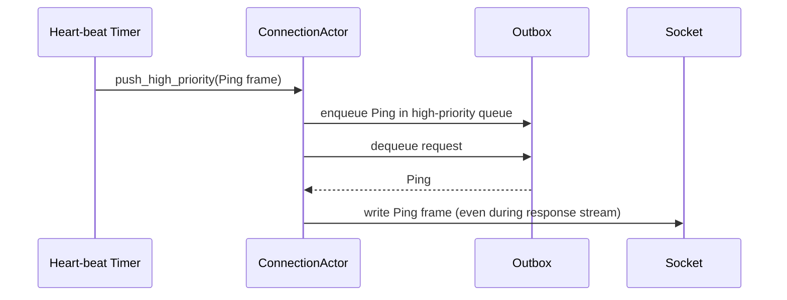

### 7.3 Broker-Side MQTT `PUBLISH`

An MQTT broker can deliver retained messages or fan-out new `PUBLISH` frames to
all subscribed clients via their `PushHandle`s. The `try_push` method allows
the broker to drop non-critical messages when a subscriber falls behind.

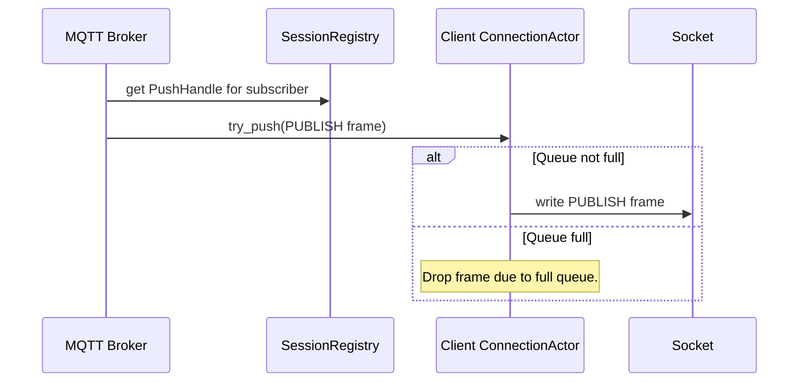

## 8. Measurable Objectives & Success Criteria

| Category        | Objective                                                                                                           | Success Metric                                                                                                                                                                              |
| --------------- | ------------------------------------------------------------------------------------------------------------------- | ------------------------------------------------------------------------------------------------------------------------------------------------------------------------------------------- |
| API Correctness | The PushHandle, SessionRegistry, and WireframeProtocol trait are implemented exactly as specified in this document. | 100% of the public API surface is present and correctly typed.                                                                                                                              |
| Functionality   | Pushed frames are delivered reliably and in the correct order of priority.                                          | A test with concurrent high-priority, low-priority, and streaming producers must show that all frames are delivered and that the final written sequence respects the strict priority order. |
| Back-pressure   | A slow consumer must cause producer tasks to suspend without consuming unbounded memory.                            | A test with a slow consumer and a fast producer must show the producer's push().await call blocks, and the process memory usage remains stable.                                             |
| Resilience      | The SessionRegistry must not leak memory when connections are terminated.                                           | A long-running test that creates and destroys thousands of connections must show no corresponding growth in the SessionRegistry's size or the process's overall memory footprint.           |
| Performance     | The overhead of the push mechanism should be minimal for connections that do not use it.                            | A benchmark of a simple request-response workload with the push feature enabled (but unused) should show < 2% performance degradation compared to a build without the feature.              |
| Performance     | The latency for a high-priority push under no contention should be negligible.                                      | The time from push_high_priority().await returning to the frame being written to the socket buffer should be < 10µs.                                                                        |
