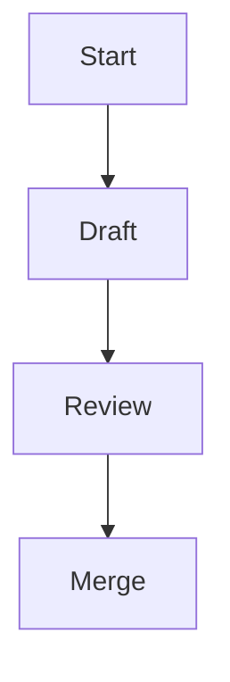

# Documentation style guide

This guide outlines conventions for authoring documentation for Lille. Apply
these rules to keep the documentation clear and consistent for developers.

## Spelling

- Use British English based on the
  [Oxford English Dictionary](https://public.oed.com/) (en-GB-oxendict):
  - suffix -ize in words like _realize_ and _organization_ instead of
     -ise endings,
  - suffix ‑lyse in words not traced to the Greek ‑izo, ‑izein suffixes,
     such as _analyse_, _paralyse_ and _catalyse_,
  - suffix -our in words such as _colour_, _behaviour_ and _neighbour_,
  - suffix -re in words such as _calibre_, _centre_ and fibre,
  - double "l" in words such as _cancelled_, _counsellor_ and _cruellest_,
  - maintain the "e" in words such as _likeable_, _liveable_ and _rateable_,
  - suffix -ogue in words such as _analogue_ and _catalogue_,
  - and so forth.
- The word **"outwith"** is acceptable.
- Keep US spelling when used in an API, for example `color`.
- The project licence file is spelled `LICENSE` for community consistency.

## Punctuation and grammar

- Use the Oxford comma: "ships, planes, and hovercraft" where it aids
  comprehension.
- Company names are treated as collective nouns: "Lille Industries are
  expanding".

## Headings

- Write headings in sentence case.
- Use Markdown headings (`#`, `##`, `###`, and so on) in order without skipping
  levels.

## Markdown rules

- Follow [markdownlint](https://github.com/DavidAnson/markdownlint)
  recommendations[^markdownlint].
- Provide code blocks and lists using standard Markdown syntax.
- Always provide a language identifier for fenced code blocks; use `plaintext`
  for non-code text.
- Use `-` as the first level bullet and renumber lists when items change.
- Prefer inline links using `[text](url)` or angle brackets around the URL.
- Ensure blank lines before and after bulleted lists and fenced blocks.
- Ensure tables have a delimiter line below the header row.

## Expanding acronyms

- Expand any uncommon acronym on first use, for example, Continuous Integration
  (CI).

## Formatting

- Wrap paragraphs at 80 columns.
- Wrap code at 120 columns.
- Do not wrap tables.
- Use footnotes referenced with `[^label]`.

## Example snippet

```rust
/// A simple function demonstrating documentation style.
fn add(a: i32, b: i32) -> i32 {
    a + b
}
```

## API doc comments (Rust)

Use doc comments to document public APIs. Keep them consistent with the
contents of the manual.

- Begin each block with `///`.
- Keep the summary line short, followed by further detail.
- Explicitly document all parameters with `# Parameters`, describing each
  argument.
- Document the return value with `# Returns`.
- Document any panics or errors with `# Panics` or `# Errors` as appropriate.
- Place examples under `# Examples` and mark the code block with `no_run` so
  they do not execute during documentation tests.
- Put function attributes after the doc comment.

```rust
/// Returns the sum of `a` and `b`.
///
/// # Parameters
/// - `a`: The first integer to add.
/// - `b`: The second integer to add.
///
/// # Returns
/// The sum of `a` and `b`.
///
/// # Examples
///
/// ```rust,no_run
/// assert_eq!(add(2, 3), 5);
/// ```
#[inline]
pub fn add(a: i32, b: i32) -> i32 {
    a + b
}
```

## Diagrams and images

Where it adds clarity, include [Mermaid](https://mermaid.js.org/) diagrams.
When embedding figures, use `` and provide brief alt
text describing the content. Add a short description before each Mermaid
diagram so screen readers can understand it.

For screen readers: The following flowchart outlines the documentation workflow.



## Roadmap Task Writing Guidelines

When documenting development roadmap items, write them so that they are
achievable, measurable, and structured. This ensures the roadmap functions as a
practical planning tool rather than a vague wishlist. Do not commit to
timeframes in the roadmap. Development effort should be roughly consistent from
task to task.

### Principles for Roadmap Tasks

- Define outcomes, not intentions: Phrase tasks in terms of the capability
  delivered (e.g. “Implement role-based access control for API endpoints”), not
  aspirations like “Improve security”.
- Quantify completion criteria: Attach measurable finish lines (e.g. “90%
  test coverage for new modules”, “response times under 200ms”, “all endpoints
  migrated”).
- Break into atomic increments: Ensure tasks can be completed in weeks, not
  quarters. Large goals should be decomposed into clear, deliverable units.
- Tie to dependencies and sequencing: Document prerequisites so tasks can be
  scheduled realistically (e.g. “Introduce central logging service” before “Add
  error dashboards”).
- Bound scope explicitly: Note both in-scope and out-of-scope elements (e.g.
  “Build analytics dashboard (excluding churn prediction)”).

### Hierarchy of Scope

Roadmaps should be expressed in three layers of scope to maintain clarity and
navigability:

- Phases (strategic milestones) – Broad outcome-driven stages that represent
  significant capability shifts. Why the work matters.
- Steps (epics / workstreams) – Mid-sized clusters of related tasks grouped
  under a phase. What will be built.
- Tasks (execution units) – Small, measurable pieces of work with clear
  acceptance criteria. How it gets done.

### Roadmap formatting conventions

- **Dotted numbering:** Number phases, steps, and headline tasks using dotted
  notation:
  - Phases: 1, 2, 3, …
  - Steps: 1.1, 1.2, 1.3, …
  - Headline tasks: 1.1.1, 1.1.2, 1.1.3, …
- **Checkboxes:** Precede task and sub-task items with a GitHub-Flavoured
  Markdown (GFM) checkbox (`[ ]`) to track completion status.
- **Dependencies:** Note non-linear dependencies explicitly. Where a task
  depends on another task outside its immediate sequence, cite the dependency
  using dotted notation (e.g. "Requires 2.3.1").
- **Success criteria:** Include explicit success criteria only where not
  immediately obvious from the task description.
- **Design document citations:** Where applicable, cite the relevant design
  document section for each task (e.g. "See design-doc.md §3.2").

### Roadmap example

```markdown
## 1. Core infrastructure

### 1.1. Logging subsystem

- [ ] 1.1.1. Introduce central logging service
  - [ ] Define log message schema. See design-doc.md §2.1.
  - [ ] Implement log collector daemon.
  - [ ] Add structured logging to API layer.
- [ ] 1.1.2. Add error dashboards. Requires 1.1.1.
  - [ ] Deploy Grafana instance.
  - [ ] Create error rate dashboard (target: <1% error rate visible within 5 min).

### 1.2. Authentication

- [ ] 1.2.1. Implement role-based access control. Requires 1.1.1.
  - [ ] Define role hierarchy. See design-doc.md §4.3.
  - [ ] Add RBAC middleware to API endpoints.
  - [ ] Write integration tests for permission boundaries.
```

## Architectural Decision Records (ADRs)

Use ADRs to document significant architectural and design decisions. ADRs
capture the context, options considered, and rationale behind decisions,
providing a historical record for future maintainers.

### Naming convention

Name ADR files using the pattern `adr-NNN-short-description.md`, where `NNN` is
a zero-padded sequence number (e.g. `adr-001-async-fixtures-and-tests.md`).
Place ADRs in the `docs/` directory.

### Required sections

Every ADR must include the following sections in order:

- **Status:** One of `Proposed`, `Accepted`, `Superseded`, or `Deprecated`. For
  `Accepted` status, include the date and a brief summary of what was decided.
- **Date:** The date the ADR was created or last updated (format: YYYY-MM-DD).
- **Context and Problem Statement:** Describe the situation, constraints, and
  the problem or question that prompted the decision. Include enough background
  for readers unfamiliar with the history.

### Conditional sections

Include these sections as appropriate to the decision's complexity:

- **Decision Drivers:** Key factors, requirements, or constraints that
  influenced the decision. Use bullet points.
- **Requirements:** For complex decisions, separate functional and technical
  requirements into subsections.
- **Options Considered:** Describe the alternatives evaluated. Use a comparison
  table when contrasting multiple options across several dimensions.
- **Decision Outcome / Proposed Direction:** State the chosen approach and
  summarise the rationale. For `Proposed` ADRs, describe the recommended
  direction.
- **Goals and Non-Goals:** Clarify what the decision aims to achieve and what
  is explicitly out of scope.
- **Migration Plan:** For decisions requiring phased implementation, break the
  work into numbered phases with clear goals and deliverables.
- **Known Risks and Limitations:** Document trade-offs, potential issues, and
  constraints of the chosen approach.
- **Outstanding Decisions:** For `Proposed` ADRs, list open questions that must
  be resolved before acceptance.
- **Architectural Rationale:** Explain how the decision aligns with broader
  architectural principles and project goals.

### Formatting guidance

- Use second-level headings (`##`) for major sections.
- Use third-level headings (`###`) for subsections (e.g. phases, option names).
- Use tables to compare options when multiple dimensions are relevant. Include
  a caption below the table (e.g. "_Table 1: Trade-offs between X and Y._").
- Include code snippets with language identifiers when illustrating technical
  approaches. Use `no_run` for illustrative Rust code that should not be
  executed.
- Add screen reader descriptions before complex diagrams or code blocks.
- Reference external sources using inline links or footnotes.

### ADR template

```markdown
# Architectural decision record (ADR) NNN: <title>

## Status

Proposed.

## Date

YYYY-MM-DD.

## Context and Problem Statement

<Describe the situation, constraints, and the question being addressed.>

## Decision Drivers

- <Driver 1>
- <Driver 2>

## Options Considered

### Option A: <Name>

<Description, consequences, and trade-offs.>

### Option B: <Name>

<Description, consequences, and trade-offs.>

| Topic     | Option A | Option B |
| --------- | -------- | -------- |
| <Factor>  | <Value>  | <Value>  |

_Table 1: Comparison of options._

## Decision Outcome / Proposed Direction

<State the chosen or recommended approach and summarise the rationale.>

## Known Risks and Limitations

- <Risk or limitation 1>
- <Risk or limitation 2>

## Outstanding Decisions

- <Open question 1>
- <Open question 2>
```

______________________________________________________________________

[^markdownlint]: A linter that enforces consistent Markdown formatting.
