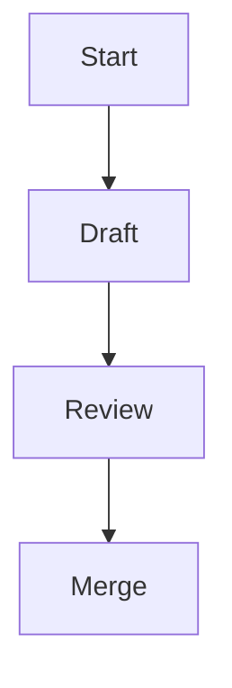

# Documentation style guide

This guide outlines conventions for authoring documentation for Lille. Apply
these rules to keep the documentation clear and consistent for developers.

## Spelling

- Use British English based on the
  [Oxford English Dictionary](https://public.oed.com/) (en-oxendict).
- The word **"outwith"** is acceptable.
- Keep US spelling when used in an API, for example `color`.
- The project licence file is spelled `LICENSE` for community consistency.

## Punctuation and grammar

- Use the Oxford comma: "ships, planes, and hovercraft".
- Company names are treated as collective nouns: "Lille Industries are
  expanding".

## Headings

- Write headings in sentence case.
- Use Markdown headings (`#`, `##`, `###`, and so on) in order without skipping
  levels.

## Markdown rules

- Follow [markdownlint](https://github.com/DavidAnson/markdownlint)
  recommendations[^markdownlint].
- Provide code blocks and lists using standard Markdown syntax.
- Always use fenced code blocks with a language identifier; use `plaintext` for
  non-code text.
- Use `-` as the first level bullet and renumber lists when items change.
- Prefer inline links using `[text](url)` or angle brackets around the URL.

## Expanding acronyms

- Expand any uncommon acronym on first use, for example, Continuous Integration
  (CI).

## Formatting

- Wrap paragraphs at 80 columns.
- Wrap code at 120 columns.
- Do not wrap tables.
- Use footnotes referenced with `[^label]`.

## Example snippet

```rust
/// A simple function demonstrating documentation style.
fn add(a: i32, b: i32) -> i32 {
    a + b
}
```

## API doc comments

Use doc comments to document public APIs. Keep them consistent with the contents
of the manual.

- Begin each block with `///`.
- Keep the summary line short, followed by further detail.
- Explicitly document all parameters with `# Parameters`, describing each
  argument.
- Document the return value with `# Returns`.
- Document any panics or errors with `# Panics` or `# Errors` as appropriate.
- Place examples under `# Examples` and mark the code block with `no_run` so
  they do not execute during documentation tests.
- Put function attributes after the doc comment.

````rust
/// Returns the sum of `a` and `b`.
///
/// # Parameters
/// - `a`: The first integer to add.
/// - `b`: The second integer to add.
///
/// # Returns
/// The sum of `a` and `b`.
///
/// # Examples
///
/// ```rust,no_run
/// assert_eq!(add(2, 3), 5);
/// ```
#[inline]
pub fn add(a: i32, b: i32) -> i32 {
    a + b
}
````

## Diagrams and images

Where it adds clarity, include [Mermaid](https://mermaid.js.org/) diagrams. When
embedding figures, use `` and provide concise alt text
describing the content. Add a short description before each Mermaid diagram so
screen readers can understand it.



\[^markdownlint\]: A linter that enforces consistent Markdown formatting.
