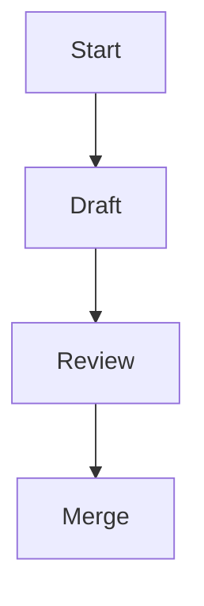

# Documentation style guide

This guide outlines conventions for authoring documentation for software
created by df12 Productions. Apply these rules to keep documentation clear,
consistent, and easy to maintain across projects.

## Spelling

- Use British English based on the
  [Oxford English Dictionary](https://public.oed.com/) locale `en-GB-oxendict`,
  which denotes English for the Great Britain market in the Oxford style:
  - suffix -ize in words like _realize_ and _organization_ instead of
     -ise endings,
  - suffix ‑lyse in words not traced to the Greek ‑izo, ‑izein suffixes,
     such as _analyse_, _paralyse_ and _catalyse_,
  - suffix -our in words such as _colour_, _behaviour_ and _neighbour_,
  - suffix -re in words such as _calibre_, _centre_ and _fibre_,
  - double "l" in words such as _cancelled_, _counsellor_ and _cruellest_,
  - maintain the "e" in words such as _likeable_, _liveable_ and _rateable_,
  - suffix -ogue in words such as _analogue_ and _catalogue_,
  - and so forth.
- The words **"outwith"** and **"caveat"** are acceptable.
- Keep United States (US) spelling when used in an API, for example, `color`.
- The project uses the filename `LICENSE` for community consistency.

## Punctuation and grammar

- Use the Oxford comma: "ships, planes, and hovercraft" where it aids
  comprehension.
- Company names are treated as collective nouns: "df12 Productions are
  releasing an update".
- Avoid first and second person personal pronouns outside the `README.md`
  file.

## Headings

- Write headings in sentence case.
- Use Markdown headings (`#`, `##`, `###`, and so on) in order without skipping
  levels.

## Markdown rules

- Follow [markdownlint](https://github.com/DavidAnson/markdownlint)
  recommendations[^1].
- Provide code blocks and lists using standard Markdown syntax.
- Always provide a language identifier for fenced code blocks; use `plaintext`
  for non-code text.
- Use `-` as the first level bullet and renumber lists when items change.
- Prefer inline links using `[text](url)` or angle brackets around the URL.
- Ensure blank lines before and after bulleted lists and fenced blocks.
- Ensure tables have a delimiter line below the header row.

## Expanding acronyms

- Expand any uncommon acronym on first use, for example, Continuous Integration
  (CI).

## Formatting

- Wrap paragraphs at 80 columns.
- Wrap code at 120 columns.
- Do not wrap tables.
- Use GitHub-flavoured numeric footnotes referenced as `[^1]`.
- Footnotes must be numbered in order of appearance in the document.
- Caption every table, and caption every diagram.

## Standard document types

Repositories that adopt this documentation style should keep a small set of
high-value documents with clearly separated audiences and responsibilities.
These document types are complementary: the contents file helps readers find
material, the user's guide explains how to use the project, the developer's
guide explains how to work on the project, the design document explains why the
system is shaped the way it is, and the repository layout document explains
where important things live. For discoverability, use canonical filenames
unless a stronger repository-specific constraint applies. A minimal canonical
set looks like
`docs/{contents,users-guide,developers-guide,repository-layout}.md` plus a
primary design document under `docs/*-design.md`, for example
`docs/theoremc-design.md` or `docs/query-planner-design.md`.

### Contents file

Use a dedicated contents file, typically `docs/contents.md`, as the index for
the documentation set.

- Make the document title explicit, for example `# Documentation contents`.
- Begin with the contents file linking to itself so readers can confirm they
  are at the index.
- List each document exactly once with an inline link and a short descriptive
  phrase explaining why someone would open it.
- Group related material together, such as decision records, reference
  documents, guides, and plan directories.
- Keep the descriptions audience-focused. Explain the purpose of the document,
  not merely its filename.
- Prefer stable ordering so repeated readers can scan predictably. Grouping by
  topic is usually better than strict alphabetic ordering.
- When listing a directory, add one nested level only where it materially
  improves navigation, for example to enumerate execution plans beneath an
  `execplans/` entry.
- Update the contents file whenever a document is added, renamed, or removed.

### User's guide

Use the user's guide, canonically `docs/users-guide.md`, for readers who need
to apply the project rather than modify its internals. In a library, this means
consumers of the application programming interface (API). In an application,
this means operators, end users, or integrators.

- Open with one short paragraph that states the audience and scope.
- Organize the guide around user-facing tasks, concepts, and guarantees rather
  than internal module boundaries.
- Introduce the primary workflow early, with a minimal working example that a
  reader can adapt immediately.
- Put public-facing reference material here when users need it to succeed, for
  example CLI usage, configuration keys, file-format rules, or API surface
  summaries.
- Present rules, constraints, defaults, and error behaviour near the feature
  they affect, rather than scattering them across the document.
- Use tables where they clarify field sets, command options, or compatibility
  matrices.
- Include concrete examples in code or data form when describing formats,
  schemas, or command usage.
- Higher-level user workflows belong here, for example "load a document",
  "configure the service", or "interpret diagnostics".
- Link to design documents or maintainer references when deeper rationale would
  otherwise overload the guide.
- Exclude maintainer-only concerns such as internal layering debates, future
  refactor plans, or enforcement tooling unless they directly affect users.

### Developer's guide

Use the developer's guide, canonically `docs/developers-guide.md`, for
maintainers and contributors. Treat this as the operating manual for working on
the existing system, not as the place for the project's primary design document.

- Open with one short paragraph that states the audience and the operational
  scope of the guide.
- Link early to the design document, repository layout document, accepted
  decision records, and other normative references that explain architecture or
  rationale in depth.
- Put maintainer-facing implementation guidance here, for example build, test,
  lint, release, debugging, extension, and contribution workflows.
- Use numbered sections for long-form technical documents to improve
  cross-referencing in reviews and follow-up discussions.
- Separate normative rules from informative explanation. Mark source-of-truth
  sections clearly.
- Include compact interface maps or workflow diagrams where they materially
  improve implementation guidance.
- Keep subsystem descriptions focused on current responsibilities,
  integration points, and operational expectations. Put design rationale, major
  trade-offs, and proposed architecture in design documents instead.
- Do not embed repository-layout guidance here. The canonical location for
  file-tree and path-responsibility documentation is
  `docs/repository-layout.md`.
- Keep the document synchronized with decision records, roadmap items, and the
  codebase. A stale developer's guide is worse than a shorter one.

### Design document, ADR, and RFC

Use these document types for different jobs. Do not collapse them into one
catch-all "design note".

- A **design document** explains the shape of a system or subsystem: its
  architecture, constraints, data flow, rationale, and intended evolution. It
  is usually a living document and may describe the current implementation, the
  target implementation, or both.
- An **Architecture Decision Record (ADR)** captures one accepted decision. It
  should be narrow, stable, and explicit about context, decision, consequences,
  and status. Use an ADR when the important thing to preserve is the outcome,
  not the full exploratory discussion that led to it.
- A **Request for Comments (RFC)** proposes a change before acceptance. It is
  the right format for changes that need reviewing, alternatives analysis,
  migration planning, or cross-team discussion. An RFC may later be accepted,
  rejected, superseded, or distilled into one or more ADRs.

In short: use a design document to explain the system, an ADR to record a
decision, and an RFC to propose a change.

### Design document

Use a dedicated design document, conventionally named
`docs/<product-or-topic>-design.md`, to explain the architecture, constraints,
rationale, and intended evolution of a system or subsystem. This document is
the correct location for design intent; that material must not be buried in the
user's guide or developer's guide.

- Start with a concise front matter section that states status, scope, primary
  audience, and the decision records or other documents that take precedence.
- Open the main body with the problem statement, product thesis, or design goal
  before describing the solution. Readers should understand the problem the
  design is solving before they inspect the structure.
- State the non-negotiable constraints explicitly. These are the rules later
  sections assume rather than re-justify.
- Separate normative definitions from informative explanation. If another
  document is the source of truth for a schema, protocol, or naming rule, say
  so plainly and link to it.
- Describe the high-level architecture before diving into file-level or
  module-level details. A reader should understand the major subsystems,
  boundaries, and data flow early.
- Use numbered sections for substantial designs so review comments, follow-up
  changes, and decision records can cite stable anchors.
- Include diagrams, tables, or pipeline sketches when they materially improve
  comprehension, especially for flows, layered boundaries, or generated
  artefacts.
- Record risks, trade-offs, rejected alternatives, and future extension points.
  A design document should explain not only what the system looks like, but why
  it takes that shape.
- Keep examples concrete and representative. Prefer one realistic example that
  exercises the important structure over several toy fragments.
- Keep the design document synchronized with accepted decision records and the
  implemented system. If the code or the governing decision changes, update the
  design or mark the divergence explicitly.

### Request for Comments (RFC)

Use RFCs for proposed changes that need technical review before they become
binding. Store them under `docs/rfcs/`.

### RFC naming convention

Name RFC files using the pattern `0001-short-topic.md`, where `0001` is a
zero-padded sequence number. Place RFCs in the `docs/rfcs/` directory.

- Number RFCs sequentially in allocation order rather than by date.
- Do not renumber existing RFCs after publication. Gaps are acceptable when
  numbers are reserved, drafted on another branch, or intentionally skipped.

### RFC required sections

Every RFC must include the following sections in order:

- **Title:** Start the document with a numbered title in this form:
  `# RFC 0001: Concise subject`.
- **Preamble:** Follow the title with a dedicated `## Preamble` section.
- **RFC number:** Include the allocated sequence number.
- **Status:** State the document status. Use `Proposed` unless a later process
  explicitly promotes, rejects, withdraws, or supersedes the RFC.
- **Created:** The date the RFC was created (format: YYYY-MM-DD).
- **Opening section:** Keep the first substantive section near the top.
  `## Summary`, `## Executive summary`, or `## Problem` are all acceptable if
  used consistently within the document.

### RFC conditional sections

Include these sections as appropriate to the scope and complexity of the
proposal:

- **Problem:** Describe the deficiency, risk, or missing capability that
  motivates the RFC.
- **Current State:** Explain the relevant current behaviour or architecture when
  the proposal depends on existing constraints.
- **Goals and Non-goals:** Clarify what the RFC intends to change and what it
  deliberately leaves out of scope.
- **Proposed Design / Proposed Change:** Describe the recommended design with
  enough detail to support implementation review.
- **Requirements:** Separate functional, technical, safety, or operational
  requirements when the proposal has multiple kinds of constraints.
- **Compatibility and Migration:** Explain rollout expectations, compatibility
  impact, and migration sequencing when adoption is not trivial.
- **Alternatives Considered:** Record rejected options and the reasons they
  were not chosen.
- **Open Questions / Outstanding Decisions:** Identify unresolved issues that
  still need reviewing before the proposal can be treated as settled.
- **Recommendation:** End with a clear statement of the preferred direction
  when the preceding analysis presents multiple viable choices.

### RFC formatting guidance

- Use second-level headings (`##`) for major sections.
- Use third-level headings (`###`) for subsections such as phases, options,
  requirements groupings, or rollout stages.
- Use numbered major sections for long RFCs when stable review anchors will
  help discussion.
- Use tables to compare design alternatives, rollout paths, or capability
  trade-offs when multiple dimensions matter.
- Include code snippets with language identifiers when illustrating interfaces,
  payloads, or implementation seams.
- Add screen reader descriptions before complex diagrams or code blocks.
- Update links when RFC filenames change, especially cross-references from one
  RFC to another.

### RFC template

```markdown
# RFC 0001: <title>

## Preamble

- **RFC number:** 0001
- **Status:** Proposed
- **Created:** YYYY-MM-DD

## Summary

<Concise statement of the proposal and why it matters.>

## Problem

<Describe the current deficiency, risk, or missing capability.>

## Current state

<Summarize the relevant current implementation or constraints.>

## Goals and non-goals

- Goals:
  - <Goal 1>
  - <Goal 2>
- Non-goals:
  - <Non-goal 1>
  - <Non-goal 2>

## Proposed design

<Describe the recommended design in enough detail for technical review.>

## Requirements

### Functional requirements

- <Functional requirement 1>
- <Functional requirement 2>

### Technical requirements

- <Technical requirement 1>
- <Technical requirement 2>

## Compatibility and migration

<Describe compatibility impact, rollout constraints, and migration sequencing.>

## Alternatives considered

### Option A: <Name>

<Description, consequences, and trade-offs.>

### Option B: <Name>

<Description, consequences, and trade-offs.>

## Open questions

- <Open question 1>
- <Open question 2>

## Recommendation

<State the preferred direction and why it should be adopted.>
```

## Architectural decision records (ADRs)

Use ADRs to document significant architectural and design decisions. ADRs
capture the context, options considered, and rationale behind decisions,
providing a historical record for future maintainers.

### Naming convention

Name ADR files using the pattern `adr-NNN-short-description.md`, where `NNN` is
a zero-padded sequence number (e.g. `adr-001-async-fixtures-and-tests.md`).
Place ADRs in the `docs/` directory.

### Required sections

Every ADR must include the following sections in order:

- **Status:** One of `Proposed`, `Accepted`, `Superseded`, or `Deprecated`. For
  `Accepted` status, include the date and a brief summary of what was decided.
- **Date:** The date the ADR was created or last updated (format: YYYY-MM-DD).
- **Context and Problem Statement:** Describe the situation, constraints, and
  the problem or question that prompted the decision. Include enough background
  for readers unfamiliar with the history.

### Conditional sections

Include these sections as appropriate to the decision's complexity:

- **Decision Drivers:** Key factors, requirements, or constraints that
  influenced the decision. Use bullet points.
- **Requirements:** For complex decisions, separate functional and technical
  requirements into subsections.
- **Options Considered:** Describe the alternatives evaluated. Use a comparison
  table when contrasting multiple options across several dimensions.
- **Decision Outcome / Proposed Direction:** State the chosen approach and
  summarize the rationale. For `Proposed` ADRs, describe the recommended
  direction.
- **Goals and Non-Goals:** Clarify what the decision aims to achieve and what
  is explicitly out of scope.
- **Migration Plan:** For decisions requiring phased implementation, break the
  work into numbered phases with clear goals and deliverables.
- **Known Risks and Limitations:** Document trade-offs, potential issues, and
  constraints of the chosen approach.
- **Outstanding Decisions:** For `Proposed` ADRs, list open questions that must
  be resolved before acceptance.
- **Architectural Rationale:** Explain how the decision aligns with broader
  architectural principles and project goals.

### Formatting guidance

- Use second-level headings (`##`) for major sections.
- Use third-level headings (`###`) for subsections (e.g. phases, option names).
- Use tables to compare options when multiple dimensions are relevant. Include
  a caption below the table (e.g. “_Table 1: Trade-offs between X and Y._”).
- Include code snippets with language identifiers when illustrating technical
  approaches. Use `no_run` for illustrative Rust code that should not be
  executed.
- Add screen reader descriptions before complex diagrams or code blocks.
- Reference external sources using inline links or footnotes.

### ADR template

```plaintext
# Architectural decision record (ADR) NNN: <title>

## Status

<Proposed | Accepted | Superseded | Deprecated>.

## Date

YYYY-MM-DD.

## Context and problem statement

<Describe the situation, constraints, and the question being addressed.>

## Decision Drivers

- <Driver 1>
- <Driver 2>

## Requirements

### Functional requirements

- <Functional requirement 1>
- <Functional requirement 2>

### Technical requirements

- <Technical requirement 1>
- <Technical requirement 2>

## Options considered

### Option A: <Name>

<Description, consequences, and trade-offs.>

### Option B: <Name>

<Description, consequences, and trade-offs.>

| Topic     | Option A | Option B |
| --------- | -------- | -------- |
| <Factor>  | <Value>  | <Value>  |

_Table 1: Comparison of options._

## Decision outcome / proposed direction

<State the chosen or recommended approach and summarize the rationale.>

## Goals and non-goals

- Goals:
  - <Goal 1>
  - <Goal 2>
- Non-goals:
  - <Non-goal 1>
  - <Non-goal 2>

## Migration plan

<Use numbered phases with clear goals and deliverables where phased
implementation is required.>

## Known risks and limitations

- <Risk or limitation 1>
- <Risk or limitation 2>

## Outstanding decisions

- <Open question 1>
- <Open question 2>
```

### Repository layout document

Use a repository layout document, canonically `docs/repository-layout.md`, to
explain the shape of the tree and the responsibilities of its major paths. Use
this standalone document as the canonical location for repository-layout
guidance rather than embedding that material in the developer's guide.

- Document the top-level directories and any critical subdirectories that a new
  contributor must understand quickly.
- Explain the purpose, ownership boundary, and notable conventions of each
  path, not just its name.
- Prefer a compact tree, table, or both. Use the tree for orientation and the
  prose or table for semantics.
- Distinguish between authoritative structure and illustrative sketches. If the
  tree is incomplete or simplified, say so explicitly.
- Highlight where source code, tests, generated artefacts, plans, and
  long-lived reference documents belong.
- Call out any directories with unusual constraints, such as generated output,
  fixtures, snapshots, or capability-restricted paths.
- Ensure the contents file links directly to `docs/repository-layout.md` so
  readers can find it without scanning the developer's guide.
- Update the layout document when the repository structure changes enough that
  a contributor could otherwise follow outdated guidance.

## Example snippet

```rust,no_run
/// A simple function demonstrating documentation style.
fn add(a: i32, b: i32) -> i32 {
    a + b
}
```

## API doc comments (Rust)

Use doc comments to document public APIs. Keep them consistent with the
contents of the manual.

- Begin each block with `///`.
- Keep the summary line short, followed by further detail.
- Explicitly document all parameters with `# Parameters`, describing each
  argument.
- Document the return value with `# Returns`.
- Document any panics or errors with `# Panics` or `# Errors` as appropriate.
- Place examples under `# Examples` and mark the code block with `no_run`, so
  they do not execute during documentation tests.
- Put function attributes after the doc comment.

```rust,no_run
/// Returns the sum of `a` and `b`.
///
/// # Parameters
/// - `a`: The first integer to add.
/// - `b`: The second integer to add.
///
/// # Returns
/// The sum of `a` and `b`.
///
/// # Examples
///
/// ```rust,no_run
/// assert_eq!(add(2, 3), 5);
/// ```
#[inline]
pub fn add(a: i32, b: i32) -> i32 {
    a + b
}
```

## Diagrams and images

Where it adds clarity, include [Mermaid](https://mermaid.js.org/) diagrams.
When embedding figures, use `` and provide brief alt
text describing the content. Add a short description before each Mermaid
diagram, so screen readers can understand it.

For screen readers: The following flowchart outlines the documentation workflow.


```mermaid
flowchart TD
    A[Start] --> B[Draft]
    B --> C[Review]
    C --> D[Merge]
```

_Figure 1: Documentation workflow from draft through merge review._

## Roadmap task writing guidelines

When documenting development roadmap items, write them to be achievable,
measurable, and structured. This ensures the roadmap functions as a practical
planning tool rather than a vague wishlist. Do not commit to timeframes in the
roadmap. Development effort should be roughly consistent from task to task.

### Principles for roadmap tasks

- Define outcomes, not intentions: Phrase tasks in terms of the capability
  delivered (e.g. “Implement role-based access control for API endpoints”), not
  aspirations like “Improve security”.
- Quantify completion criteria: Attach measurable finish lines (e.g. “90%
  test coverage for new modules”, “response times under 200ms”, “all endpoints
  migrated”).
- Break into atomic increments: Ensure tasks can be completed in weeks, not
  quarters. Large goals should be decomposed into clear, deliverable units.
- Tie to dependencies and sequencing: Document prerequisites, so tasks can be
  scheduled realistically (e.g. “Introduce central logging service” before “Add
  error dashboards”).
- Bound scope explicitly: Note both in-scope and out-of-scope elements (e.g.
  “Build analytics dashboard (excluding churn prediction)”).

### Hierarchy of scope

Roadmaps should be expressed in three layers of scope to maintain clarity and
navigability:

- Phases (strategic milestones) – Broad outcome-driven stages that represent
  significant capability shifts. Why the work matters.
- Steps (epics / workstreams) – Mid-sized clusters of related tasks grouped
  under a phase. What will be built.
- Tasks (execution units) – Small, measurable pieces of work with clear
  acceptance criteria. How it gets done.

This hierarchy should align with the GIST framework:

- Phases correspond to strategic themes or milestones.
- Steps correspond to GIST-style workstreams. A step must describe a coherent
  body of delivery work with one clear objective, explicit sequencing value,
  and a practical learning loop. A step is not just a heading used to group
  unrelated tasks.
- Tasks correspond to implementation-level execution units. A task should be a
  concrete build activity, not an aspiration, research topic, or status label.

### Roadmap formatting conventions

- **Dotted numbering:** Number phases, steps, and headline tasks using dotted
  notation:
  - Phases: 1, 2, 3, …
  - Steps: 1.1, 1.2, 1.3, …
  - Headline tasks: 1.1.1, 1.1.2, 1.1.3, …
- **Checkboxes:** Precede task and sub-task items with a GitHub Flavored
  Markdown (GFM) checkbox (`[ ]`) to track completion status.
- **Dependencies:** Note non-linear dependencies explicitly. Where a task
  depends on another task outside its immediate sequence, cite the dependency
  using dotted notation (e.g. “Requires 2.3.1”).
- **Success criteria:** Include explicit success criteria only where not
  immediately obvious from the task description.
- **Design document citations:** Where applicable, cite the relevant design
  document section for each task (e.g. “See design-doc.md §3.2”).

### Roadmap example

```plaintext
## 1. Core infrastructure

### 1.1. Logging subsystem

- [ ] 1.1.1. Introduce central logging service
  - Define log message schema. See design-doc.md §2.1.
  - Implement log collector daemon.
  - Add structured logging to API layer.
- [ ] 1.1.2. Add error dashboards. Requires 1.1.1.
  - Deploy Grafana instance.
  - Create error rate dashboard (target: <1% error rate visible within 5 min).

### 1.2. Authentication

- [ ] 1.2.1. Implement role-based access control (RBAC). Requires 1.1.1.
  - Define role hierarchy. See design-doc.md §4.3.
  - Add RBAC middleware to API endpoints.
  - Write integration tests for permission boundaries.
```

### Writing GIST-aligned steps

When writing a roadmap step, make it function as a real workstream:

- Give the step a concrete objective that describes what will exist when the
  workstream is complete.
- State the learning opportunity for the step when that learning affects later
  sequencing or design choices.
- Group only tasks that serve the same delivery objective. If the tasks do not
  share one operational purpose, split the step.
- Sequence steps so each workstream either unlocks the next one or reduces a
  specific class of delivery risk.

Avoid using steps as passive document structure. Headings such as “Backend
changes”, “Frontend work”, or “Other tasks” are not sufficient unless they are
framed as real workstreams with a defined outcome.

______________________________________________________________________

[^1]: A linter that enforces consistent Markdown formatting.
