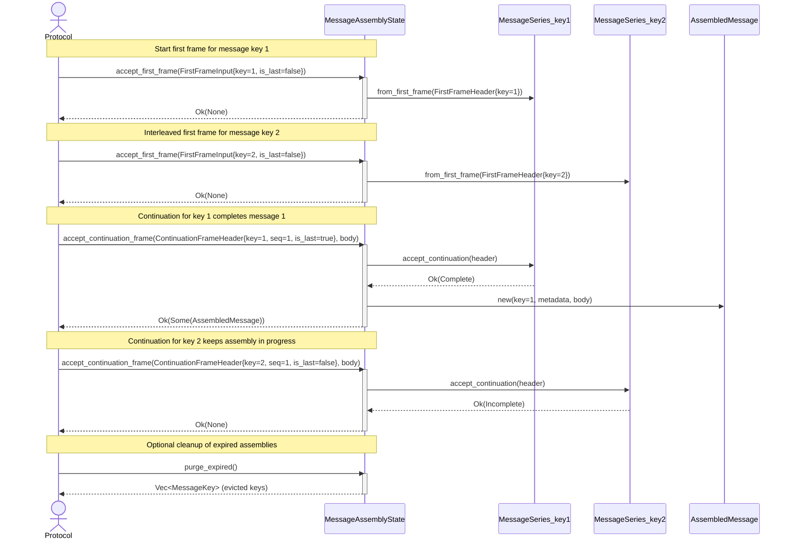

# Message key support and continuity validation for MessageAssembler

This ExecPlan is a living document. The sections `Constraints`, `Tolerances`,
`Risks`, `Progress`, `Surprises & Discoveries`, `Decision Log`, and
`Outcomes & Retrospective` must be kept up to date as work proceeds.

Status: COMPLETE

No `PLANS.md` exists in this repository.

## Purpose / Big Picture

Wireframe's `MessageAssembler` module needs multiplexing support, so protocol
implementations can process interleaved frame streams from multiple logical
messages on the same connection. This work delivers message key tracking and
continuity validation (ordering, missing frames, duplicate frames) at the
protocol level, above transport fragmentation.

Success is observable when:

- A `MessageSeries` type tracks frame ordering per message key, detecting
  out-of-order frames, duplicates, and sequence overflows.
- A `MessageAssemblyState` type manages multiple concurrent assemblies keyed by
  `MessageKey`, supporting interleaved first/continuation frames.
- Unit tests cover single-message assembly, interleaved assembly, ordering
  violations, duplicate detection, and size/timeout limits.
- Integration tests validate the same scenarios through the harness.
- `docs/users-guide.md` documents the new public interface.
- `docs/roadmap.md` marks 8.2.3 and 8.2.4 as done.

## Constraints

- The new types must integrate with the existing `MessageAssembler` trait and
  header types in `src/message_assembler/`.
- Error types must use `thiserror` for consistency with existing patterns.
- Each source file must remain under 400 lines.
- Code must pass `make check-fmt`, `make lint`, and `make test`.
- No changes to `src/fragment/` (transport-level fragmentation remains
  separate).
- Public API must be re-exported from `src/lib.rs`.

## Tolerances (Exception Triggers)

- Scope: if implementation requires changes to more than 15 files, stop and
  escalate.
- Interface: if the existing `MessageAssembler` trait signature must change,
  stop and escalate.
- Dependencies: no new external dependencies required.
- Iterations: if tests still fail after 3 attempts, stop and escalate.
- Time: if a milestone takes more than 4 hours, stop and escalate.

## Risks

- Risk: Sequence tracking logic may be underspecified for protocols without
  sequence numbers. Severity: low Likelihood: low Mitigation: Make sequence
  tracking optional; if `ContinuationFrameHeader.sequence` is `None`, skip
  ordering validation for that series.

- Risk: Test coverage gaps for edge cases (e.g., `u32::MAX` sequence overflow).
  Severity: medium Likelihood: low Mitigation: Include explicit tests for
  overflow detection using `force_next_sequence_for_tests()` helper.

## Progress

- [x] (2026-01-07 00:00Z) Draft ExecPlan for 8.2.3 and 8.2.4.
- [x] Add `checked_increment()` to `FrameSequence` in `header.rs`.
- [x] Create `src/message_assembler/error.rs` with error and status types.
- [x] Create `src/message_assembler/series.rs` with `MessageSeries`.
- [x] Create `src/message_assembler/state.rs` with `MessageAssemblyState` and
  `AssembledMessage`.
- [x] Update `src/message_assembler/mod.rs` to export new submodules.
- [x] Update `src/lib.rs` to re-export new public types.
- [x] Add unit tests to `src/message_assembler/tests.rs`.
- [x] Create integration feature `tests/features/message_assembly.feature`.
- [x] Create test world `tests/worlds/message_assembly.rs`.
- [x] Create step definitions `tests/steps/message_assembly_steps.rs`.
- [x] Register new tests in `tests/cucumber.rs`, `tests/worlds/mod.rs`, and
  `tests/steps/mod.rs`.
- [x] Update `docs/users-guide.md` with new public interface documentation.
- [x] Update `docs/roadmap.md` to mark 8.2.3 and 8.2.4 as done.
- [x] Run formatting, linting, and test gates with `make` targets.

## Surprises & Discoveries

(To be updated during implementation.)

## Decision Log

- Decision: Mirror the `FragmentSeries`/`Reassembler` patterns from
  `src/fragment/` for consistency. Rationale: Reduces cognitive load;
  developers familiar with transport-level fragmentation will recognize the
  analogous protocol-level structures. Date/Author: 2026-01-07 (Codex).

- Decision: Make sequence validation optional by checking if
  `ContinuationFrameHeader.sequence` is `Some`. Rationale: Not all protocols
  supply sequence numbers; forcing them would limit adoption. Date/Author:
  2026-01-07 (Codex).

- Decision: Detect duplicates by comparing incoming sequence against expected:
  if incoming < expected, it was already processed. Rationale: Simple and
  correct for strictly ordered sequences without maintaining a set of seen
  sequences. Date/Author: 2026-01-07 (Codex).

## Outcomes & Retrospective

(To be updated at completion.)

## Context and Orientation

Wireframe's `MessageAssembler` module (`src/message_assembler/`) provides a
protocol-facing hook for multi-frame request parsing. The trait and header
types were introduced in 8.2.1 and 8.2.2:

- `MessageAssembler` trait with `parse_frame_header(&self, payload: &[u8])`
  method (`src/message_assembler/mod.rs:74-98`).
- `MessageKey(pub u64)` newtype for correlating frames
  (`src/message_assembler/header.rs:8-22`).
- `FrameSequence(pub u32)` optional sequence number for continuation frames
  (`src/message_assembler/header.rs:24-38`).
- `FirstFrameHeader` and `ContinuationFrameHeader` structs with message key,
  body length, is_last, and optional fields
  (`src/message_assembler/header.rs:49-75`).

The transport-level fragmentation layer in `src/fragment/` provides reference
patterns:

- `FragmentSeries` (`src/fragment/series.rs`) tracks ordering via `next_index`
  and `complete` fields, with `accept()` method returning `FragmentStatus` or
  `FragmentError`.
- `FragmentError` (`src/fragment/error.rs:25-51`) has variants:
  `MessageMismatch`, `IndexMismatch`, `SeriesComplete`, `IndexOverflow`.
- `Reassembler` (`src/fragment/reassembler.rs`) manages multiple concurrent
  assemblies keyed by `MessageId`.

Testing patterns:

- Unit tests use rstest for parameterized cases
  (`src/message_assembler/tests.rs`).
- Integration tests in `tests/features/message_assembly.feature`.
- Test helper `TestAssembler` in `src/test_helpers.rs`.
- World/steps in `tests/worlds/message_assembler.rs` and
  `tests/steps/message_assembly_steps.rs`.

The following diagram illustrates how `MessageAssemblyState` manages
interleaved frame streams from two concurrent message keys, demonstrating
multiplexing, continuity validation, and timeout-based cleanup:



## Plan of Work

### Stage A: Extend FrameSequence (no new files)

Add a `checked_increment()` method to `FrameSequence` in
`src/message_assembler/header.rs`, following the pattern of `FragmentIndex` in
`src/fragment/index.rs`.

### Stage B: Create error types

Create `src/message_assembler/error.rs` with:

- `MessageSeriesStatus` enum: `Incomplete`, `Complete`
- `MessageSeriesError` enum: `KeyMismatch`, `SequenceMismatch`,
  `SeriesComplete`, `SequenceOverflow`, `MissingFirstFrame`, `DuplicateFrame`

### Stage C: Create MessageSeries

Create `src/message_assembler/series.rs` with:

- `MessageSeries` struct tracking: `message_key`, `next_sequence`,
  `sequence_tracking` (enum: `Untracked`/`Tracked`), `complete`,
  `expected_total`.
- `from_first_frame(header: &FirstFrameHeader) -> Self` factory.
- `accept_continuation(header: &ContinuationFrameHeader)` method returning
  `Result<MessageSeriesStatus, MessageSeriesError>`.
- `force_next_sequence_for_tests()` helper for testing overflow.

### Stage D: Create MessageAssemblyState

Create `src/message_assembler/state.rs` with:

- `PartialAssembly` struct (private): `series`, `metadata`, `body_buffer`,
  `started_at`.
- `AssembledMessage` struct (public): `message_key`, `metadata`, `body`.
- `MessageAssemblyError` enum: `Series(MessageSeriesError)`,
  `DuplicateFirstFrame`, `MessageTooLarge`.
- `MessageAssemblyState` struct with `HashMap<MessageKey, PartialAssembly>`.
- Methods: `new()`, `accept_first_frame()`, `accept_first_frame_at()`,
  `accept_continuation_frame()`, `accept_continuation_frame_at()`,
  `purge_expired()`, `purge_expired_at()`, `buffered_count()`.

### Stage E: Update module exports

- Update `src/message_assembler/mod.rs` to declare `error`, `series`, `state`
  submodules and re-export public types.
- Update `src/lib.rs` to re-export new types: `AssembledMessage`,
  `MessageAssemblyError`, `MessageAssemblyState`, `MessageSeries`,
  `MessageSeriesError`, `MessageSeriesStatus`.

### Stage F: Unit tests

Extend `src/message_assembler/tests.rs` with:

- `series_accepts_sequential_continuation_frames`
- `series_rejects_wrong_key`
- `series_rejects_out_of_order_sequence`
- `series_rejects_duplicate_sequence`
- `series_rejects_after_completion`
- `series_detects_sequence_overflow`
- `state_tracks_multiple_interleaved_messages`
- `state_rejects_continuation_without_first_frame`
- `state_rejects_duplicate_first_frame`
- `state_enforces_size_limit`
- `state_purges_expired_assemblies`

### Stage G: Integration tests

- Create `tests/features/message_assembly.feature` with scenarios for
  single-message assembly, interleaved messages, out-of-order rejection,
  duplicate rejection, missing first frame, size limit, and timeout.
- Create `tests/worlds/message_assembly.rs` with `MessageAssemblyWorld`.
- Create `tests/steps/message_assembly_steps.rs` with Given/When/Then steps.
- Register in `tests/cucumber.rs`, `tests/worlds/mod.rs`,
  `tests/steps/mod.rs`.

### Stage H: Documentation

- Update `docs/users-guide.md` section "Message assembler hook" to document
  `MessageAssemblyState`, `MessageSeries`, and error types.
- Update `docs/roadmap.md` to mark 8.2.3 and 8.2.4 as `[x]`.

## Concrete Steps

1. Read existing code:

   ```sh
   cat src/message_assembler/header.rs
   cat src/fragment/series.rs
   cat src/fragment/error.rs
   ```

2. Add `checked_increment()` to `FrameSequence`:

   ```sh
   # Edit src/message_assembler/header.rs
   # Add impl block with checked_increment() method
   ```

3. Create error types:

   ```sh
   # Create src/message_assembler/error.rs
   # Define MessageSeriesStatus and MessageSeriesError
   ```

4. Create MessageSeries:

   ```sh
   # Create src/message_assembler/series.rs
   # Define MessageSeries with from_first_frame and accept_continuation
   ```

5. Create MessageAssemblyState:

   ```sh
   # Create src/message_assembler/state.rs
   # Define PartialAssembly, AssembledMessage, MessageAssemblyError,
   # MessageAssemblyState
   ```

6. Update module exports:

   ```sh
   # Edit src/message_assembler/mod.rs to add submodules and exports
   # Edit src/lib.rs to add re-exports
   ```

7. Add unit tests:

   ```sh
   # Edit src/message_assembler/tests.rs or create new test module
   ```

8. Add integration tests:

   ```sh
   # Create tests/features/message_assembly.feature
   # Create tests/worlds/message_assembly.rs
   # Create tests/steps/message_assembly_steps.rs
   # Update tests/cucumber.rs, tests/worlds/mod.rs, tests/steps/mod.rs
   ```

9. Update documentation:

   ```sh
   # Edit docs/users-guide.md
   # Edit docs/roadmap.md
   ```

10. Run quality gates:

    ```sh
    set -o pipefail
    timeout 300 make fmt 2>&1 | tee /tmp/wireframe-fmt.log
    timeout 300 make markdownlint 2>&1 | tee /tmp/wireframe-markdownlint.log
    timeout 300 make check-fmt 2>&1 | tee /tmp/wireframe-check-fmt.log
    timeout 300 make lint 2>&1 | tee /tmp/wireframe-lint.log
    timeout 300 make test 2>&1 | tee /tmp/wireframe-test.log
    ```

## Validation and Acceptance

Acceptance requires:

- New `MessageSeries` type compiles with `from_first_frame()` and
  `accept_continuation()` methods.
- New `MessageAssemblyState` type manages multiple concurrent assemblies with
  `accept_first_frame()` and `accept_continuation_frame()`.
- Unit tests cover ordering, duplicates, size limits, and timeout purging.
- Integration scenarios for interleaved assembly pass.
- `make check-fmt`, `make lint`, and `make test` exit with status 0.
- `docs/users-guide.md` documents the new types.
- `docs/roadmap.md` marks 8.2.3 and 8.2.4 as done.

Quality criteria:

- Tests: `cargo test --workspace` passes.
- Lint: `cargo clippy --workspace --all-targets --all-features -- -D warnings`
  passes.
- Format: `cargo fmt --workspace -- --check` passes.

## Idempotence and Recovery

All steps are additive. If a step fails, fix the underlying issue and re-run.
The new files can be deleted and recreated without affecting existing
functionality. Use `tee` outputs to locate failures before retrying.

## Artifacts and Notes

Expected artefacts:

- `src/message_assembler/error.rs` (~60 lines)
- `src/message_assembler/series.rs` (~150 lines)
- `src/message_assembler/state.rs` (~200 lines)
- `tests/features/message_assembly.feature` (~60 lines)
- `tests/worlds/message_assembly.rs` (~150 lines)
- `tests/steps/message_assembly_steps.rs` (~100 lines)

## Interfaces and Dependencies

At completion, the following public interfaces must exist in
`wireframe::message_assembler`:

```rust
pub enum MessageSeriesStatus {
    Incomplete,
    Complete,
}

pub enum MessageSeriesError {
    KeyMismatch { expected: MessageKey, found: MessageKey },
    SequenceMismatch { expected: FrameSequence, found: FrameSequence },
    SeriesComplete,
    SequenceOverflow { last: FrameSequence },
    MissingFirstFrame { key: MessageKey },
    DuplicateFrame { key: MessageKey, sequence: FrameSequence },
}

pub struct MessageSeries { /* … */ }
impl MessageSeries {
    pub fn from_first_frame(header: &FirstFrameHeader) -> Self;
    pub fn message_key(&self) -> MessageKey;
    pub fn is_complete(&self) -> bool;
    pub fn expected_total(&self) -> Option<usize>;
    pub fn accept_continuation(
        &mut self,
        header: &ContinuationFrameHeader,
    ) -> Result<MessageSeriesStatus, MessageSeriesError>;
}

pub struct AssembledMessage { /* … */ }
impl AssembledMessage {
    pub fn message_key(&self) -> MessageKey;
    pub fn metadata(&self) -> &[u8];
    pub fn body(&self) -> &[u8];
    pub fn into_body(self) -> Vec<u8>;
}

pub enum MessageAssemblyError {
    Series(MessageSeriesError),
    DuplicateFirstFrame { key: MessageKey },
    MessageTooLarge { key: MessageKey, attempted: usize, limit: NonZeroUsize },
}

pub struct MessageAssemblyState { /* … */ }
impl MessageAssemblyState {
    pub fn new(max_message_size: NonZeroUsize, timeout: Duration) -> Self;
    pub fn accept_first_frame(/* … */) -> Result<Option<AssembledMessage>, MessageAssemblyError>;
    pub fn accept_continuation_frame(/* … */) -> Result<Option<AssembledMessage>, MessageAssemblyError>;
    pub fn purge_expired(&mut self) -> Vec<MessageKey>;
    pub fn buffered_count(&self) -> usize;
}
```

In `src/message_assembler/header.rs`, add:

```rust
impl FrameSequence {
    pub fn checked_increment(self) -> Option<Self>;
}
```
