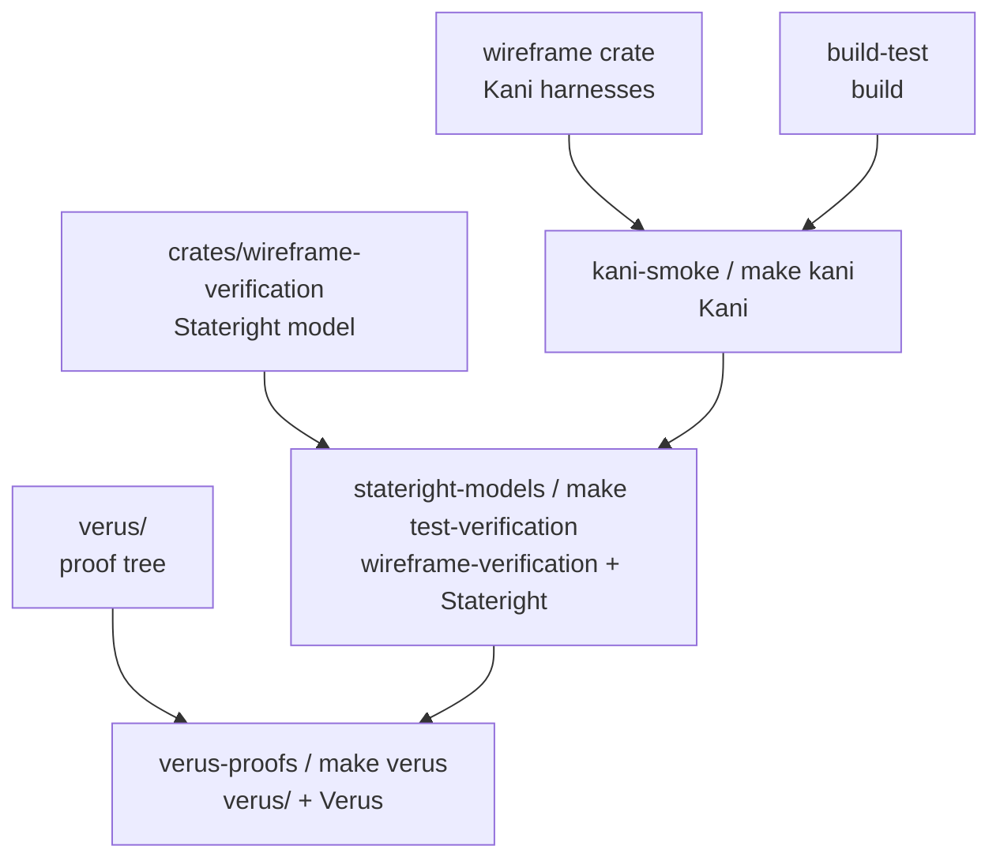
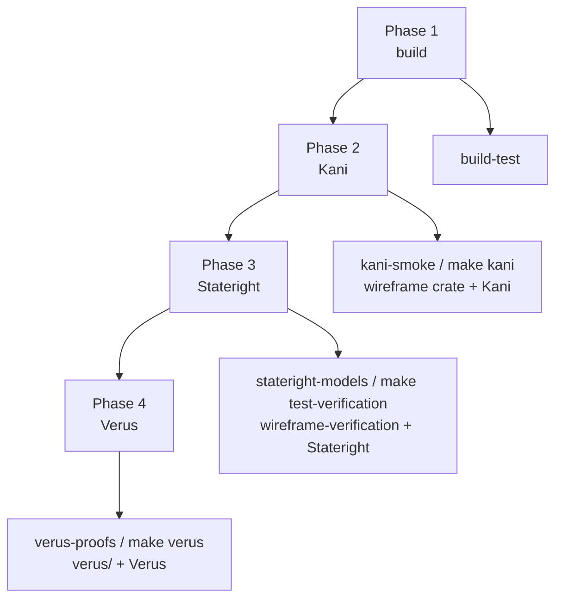

# Formal verification methods in Wireframe

## Executive summary

Wireframe already does more than basic unit testing. The main crate already
depends on `proptest` and `loom`, and the current tree includes advanced tests
such as `tests/advanced/concurrency_loom.rs` and
`tests/advanced/interaction_fuzz.rs`.[^1][^2][^3] That existing investment
matters, because it changes where formal methods will pay for themselves.

The highest-return additions are not “formalize everything”. They are:

1. **Kani** for small, deterministic protocol logic and bounded state machines
   in `src/frame/*`, `src/fragment/*`, and selected parts of
   `src/message_assembler/*`.
2. **Stateright** for the `ConnectionActor` scheduling and output-orchestration
   logic in `src/connection/*`, where the bug surface comes from interleavings
   rather than arithmetic.[^4]
3. **Verus** for a small number of protocol invariants worth freezing as
   proofs, especially in `src/message_assembler/*`, not for the Tokio actor or
   input/output (I/O)-heavy code.[^5]

The best way to integrate those tools in Wireframe is **not** to copy either
Chutoro or mxd wholesale. Instead, use a hybrid of both:

- Follow **Chutoro** for **Verus** and the overall **`make kani` /
  `make kani-full` / `make verus`** operational pattern, with pinned tool
  versions, repo-local scripts, and a dedicated CI job for
  Verus.[^6][^7][^8][^9][^10]
- Follow **mxd** for **Stateright**: put models in a dedicated internal
  verification crate, run them through ordinary Rust tests, and give the
  checker a shared harness that distinguishes safety from reachability
  properties.[^11][^12][^13][^14]
- Keep **Kani** closer to the Wireframe production crate than the Stateright
  models. Several of the best Kani targets are small internal helpers and state
  machines; forcing them into a separate crate would either widen the public
  application programming interface (API) or drive awkward feature-only exports.

That split gives Wireframe a pragmatic verification stack:

- **Proptest** stays in place for broad, generated behavioural coverage.
- **Loom** stays in place for real synchronization interleavings on queue
  internals.
- **Kani** adds exhaustive bounded checking for small protocol logic.
- **Stateright** adds explicit state-space exploration for the connection actor.
- **Verus** proves only the invariants that are worth proving for all
  executions.

## Current state in Wireframe

Today, Wireframe is a single Cargo package rather than a workspace. Its
`Cargo.toml` includes `proptest` and `loom` in `dev-dependencies`, exposes an
`advanced-tests` feature, and defines dedicated advanced test targets such as
`bdd`, `bdd_pool`, and `concurrency_loom`.[^1] The top-level `Makefile`
currently provides build, test, lint, formatting, and benchmark targets, but no
formal-verification targets.[^15] The current continuous integration (CI)
workflow is a single `build-test` job running formatting, linting, and coverage
generation, again with no dedicated formal-verification jobs.[^16]

That means Wireframe does **not** need a new testing culture. It already has
one. What is missing is infrastructure for **proof-oriented** and
**model-checking** workflows.

Two existing tests are especially relevant:

- `tests/advanced/concurrency_loom.rs` explores `PushQueues` interleavings
  without Tokio and checks dead-letter queue (DLQ) accounting and queue-full
  behaviour under concurrent producers.[^2]
- `tests/advanced/interaction_fuzz.rs` uses Proptest to generate pushes and an
  optional response stream, but the current strategy constructs actions as “all
  highs, then all lows, then maybe one stream”, so it does **not** explore
  mixed schedules, shutdown races, or response-versus-multi-packet
  interleavings.[^3]

That division is exactly why Stateright belongs in Wireframe: Loom already
covers the low-level queue machinery, but the connection actor still lacks an
explicit model of schedule permutations.

## Where formal methods should go first

### First priority: `src/frame/*`

`src/frame/format.rs` accepts length-prefix widths in `1..=8`, and its tests
explicitly accept widths `3`, `5`, `6`, and `7`. `src/frame/conversion.rs`,
however, only supports `1`, `2`, `4`, and `8` bytes when reading and writing
prefixes.[^17][^18]

That split is the cleanest “formal methods will find something meaningful here”
target in the whole repo. A bounded checker can make that mismatch painfully
obvious.

Use:

- **Kani** to prove supported-width round-trips and bounded overflow rejection.
- **Proptest** to generate many lengths and endianness combinations.

Do **not** start with Verus here. The logic is small and concrete; Kani is the
better first tool.

### Second priority: `src/fragment/*`

`Fragmenter`, `FragmentSeries`, and `Reassembler` implement a mostly pure
protocol: split payloads, enforce monotone indices, reject gaps, tolerate
duplicates, cap total size, and purge expired partial state.[^19][^20][^21]

This is excellent Kani territory because the state space is naturally bounded
for small payloads and small traces. It is also a strong Proptest target
because the round-trip property is obvious and valuable:

- `reassemble(fragment(payload)) == payload`
- every non-final fragment is at most the configured cap
- duplicates do not change the reconstructed payload
- irrecoverable continuity errors do not leave poisoned partial state behind

### Third priority: `src/message_assembler/*`

This is the best candidate for the **strongest** verification investment.
`FirstFrameHeader` carries `total_body_len`, `MessageSeries` stores it as
`expected_total`, and `MessageAssemblyState` uses the declared total for the
initial size-limit check.[^22][^23][^24]

However, on completion, the current `accept_continuation_frame_at` path removes
the partial assembly and returns the assembled message without an explicit
final equality check between the accumulated body length and
`expected_total`.[^24]

That is either:

- a deliberate design choice, in which case the name `total_body_len`
  overstates the guarantee, or
- a missing invariant, in which case it deserves both runtime enforcement and
  verification.

This is where Verus becomes plausible, but only **after** a contract decision.

### Fourth priority: `src/connection/*`

`ConnectionActor` is the best Stateright target in the repo. It polls shutdown,
high- and low-priority queues, an optional multi-packet channel, and an
optional response stream via a biased `tokio::select!`, while maintaining an
invariant that only one active output source may be installed at a time.[^4]

That is not a Kani-shaped problem. It is a state-exploration problem.

Use **Stateright** to model:

- queue arrivals
- response-stream events
- multi-packet events
- shutdown races
- fairness decisions
- terminal conditions

Do **not** try to verify this actor directly in Verus in phase 1. That is the
wrong tool for the dominant risk.

### Low-priority or ordinary-testing-only modules

Early formal-method effort should not focus on `fairness.rs`, `preamble.rs`,
`app_data_store.rs`, or `session.rs` as stand-alone proof targets. The
cost-benefit ratio looks weak there. Keep them under ordinary unit,
behavioural, and property-based tests unless later evidence suggests
otherwise.[^25]

That said, **fairness behaviour as observed through `ConnectionActor`
absolutely does belong in the Stateright model**. The distinction matters.

## Decisions Wireframe should make before writing proofs

Three design questions need explicit answers before verification becomes a CI
gate.

### 1. What widths does Wireframe actually support for length prefixes?

Right now, constructors accept `1..=8`, while conversion helpers only implement
`1 | 2 | 4 | 8`.[^17][^18]

Choose one of these positions and encode it everywhere:

- **Position A:** Wireframe supports only `1`, `2`, `4`, and `8`. Tighten the
  constructors and tests.
- **Position B:** Wireframe truly supports `1..=8`. Extend conversion logic to
  `3`, `5`, `6`, and `7`.

**Position A** is the stronger choice unless a protocol requirement exists for
odd prefix widths. The smaller supported set is simpler to explain, simpler to
verify, and closer to what the implementation already does.

### 2. Is `total_body_len` authoritative or advisory?

The current name strongly implies authority, but the completion path does not
enforce it.[^22][^24]

Choose one of these positions:

- **Position A:** It is authoritative. Completion must fail if the actual body
  length differs.
- **Position B:** It is advisory. Rename it accordingly and document that
  mismatch is tolerated.

**Position A** is the stronger choice unless an existing protocol reason
requires treating it as a hint.

### 3. What fairness guarantee does `ConnectionActor` actually make?

The actor uses a biased `select!` and maintains a fairness tracker, but a model
should not prove a stronger liveness guarantee than the code intends.[^4]

Be precise:

- Does low priority get service only after high priority quiesces?
- Is there a bounded-starvation guarantee?
- Do response and multi-packet outputs dominate queued pushes while active?

Formal models are unforgiving here. They force the actual contract onto the
page rather than the aspirational one.

## Recommended repository layout

### Preferred layout

A **hybrid workspace** is the recommended shape for Wireframe while keeping the
existing root package in place. Cargo explicitly supports a root manifest that
contains both `[package]` and `[workspace]`.[^26]

Use that layout:

```text
.
├── Cargo.toml                        # existing root package + new [workspace]
├── Makefile
├── scripts/
│   ├── install-kani.sh
│   ├── install-verus.sh
│   └── run-verus.sh
├── tools/
│   ├── kani/
│   │   └── VERSION
│   └── verus/
│       ├── VERSION
│       └── SHA256SUMS
├── crates/
│   └── wireframe-verification/
│       ├── Cargo.toml
│       ├── src/
│       │   ├── lib.rs
│       │   └── connection_model/
│       └── tests/
│           ├── verification_harness.rs
│           └── connection_actor.rs
├── verus/
│   ├── wireframe_proofs.rs
│   ├── message_assembler_total.rs
│   └── message_assembler_budget.rs
└── src/
    ├── frame/
    │   └── kani.rs
    ├── fragment/
    │   └── kani.rs
    └── message_assembler/
        └── kani.rs
```

The repository split is easier to reason about if the crate boundaries and CI
targets are viewed together: the main `wireframe` crate owns Kani harnesses,
`crates/wireframe-verification` owns the Stateright model, and `verus/` owns
proof-only files, while CI moves from the ordinary build gate into the
tool-specific jobs.

For screen readers: The following flowchart shows the `wireframe` crate feeding
Kani, `wireframe-verification` feeding Stateright, `verus/` feeding Verus, and
the CI rollout moving from build to Kani to Stateright to Verus.



### Why this split is better than a single “formal” crate

This is the central architectural recommendation in this document.

Use **three different homes**:

1. **Kani harnesses in the main `wireframe` package**
   - Best for small internal helpers and state machines.
   - Avoids making proof-only internals public.
   - Aligns with Chutoro’s “Kani lives with the crate it proves” pattern.[^7]

2. **Stateright models in `crates/wireframe-verification`**
   - Best for abstract models and test harnesses.
   - Matches the mxd pattern cleanly.[^11][^13]

3. **Verus proofs outside Cargo under `verus/`**
   - Best for pinned toolchain management and proof-only modules.
   - Matches Chutoro’s approach exactly.[^9][^10][^27]

Forcing all three tools into one place would either pollute the public API or
make local execution clumsy.

### Root `Cargo.toml` changes

Add a workspace section to the root manifest:

```toml
[workspace]
members = ["."]
default-members = ["."]
resolver = "3"
```

Why `default-members = ["."]`?

Because the repo currently behaves like a single-package crate. Keeping only
the root package as a default member means `cargo test`, `cargo check`, and
`cargo clippy` at the repo root do not suddenly start running the verification
crate by accident.[^26]

That is a small but important stability choice.

One nuance matters here: Cargo metadata for this repository still reports the
in-repository helper crate `wireframe_testing` in `workspace_members` once the
root manifest becomes an explicit workspace, even though the staged
`members = ["."]` list only names the root package. The practical 10.1.1
contract is therefore:

- the root manifest is explicitly workspace-aware,
- the root `wireframe` package remains the sole `default-members` entry, and
- the dedicated verification crate is still deferred until 10.1.2.

This should land in two stages:

1. Roadmap item 10.1.1 adds the explicit hybrid workspace with
   `members = ["."]`.
2. Roadmap item 10.1.2 extends the member list to
   `[".", "crates/wireframe-verification"]` when the verification crate exists.

That staging keeps the Cargo layout change separate from the introduction of
new verification code and avoids a placeholder crate solely to satisfy the
workspace manifest.

## Kani integration

### Kani tooling model

Kani is a bounded model checker for Rust. The normal project entry point is
`cargo kani`, which behaves like `cargo test` in the sense that it runs against
a Cargo package, but it analyses **proof harnesses** rather than ordinary
tests.[^28] Kani installs as a Cargo subcommand via
`cargo install --locked kani-verifier`, and then `cargo kani setup` installs
its backend under `~/.kani/` by default; `KANI_HOME` can override that
location.[^29]

### Why Kani belongs in the main Wireframe package

The best Wireframe Kani targets sit close to internal logic:

- frame conversion helpers
- fragment-ordering trackers
- message-assembly sequencing and budgeting

Placing those harnesses in an external crate would either lose access to
non-public helpers or start exporting internal APIs just to satisfy the prover.
That is a poor trade.

Instead, add module-adjacent harnesses under `#[cfg(kani)]`, for example:

```rust
// src/frame/mod.rs
#[cfg(kani)]
mod kani;
```

Do the same under `src/fragment/` and `src/message_assembler/`.

For harnesses that only need public APIs, integration tests under
`tests/formal_kani/` are fine. The module-adjacent approach is for cases where
proof access to crate internals is useful and justified.

### Recommended Kani targets

#### Phase 1 smoke harnesses

These should run on every pull request.

1. **Supported length-prefix round-trip**
   - widths: `1`, `2`, `4`, `8`
   - both endiannesses
   - lengths that fit the selected width

2. **Unsupported-width behaviour**
   - this becomes a regression harness after the project decides whether `3`,
     `5`, `6`, `7` are valid or invalid

3. **`FragmentSeries` trace checks**
   - duplicate index does not advance
   - gap fails
   - final fragment marks completion
   - post-completion non-duplicate fragment fails

4. **`Reassembler` small-trace checks**
   - ordered fragments reconstruct correctly
   - duplicate fragment leaves buffer unchanged
   - oversize append removes partial state

5. **`MessageSeries` sequencing checks**
   - once sequence tracking starts, missing sequence is rejected
   - duplicate sequence is rejected
   - gap is rejected
   - completion is sticky

6. **`MessageAssemblyState` declared-total behaviour**
   - only after the contract decision on `total_body_len`

#### Phase 2 full harnesses

These can run nightly or by manual dispatch:

- larger trace bounds
- more sequence values
- more combinations of declared total, metadata length, and body chunks

### Smoke versus full targets

Copy Chutoro’s split:

```make
kani: ## Run practical Kani smoke harnesses
	cargo kani -p wireframe --harness verify_length_prefix_roundtrip_smoke
	cargo kani -p wireframe --harness verify_fragment_series_small_trace
	cargo kani -p wireframe --harness verify_message_series_small_trace

kani-full: ## Run all Kani harnesses with larger bounds
	cargo kani -p wireframe
```

That pattern is one of the most useful ideas in Chutoro’s Makefile.[^7]

### Unwinding policy

Kani supports both command-line unwind settings and per-harness unwind
annotations.[^30]

Use this rule in Wireframe:

- Prefer **`#[kani::unwind(N)]`** on the specific harness when the bound is
  semantically meaningful.
- Use a global `--default-unwind` only as a coarse fallback, or for a smoke
  target where every harness deliberately shares the same small bound.

This is slightly stricter than Chutoro’s current `--default-unwind 4` / `10`
pattern, but it reduces accidental overconfidence.

### Optional later step: Kani contracts

Kani has contract support, including proof harnesses for contracts and verified
stubbing.[^31] Do **not** start there. Wireframe does not need modular
verification on day one.

Consider contracts later only if:

- the project extracts pure helpers for message-budget arithmetic,
- Kani runtimes become large enough that verified stubbing would help, or
- a single helper ends up reused across many harnesses.

### A representative Kani harness shape

This is the sort of harness that should land first:

```rust
#[cfg(kani)]
mod kani {
    use bytes::BytesMut;

    use super::{Endianness, LengthFormat};

    #[kani::proof]
    fn verify_supported_length_prefix_roundtrip() {
        let width = if kani::any() {
            2usize
        } else if kani::any() {
            1usize
        } else if kani::any() {
            4usize
        } else {
            8usize
        };

        let endianness = if kani::any() {
            Endianness::Big
        } else {
            Endianness::Little
        };

        let len: usize = kani::any();
        let max = match width {
            1 => u8::MAX as usize,
            2 => u16::MAX as usize,
            4 => u32::MAX as usize,
            8 => usize::MAX,
            _ => unreachable!(),
        };
        kani::assume(len <= max);

        let fmt = LengthFormat::new(width, endianness);
        let mut buf = BytesMut::new();
        fmt.write_len(len, &mut buf).unwrap();
        let decoded = fmt.read_len(&buf).unwrap();
        assert_eq!(decoded, len);
    }
}
```

That harness is small, stable, and checks something load-bearing.

## Stateright integration

### Stateright tooling model

Stateright is a model checker for Rust state machines and actor-like systems.
Its checker searches for counterexamples to `always` properties and examples of
`sometimes` properties.[^14] The library exposes ordinary Rust APIs such as
`Model::checker()` and `CheckerBuilder::spawn_bfs()` / `spawn_dfs()`.[^32]

That “ordinary Rust crate plus ordinary tests” model is why mxd’s verification
crate is a good starting point.[^11][^13]

### Why Stateright belongs in a separate verification crate

The connection actor model should be an **abstraction of policy**, not a re-run
of Tokio internals. That makes it a natural fit for a dedicated crate:

- `publish = false`
- no impact on the public API
- ordinary `cargo test` or `cargo nextest run` execution
- room for multiple model configurations and shared harness code

A good starting `Cargo.toml` is:

```toml
[package]
name = "wireframe-verification"
version = "0.1.0"
edition = "2024"
publish = false

[dependencies]
stateright = "0.30"
wireframe = { path = "../..", default-features = false, features = ["test-support"] }

[dev-dependencies]
rstest = "0.26"
```

`cargo nextest` should **not** be mandatory here on day one unless the wider
repo already calls for it. mxd uses `nextest`, but Wireframe’s current Makefile
uses `cargo test`.[^12][^15] The important part is the **separate crate and
shared harness**, not the exact test runner.

### Model scope

Model the `ConnectionActor` semantically, not mechanically.

The model state should represent things like:

- high-priority queue contents
- low-priority queue contents
- active output source: none / response / multi-packet
- whether shutdown has been requested
- fairness tracker state
- emitted frames
- whether `on_command_end` has fired for the current command
- whether a multi-packet terminator has already been emitted

The actions should be nondeterministic protocol events, for example:

- `EnqueueHigh(frame)`
- `EnqueueLow(frame)`
- `InstallResponse(stream_id)`
- `ResponseYield(frame)`
- `ResponseError`
- `ResponseEnd`
- `InstallMultiPacket(channel_id)`
- `MultiPacketYield(frame)`
- `MultiPacketClose`
- `Shutdown`
- `TickFairness`

This is intentionally more abstract than the runtime implementation. That is a
feature, not a bug.

### Properties to encode

Follow mxd’s distinction between **safety** and **reachability**
properties.[^13]

#### Safety (`Property::always`)

1. **Mutual exclusion of active outputs**
   - response and multi-packet are never simultaneously active

2. **Single terminal marker for multi-packet streams**
   - at most one terminator is emitted per multi-packet session

3. **`on_command_end` fires at most once per logical command**

4. **No output-source resurrection after terminal shutdown**
   - depending on the specific contract selected

5. **Priority order is preserved where required**
   - for example, high before low when both are immediately ready

6. **Correlation handling remains coherent**
   - if the model includes correlation identifiers

#### Reachability (`Property::sometimes`)

1. a high-priority frame can be emitted
2. a low-priority frame can be emitted
3. a response stream can complete
4. a multi-packet session can complete
5. shutdown can race with an active output source
6. low-priority work can make progress once the fairness policy permits it

That last clause matters. Do **not** state a stronger liveness guarantee than
the implementation promises.

### Shared checker harness

Copy mxd’s excellent pattern almost verbatim: inspect the model’s properties,
split them into safety versus reachability sets, run the checker with bounded
depth and state count, stop early once all reachability properties are found,
then fail the test if any safety property produced a discovery or any
reachability property remained undiscovered.[^13]

That yields stable CI reporting and avoids a sea of bespoke assertions.

A good initial harness budget for Wireframe is slightly larger than mxd’s
because the connection actor state is richer. Start with something like:

- `target_max_depth(8)`
- `target_state_count(5_000)`
- `spawn_bfs()` for pull requests (PRs), using breadth-first search (BFS)

Then add a deeper nightly run.

### Suggested Stateright file layout

```text
crates/wireframe-verification/
├── src/
│   ├── lib.rs
│   └── connection_model/
│       ├── mod.rs
│       ├── model.rs
│       ├── state.rs
│       ├── action.rs
│       └── properties.rs
└── tests/
    ├── verification_harness.rs
    └── connection_actor.rs
```

### Why not use Stateright’s actor API first?

Stateright has an actor module and an `ActorModel` abstraction.[^33] That can
be useful later if the project decides to model multiple interacting
connections or server-level components.

For the first Wireframe model, implementing `Model` directly is still the
better choice, because:

- mxd already demonstrates that pattern successfully,
- Wireframe’s first problem is a single actor with nondeterministic input
  events,
- a direct model gives tighter control over abstractions and fairness semantics.

## Verus integration

### Verus tooling model

Verus verifies correctness against explicit specifications and is designed for
proving properties for **all executions**, especially in low-level systems
code.[^5] Its installation model is separate from Cargo: the upstream
installation guidance is to download a release build, unzip it, and run
`./verus`, which then indicates the required Rust toolchain.[^34]

That matches Chutoro’s choice to keep Verus outside the Cargo workflow
entirely, using pinned version files, checksum verification, a local install
directory, and a wrapper script that installs the required Rust toolchain on
demand.[^9][^10]

Wireframe should copy that pattern almost exactly.

### Why Verus should *not* live inside the main build

Do not try to make Verus look like a normal Cargo test target. It is not one.
Treat it as a separate proof runner.

Use:

- `tools/verus/VERSION`
- `tools/verus/SHA256SUMS`
- `scripts/install-verus.sh`
- `scripts/run-verus.sh`
- `make verus`

That yields:

- a pinned binary
- reproducible local and CI installs
- no pollution of the normal Rust toolchain
- room for proof-only files under `verus/`

### What Verus should prove in Wireframe

Start narrow. Very narrow.

The first worthwhile Verus target is a proof-only model of the message
assembler.

#### Best first proof obligations

1. **Declared total length is respected**
   - if `expected_total` is present and the series completes, then the final
     body length equals that total
   - this only makes sense after adopting the authoritative interpretation of
     `total_body_len`

2. **Buffered bytes are accounted for correctly**
   - inserting a partial assembly increases buffered bytes by metadata + body
   - accepting a continuation increases them by the body size only
   - completing or evicting an assembly releases exactly its buffered bytes

3. **Duplicates do not increase buffered bytes**

4. **Completion removes the assembly from in-flight state**

5. **Sequence-based completion is monotone**
   - once complete, never incomplete again

These are valuable because they lock down the data-plane invariants that
ordinary tests often cover only indirectly.

### What Verus should not prove first

Do **not** begin with:

- `src/connection/*`
- Tokio I/O
- `DashMap` wrappers
- timeout-driven orchestration code
- large proof attempts over production `HashMap<MessageKey, PartialAssembly>`
  logic

That path will burn time and produce little value.

### Proof style recommendation

Copy the Chutoro style: keep the first Verus files as **proof-only modules with
proof-specific types** rather than trying to verify the production structs
directly.[^27]

In other words:

- create a mathematically small `SpecAssemblyState`
- prove lemmas about `accept_first`, `accept_continuation`, and `complete`
- only then decide whether parts of the production code should be restructured
  to align more directly with the proof model

That is a more honest path than pretending phase 1 will mechanically prove the
shipping implementation verbatim.

### Trigger discipline

Chutoro’s developer guide is right to warn against ignoring Verus trigger
warnings. Use explicit triggers where necessary and do not hide
trigger-selection changes in CI.[^35]

Copy that guidance into Wireframe’s contributor docs once Verus lands.

### Representative proof tree

```text
verus/
├── wireframe_proofs.rs
├── message_assembler_total.rs
├── message_assembler_budget.rs
└── fragment_bounds.rs          # optional later
```

`wireframe_proofs.rs` can simply `mod` the proof files and provide a single
entry point for `make verus`, following the same broad pattern as Chutoro’s
`edge_harvest_proofs.rs`.[^27]

## Recommended Makefile changes

Wireframe’s current top-level `Makefile` has no formal-verification
targets.[^15] The following targets should be added:

```make
.PHONY: test-verification stateright kani kani-full verus formal formal-pr formal-nightly

test-verification: ## Run the Stateright verification crate
	cargo test -p wireframe-verification

stateright: test-verification ## Alias for verification models

kani: ## Run Kani smoke harnesses
	cargo kani -p wireframe --harness verify_length_prefix_roundtrip_smoke
	cargo kani -p wireframe --harness verify_fragment_series_small_trace
	cargo kani -p wireframe --harness verify_message_series_small_trace

kani-full: ## Run all Kani harnesses
	cargo kani -p wireframe

verus: ## Run Verus proofs
	VERUS_BIN="$(VERUS_BIN)" scripts/run-verus.sh

formal-pr: test-verification kani verus ## Fast PR gate

formal-nightly: test-verification kani-full verus ## Deeper scheduled gate

formal: formal-pr ## Default formal suite
```

Two notes:

1. `cargo test` is the better starting point for the Stateright crate because
   it minimizes the delta from current Wireframe practice. If the wider repo
   later migrates to `nextest`, this target should change to match.
2. The Kani target names should stay **explicit**. Chutoro’s smoke targets are
   explicit harness names, not magical directory scans, and that is a good
   pattern.[^7]

## Recommended CI changes

### Keep the current build-test job intact

Wireframe’s existing `build-test` job should remain the ordinary
build/lint/test/coverage job.[^16] Do **not** fold formal verification into
coverage generation.

Formal methods belong in separate jobs because they:

- need different caching
- sometimes need different runner images
- produce different failure modes
- should be runnable independently

### Add three new jobs

#### 1. `stateright-models`

Run on every pull request.

```yaml
stateright-models:
  runs-on: ubuntu-latest
  steps:
    - uses: actions/checkout@v5
    - name: Setup Rust
      uses: leynos/shared-actions/.github/actions/setup-rust@<PINNED_SHA>
    - name: Run Stateright verification crate
      run: make test-verification
```

#### 2. `kani-smoke`

Run on every pull request.

Kani ships a GitHub Action, and its docs describe CI usage, but the documented
setup is specifically tied to Ubuntu x86_64 support.[^36] A repo-local
installer script plus `make kani` is still the better fit for Wireframe because
that keeps local and CI execution aligned and mirrors the Verus pattern.

A lightweight setup is:

```yaml
kani-smoke:
  runs-on: ubuntu-20.04
  env:
    KANI_HOME: ${{ runner.temp }}/kani
  steps:
    - uses: actions/checkout@v5
    - name: Setup Rust
      uses: leynos/shared-actions/.github/actions/setup-rust@<PINNED_SHA>
    - name: Install Kani
      run: scripts/install-kani.sh
    - name: Run Kani smoke harnesses
      run: make kani
```

Where `scripts/install-kani.sh` does roughly this:

```bash
#!/usr/bin/env bash
set -euo pipefail
KANI_VERSION="$(cat tools/kani/VERSION)"
cargo install --locked kani-verifier --version "${KANI_VERSION}"
cargo kani setup
```

That script is intentionally simpler than the Verus installer because Kani
already has a Cargo-based install path.[^29]

#### 3. `verus-proofs`

Copy Chutoro’s structure directly.[^8]

```yaml
verus-proofs:
  runs-on: ubuntu-latest
  steps:
    - uses: actions/checkout@v5
    - name: Install Verus
      run: scripts/install-verus.sh
      env:
        VERUS_INSTALL_DIR: ${{ runner.temp }}/verus
    - name: Run Verus proofs
      run: make verus
      env:
        VERUS_BIN: ${{ runner.temp }}/verus/verus/verus
```

### Add a scheduled nightly or manual workflow

Use this for the expensive work:

- `make kani-full`
- deeper Stateright bounds
- optional ignored “deep model” tests

Do not put the expensive suite on every pull request unless the early results
are dramatically faster than expected.

## How Proptest and Loom fit after these changes

This document is about formal methods, but the right integration strategy is
additive, not replacement-oriented.

### Keep Proptest

Proptest is already present in Wireframe and should stay central for:

- larger payload generation
- long random traces
- parser robustness
- concrete behavioural or codec-level properties[^1][^3]

The right relationship is:

- **Kani** for exhaustive bounded proofs over small state spaces
- **Proptest** for broad generated testing over larger spaces

Those are complementary tools.

### Keep Loom

Loom is already doing the right kind of job in `concurrency_loom.rs`: exploring
the behaviour of shared queue state under concurrent producers.[^2]

The right relationship is:

- **Loom** for real synchronization interleavings over concrete concurrent code
- **Stateright** for abstract protocol-state interleavings over the connection
  actor

Again, complementary, not competing.

## Concrete first tasks

The implementation order in Wireframe should be:

### Phase 1: infrastructure only

1. convert the repo to a hybrid workspace
2. add `crates/wireframe-verification`
3. add `tools/verus/*` and `scripts/run-verus.sh` / `install-verus.sh`
4. add `tools/kani/VERSION` and `scripts/install-kani.sh`
5. add `make test-verification`, `make kani`, `make kani-full`, `make verus`
6. add CI jobs for Stateright, Kani smoke, and Verus

### Phase 2: low-risk high-return verification

1. add Kani harnesses for `src/frame/*`
2. add Kani harnesses for `src/fragment/*`
3. strengthen existing Proptest around fragment round-trips and actor action
   interleavings

### Phase 3: actor modelling

1. create `ConnectionActorModel` in `wireframe-verification`
2. add safety and reachability properties
3. gate a bounded BFS checker in PR CI
4. add a deeper nightly checker

### Phase 4: proof-worthy invariants

1. decide the `total_body_len` contract
2. enforce it in runtime code if authoritative
3. write Verus proofs for declared total and budget accounting

Those phases line up with the operational rollout: build plumbing lands first,
then Kani harnesses in the main crate, then the Stateright model in
`wireframe-verification`, and finally Verus proofs under `verus/`.

For screen readers: The following flowchart shows the rollout order from build
to Kani to Stateright to Verus, with each phase mapped to its CI target and
repository component.



That sequence is deliberate. It pushes the most bug-finding value to the front
and delays the most proof-maintenance cost until after Wireframe has settled
the relevant contracts.

## What to avoid

A few antipatterns are worth ruling out explicitly.

### Do not verify the Tokio actor with Verus first

That is the wrong tool for the main risk surface.

### Do not put Kani, Stateright, and Verus all in one crate

Each tool wants a different relationship with the production code.

### Do not widen the public API just to satisfy proofs

If Kani needs crate-internal access, keep the harness inside the main package.

### Do not use `--all-features` for formal jobs by default

Formal jobs should compile the **smallest feature set that still exercises the
target invariant**. Pulling in unrelated optional features only increases build
time and state-space size.

### Do not ignore Verus trigger warnings

Chutoro is right about this.[^35]

### Do not leave the `total_body_len` contract ambiguous

Either prove it or rename it. Ambiguous protocol contracts are exactly where
formal methods become awkward and brittle.

## Final recommendation

The most coherent Wireframe plan is:

- **Adopt Chutoro’s operational pattern** for Kani/Verus: explicit make
  targets, smoke versus full runs, pinned tools, separate CI jobs.[^7][^8]
- **Adopt mxd’s structural pattern** for Stateright: a dedicated internal
  verification crate with a shared bounded-checker harness.[^11][^13]
- **Keep Kani inside the main `wireframe` package**, not in the verification
  crate.
- **Use Verus only where a crisp protocol invariant exists and is worth
  maintaining as a proof.**

If only the first tranche of this work lands, it should be:

1. workspace + verification crate + make/CI plumbing,
2. Kani on `src/frame/*`,
3. Kani on `src/fragment/*`,
4. Stateright on `src/connection/*`.

That will give Wireframe the highest bug-finding return for the least
organizational friction.

## References

[^1]: Wireframe [`Cargo.toml`](../Cargo.toml)
[^2]: Wireframe
      [`tests/advanced/concurrency_loom.rs`](../tests/advanced/concurrency_loom.rs)
[^3]: Wireframe
      [`tests/advanced/interaction_fuzz.rs`](../tests/advanced/interaction_fuzz.rs)
[^4]: Wireframe [`src/connection/mod.rs`](../src/connection/mod.rs)
[^5]: Verus guide: <https://verus-lang.github.io/verus/guide/>
[^6]: Chutoro README: <https://github.com/leynos/chutoro/blob/main/README.md>
[^7]: Chutoro `Makefile`: <https://github.com/leynos/chutoro/blob/main/Makefile>
[^8]: Chutoro CI workflow:
      <https://github.com/leynos/chutoro/blob/main/.github/workflows/ci.yml>
[^9]: Chutoro `scripts/install-verus.sh`:
      <https://github.com/leynos/chutoro/blob/main/scripts/install-verus.sh>
[^10]: Chutoro `scripts/run-verus.sh`:
       <https://github.com/leynos/chutoro/blob/main/scripts/run-verus.sh>
[^11]: mxd verification crate `Cargo.toml`:
       <https://github.com/leynos/mxd/blob/main/crates/mxd-verification/Cargo.toml>
[^12]: mxd `Makefile`: <https://github.com/leynos/mxd/blob/main/Makefile>
[^13]: mxd `crates/mxd-verification/tests/verification_harness.rs`:
       <https://github.com/leynos/mxd/blob/main/crates/mxd-verification/tests/verification_harness.rs>
[^14]: Stateright crate documentation:
       <https://docs.rs/stateright/latest/stateright/>
[^15]: Wireframe [`Makefile`](../Makefile)
[^16]: Wireframe
       [CI workflow](../.github/workflows/ci.yml)
[^17]: Wireframe [`src/frame/format.rs`](../src/frame/format.rs)
[^18]: Wireframe
       [`src/frame/conversion.rs`](../src/frame/conversion.rs)
[^19]: Wireframe
       [`src/fragment/fragmenter.rs`](../src/fragment/fragmenter.rs)
[^20]: Wireframe [`src/fragment/series.rs`](../src/fragment/series.rs)
[^21]: Wireframe
       [`src/fragment/reassembler.rs`](../src/fragment/reassembler.rs)
[^22]: Wireframe
       [`src/message_assembler/header.rs`](../src/message_assembler/header.rs)
[^23]: Wireframe
       [`src/message_assembler/series.rs`](../src/message_assembler/series.rs)
[^24]: Wireframe
       [`src/message_assembler/state.rs`](../src/message_assembler/state.rs)
[^25]: Wireframe [`src/fairness.rs`](../src/fairness.rs)
[^26]: Cargo workspace reference:
       <https://doc.rust-lang.org/cargo/reference/workspaces.html>
[^27]: Chutoro `verus/edge_harvest_proofs.rs`:
       <https://github.com/leynos/chutoro/blob/main/verus/edge_harvest_proofs.rs>
[^28]: Kani tutorial, running `cargo kani`:
       <https://model-checking.github.io/kani/tutorial-first-steps.html>
[^29]: Kani install guide:
       <https://model-checking.github.io/kani/install-guide.html>
[^30]: Kani loop-unwinding documentation:
       <https://model-checking.github.io/kani/reference/attributes.html#unwind>
[^31]: Kani contracts reference:
       <https://model-checking.github.io/kani/reference/experimental/contracts.html>
[^32]: Stateright `CheckerBuilder` documentation:
       <https://docs.rs/stateright/latest/stateright/struct.CheckerBuilder.html>
[^33]: Stateright actor module documentation:
       <https://docs.rs/stateright/latest/stateright/actor/index.html>
[^34]: Verus installation instructions:
       <https://github.com/verus-lang/verus/blob/main/INSTALL.md>
[^35]: Chutoro developer guide, Verus section:
       <https://github.com/leynos/chutoro/blob/main/docs/developers-guide.md>
[^36]: Kani CI / GitHub Action documentation:
       <https://model-checking.github.io/kani/rust-feature-support/ci-cd.html>
