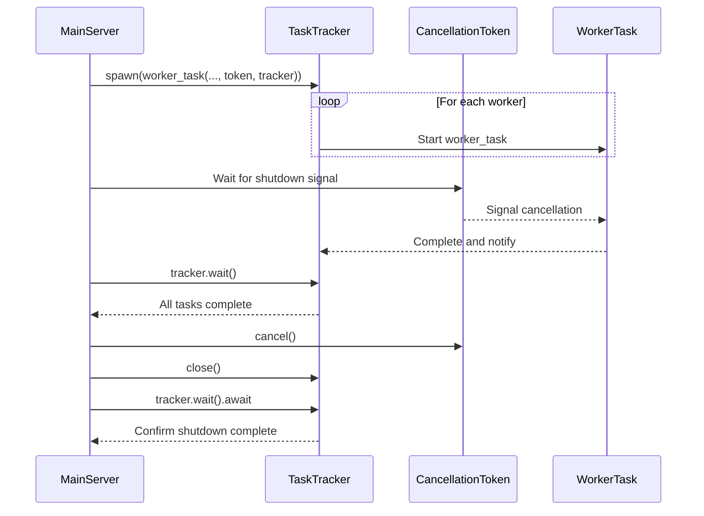
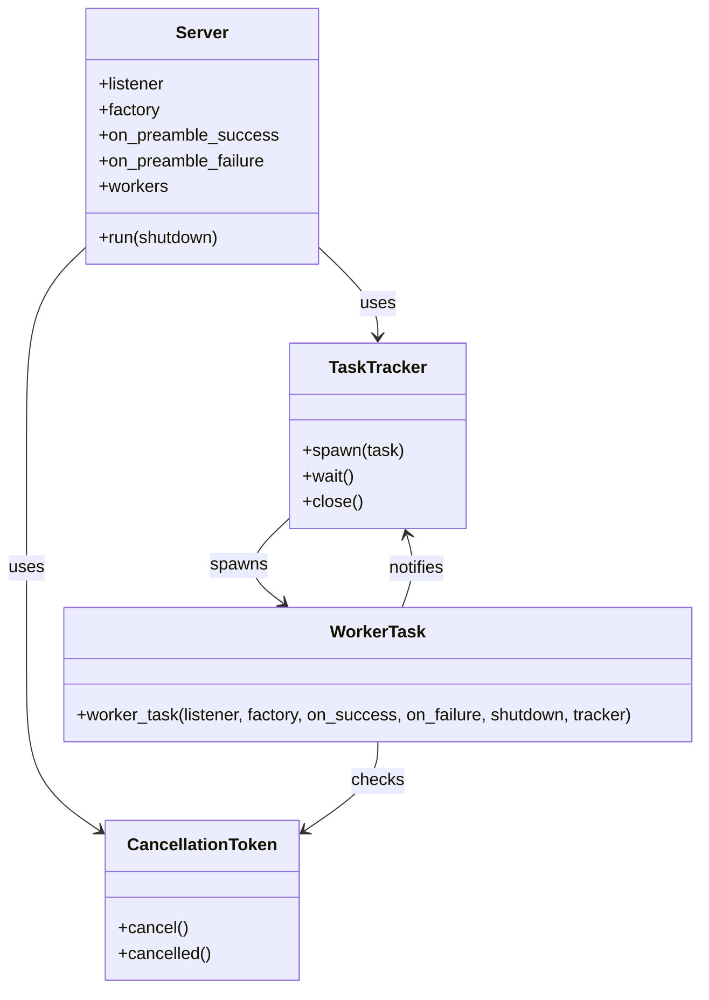

# Hardening `wireframe`: A Guide to Production Resilience

## 1. Introduction: The Philosophy of Resilience

For a low-level networking library like `wireframe`, resilience is not an
optional extra; it is a core, non-functional requirement. A library that is
functionally correct but brittle under load, susceptible to resource
exhaustion, or unable to terminate cleanly is not fit for production. This
guide details the comprehensive strategy for hardening `wireframe`,
transforming it into a framework that is robust by default.

This document is targeted at implementers. It moves beyond theoretical
discussion to provide concrete, actionable patterns and code for building a
resilient system. The philosophy is simple: anticipate failure, manage
resources meticulously, and provide clear mechanisms for control and recovery.
This guide covers three critical domains: coordinated shutdown, leak-proof
resource management, and denial-of-service mitigation.

## 2. Coordinated, Graceful Shutdown

A network service that cannot shut down cleanly leaks resources, corrupts
state, and provides a poor experience for clients. `wireframe` will implement a
canonical, proactive shutdown pattern, ensuring that termination is an orderly
and reliable process.

### 2.1 The `CancellationToken` and `TaskTracker` Pattern

The core mechanism relies on two primitives from the `tokio` ecosystem:
`tokio_util::sync::CancellationToken` for signalling and
`tokio_util::task::TaskTracker` for synchronisation.

- `CancellationToken`: A single root token is created at server startup.
  This token is cloned and distributed to every spawned task, including
  connection actors and any user-defined background workers. When the server
  needs to shut down (e.g., on receipt of `SIGINT`), it calls `.cancel()` on
  the root token, a signal that is immediately visible to all clones.

- `TaskTracker`: The server uses a `TaskTracker` to `spawn` all tasks. After
  triggering cancellation, the main server task calls `tracker.close()` and
  then `tracker.wait().await`. This call will only resolve once every single
  tracked task has completed, guaranteeing that no tasks are orphaned.

### 2.2 Implementation in the Connection Actor

Every long-running loop within `wireframe` must be made cancellation-aware.
This is achieved by adding a high-priority branch to every `select!` macro.

#### Example: The Main Connection Actor Loop

```rust
use tokio_util::sync::CancellationToken;
use tokio_util::task::TaskTracker;

pub async fn run_connection(
    mut socket: impl AsyncRead + AsyncWrite,
    shutdown_token: CancellationToken,
    // ... other state
) {
    loop {
        tokio::select! {
            // Biased polling ensures the shutdown signal is always checked first.
            biased;

            _ = shutdown_token.cancelled() => {
                tracing::info!("Shutdown signal received, closing connection.");
                // Optionally send a final protocol-specific shutdown message.
                // e.g., socket.write_all(b"GOODBYE").await;
                break;
            },

            // The main work of the actor, e.g., reading the next frame.
            result = read_frame_from_socket(&mut socket) => {
                match result {
                    Ok(Some(frame)) => { /* process frame */ },
                    Ok(None) => {
                        tracing::info!("Client closed connection cleanly.");
                        break;
                    },
                    Err(e) => {
                        tracing::warn!(error = ?e, "Error reading from socket.");
                        break;
                    }
                }
            }
        }
    }
    tracing::debug!("Connection actor terminated.");
}

```

This pattern ensures that whether a connection ends due to a client disconnect,
an error, or a server-wide shutdown, the task terminates cleanly and reliably.

#### Sequence Diagram



#### Class Diagram



## 3. Meticulous Resource Management

Long-running servers are exquisitely sensitive to resource leaks. `wireframe`
will enforce strict resource management patterns to guarantee stability over
time.

### 3.1 RAII and Explicit `Drop` Semantics

Rust's ownership model and the `Drop` trait are the foundation of resource
safety. All handles within `wireframe` that manage a resource (e.g.,
`PushHandle`, stream producers) must have well-defined `Drop` implementations.
This ensures that resources are cleaned up correctly even in the case of panics
or early returns from user code, relying on the RAII (Resource Acquisition Is
Initialization) pattern for safety.

Connection tasks are wrapped with `catch_unwind` to log and discard panics.
Each panicking connection is isolated so it cannot terminate the entire server.

Each occurrence also increments the `wireframe_connection_panics_total`
counter, enabling alerts on unexpected spikes. The counter intentionally omits
peer address labels to limit cardinality and protect personally identifiable
information. Operators can chart `rate(wireframe_connection_panics_total[5m])`
in Prometheus and create Grafana panels to visualize instability. To emit this
metric, enable the `metrics` Cargo feature and install a recorder such as
`metrics_exporter_prometheus`, which exposes an HTTP endpoint for scraping.

### 3.2 Leak-Proof Registries with `Weak`/`Arc`

A global `SessionRegistry` that stores `PushHandle`s to active connections is a
classic source of memory leaks. If the registry holds a strong `Arc` to the
connection's channel, the channel's resources can never be deallocated, even
after the connection actor has terminated.

The solution is to store non-owning `Weak` pointers in the registry.

**Implementation:**

1. **Define** `PushHandle` **around an** `Arc`**:**

   ```rust
   // The internal state shared by handles.
   struct PushHandleInner<F> {
       tx: mpsc::Sender<F>,
       // Other shared state can go here.
   }

   // The public, cloneable handle.
   #[derive(Clone)]
   pub struct PushHandle<F>(Arc<PushHandleInner<F>>);


   ```

2. **Store** `Weak` **pointers in the** `SessionRegistry`**:**

   ```rust
   use dashmap::DashMap;
   use std::sync::{Arc, Weak};

   // The registry holds non-owning weak pointers.
   pub struct SessionRegistry<F>(DashMap<ConnectionId, Weak<PushHandleInner<F>>>);


   ```

3. **Access via** `upgrade()`**:** To use a handle, a task must "upgrade" the
   `Weak` pointer to a strong `Arc`. If the upgrade fails, it means the
   connection is gone, and the registry can perform just-in-time cleanup.

   ```rust
   impl<F> SessionRegistry<F> {
       pub fn get(&self, id: &ConnectionId) -> Option<PushHandle<F>> {
           self.0.get(id)
                .and_then(|weak_ref| weak_ref.upgrade()) // Attempt to get a strong reference.
                .map(PushHandle::from_arc) // If successful, wrap it in our public type.
        }

       // Optional: A method to periodically sweep for dead entries.
       pub fn prune(&self) {
           self.0.retain(|_id, weak_ref| weak_ref.strong_count() > 0);
       }
   }


   ```

This pattern entirely prevents the registry from causing memory leaks.

## 4. Denial-of-Service (DoS) Mitigation

As a library exposed to the network, `wireframe` must be hardened against
resource exhaustion attacks.

### 4.1 Throttling with Per-Connection Rate Limiting

A malicious or buggy client could trigger pushed messages at an extremely high
rate, saturating the CPU of the connection actor. To prevent this, `wireframe`
will provide a configurable, per-connection rate limiter. An asynchronous
token-bucket algorithm is ideal.

**Implementation Sketch:**

```rust
use wireframe::push::{PushQueues, MAX_PUSH_RATE};

// Configure a connection to allow at most MAX_PUSH_RATE pushes per second.
let (queues, handle) = PushQueues::<Frame>::builder()
    .high_capacity(8)
    .low_capacity(8)
    .rate(Some(MAX_PUSH_RATE))
    .build()
    .expect("rate within supported bounds");

// Calling `unlimited` disables rate limiting entirely:
let (_unlimited, _handle) = PushQueues::<Frame>::builder()
    .high_capacity(8)
    .low_capacity(8)
    .unlimited()
    .build()
    .expect("failed to build unlimited queues");

// Inside PushHandle::push()
async fn push(&self, frame: Frame) -> Result<(), PushError> {
    // If a limiter is configured, wait for a token before queuing the frame.
    if let Some(ref limiter) = self.limiter {
        limiter.acquire(1).await;
    }

    self.tx.send(frame).await.map_err(|_| /*...*/)
}

```

This throttles misbehaving producers gracefully without blocking the entire
runtime.

### 4.2 Memory Caps and Timeouts

To defend against attacks using large frames or slow data transmission, the
fragmentation layer must be hardened.

- **Strict Memory Cap (**`max_message_size`**):** The `FragmentAdapter` will
  enforce a non-optional, configurable limit on the total size of a logical
  message it is willing to re-assemble. Any fragment that would cause the
  partial message buffer to exceed this limit will result in an immediate error
  and connection termination.

- **Re-assembly Timeout:** A long-running connection could be attacked by a
  client that sends the first fragment of many different large messages but
  never sends the final fragments, slowly filling the re-assembly buffer. The
  `FragmentAdapter` must therefore include a **non-optional, configurable
  timeout** for partial messages. A `tokio-util`-based timer or a simple
  `dashmap` of `(MessageId, Instant)` can be used to track the age of partial
  assemblies, which are purged if they are not completed within the time limit
  (e.g., 30 seconds).

## 5. Advanced Resilience Patterns

For applications requiring the highest levels of reliability, `wireframe` will
provide optional, advanced patterns for error handling and recovery.

### 5.1 Typed Errors for Intelligent Recovery

A simple `io::Error` is insufficient to describe all failure modes. `wireframe`
will use a generic error enum to distinguish between unrecoverable transport
errors and potentially recoverable protocol errors.

```rust
pub enum WireframeError<E> {
    /// A fatal I/O error occurred. The connection should be terminated.
    Io(std::io::Error),
    /// A protocol-specific logical error. The framework may be able to
    /// format a reply before closing the logical stream.
    Protocol(E),
}

```

When the connection actor receives a `WireframeError::Protocol(e)` from a
response stream, it can pass this typed error to a protocol-specific callback.
This allows the protocol implementation to serialize a proper error frame
(e.g., an SQL error code) to send to the client before terminating the current
operation, rather than just abruptly closing the connection.

When a stream concludes successfully, the connection actor calls the
`stream_end_frame` hook to produce a terminator frame with no payload. This
explicit marker lets clients recognize that the logical stream has ended and
helps avoid lingering resources or stalled state machines. The terminator is
only appended if the protocol supplies one (that is, the hook returns
`Some(frame)`), and the frame passes through the `before_send` hook like any
other, allowing final mutation or metadata to be applied consistently.

### 5.2 Dead Letter Queues (DLQ) for Guaranteed Pushing

In some systems (e.g., financial transactions, critical audit logs), dropping a
message is not an option. For these use cases, the push mechanism will support
an optional Dead Letter Queue.

Implementation:

The WireframeApp builder will allow the user to provide a mpsc::Sender for a
DLQ. The PushHandle's internal logic for handling a full queue will be modified:

```rust
// Inside PushHandle, when try_send fails with a full queue
match self.tx.try_send(frame) {
    Ok(_) => Ok(()),
    Err(mpsc::error::TrySendError::Full(failed_frame)) => {
        if let Some(dlq_tx) = &self.dlq_tx {
            // Attempt to route the failed frame to the DLQ.
            if dlq_tx.try_send(failed_frame).is_err() {
                tracing::warn!("Push queue and DLQ are both full. Frame lost.");
            }
        } else {
            // Default behaviour: drop the frame.
            tracing::warn!("Push queue full, dropping frame.");
        }
        Ok(())
    },
    //... handle closed error
}

```

By default the library logs each DLQ drop to maximise visibility during
development and testing. Applications can tune verbosity using the push queue
builder's `dlq_log_every_n` and `dlq_log_interval` settings to throttle
warnings per handle in production.

A separate part of the application is then responsible for consuming from the
DLQ's receiver to inspect, log, and re-process these failed messages, ensuring
zero message loss even under transient high load.

## 5. Metrics and Observability

Operational visibility is critical in production. `wireframe` updates counters
and gauges through the optional `metrics` feature. See the documentation for
`wireframe::metrics` for a Prometheus recorder example. The exposed metrics
include processed frame counts, error totals and the active connection gauge.

By systematically implementing these hardening strategies, `wireframe` will
provide the guarantees of stability, security, and reliability expected of a
foundational piece of network infrastructure.
