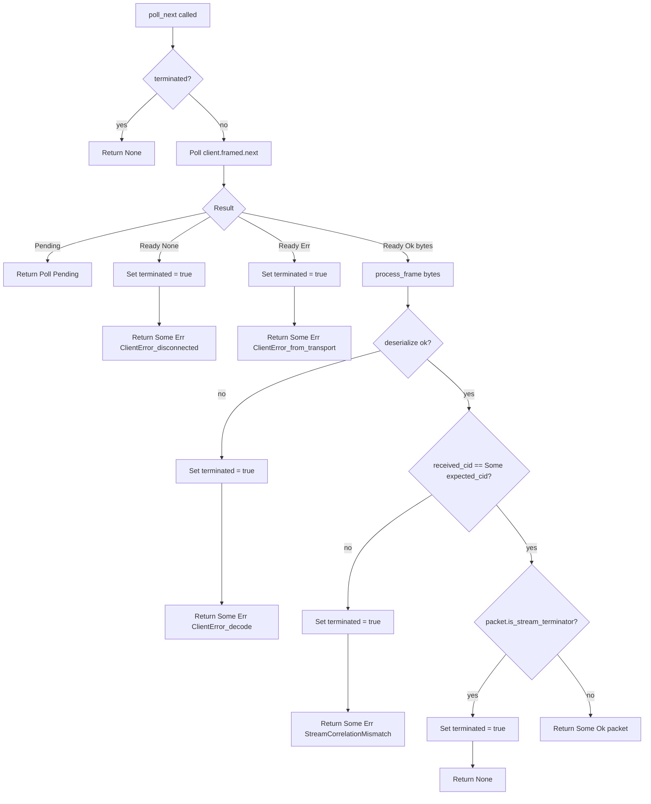

# Comprehensive Design: Multi-Packet & Streaming Responses

## 1. Introduction & Philosophy

The initial version of `wireframe` established a robust, strictly
request-response communication model. This design was intentionally simple but
is insufficient for the rich, conversational protocols that define modern
networking, such as database wire formats (MySQL, PostgreSQL), message brokers
(MQTT), and RPC systems (gRPC). These protocols frequently require a single
request to elicit a multi-part or open-ended sequence of response frames.

This document details the design for a first-class, protocol-agnostic streaming
response feature. The core philosophy is to enable this complex functionality
through a simple, declarative, and ergonomic API. By embracing modern
asynchronous Rust patterns, the design avoids the complexities of imperative,
sink-based APIs and provides a unified handler model that is both powerful for
streaming and simple for single-frame replies.

This feature is a key component of the "Road to Wireframe 1.0," working in
concert with asynchronous push messaging and fragmentation to create a fully
duplex and capable framework.

## Contents

- [1. Introduction & Philosophy](#1-introduction--philosophy)
- [2. Design Goals & Requirements](#2-design-goals--requirements)
- [3. Core Architecture: Declarative Streaming][sec-3]
  - [3.1 The Connection Actor's Role][sec-31]
  - [3.2 The `async-stream` Crate][sec-32]
  - [3.3 End-of-stream Signalling][sec-33]
- [4. Public API Surface][sec-4]
  - [4.1 The `Response` Enum][sec-41]
  - [4.2 Tuple-Based Multi-Packet Responses][sec-42]
  - [4.3 The `WireframeError` Enum][sec-43]
- [5. Handler Implementation Patterns][sec-5]
  - [5.1 Single-Frame Reply (Unchanged)][sec-51]
  - [5.2 Small, Multi-Part Result (`Response::Vec`)][sec-52]
  - [5.3 Large or Dynamic Stream (`Response::Stream`)][sec-53]
- [6. Stream Lifecycle and Error Handling][sec-6]
  - [6.1 Stream Termination][sec-61]
  - [6.2 Error Propagation][sec-62]
  - [6.3 Cancellation Safety & `Drop` Semantics][sec-63]
- [7. Synergy with Other 1.0 Features][sec-7]
- [8. Measurable Objectives & Success Criteria][sec-8]
- [9. Alternatives considered](#9-alternatives-considered)
- [10. Design decisions](#10-design-decisions)
- [11. Streaming request bodies](#11-streaming-request-bodies)
- [12. Client-side streaming consumption](#12-client-side-streaming-consumption)

[sec-3]: #3-core-architecture-declarative-streaming

[sec-31]: #31-the-connection-actors-role

[sec-32]: #32-the-async-stream-crate

[sec-33]: #33-end-of-stream-signalling

[sec-4]: #4-public-api-surface

[sec-41]: #41-the-response-enum

[sec-42]: #42-tuple-based-multi-packet-responses

[sec-43]: #43-the-wireframeerror-enum

[sec-5]: #5-handler-implementation-patterns

[sec-51]: #51-single-frame-reply-unchanged

[sec-52]: #52-small-multi-part-result-responsevec

[sec-53]: #53-large-or-dynamic-stream-responsestream

[sec-6]: #6-stream-lifecycle-and-error-handling

[sec-61]: #61-stream-termination

[sec-62]: #62-error-propagation

[sec-63]: #63-cancellation-safety--drop-semantics

[sec-7]: #7-synergy-with-other-10-features

[sec-8]: #8-measurable-objectives--success-criteria

## 2. Design Goals & Requirements

The implementation must satisfy the following core requirements:

<!-- markdownlint-disable MD060 -->
| ID | Requirement                                                                                                          |
| --- | -------------------------------------------------------------------------------------------------------------------- |
| G1 | Allow a handler to send zero, one, or many frames for a single logical response.                                     |
| G2 | Provide transparent back-pressure: writers must suspend when outbound capacity is exhausted.                         |
| G3 | Integrate with protocol-specific sequencing rules (e.g., per-command counters) without hard-coding any one protocol. |
| G4 | Keep the simple “single-frame reply” path untouched; upgrading should be optional and ergonomic.                     |
| G5 | Work symmetrically for servers and clients built with wireframe.                                                     |
<!-- markdownlint-enable MD060 -->

## 3. Core Architecture: Declarative Streaming

The cornerstone of this design is a move to a purely **declarative streaming
model**. Handlers declaratively return a description of the entire response.
This approach significantly simplifies the API surface, improves testability,
and eliminates a class of resource management issues associated with sink-based
designs.

### 3.1 The Connection Actor's Role

The existing connection actor model is well-suited to consume these declarative
responses. When a handler returns a `Response::Stream`, the actor will take
ownership of the stream and poll it for new frames within its main `select!`
loop.

Back-pressure emerges naturally from this design. The `select!` loop awaits
writing each frame to the socket. If the socket is slow and its buffer fills,
the `write` operation will suspend the actor task. This suspension prevents the
actor from polling the response stream for the next frame, which in turn
propagates back-pressure all the way to the stream's producer without any
explicit channel management.

### 3.2 The `async-stream` Crate

To provide an ergonomic way for developers to generate streams using
imperative-style logic (e.g., inside a `for` loop), `wireframe` adopts and
recommends the `async-stream` crate. This crate provides macros (`stream!` and
`try_stream!`) that transform imperative `yield` statements into a fully
compliant `Stream` object. This gives developers the intuitive feel of
imperative code generation with minimal API complexity. The library recommends
this pattern as the canonical way to build `Response::Stream` values.

### 3.3 End-of-stream Signalling

`ConnectionActor` classifies how a multi-packet channel finished using a
`MultiPacketTerminationReason` helper. When `recv` returns `None`, the actor
records a `Drained` completion, logs an `info!` event that includes the
connection identifier, peer address, and correlation identifier, and fetches a
protocol-specific terminator frame via `stream_end_frame`. That frame is
stamped with the stored `correlation_id`, passed through the standard
`before_send` hook, and recorded by outbound metrics before being queued for
transmission.

If the channel disconnects unexpectedly the termination reason becomes
`Disconnected`. The actor emits a `warn!` level log so operators can spot
broken senders, but it still forwards the terminator frame and calls
`on_command_end` to ensure higher layers release any per-request resources.

Shutdown-driven closure is tracked separately through the `Shutdown` variant.
The actor logs the closure so observability tools can correlate it with control
plane events and clears any remaining state without synthesising an
end-of-stream marker.

## 4. Public API Surface

The public API is designed for clarity, performance, and ergonomic flexibility.

### 4.1 The `Response` Enum

The `Response` enum is the primary return type for all handlers. It is enhanced
to provide optimised paths for common response patterns.

```rust
use futures_core::stream::Stream;
use std::pin::Pin;

/// Represents the full response to a request.
pub enum Response<F, E> {
    /// A single frame reply. The most common case.
    Single(F),

    /// An optimized response for a small, known list of frames.
    /// Avoids the overhead of boxing and dynamic dispatch for simple multi-part replies.
    Vec(Vec<F>),

    /// A potentially unbounded stream of frames for complex or dynamically generated responses.
    Stream(FrameStream<F, E>),

    /// Frames produced via a channel for multi-packet replies.
    MultiPacket(tokio::sync::mpsc::Receiver<F>),

    /// A response that sends no frames, indicating the request was handled
    /// but produced no output (e.g., after a server push).
    Empty,
}

/// A type alias for a type-erased, dynamically dispatched stream of frames.
pub type FrameStream<F, E> =
    Pin<Box<dyn Stream<Item = Result<F, WireframeError<E>>> + Send + 'static>>;
```

MultiPacket uses a `tokio::sync::mpsc::Receiver` to deliver frames one-by-one,
relying on channel back-pressure to pace senders. This intentionally couples
wireframe to the Tokio runtime; runtime agnosticism is not currently a goal.

This design allows simple, single-frame handlers to remain unchanged
(`Ok(my_frame.into())`) while providing powerful and efficient options for more
complex cases.

To simplify consumption, `Response::into_stream` converts any `Response`
variant into a `FrameStream`. Downstream code can iterate over frames without
matching `MultiPacket` or wiring channels. Both `Response::Vec` with an empty
vector and `Response::Empty` yield an empty stream.

### 4.2 Tuple-Based Multi-Packet Responses

To make `Response::MultiPacket` ergonomic for developers, handlers can return a
tuple containing a Tokio `mpsc::Sender` and an initial `Response`. The
connection actor interprets this tuple as a request to stream follow-up frames
from the paired channel after any immediate frames have been dispatched. This
is the blessed pattern recorded in
[ADR 0001](adr/0001-multi-packet-streaming-response-api.md).

Two helpers are planned to codify the intended ergonomics (they are specified
here for implementation in the follow-up to ADR 0001):

- `Response::with_channel(capacity)` will construct a bounded channel, return
  the sender, and wrap the receiver inside a `Response::MultiPacket`. This is
  the minimal entry-point for streams that do not need to send frames
  immediately.
- `Response::with_channel_and_initial(capacity, initial)` will extend the
  previous helper by allowing callers to provide the initial `Response`
  explicitly. The helper records the initial variant (`Single`, `Vec`, or
  `Empty`) alongside the multi-packet receiver so the connection actor can
  first emit the up-front frames and then enter streaming mode.

#### 4.2.1 Implemented helper: `Response::with_channel`

`Response::with_channel` is now available. It forwards to Tokio's
`mpsc::channel`, returning the sender with a `Response::MultiPacket` that owns
the receiver. The helper intentionally mirrors Tokio's panic on zero capacity;
propagating this behaviour keeps the API predictable for developers already
familiar with Tokio channels. Unit tests assert that the helper enforces
bounded capacity and drains frames in order, while the multi-packet Cucumber
feature exercises the helper end-to-end through a background producer task. The
fixture demonstrates the intended tuple return pattern: spawn a producer,
stream frames through the sender, and rely on the connection actor to manage
delivery and shutdown semantics.

When a tuple is returned, the connection actor:

- sends any frames embedded in the initial `Response` before transitioning into
  streaming mode;
- attaches the stored receiver to its outbound loop so subsequent frames flow
  through the same middleware, instrumentation, and hook pipeline; and
- observes Tokio channel semantics for back-pressure and cancellation. A slow
  client causes the receiver to stop draining, which in turn suspends
  `Sender::send` calls, while dropping all senders closes the channel and
  triggers the usual end-of-stream marker emission.

The helpers keep single-frame handlers unchanged whilst giving developers a
declarative mechanism to orchestrate long-running responses. Background tasks
can hold clones of the sender and deliver frames as they become available
without re-implementing connection logic.

```rust
use futures::StreamExt;
use tokio::sync::mpsc;
use wireframe::Response;

async fn handle_long_query(
    req: QueryRequest,
) -> Result<(mpsc::Sender<MyFrame>, Response<MyFrame, MyError>), MyError> {
    let header = MyFrame::ack(req.correlation_id);

    // Planned helper from this design; until shipped, handlers can manually
    // build the tuple by calling `tokio::sync::mpsc::channel` and constructing
    // `Response::MultiPacket`.
    let (tx, response) = Response::with_channel_and_initial(
        16,
        Response::Single(header),
    );

    let query = req.clone();
    let mut producer = tx.clone();
    tokio::spawn(async move {
        if producer.send(MyFrame::starting_chunk()).await.is_err() {
            return;
        }

        let mut rows = stream_rows(query);
        while let Some(Ok(row)) = rows.next().await {
            let frame = MyFrame::from(row);
            if producer.send(frame).await.is_err() {
                break;
            }
        }
    });

    Ok((tx, response))
}
```

The example illustrates how the planned helper lifts the receiver management
out of the handler. The initial response variant can be changed to
`Response::Vec` for a small batch of up-front frames or `Response::Empty` when
no immediate message is required. In every case the connection actor preserves
ordering: the initial frames are sent synchronously, the streamed frames
follow, and the channel closure triggers the protocol-specific end-of-stream
marker.

### 4.3 The `WireframeError` Enum

To enable more robust error handling, a generic error enum will be introduced.
This allows the framework and protocol implementations to distinguish between
unrecoverable transport failures and logical, protocol-level errors.

```rust
/// A generic error type for wireframe operations.
pub enum WireframeError<E> {
    /// An error occurred in the underlying transport (e.g., socket closed).
    /// These are typically unrecoverable for the connection.
    Io(std::io::Error),

    /// A protocol-defined error occurred (e.g., invalid request).
    /// The framework can pass this to the protocol layer to be formatted
    /// into a proper error frame before closing the stream.
    Protocol(E),
}

// Implement `From<std::io::Error>` for ergonomics.
impl<E> From<std::io::Error> for WireframeError<E> {
    fn from(e: std::io::Error) -> Self {
        WireframeError::Io(e)
    }
}
```

## 5. Handler Implementation Patterns

The following examples illustrate how developers will use the new API.

### 5.1 Single-Frame Reply (Unchanged)

Existing code continues to work without modification, fulfilling goal **G4**.

```rust
async fn handle_ping(_req: Request) -> Result<Response<MyFrame, MyError>, MyError> {
    // `MyFrame` implements `Into<Response<...>>`
    Ok(build_pong_frame().into())
}
```

### 5.2 Small, Multi-Part Result (`Response::Vec`)

For simple, fixed-size multi-part responses, like a MySQL result set header,
`Response::Vec` is both ergonomic and performant.

```rust
async fn handle_select_headers(_req: Request) -> Result<Response<MySqlFrame, MyError>, MyError> {
    // Pre-build frames for: column-count, column-def, EOF
    let frames = vec![];
    Ok(Response::Vec(frames))
}
```

### 5.3 Large or Dynamic Stream (`Response::Stream`)

For large or dynamically generated result sets, like a PostgreSQL `COPY OUT`
command, `async-stream` provides an intuitive way to generate the stream.

```rust
use async_stream::try_stream;

async fn handle_copy_out(req: PgCopyRequest) -> Result<Response<PgFrame, PgError>, PgError> {
    let response_stream = try_stream! {
        // First, yield the row description frame.
        yield PgFrame::row_description(&req.columns);

        // Now, iterate over the data source and yield a frame for each row.
        // The `?` operator will correctly propagate errors into the stream.
        for row in database::fetch_rows_for_copy(&req.table)? {
            yield PgFrame::data_row(row)?;
        }

        // Finally, yield the completion message.
        yield PgFrame::command_complete("COPY");
    };

      Ok(Response::Stream(Box::pin(response_stream)))
}
```

`async-stream` is the preferred crate for constructing dynamic
`Response::Stream` values. See `examples/async_stream.rs` for a complete
demonstration.

## 6. Stream Lifecycle and Error Handling

### 6.1 Stream Termination

A response stream is considered complete when the underlying `Stream`
implementation returns `Poll::Ready(None)`. The connection actor will detect
this and call the `on_logical_response_end` hook on the `WireframeProtocol`
trait, allowing the protocol implementation to reset any per-command state.

### 6.2 Error Propagation

If the stream yields an `Err(WireframeError<E>)`, the connection actor will:

1. **If** `WireframeError::Io`**:** Immediately terminate the connection, as
   this indicates a transport-level failure.

2. **If** `WireframeError::Protocol(e)`**:** Pass the typed error `e` to a new
   `handle_error` callback on the `WireframeProtocol` trait. This gives the
   protocol layer a chance to serialize a proper error frame to send to the
   client before the stream is terminated.

### 6.3 Cancellation Safety & `Drop` Semantics

The design is inherently cancellation-safe. The `select!` macro in the
connection actor will drop the `FrameStream` future if another branch (e.g., a
shutdown signal) completes first. Because `StreamExt::next()` is
cancellation-safe, no frames will be lost; the stream will simply be dropped.

Similarly, if a handler panics or returns early, the `Stream` object it created
is simply dropped. The connection actor will see the stream end as if it had
completed normally, ensuring no resources are leaked and the connection does
not hang.

## 7. Synergy with Other 1.0 Features

- **Asynchronous Pushes:** The connection actor's prioritized write loop (as
  defined in the outbound messaging design) will always poll for pushed
  messages *before* polling the response stream. This ensures that urgent,
  out-of-band messages are not starved by a long-running data stream.

- **Message Fragmentation:** Streaming occurs at the logical frame level. The
  `FragmentAdapter` will operate at a lower layer, transparently splitting any
  large frames yielded by the stream before they are written to the socket. The
  handler and streaming logic remain completely unaware of fragmentation.

- **Streaming Request Bodies:** [ADR 0002][adr-0002] introduces first-class
  streaming request bodies as the inbound counterpart to streaming responses.
  Handlers MAY receive `RequestParts` plus `RequestBodyStream` rather than a
  fully reassembled `Vec<u8>`, enabling incremental processing of large inbound
  payloads. This symmetry allows protocols to apply the same back-pressure and
  memory budget semantics in both directions.

- **MessageAssembler:** Protocol-level multi-frame message assembly integrates
  with streaming request bodies. The `MessageAssembler` abstraction allows
  protocol crates to supply protocol-specific parsing and continuity rules
  while Wireframe provides shared buffering machinery and limit enforcement.
  See the [fragmentation design][frag-design] for how transport-level
  fragmentation and protocol-level assembly compose. The hook is surfaced as
  `wireframe::message_assembler::MessageAssembler` and registered via
  `WireframeApp::with_message_assembler`.

[frag-design]: generic-message-fragmentation-and-re-assembly-design.md

## 8. Measurable Objectives & Success Criteria

<!-- markdownlint-disable MD013 -->

| Category        | Objective                                                                                                                                        | Success Metric                                                                                                                                             |
| --------------- | ------------------------------------------------------------------------------------------------------------------------------------------------ | ---------------------------------------------------------------------------------------------------------------------------------------------------------- |
| API Correctness | The Response enum and FrameStream type alias are implemented exactly as specified in this document.                                              | 100% of the public API surface is present and correctly typed.                                                                                             |
| Functionality   | A handler returning a stream of N frames results in N frames being written to the socket in the correct order.                                   | A test suite confirms 100% frame delivery and strict ordering for Response::Vec and Response::Stream.                                                      |
| Ergonomics      | The async-stream pattern is documented as the canonical approach for dynamic stream generation.                                                  | The official examples and documentation exclusively use the declarative Response model.                                                                    |
| Performance     | The Response::Vec variant has measurably lower allocation and dispatch overhead than Response::Stream for small, fixed-size responses.           | A criterion benchmark confirms that Response::Vec is at least 50% faster and performs fewer allocations than Response::Stream for a response of 10 frames. |
| Error Handling  | A WireframeError::Protocol error yielded from a stream correctly triggers the handle_error protocol callback without terminating the connection. | An integration test confirms that a protocol-level error is correctly formatted and sent to the client, while the connection remains open.                 |

<!-- markdownlint-enable MD013 -->

## 9. Alternatives considered

Several options were evaluated before the tuple-based design was selected. Each
alternative fell short against one or more requirements in
[Section 2](#2-design-goals--requirements).

- **Exclusive use of `Response::Stream` with `async-stream`.** This approach
  keeps the API surface minimal but forces every producer to operate from a
  single async context. It struggles with goal **G1** (multiple producers) and
  erodes the ergonomics demanded by **G4** for simple upgrades, because
  handlers must manually interleave initial frames and ongoing data inside one
  stream.
- **Sink or callback-oriented APIs.** Providing a bespoke responder object would
  satisfy back-pressure but duplicates Tokio channel functionality, adds new
  abstractions contrary to the "adhere to existing architecture" constraint,
  and complicates lifecycle management. The tuple proposal retains the familiar
  Tokio channels and meets **G2** without bespoke sinks.
- **Blocking or partially streaming handlers.** Allowing handlers to emit
  frames sequentially without yielding undermines the framework's concurrency
  story and violates **G2** by removing natural back-pressure. It also risks
  head-of-line blocking for unrelated work, conflicting with the connection
  actor design described earlier.

Adopting the tuple with helpers therefore best satisfies the goals matrix while
staying true to the architecture already in production use.

## 10. Design decisions

- Multi-packet channels are driven inside the existing connection actor
  `select!` loop rather than by a detached task. This keeps a single locus for
  back-pressure, aligns with the production resilience guidance on avoiding
  orphaned tasks, and ensures orderly shutdown propagates to streaming work.
- The `ConnectionActor` owns the channel receiver and polls it via the
  main `select!` loop. Frames pass through `process_frame_common` so protocol
  hooks and metrics observe every packet. When the channel drains, the actor
  emits the protocol end-of-stream marker and invokes `on_command_end` to
  release per-request state.
- The actor captures the request's `correlation_id` before iterating the
  channel and stamps it onto every serialised frame. This preserves protocol
  invariants without requiring handlers to mutate frames post-creation and
  mirrors the message attribution strategy outlined in the capability roadmap.
- **Correlation provenance today.** The current implementation expects
  correlation to live inside the serialised `Envelope` payload. See the decode
  path in `src/app/connection.rs` and the payload-carried correlation fields in
  `src/app/envelope.rs`.
- **Header correlation (if that is not the intent).** The boundary for
  injecting header correlation is the frame-to-`Envelope` step in
  `WireframeApp::decode_envelope` (`src/app/connection.rs`). That is where the
  decoded frame and the deserialised `Envelope` are both available, so the
  runtime can merge header correlation into `Envelope::correlation_id` (for
  example, “if payload correlation is `None`, inherit from the header; if both
  exist and differ, log and pick a precedence rule”). On the outbound path,
  `FrameCodec::wrap_payload` receives the codec instance and raw `Bytes`, but
  it still cannot see correlation unless it is embedded in the payload.
  Supporting header correlation therefore requires a codec API that can wrap
  `Envelope` or `PacketParts` directly (for example, a `wrap_parts` or
  `wrap_envelope` helper alongside `wrap_payload`).
- Implementation stores the expected identifier alongside a closure built from
  the new `CorrelatableFrame` trait, ensuring frames can be stamped in a
  generic actor without constraining other protocols. Debug builds assert the
  stamped frame exposes the expected identifier so regressions fail fast.

Debug-mode assertions must guard this stamping by checking
`frame.correlation_id == request.correlation_id` before a frame is dispatched.
The actor enforces this invariant when accepting a new multi-packet channel:

```rust
// src/connection.rs
pub fn set_multi_packet(&mut self, channel: Option<mpsc::Receiver<F>>) {
    debug_assert!(
        self.response.is_none(),
        "ConnectionActor invariant violated: multi_packet requires no active response",
    );
    self.multi_packet = channel;
}
```

Document the assertion and add tests covering normal streaming, early receiver
closure, and error paths. This ensures reviewers can confirm the stamping
cannot regress or be removed.

- When the receiver reports closure, the actor emits the configured
  end-of-stream marker via the normal send path and then triggers the protocol
  lifecycle hooks. This guarantees downstream clean-up and observability cues
  stay consistent with other stream completions.
- Integration tests exercise the actor in a client-like configuration. They
  stream multiple envelopes, assert the terminator inherits the request's
  `correlation_id`, verify a dropped producer logs a `reason=disconnected`
  warning, and ensure push-queue traffic interleaves with streamed frames
  without corrupting correlation identifiers.

## 11. Streaming request bodies

[ADR 0002][adr-0002] extends Wireframe's streaming model to inbound requests,
providing symmetry with the outbound streaming capabilities documented above.

### 11.1 Handler-facing shapes

Handlers that opt into streaming request bodies receive two components:

- `RequestParts` carries the routing and correlation metadata needed to
  dispatch the request before the body is fully received.
- `RequestBodyStream` yields body chunks incrementally, allowing handlers to
  process large payloads without buffering the entire message in memory.

See [ADR 0002][adr-0002] for the canonical type definitions. The exact field
names and types may evolve; protocol authors should consult the published API
documentation for current signatures.

### 11.2 Opt-in semantics

The default remains "buffered request" to preserve Wireframe's existing
transparent assembly ergonomics for small messages and simple protocols.
Handlers MAY opt into streaming by declaring a compatible extractor signature.

Wireframe MAY expose an `AsyncRead` adaptor for `RequestBodyStream` so protocol
crates can reuse existing parsers that expect `AsyncRead` rather than `Stream`.

### 11.3 Symmetry with response streaming

Streaming request bodies mirror `Response::Stream`:

| Direction           | Type                | Back-pressure mechanism                               |
| ------------------- | ------------------- | ----------------------------------------------------- |
| Outbound (response) | `Response::Stream`  | Socket write suspension propagates to stream producer |
| Inbound (request)   | `RequestBodyStream` | Socket read suspension propagates to body consumer    |

Both directions apply the same per-connection memory budgets and back-pressure
semantics, ensuring consistent resource accounting across the duplex channel.

### 11.4 Composition with MessageAssembler

When a protocol uses the `MessageAssembler` abstraction for multi-frame message
assembly, the assembler produces either:

- a buffered request body (the default), or
- a `RequestBodyStream` that the handler consumes incrementally.

The assembler handles protocol-specific continuity rules (ordering, missing
frames, duplicate frames) while Wireframe provides shared buffering machinery
and limit enforcement. See [ADR 0002][adr-0002] for the complete specification.

[adr-0002]: adr/0002-streaming-requests-and-shared-message-assembly.md

## 12. Client-side streaming consumption

Sections 3–6 document how the **server** produces streaming and multi-packet
responses. This section describes the symmetric **client** machinery that
consumes those responses, completing design goal **G5**.

### 12.1 Terminator detection via `Packet::is_stream_terminator`

The server emits a terminator frame via the `stream_end_frame` protocol hook.
The client must detect that frame to know when to stop reading. Rather than
introducing a new trait or a closure parameter, the `Packet` trait gains a
method with a backward-compatible default:

```rust
fn is_stream_terminator(&self) -> bool { false }
```

Protocol implementations override this to match their terminator format (for
example, `self.id == 0`). The approach was chosen over alternatives because:

- **Single abstraction.** `Packet` already models the protocol frame; adding
  terminator knowledge avoids a parallel hierarchy.
- **Backward-compatible.** The `false` default means existing `Packet`
  implementations compile without changes.
- **Symmetric.** Server produces terminators (`stream_end_frame`); client
  detects them (`is_stream_terminator`). The two hooks mirror each other.

### 12.2 `ResponseStream` type

`ResponseStream<'a, P, S, T, C>` implements `futures::Stream` and borrows the
`WireframeClient` exclusively for the duration of the stream. Each `poll_next`
call:

1. Reads the next length-delimited frame from the transport.
2. Deserializes it into `P` using the client's configured serializer.
3. Validates the correlation identifier against the expected value.
4. Checks `is_stream_terminator()` — if true, marks the stream as terminated
   and returns `None`.
5. Otherwise yields `Ok(frame)`.

<!-- Figure: ResponseStream poll_next control flow.
     Accessible description for screen readers and editors that do not render
     Mermaid diagrams:

     The diagram is a top-down flowchart showing the decision tree inside
     ResponseStream::poll_next.  Entry checks whether the stream is already
     terminated; if so it returns None immediately.  Otherwise the underlying
     Framed transport is polled.  Four outcomes branch from the poll result:
     (1) Pending → return Poll::Pending;
     (2) Ready(None) → set terminated, return Err(disconnected);
     (3) Ready(Err) → set terminated, return Err(transport error);
     (4) Ready(Ok(bytes)) → enter process_frame, which first attempts
         deserialization (failure → set terminated, return Err(decode)).
         On success it checks the correlation ID (mismatch → set terminated,
         return Err(StreamCorrelationMismatch)), then checks
         is_stream_terminator (true → set terminated, return None).
         If none of those conditions apply it yields Ok(packet). -->



Key design decisions:

- **Concrete type, not boxed `FrameStream`.** Avoids dynamic dispatch and
  lets the borrow checker enforce that only one stream is active at a time.
- **`&mut self` borrowing, not transport splitting.** Splitting `Framed` into
  read and write halves would complicate the API for marginal benefit. Callers
  already cannot do concurrent operations on `&mut self`, so the exclusive
  borrow is natural.
- **Terminator not yielded.** The terminator frame is swallowed by
  `ResponseStream` and the stream returns `None`, matching the server's
  behaviour where `on_command_end` is internal machinery.

### 12.3 Client streaming API surface

Two methods are exposed on `WireframeClient`:

- `call_streaming<P>(request) -> Result<ResponseStream, ClientError>` — sends
  the request, auto-generates a correlation identifier if the request does not
  carry one, and returns a `ResponseStream`. This is the high-level API for the
  common case.
- `receive_streaming<P>(correlation_id) -> ResponseStream` — returns a stream
  for a pre-sent request. This is the low-level API for callers who need to
  send the request separately (for example, via `send_envelope`).

### 12.4 Error handling

`ResponseStream` surfaces three categories of error:

| Error variant                            | Trigger                            |
| ---------------------------------------- | ---------------------------------- |
| `ClientError::Wireframe`                 | Transport or decode failure        |
| `ClientError::StreamCorrelationMismatch` | Frame carries wrong correlation ID |
| `ClientError::StreamTerminated`          | Polling after the stream has ended |

Correlation validation is performed on every frame before it is yielded to the
consumer. A mismatch terminates the stream immediately, because mixed
correlation traffic indicates a protocol violation that cannot be recovered.

### 12.5 Back-pressure

No explicit flow-control messages are needed. TCP flow control provides natural
back-pressure: if the client reads slowly, the receive buffer fills, the
server's send buffer fills, write operations suspend, and the server stops
polling its response stream or channel. This is consistent with the server-side
back-pressure architecture described in Section 3.1.
