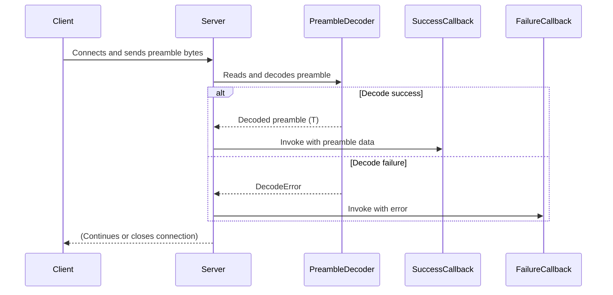

# Connection Preamble Validation

`wireframe` supports an optional connection preamble that is read as soon as a
client connects. The server decodes the preamble with
[`read_preamble`](../src/preamble.rs) and can invoke user-supplied callbacks on
success or failure. The helper uses `bincode` to decode any type implementing
`bincode::Decode` and reads exactly the number of bytes required.

The flow is summarised below:

In the tests a `HotlinePreamble` struct illustrates the pattern, but any
preamble type may be used. Register callbacks via `on_preamble_decode_success`
and `on_preamble_decode_failure` on `WireframeServer`.
