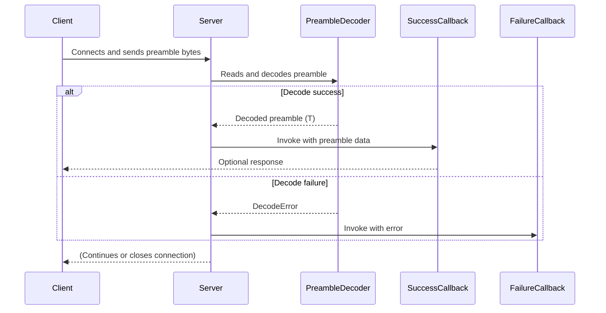

# Connection Preamble Validation

`wireframe` supports an optional connection preamble that is read as soon as a
client connects. The server decodes the preamble with
[`read_preamble`](../src/preamble.rs) and can invoke user-supplied callbacks on
success or failure. The helper uses `bincode` to decode any type implementing
`bincode::BorrowDecode` and reads exactly the number of bytes required.

The flow is summarized below:

The success callback receives the decoded preamble and a mutable `TcpStream`.
It may write a handshake response before the connection is passed to
`WireframeApp`. In the tests, a `HotlinePreamble` struct illustrates the
pattern, but any preamble type may be used. Register callbacks via
`on_preamble_decode_success` and `on_preamble_decode_failure` on
`WireframeServer`.

## Call Order

`WireframeServer::with_preamble::<T>()` must be called **before** registering
callbacks with `on_preamble_decode_success` or `on_preamble_decode_failure`.
The method converts the server to use a custom preamble type, dropping any
callbacks configured on the default `()` preamble. Registering callbacks after
calling `with_preamble::<T>()` ensures they are retained.
