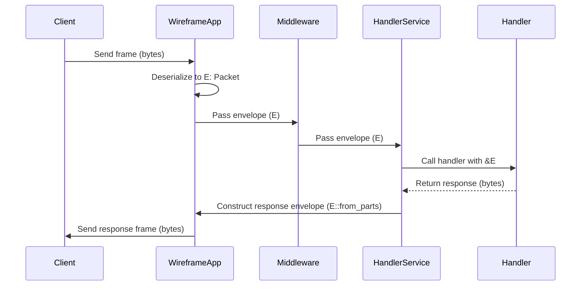
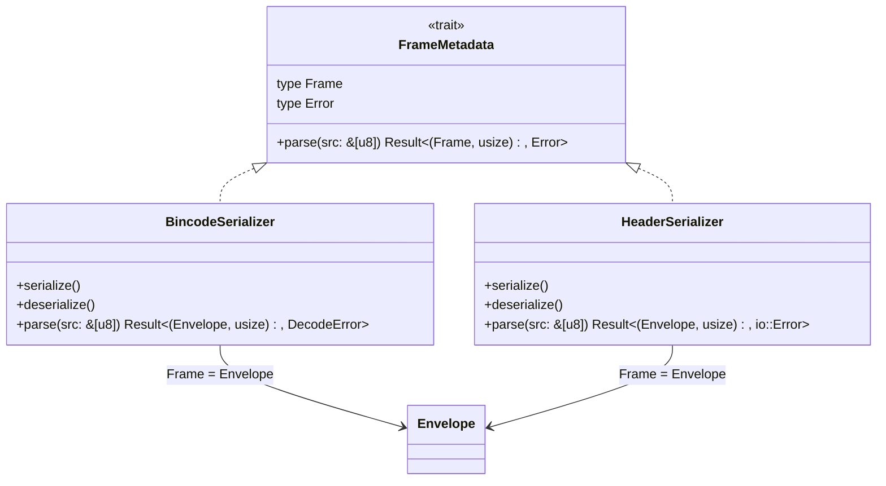
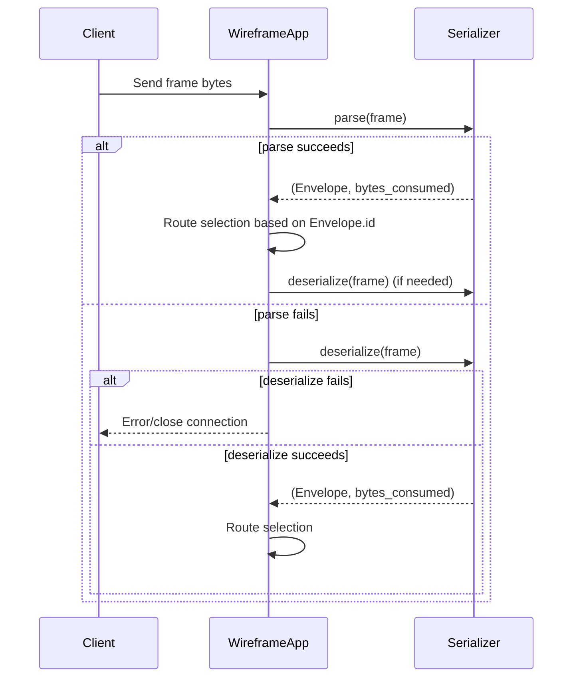
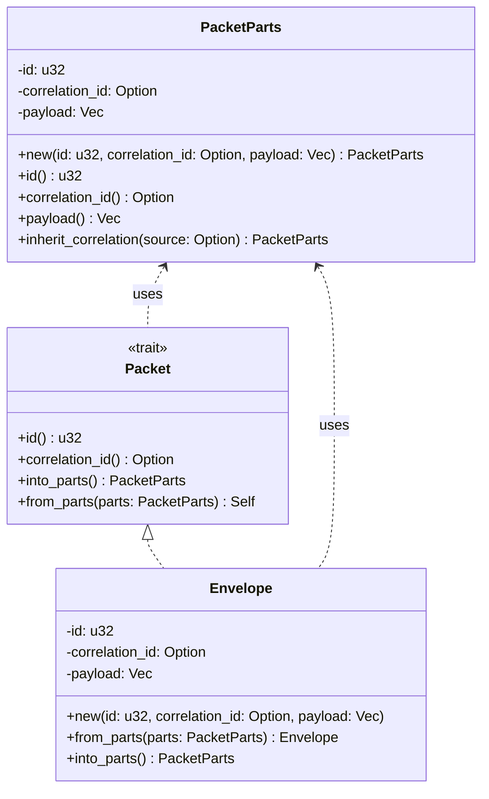
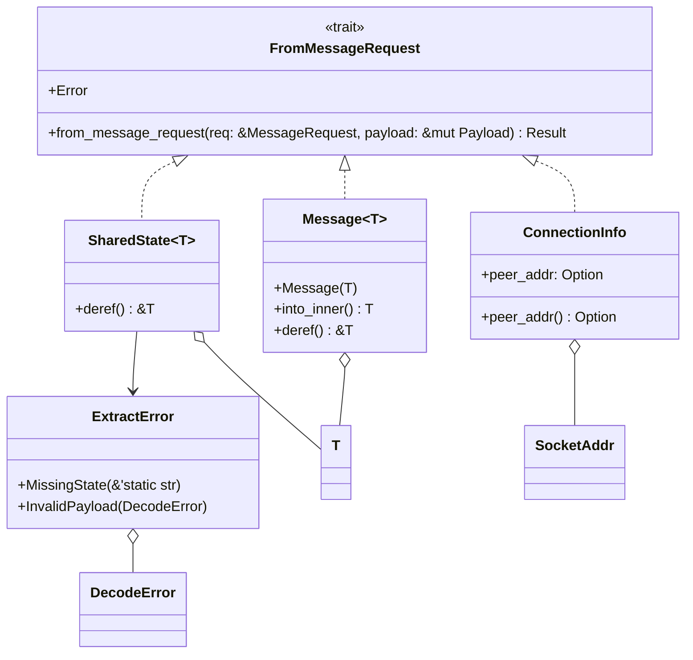
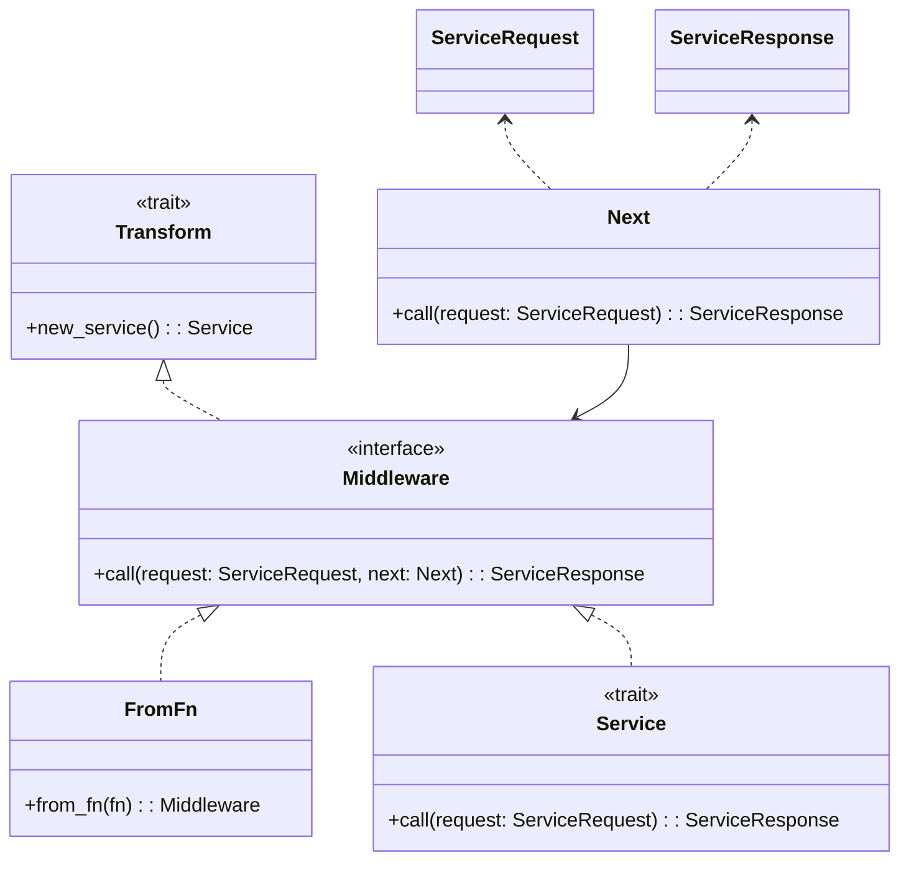

# Design of `wireframe`: A Rust Router for Binary Protocols

## 1. Introduction

The development of applications requiring communication over custom binary wire
protocols often involves significant complexities in source code. These
complexities arise from manual data serialization and deserialization,
intricate framing logic, stateful connection management, and the imperative
dispatch of messages to appropriate handlers. Such low-level concerns can
obscure the core application logic, increase development time, and introduce a
higher propensity for errors. The Rust programming language, with its emphasis
on safety, performance, and powerful compile-time abstractions, offers a
promising foundation for mitigating these challenges.

This report outlines the design of "wireframe," a novel Rust library aimed at
substantially reducing source code complexity when building applications that
handle arbitrary frame-based binary wire protocols. The design draws
inspiration from the ergonomic API of Actix Web 4, a popular Rust web framework
known for its intuitive routing, data extraction, and middleware systems.[^1]
"wireframe" intends to adapt these successful patterns to the domain of binary
protocols.

A key aspect of the proposed design is the utilization of `wire-rs`[^2] for
message serialization and deserialization, contingent upon its ability to
support or be augmented with derivable `Encode` and `Decode` traits. This,
combined with a layered architecture and high-level abstractions, seeks to
provide developers with a more declarative and less error-prone environment for
building robust network services.

## 2. Methodology

The design of the "wireframe" library is predicated on a multi-faceted approach:

1. **Literature Survey**: A comprehensive review of existing Rust libraries and
   patterns for binary serialization, protocol implementation, and network
   programming was conducted. This included an examination of serialization
   libraries such as `wire-rs`, `bincode`, `postcard`, and `bin-proto`, as well
   as protocol frameworks like `protocol` and `tarpc`. The Tokio ecosystem, a
   foundational element for asynchronous networking in Rust, was also
   considered.
2. **API Analysis**: The Application Programming Interface (API) of Actix Web
   was studied in detail, focusing on its mechanisms for routing, request data
   extraction, middleware, and application state management. The objective was
   to identify design principles that contribute to its developer-friendliness
   and could be effectively translated to the context of binary protocols.
3. **Comparative Synthesis**: Learnings from the literature survey and API
   analysis were synthesized to inform the core design decisions for
   "wireframe". This involved identifying common strategies for complexity
   reduction in Rust, such as the use of derive macros and trait-based
   abstractions, and evaluating how Actix Web's patterns could be adapted.
4. **Iterative Design**: Based on these findings, a conceptual design for
   "wireframe" was developed, outlining its architecture, core components, and
   API. This design prioritizes the user query's central goal: reducing source
   code complexity for arbitrary frame-based binary protocols.

The inaccessibility of the `leynos/mxd` repository 7, mentioned in the user
query as an example of a system whose complexity "wireframe" aims to reduce,
means that a direct comparative analysis is not possible. Therefore, the focus
of this report is on demonstrating complexity reduction through the inherent
advantages of the proposed abstractions and API design, contrasting them with
common manual implementation pitfalls.

## 3. Literature Survey and Precedent Analysis

A survey of the existing Rust ecosystem provides valuable context for the
design of "wireframe," highlighting established patterns for serialization,
protocol implementation, and API ergonomics.

### 3.1. Binary Serialization Libraries in Rust

Effective and efficient binary serialization is fundamental to any library
dealing with wire protocols. Several Rust crates offer solutions in this space,
each with distinct characteristics.

- `wire-rs`: The user query specifically suggests considering
  `wire-rs`.[^2] This library provides an extensible interface for converting
  data to and from wire protocols, supporting non-contiguous buffers and
  `no_std` environments. It features `WireReader` and `WireWriter` for manual
  data reading and writing, with explicit control over endianness.[^2] However,
  the available information does not clearly indicate the presence or nature of
  derivable `Encode` and `Decode` traits for automatic (de)serialization of
  complex types.[^2] The ability to automatically generate (de)serialization
  logic via derive macros is crucial for achieving "wireframe's" goal of
  reducing source code complexity. If such derive macros are not a core feature
  of `wire-rs`, "wireframe" would need to either contribute them, provide its
  own wrapper traits that enable derivation while using `wire-rs` internally,
  or consider alternative serialization libraries.

- `bincode`: `bincode` is a widely used binary serialization library that
  integrates well with Serde.[^3] It offers high performance and configurable
  options for endianness and integer encoding.[^4] `bincode` 2.0 makes Serde an
  optional dependency and provides its own `Encode`/`Decode` traits that can be
  derived.[^5] Its flexibility and performance make it a strong candidate if
  `wire-rs` proves unsuitable for derivable (de)serialization. The choice
  between fixed-width integers and Varint encoding offers trade-offs in terms
  of size and speed.

- `postcard`: `postcard` is another Serde-compatible library, specifically
  designed for `no_std` and embedded environments, prioritizing resource
  efficiency (memory, code size).9 It uses LEB128 for variable-length integer
  encoding and has a stable, documented wire format.10 `postcard` is noted for
  being less configurable but potentially easier to use than `bincode` due to
  fewer options.10 Benchmarks suggest `postcard` can produce smaller outputs
  than `bincode` in many cases, sometimes at a slight performance cost.9 Its
  focus on minimalism and a simple specification is appealing.

- `bin-proto`: `bin-proto` offers simple and fast structured bit-level binary
  encoding and decoding.14 It provides `BitEncode` and `BitDecode` traits,
  along with custom derive macros (e.g., `#`) for ease of use.14 It allows
  fine-grained control over bit-level layout, such as specifying the number of
  bits for fields and enum discriminants.14 `bin-proto` also supports
  context-aware parsing, where deserialization logic can depend on external
  context, a feature potentially valuable for complex protocols.

The common thread among the more ergonomic libraries (`bincode`, `postcard`,
`bin-proto`) is the provision of derive macros. This significantly simplifies
the process of making custom data structures serializable, aligning directly
with "wireframe's" complexity reduction objective. The choice of serialization
library for "wireframe" will heavily depend on the feasibility of integrating
`wire-rs` with such derivable traits or the need to adopt an alternative like
`bincode` or `postcard` that already offers this crucial feature.

### 3.2. Existing Rust Libraries for Custom Network Protocols

Several Rust libraries provide frameworks or utilities for implementing custom
network protocols, offering insights into effective abstractions.

- `protocol` **(dylanmckay/protocol)**: This crate aims to simplify protocol
  definitions in Rust by using a custom derive
  `#[derive(protocol::Protocol)]`.16 It allows structured data to be sent and
  received from any I/O stream, with built-in support for TCP and UDP. Any type
  implementing its `Parcel` trait can be serialized. The derive macro handles
  the implementation for custom types, though it requires types to also
  implement `Clone`, `Debug`, and `PartialEq`, which might be overly
  restrictive for some use cases.16 The library also supports middleware for
  transforming sent/received data. This library exemplifies the use of derive
  macros to reduce boilerplate in protocol definitions, a core strategy for
  "wireframe".

- `message-io`: This library provides abstractions for message-based network
  communication over various transports like TCP, UDP, and WebSockets. Notably,
  it offers `FramedTcp`, which prefixes messages with their size, managing data
  as packets rather than a raw stream.17 This distinction between
  connection-oriented and packet-based transports, and the provision of framing
  solutions, is relevant to "wireframe's" design for handling frame-based
  protocols.

- `tokio-util::codec`: Part of the extensive Tokio ecosystem 18,
  `tokio-util::codec` provides `Encoder` and `Decoder` traits. These traits are
  fundamental for implementing framing logic, allowing the conversion of a raw
  byte stream into a sequence of frames, and vice-versa. While not a full
  routing solution, these traits are essential low-level building blocks upon
  which "wireframe" would likely build its framing layer.

- `tarpc`: `tarpc` is an RPC framework for Rust focusing on ease of use.
  Although designed for RPC, its approach of defining service schemas directly
  in Rust code (using the `#[tarpc::service]` attribute to generate service
  traits and client/server boilerplate) is an interesting parallel to
  "wireframe's" goal of reducing boilerplate for message handlers. Features
  like pluggable transports and serde serialization further highlight its
  modern design.

A clear pattern emerges from these libraries: the use of derive macros and
trait-based designs is a prevalent and effective strategy in Rust for
simplifying protocol handling and reducing boilerplate code. Both `bin-proto`
and `protocol` leverage custom derives to generate (de)serialization logic
directly from struct and enum definitions. This is a proven pattern for
enhancing developer ergonomics and reducing the likelihood of manual
implementation errors. "wireframe" should strongly consider adopting a similar
macro-driven approach for defining message structures and potentially for
handler registration.

### 3.3. Lessons from Actix Web's API Design

Actix Web, a high-performance web framework for Rust 5, is cited in the user
query as a model for API aesthetics. Its design offers valuable lessons for
"wireframe".

- **Routing**: Actix Web provides flexible and declarative routing. Attribute
  macros like `#[get("/")]` and `#[post("/echo")]` allow handlers to be
  associated with specific HTTP methods and paths directly in their definition.
  Alternatively, routes can be registered programmatically using
  `App::service()` for macro-routed handlers or `App::route()` for manual
  configuration.4 This declarative style simplifies route management.

- **Data Extraction**: A key feature of Actix Web is its powerful extractor
  system.22 Request handlers are `async` functions that accept parameters which
  are automatically extracted from the incoming request if they implement the
  `FromRequest` trait.4 Built-in extractors include `web::Path` for path
  parameters, `web::Json` for JSON payloads, `web::Query` for query parameters,
  and `web::Data` for accessing shared application state.21 Users can also
  define custom extractors by implementing `FromRequest`.24 This system
  promotes type safety and decouples data parsing and validation from the core
  handler logic.

- **Middleware**: Actix Web has a robust middleware system allowing developers
  to insert custom processing logic into the request/response lifecycle.
  Middleware is registered using `App::wrap()` and typically implements
  `Transform` and `Service` traits.26 Common use cases include logging 27,
  authentication, and request/response modification. Middleware functions can
  be simple `async fn`s when using `middleware::from_fn()`.

- **Application Structure and State**: Applications are built around an `App`
  instance, which is then used to configure an `HttpServer`.4 Shared
  application state can be managed using `web::Data<T>`, making state
  accessible to handlers and middleware.21 For globally shared mutable state,
  careful use of `Arc` and `Mutex` (or atomics) is required, initialized
  outside the `HttpServer::new` closure.

The ergonomic success of Actix Web for web application development can be
significantly attributed to these powerful and intuitive abstractions.
Extractors, for example, cleanly separate the concern of deriving data from a
request from the business logic within a handler.22 Middleware allows for
modular implementation of cross-cutting concerns like logging or
authentication, preventing handler functions from becoming cluttered.26 If
"wireframe" can adapt these patterns—such as creating extractors for
deserialized message payloads or connection-specific metadata, and a middleware
system for binary message streams—it can achieve comparable benefits in
reducing complexity and improving code organization for its users.

### 3.4. Key Learnings and Implications for "wireframe" Design

The preceding survey underscores several critical considerations for the design
of "wireframe":

1. **Derive Macros are Essential**: For message definition and
   (de)serialization, derive macros are paramount for reducing boilerplate and
   improving developer experience, as seen in `bin-proto`, `protocol`,
   `bincode`, and `postcard`.
2. **Robust (De)serialization Strategy**: The choice of `wire-rs` is contingent
   on its ability to support derivable `Encode`/`Decode` traits. If this is not
   feasible, well-established alternatives like `bincode` or `postcard` offer
   proven Serde integration and derive capabilities.
3. **Actix-Inspired API Patterns**: Leveraging Actix Web's patterns for routing,
   data extraction (extractors), and middleware is key to achieving the desired
   developer-friendliness and reducing source code complexity.
4. **Asynchronous Foundation**: Integration with an asynchronous runtime like
   Tokio is non-negotiable for a modern, performant networking library in Rust.

Given the inaccessibility of `leynos/mxd` 7, a direct benchmark of complexity
reduction is not possible. Therefore, "wireframe" must demonstrate its benefits
through the qualitative improvements offered by its abstractions. The design
must clearly articulate how its features—such as declarative APIs, automatic
code generation via macros, and separation of concerns inspired by Actix
Web—lead to simpler, more maintainable code compared to hypothetical manual
implementations of binary protocol handlers. This involves illustrating
"before" (manual, complex, error-prone) versus "after" (wireframe, simplified,
robust) scenarios through its API design and examples.

## 4. "wireframe" Library Design

The design of "wireframe" is guided by the primary objective of reducing source
code complexity for developers working with arbitrary frame-based binary
protocols in Rust. This section details the core philosophy, architecture, and
key mechanisms of the proposed library.

### 4.1. Core Philosophy and Design Goals

The development of "wireframe" adheres to the following principles:

- **Primary Goal: Reduce Source Code Complexity**: This is the central tenet.
  Every design decision is evaluated against its potential to simplify
  development. This is achieved through high-level abstractions, declarative
  APIs, and minimizing boilerplate code.
- **Generality for Arbitrary Frame-Based Protocols**: The library must not be
  opinionated about the specific content or structure of the binary protocols
  it handles beyond the assumption of a frame-based structure. Users should be
  able to define their own framing logic and message types.
- **Performance**: Leveraging Rust's inherent performance characteristics is
  crucial.[^6] While developer ergonomics is a primary focus, the design must
  avoid introducing unnecessary overhead. Asynchronous operations, powered by a
  runtime like Tokio, are essential for efficient I/O and concurrency.
- **Safety**: The library will harness Rust's strong type system and ownership
  model to prevent common networking bugs, such as data races and
  use-after-free errors, contributing to more reliable software.
- **Developer Ergonomics**: The API should be intuitive, well-documented, and
  easy to learn, particularly for developers familiar with patterns from Actix
  Web.

A potential tension exists between the goal of supporting "arbitrary" protocols
and maintaining simplicity. An overly generic library might force users to
implement many low-level details, negating the complexity reduction benefits.
Conversely, an excessively opinionated library might not be flexible enough for
diverse protocol needs. "wireframe" aims to strike a balance by providing
robust conventions and helper traits for common protocol patterns (e.g.,
message ID-based routing, standard framing methods) while still allowing
"escape hatches" for highly customized requirements. This involves identifying
commonalities in frame-based binary protocols and offering streamlined
abstractions for them, without precluding more bespoke implementations.

### 4.2. High-Level Architecture

"wireframe" will employ a layered architecture, promoting modularity and
separation of concerns. This structure allows different aspects of protocol
handling to be managed and customized independently.

#### Conceptual Block Diagram

```text
+--------------------------+      +----------------------+      +--------------------------+
| Network Connection       |<---->| Transport Layer      |<---->| Framing Layer            |
| (e.g., TCP/UDP Socket)   |      | Adapter (Tokio I/O)  |      | (User-defined/Built-in)  |
+--------------------------+      +----------------------+      +------------+-------------+
                                                                             |
                                                                             v
+---------------------------+      +---------------------+      +--------------------------+
| Middleware (Response Path)|<-----| User Handler Logic  |<-----| Middleware (Request Path) |
+---------------------------+      +---------+-----------+      +--------------------------+
                                             ^
                                             |
+---------------------------+      +---------+-----------+      +--------------------------+
| Serialization Engine      |<---->| Routing Engine      |<---->| Deserialization Engine   |
| (e.g., wire-rs)           |      | (Message ID based)  |      | (e.g., wire-rs)          |
+---------------------------+      +---------------------+      +--------------------------+
```

**Core Components**:

- **Transport Layer Adapter**: This component interfaces with the underlying
  network I/O, typically provided by Tokio's `TcpStream`, `UdpSocket`, or
  similar asynchronous I/O primitives.18 It is responsible for the raw reading
  of bytes from the network and writing bytes to it.
- **Framing Layer**: Responsible for processing the incoming byte stream from
  the transport layer into discrete logical units called "frames." Conversely,
  it serializes outgoing messages from the application into byte sequences
  suitable for transmission, adding any necessary framing information (e.g.,
  length prefixes, delimiters). This layer will utilize user-defined or
  built-in framing logic, potentially by implementing traits like Tokio's
  `Decoder` and `Encoder`.
- **Deserialization/Serialization Engine**: This engine converts the byte
  payload of incoming frames into strongly typed Rust data structures
  (messages) and serializes outgoing Rust messages into byte payloads for
  outgoing frames. This is the primary role intended for `wire-rs` 6 or an
  alternative like `bincode` 11 or `postcard`.12 A minimal wrapper trait in the
  library currently exposes these derive macros under a convenient `Message`
  trait, providing `to_bytes` and `from_bytes` helpers.
- **Routing Engine**: After a message is deserialized (or at least a header
  containing an identifier is processed), the routing engine inspects it to
  determine which user-defined handler function is responsible for processing
  this type of message.
- **Handler Invocation Logic**: This component is responsible for calling the
  appropriate user-defined handler function. It will manage the extraction of
  necessary data (e.g., the message payload, connection information) and
  provide it to the handler in a type-safe manner, inspired by Actix Web's
  extractors.
- **Middleware/Interceptor Chain**: This allows for pre-processing of incoming
  frames/messages before they reach the handler and post-processing of
  responses (or frames generated by the handler) before they are serialized and
  sent. This enables cross-cutting concerns like logging, authentication, or
  metrics.

**Data Flow**:

1. **Incoming**: Raw bytes arrive at the **Transport Layer Adapter**.
2. The bytes are passed to the **Framing Layer**, which identifies and extracts
   a complete frame.
3. The frame's payload is passed to the **Deserialization Engine**, which
   converts it into a Rust message type.
4. The deserialized message is passed to the **Routing Engine**, which
   identifies the target handler based on message type or ID.
5. The message (and associated request context) passes through the **Middleware
   Chain (request path)**.
6. The **Handler Invocation Logic** calls the designated **User Handler
   Function**.
7. **Outgoing**: If the handler produces a response message: a. The response
   passes through the **Middleware Chain (response path)**. b. The response
   message is passed to the **Serialization Engine** to be converted into a
   byte payload. c. This payload is given to the **Framing Layer** to be
   encapsulated in a frame. d. The framed bytes are sent via the **Transport
   Layer Adapter**.



This layered architecture mirrors the conceptual separation found in network
protocol stacks, such as the OSI or TCP/IP models.28 Each component addresses a
distinct set of problems. This modularity is fundamental to managing the
overall complexity of the library and the applications built with it. It allows
individual components, such as the framing mechanism or the serialization
engine, to be potentially customized or even replaced by users with specific
needs, without requiring modifications to other parts of the system.

### 4.3. Frame Definition and Processing

To handle "arbitrary frame-based protocols," "wireframe" must provide a
flexible way to define and process frames.

- `FrameProcessor` **(or Tokio** `Decoder`**/**`Encoder` **integration)**: The
  core of frame handling will revolve around a user-implementable trait,
  tentatively named `FrameProcessor`. Alternatively, and perhaps preferably for
  ecosystem compatibility, "wireframe" could directly leverage Tokio's
  `tokio_util::codec::{Decoder, Encoder}` traits. Users would implement these
  traits to define:

  - **Decoding**: How a raw byte stream from the network is parsed into discrete
    frames. This logic would handle issues like partial reads and buffering,
    accumulating bytes until one or more complete frames can be extracted.
    Examples include length-prefixed framing (where a header indicates the
    payload size, similar to `message-io`'s `FramedTcp` 17), delimiter-based
    framing (where frames are separated by a specific byte sequence), or
    fixed-size framing.
  - **Encoding**: How an outgoing message (or its serialized byte payload) is
    encapsulated into a frame for transmission, including adding any necessary
    headers, length prefixes, or delimiters.

  "wireframe" could provide common `FrameProcessor` implementations (e.g., for
  length-prefixed frames) as part of its standard library, simplifying setup
  for common protocol types. The library ships with a
  `LengthPrefixedProcessor`. It accepts a `LengthFormat` specifying the prefix
  size and byte order—for example, `LengthFormat::u16_le()` or
  `LengthFormat::u32_be()`. Applications configure it via
  `WireframeApp::frame_processor(LengthPrefixedProcessor::new(format))`. The
  `FrameProcessor` trait remains public, so custom implementations can be
  supplied when required.

- **Optional** `FrameMetadata` **Trait**: For protocols where routing decisions
  or pre-handler middleware logic might depend on information in a frame header
  *before* the entire payload is deserialized (e.g., for performance reasons or
  if the payload type depends on a header field), an optional trait like
  `FrameMetadata` could be introduced. Types implementing this trait would
  represent the quickly parsable header part of a frame, providing access to
  identifiers or flags. This allows for a two-stage deserialization: first the
  metadata, then, based on that, the full payload.

The relationship between the trait and example serializers can be visualised as
follows:



During message processing, metadata parsing precedes full deserialization:



This separation of framing logic via traits is crucial. Different binary
protocols employ vastly different methods for delimiting messages on the wire.
Some use fixed-size headers with length fields, others rely on special
start/end byte sequences, and some might have no explicit framing beyond what
the transport layer provides (e.g., UDP datagrams). A trait-based approach for
frame processing, akin to how `tokio-util::codec` operates, endows "wireframe"
with the necessary flexibility to adapt to this diversity without embedding
assumptions about any single framing strategy into its core.

#### 4.3.1 Packet abstraction

The library defines a `Packet` trait to represent transport frames. Frames can
be decomposed into `PacketParts` for efficient handling and reassembly.
`Envelope` is the default implementation used by `wireframe`. The following
diagram depicts the `Packet` trait, `PacketParts`, and `Envelope`.



`Envelope` implements `Packet`, carrying payload and metadata through the
system. `PacketParts` avoids repetitive tuple unpacking when frames are split
into constituent pieces. A `None` correlation ID denotes an unsolicited event
or server-initiated push. In multi-packet streaming responses, the optional
`correlation_id` links all packets in the stream to the originating request,
and protocols should define an explicit end-of-stream indicator alongside the
shared correlation identifier.

### 4.4. Message Serialization and Deserialization

The conversion of frame payloads to and from Rust types is a critical source of
complexity that "wireframe" aims to simplify.

- Primary Strategy: wire-rs with Derivable Traits:

  The preferred approach is to utilize wire-rs 6 as the underlying
  serialization and deserialization engine. However, this is critically
  dependent on wire-rs supporting, or being extended to support, derivable
  `Encode`/`Decode` traits (e.g., through `wireframe_derive`). The ability to
  automatically generate this logic from struct/enum definitions is paramount.
  Manual serialization/deserialization using WireReader::read_u32(),
  WireWriter::write_string(), etc., for every field would not meet the
  complexity reduction goals.

  If wire-rs itself does not offer derive macros, "wireframe" might need to
  provide its own wrapper traits and derive macros that internally use
  wire-rs's WireReader and WireWriter primitives but expose a user-friendly,
  derivable interface.

- Alternative/Fallback Strategies:

  If wire-rs proves unsuitable (e.g., due to the difficulty of implementing
  derivable traits, performance characteristics not matching the needs, or
  fundamental API incompatibilities), well-supported alternatives with
  excellent Serde integration will be considered:

  - `bincode`: Offers high performance, configurability, and its own derivable
    `Encode`/`Decode` traits in version 2.x.10 It is a strong contender for
    general-purpose binary serialization.
  - `postcard`: Ideal for scenarios where serialized size is a primary concern,
    such as embedded systems, and also provides Serde-based derive macros.9 Its
    simpler configuration might be an advantage.10 The choice would be guided
    by the specific requirements of typical "wireframe" use cases.

- Context-Aware Deserialization:

  Some binary protocols require deserialization logic to vary based on
  preceding data or external state. For instance, the interpretation of a field
  might depend on the value of an earlier field in the same message or on the
  current state of the connection. bin-proto hints at such capabilities with
  its context parameter in BitDecode::decode.14 "wireframe" should aim to
  support this, either through features in the chosen serialization library
  (e.g., wire-rs supporting a context argument) or by layering this capability
  on top. This could involve a multi-stage deserialization process:

  1. Deserialize a generic frame header or a preliminary part of the message.
  2. Use information from this initial part to establish a context.
  3. Deserialize the remainder of the payload using this context.

The cornerstone of "reducing source code complexity" in this domain is the
automation of serialization and deserialization. Manual implementation of this
logic is not only tedious but also a frequent source of subtle bugs related to
endianness, offset calculations, and data type mismatches. Libraries like
Serde, and by extension `bincode` and `postcard`, have demonstrated the immense
value of derive macros in Rust for automating these tasks.8 If "wireframe" were
to force users into manual field-by-field reading and writing, it would fail to
deliver on its primary promise. Therefore, ensuring a smooth, derivable
(de)serialization experience is a non-negotiable aspect of its design.

### 4.5. Routing and Dispatch Mechanism

Once a frame is received and its payload (or at least a routing-relevant
header) is deserialized into a Rust message, "wireframe" needs an efficient and
clear mechanism to dispatch this message to the appropriate user-defined
handler.

- Route Definition:

  Inspired by Actix Web's declarative routing 4, but adapted for binary
  protocols, routes in "wireframe" will be defined based on message identifiers
  rather than URL paths. This identifier could be an integer, a string, or an
  enum variant extracted from the message itself or its frame header.

  Two primary approaches for defining routes are envisaged:

  1. **Programmatic Registration**:

     ```rust
     // Assuming MessageType is an enum identifying different messages
     Router::new()
        .message(MessageType::LoginRequest, handle_login)
        .message(MessageType::ChatMessage, handle_chat)
         //... other routes
     ```

  1. **Attribute Macro on Handler Functions**:

     ```rust
     #
     async fn handle_login(msg: Message<LoginRequest>, conn_info: ConnectionInfo) -> Result<LoginResponse, MyError> {
         //... handler logic
     }

     #
     async fn handle_chat(msg: Message<ChatMessage>, state: SharedState<ChatAppState>) {
         //... handler logic, no direct response needed
     }
     ```

  The attribute macro approach is generally preferred for its conciseness and
  co-location of routing information with handler logic, similar to Actix Web's
  `#[get(...)]` macros.

- Dispatch Logic:

  Internally, the router will maintain a mapping (e.g., using a HashMap or a
  specialized dispatch table if the identifiers are dense integers) from
  message identifiers to handler functions. Upon receiving a deserialized
  message, the router extracts its identifier, looks up the corresponding
  handler, and invokes it. The efficiency of this lookup is critical for
  high-throughput systems that process a large number of messages per second.

- Dynamic Routing and Guards:

  For more complex routing scenarios where the choice of handler might depend
  on multiple fields within a message or the state of the connection,
  "wireframe" could incorporate a "guard" system, analogous to Actix Web's
  route guards. Guards would be functions that evaluate conditions on the
  incoming message or connection context before a handler is chosen.

  ```rust
  Router::new()
    .message_guarded(
         MessageType::GenericCommand,
         <!-- markdownlint-disable-next-line MD013 -->
         | msg_header: &CommandHeader | msg_header.sub_type == CommandSubType::Special, handle_special_command ).message(MessageType::GenericCommand, handle_generic_command) // Fallback ``` |

  ```

The routing mechanism essentially implements a form of pattern matching or a
state machine that operates on message identifiers. A clear, declarative API
for this routing, as opposed to manual `match` statements over message types
within a single monolithic receive loop, significantly simplifies the top-level
structure of a protocol server. This declarative approach makes it easier for
developers to understand the mapping between incoming messages and their
respective processing logic, thereby improving the maintainability and
comprehensibility of the application, especially as the number of message types
grows.

## 5. "wireframe" API Design (Inspired by Actix Web)

The API of "wireframe" will be heavily influenced by Actix Web, aiming for a
similar level of developer ergonomics and clarity. This section details the
proposed API components.

### 5.1. Router Configuration and Service Definition

Similar to Actix Web's `App` and `HttpServer` structure 4, "wireframe" will
provide a builder pattern for configuring the application and a server
component to run it.

- `WireframeApp` **or** `Router` **Builder**: A central builder struct, let's
  call it `WireframeApp`, will serve as the primary point for configuring the
  protocol handling logic.

  ```rust
  use wireframe::{WireframeApp, WireframeServer, Message, error::Result};
  use my_protocol::{LoginRequest, LoginResponse, ChatMessage, AppState, MyFrameProcessor, MessageType};
  use std::sync::Arc;
  use tokio::sync::Mutex;

  // Example handler functions (defined elsewhere)
  async fn handle_login(req: Message<LoginRequest>) -> Result<LoginResponse> { /*... */ Ok(LoginResponse::default()) }
  async fn handle_chat_message(msg: Message<ChatMessage>, state: SharedState<AppState>) { /*... */ }

  // --- Assuming message_handler attribute macro ---
  async fn login_handler(req: Message<LoginRequest>) -> Result<LoginResponse> {
      /*... */
      Ok(LoginResponse::default())
  }

  async fn chat_handler(msg: Message<ChatMessage>, state: SharedState<AppState>) {
      /*... */
  }
  // ---

  async fn main_server_setup() -> std::io::Result<()> {
      let app_state = Arc::new(Mutex::new(AppState::new()));
      WireframeServer::new(move || { // Closure provides App per worker thread
         WireframeApp::new()
            .frame_processor(MyFrameProcessor::new()) // Configure the framing logic
            .app_data(app_state.clone()) // Shared application state
            //.service(login_handler) // If using attribute macros and auto-discovery
            //.service(chat_handler)
            .route(MessageType::Login, handle_login) // Manual route registration
            .route(MessageType::Chat, handle_chat_message)
            .wrap(MyLoggingMiddleware::default()) // Add middleware
      })
      .bind("127.0.0.1:7878")?
      .run()
      .await
   }
  ```

The WireframeApp builder would offer methods like:

- WireframeApp::new(): Creates a new application builder.

- .frame_processor(impl FrameProcessor): Sets the framing logic.

- .service(handler_function): Registers a handler function, potentially
  inferring the message type it handles if attribute macros are used.

- .route(message_id, handler_function): Explicitly maps a message identifier to
  a handler.

- .app_data(T): Provides shared application state, keyed by type. Registering
  another value of the same type replaces the previous one, mirroring Actix
  Web's `web::Data`.

- .wrap(middleware_factory): Adds middleware to the processing pipeline.

- **Server Initialization**: A `WireframeServer` component (analogous to
  `HttpServer`) would take the configured `WireframeApp` factory (a closure
  that creates an `App` instance per worker thread), bind to a network address,
  and manage incoming connections, task spawning for each connection, and the
  overall server lifecycle. The default number of worker tasks matches the
  available CPU cores, falling back to a single worker if the count cannot be
  determined. This would likely be built on Tokio's networking and runtime
  primitives.

This structural similarity to Actix Web is intentional. Developers familiar
with Actix Web's application setup will find "wireframe's" approach intuitive,
reducing the learning curve. Actix Web is a widely adopted framework 5, and
reusing its successful patterns makes "wireframe" feel like a natural extension
for a different networking domain, rather than an entirely new and unfamiliar
library.

### 5.2. Handler Functions

Handler functions are the core of the application logic, processing incoming
messages and optionally producing responses.

- **Signature**: Handler functions will be `async` and their parameters will be
  resolved using "wireframe" extractors.

  ```rust
  async fn handler_name(
      param1: ExtractedType1,
      param2: ExtractedType2,
      //... up to a reasonable limit
  ) -> Result<ResponseType, ErrorType> {
      // Handler logic
  }
  ```

- **Asynchronous Nature**: Handlers *must* be `async` functions to integrate
  seamlessly with the Tokio runtime and enable non-blocking operations. This is
  standard practice in modern Rust network programming.

- **Parameters as Extractors**: Arguments to handler functions are not passed
  directly by the router. Instead, their types must implement an "extractor"
  trait (see Section 5.3). "wireframe" will attempt to resolve each argument by
  calling its extraction logic.

- **Return Types**: Handlers can return various types, which "wireframe" will
  process accordingly:

  - A specific message type that implements a `wireframe::Responder` trait
    (analogous to Actix Web's `Responder` trait 4). This trait defines how the
    returned value is serialized and sent back to the client. When a handler
    yields such a value, `wireframe` encodes it using the application’s
    configured serializer and passes the resulting bytes to the
    `FrameProcessor` for transmission back to the peer.
  - `Result<ResponseType, ErrorType>`: For explicit error handling. If
    `Ok(response_message)`, the message is sent. If `Err(error_value)`, the
    error is processed by "wireframe's" error handling mechanism (see Section
    5.5). `ErrorType` should be convertible into a general `WireframeError`.
  - `()`: If the handler does not need to send a direct response to the specific
    incoming message (e.g., broadcasting a message to other clients, or if the
    protocol is one-way for this message).

The following table outlines core "wireframe" API components and their Actix
Web analogies, illustrating how the "aesthetic sense" of Actix Web is
translated:

#### Table 1: Core `wireframe` API Components and Actix Web Analogies

| `wireframe` Component             | Actix Web Analogy                      | Purpose in `wireframe`                                                            |
| --------------------------------- | -------------------------------------- | --------------------------------------------------------------------------------- |
| `WireframeApp` / `Router`         | `actix_web::App`                       | Overall application/service configuration, route registration, middleware, state. |
| `WireframeServer`                 | `actix_web::HttpServer`                | Binds to network, manages connections, runs the application.                      |
| `#[message_handler(MsgId)]`       | `#[get("/path")]` / `#[post("/path")]` | Declarative routing for handlers based on message identifiers.                    |
| `Message<T>` (Extractor)          | `web::Json<T>` / `web::Payload`        | Extracts and deserializes the main message payload of type `T`.                   |
| `ConnectionInfo` (Extractor)      | `HttpRequest`                          | Provides access to connection-specific data (e.g., peer address, connection ID).  |
| `SharedState<T>` (Extractor)      | `web::Data<T>`                         | Provides access to shared application state.                                      |
| `impl WireframeResponder`         | `impl Responder`                       | Defines how handler return values are serialized and sent back to the client.     |
| `WireframeMiddleware` (Transform) | `impl Transform`                       | Factory for middleware services that process messages/frames.                     |

This mapping is valuable because it leverages existing mental models for
developers familiar with Actix Web, thereby lowering the barrier to adoption
for "wireframe". The use of `async fn` and extractor patterns directly
contributes to cleaner, more readable, and more testable handler logic. By
delegating tasks like data deserialization and access to connection metadata to
extractors (similar to how Actix Web extractors handle HTTP-specific parsing
22), "wireframe" handler functions can remain focused on the core business
logic associated with each message type.

### 5.3. Data Extraction and Type Safety

Inspired by Actix Web's extractors 22, "wireframe" will provide a type-safe
mechanism for accessing data from incoming messages and connection context
within handlers.

- `FromMessageRequest` **Trait**: A central trait, analogous to Actix Web's
  `FromRequest` 24, will be defined. Types implementing `FromMessageRequest`
  can be used as handler arguments.

  ```rust
  use wireframe::dev::{MessageRequest, Payload}; // Hypothetical types

  pub trait FromMessageRequest: Sized {
      type Error: Into<wireframe::Error>; // Error type if extraction fails

      fn from_message_request(
          req: &MessageRequest,
          payload: &mut Payload,
      ) -> Result<Self, Self::Error>;
  }
  ```

The `MessageRequest` encapsulates connection metadata and any values registered
with `WireframeApp::app_data`. These values are stored by type, so only one
instance of each type can exist; later registrations overwrite earlier ones.
`Payload` represents the raw or partially processed frame data.

- **Built-in Extractors**: "wireframe" will provide several common extractors:

- `Message<T>`: This would be the most common extractor. It attempts to
  deserialize the incoming frame's payload into the specified type `T`. `T`
  must implement the relevant deserialization trait (e.g., `Decode` from
  `wire-rs` or `serde::Deserialize` if using `bincode`/`postcard`).

  ```rust
  async fn handle_user_update(update: Message<UserUpdateData>) -> Result<()> {
      // update.into_inner() returns a `UserUpdateData` instance
      //...
  }
  ```

- `ConnectionInfo`: Provides access to metadata about the current connection,
  such as the peer's network address, a unique connection identifier assigned
  by "wireframe", or transport-specific details.

  ```rust
  async fn handle_connect_event(conn_info: ConnectionInfo) {
      println!("New connection from: {}", conn_info.peer_addr());
  }
  ```

- `SharedState<T>`: Allows handlers to access shared application state that was
  registered with `WireframeApp::app_data()`, similar to
  `actix_web::web::Data<T>`.

  ```rust
  async fn get_user_count(state: SharedState<Arc<Mutex<UserStats>>>) -> Result<UserCountResponse> {
      let count = state.lock().await.get_user_count();
      //...
  }
  ```

- **Custom Extractors**: Developers can implement `FromMessageRequest` for their
  own types. This is a powerful extensibility point, allowing encapsulation of
  custom logic for deriving specific pieces of data from an incoming message or
  its context. For example, a custom extractor could parse a session token from
  a specific field in all messages, validate it, and provide a `UserSession`
  object to the handler.

This extractor system, backed by Rust's strong type system, ensures that
handlers receive correctly typed and validated data, significantly reducing the
likelihood of runtime errors and boilerplate parsing code within the handler
logic itself. Custom extractors are particularly valuable as they allow common,
protocol-specific data extraction and validation logic (for example extracting
and verifying a session token from a custom frame header) to be encapsulated
into reusable components. This further reduces code duplication across multiple
handlers and keeps the handler functions lean and focused on their specific
business tasks, mirroring the benefits seen with Actix Web's `FromRequest`
trait.



### 5.4. Middleware and Extensibility

"wireframe" will incorporate a middleware system conceptually similar to Actix
Web's 5, allowing developers to inject custom logic into the message processing
pipeline.

- `WireframeMiddleware` **Concept**: Middleware in "wireframe" will be defined
  by implementing a pair of traits, analogous to Actix Web's `Transform` and
  `Service` traits.

- The `Transform` trait would act as a factory for the middleware service. Its
  `transform` method is annotated with `#[must_use]` (to encourage using the
  returned service) and `#[inline]` for potential performance gains.

- The `Service` trait would define the actual request/response processing logic.
  Middleware would operate on "wireframe's" internal request and

  response types, which could be raw frames at one level or deserialized
  messages at another, depending on the middleware's purpose.

The relationships among these components are illustrated in the following
diagram:



A simplified functional middleware approach uses `from_fn` so middleware can be
written as an async function or closure:

```rust
use wireframe::middleware::from_fn;

let logging = from_fn(|req, next| async move {
    tracing::info!("--> received: {:?}", req.frame());
    let mut res = next.call(req).await?;
    tracing::info!("<-- sending: {:?}", res.frame());
    Ok(res)
});
```

- **Registration**: Middleware would be registered with the `WireframeApp`
  builder:

  ```rust
  WireframeApp::new()
     .wrap(from_fn(|req, next| async move { /* auth */ next.call(req).await }))
     .wrap(logging)
  ```

  The last middleware registered (`logging` above) runs first on incoming
  messages and last on outgoing responses.

- **Use Cases**:

  - **Logging**: Recording details of incoming and outgoing messages, connection
    events (e.g., Actix Web's `Logger` middleware 27).
  - **Authentication/Authorization**: Validating credentials present in messages
    or authorizing operations based on connection state or message content.
  - **Metrics**: Collecting data such as message counts per type, processing
    times for handlers, or active connection counts.
  - **Frame/Message Transformation**: On-the-fly modification of frames or
    messages, such as encryption/decryption or compression/decompression.
    (Though complex transformations might be better suited to the
    `FrameProcessor` layer).
  - **Request/Response Manipulation**: Modifying message content before it
    reaches a handler or before a response is sent.
  - **Connection Lifecycle Hooks**: Performing actions when connections are
    established or terminated. `WireframeApp` exposes `on_connection_setup` and
    `on_connection_teardown` for initializing and cleaning up per-connection
    session state.

The middleware system promotes a clean separation of concerns. Cross-cutting
functionalities like logging, authentication, or metrics collection can be
implemented as modular, reusable middleware components. This prevents the core
handler logic from being cluttered with these auxiliary tasks, leading to more
maintainable and focused handlers. This modularity is a key factor in reducing
overall application complexity, particularly in larger systems, mirroring the
advantages provided by Actix Web's middleware architecture.26 For instance, a
middleware could transparently handle session management for stateful binary
protocols, abstracting this complexity away from individual message handlers.

### 5.5. Error Handling Strategy

Robust and clear error handling is crucial for any network service. "wireframe"
will provide a comprehensive error handling strategy.

- **Comprehensive Error Enum(s)**: Specific error types will be defined for
  different stages of processing to provide clear diagnostics:

  - `FramingError`: Errors occurring during the parsing of byte streams into
    frames or the construction of frames from outgoing messages (e.g.,
    incomplete frames, invalid length prefixes, delimiter mismatches).
  - `SerializationError` / `DeserializationError`: Errors originating from the
    underlying (de)serialization library (e.g., `wire-rs`, `bincode`). This
    would include issues like malformed payloads, type mismatches, or data
    integrity failures (e.g., failed CRC checks if integrated at this level).
  - `RoutingError`: Errors related to message dispatch, such as a message
    identifier not corresponding to any registered handler, or guards
    preventing access.
  - `HandlerError`: Errors explicitly returned by user-defined handler
    functions, indicating a problem in the application's business logic.
  - `IoError`: Errors from the underlying network I/O operations (e.g.,
    connection reset, broken pipe).
  - `ExtractorError`: Errors occurring during the data extraction process for
    handler parameters.
  - `MiddlewareError`: Errors originating from middleware components.

- `WireframeError`: A top-level public error enum will be defined to encompass
  all possible errors that can occur within the "wireframe" system. This
  provides a single error type that users can match on for top-level error
  management.

```rust
  pub enum WireframeError {
      Io(std::io::Error),
      Framing(FramingError),
      Deserialization(DeserializationError), // Could be generic over the serializer's error type
      Serialization(SerializationError),   // Could be generic over the serializer's error type
      Routing(RoutingError),
      Handler(Box<dyn std::error::Error + Send + Sync>), // To wrap arbitrary handler errors
      Extractor(ExtractorError),
      Middleware(Box<dyn std::error::Error + Send + Sync>),
      //... other variants
  }
  ```

- **Error Conversion**: Standard `From` traits will be implemented to allow easy
  conversion from specific error types (and common standard library errors like
  `std::io::Error`) into `WireframeError`. This simplifies error propagation
  within the library and in user code.

- **Error Propagation**:

  - Errors from extractors will typically prevent the handler from being called,
    and "wireframe" will handle the error (e.g., log it and potentially close
    the connection).
  - Errors returned by handlers (as `Result::Err`) will be caught and processed.
  - Middleware can intercept errors or generate its own.

- **Custom Error Responses**: If the specific binary protocol supports sending
  error messages back to the client, "wireframe" should provide a mechanism for
  handlers or middleware to return such protocol-specific error responses. This
  might involve a special `Responder`-like trait for error types, similar to
  how Actix Web's `ResponseError` trait allows custom types to be converted
  into HTTP error responses.4 By default, unhandled errors or errors that
  cannot be translated into a protocol-specific response might result in
  logging the error and closing the connection.

A well-defined error strategy is paramount for building resilient network
applications. It simplifies debugging by providing clear information about the
source and nature of failures. Actix Web's `ResponseError` trait 4 serves as a
good model for how errors can be consistently processed and potentially
translated into meaningful responses for the client. "wireframe" will adopt
similar principles to ensure that errors are handled gracefully and
informatively.

### 5.6. Illustrative API Usage Examples

To demonstrate the intended simplicity and the Actix-Web-inspired API, concrete
examples are invaluable. They make the abstract design tangible and showcase
how "wireframe" aims to reduce source code complexity.

- **Example 1: Simple Echo Protocol**

  This example illustrates a basic server that echoes back any string it
  receives.

  1. **Message Definitions** (assuming `wire-rs` with derive macros, or
     `bincode`/`postcard` with Serde):

     ```rust
     // Crate: my_protocol_messages.rs
     // Using bincode and serde for this example
     use serde::{Serialize, Deserialize};

     #
     pub struct EchoRequest {
         pub payload: String,
     }

     #
     pub struct EchoResponse {
         pub original_payload: String,
         pub echoed_at: u64, // Example: timestamp
     }
     ```

- **Frame Processor Implementation** (Simple length-prefixed framing using
   `tokio-util`; invalid input or oversized frames return `io::Error` from both
   decode and encode):

```rust
// Crate: my_frame_processor.rs
use bytes::{BytesMut, Buf, BufMut};
use tokio_util::codec::{Decoder, Encoder};
use byteorder::{BigEndian, ByteOrder};
use std::io;

const MAX_FRAME_LEN: usize = 16 * 1024 * 1024; // 16 MiB upper limit

pub struct LengthPrefixedCodec;

impl Decoder for LengthPrefixedCodec {
    type Item = BytesMut; // Raw frame payload
    type Error = io::Error;

    fn decode(&mut self, src: &mut BytesMut) -> Result<Option<Self::Item>, Self::Error> {
        if src.len() < 4 { return Ok(None); } // Not enough data for length prefix

        let length = BigEndian::read_u32(&src[..4]) as usize;

        if length > MAX_FRAME_LEN {
            return Err(io::Error::new(io::ErrorKind::InvalidInput, "frame too large"));
        }

        if src.len() < 4 + length {
            src.reserve(4 + length - src.len());
            return Ok(None); // Not enough data for full frame
        }
        src.advance(4); // Consume length prefix
        Ok(Some(src.split_to(length)))
    }
}

impl<T: AsRef<[u8]>> Encoder<T> for LengthPrefixedCodec {
    type Error = io::Error;

    fn encode(&mut self, item: T, dst: &mut BytesMut) -> Result<(), Self::Error> {
        let data = item.as_ref();
        if data.len() > MAX_FRAME_LEN {
            return Err(io::Error::new(io::ErrorKind::InvalidInput, "frame too large"));
        }

        dst.reserve(4 + data.len());
        dst.put_u32(data.len() as u32);
        dst.put_slice(data);
        Ok(())
    }
}
```

(Note: "wireframe" would abstract the direct use of `Encoder`/`Decoder` behind
its own `FrameProcessor` trait or provide helpers.) <!-- list break -->

- **Server Setup and Handler**:

   ```rust
   // Crate: main.rs

   use wireframe::{
       WireframeApp,
       WireframeServer,
       Message,
       error::Result as WireframeResult,
       serializer::BincodeSerializer,
   };
   use my_protocol_messages::{EchoRequest, EchoResponse};
   use my_frame_processor::LengthPrefixedCodec; // Or wireframe's abstraction
   use std::time::{SystemTime, UNIX_EPOCH};

   // Define a message ID enum if not using type-based routing directly
   enum MyMessageType {
       Echo = 1,
   }

   // Handler function
   async fn handle_echo(
       req: Message<EchoRequest>,
   ) -> WireframeResult<EchoResponse> {
       println!("Received echo request with payload: {}", req.payload);
       Ok(EchoResponse {
           original_payload: req.payload.clone(),
           echoed_at: SystemTime::now()
               .duration_since(UNIX_EPOCH)
               .unwrap()
               .as_secs(),
       })
   }

   #[tokio::main]
   async fn main() -> std::io::Result<()> {
       println!("Starting echo server on 127.0.0.1:8000");

       WireframeServer::new(|| {
           WireframeApp::new()
               //.frame_processor(LengthPrefixedCodec) // Simplified
               .serializer(BincodeSerializer) // Specify serializer
               .route(MyMessageType::Echo, handle_echo) // Route based on ID
               // OR if type-based routing is supported and EchoRequest has an ID:
               //.service(handle_echo_typed) where handle_echo_typed takes Message<EchoRequest>
       })
       .bind("127.0.0.1:8000")?
       .run()
       .await
   }
   ```

This example, even in outline, demonstrates how derive macros for messages, a
separable framing component, and a clear handler signature with extractors
(`Message<EchoRequest>`) and a return type (`WireframeResult<EchoResponse>`)
simplify server implementation.

- **Example 2: Basic Chat Message Protocol**

  1. **Message Definitions**:

     ```rust
     // Crate: my_chat_messages.rs
     use serde::{Serialize, Deserialize};

     pub enum ClientMessage {
         Join { user_name: String },
         Post { content: String },
     }

     pub enum ServerMessage {
         UserJoined { user_name: String },
         NewMessage { user_name: String, content: String },
         JoinError { reason: String },
     }
     // Assume ClientMessage and ServerMessage have associated IDs for routing/serialization
     ```

  1. **Application State**:

     ```rust
     // Crate: main.rs (or app_state.rs)
     use std::collections::HashMap;
     use tokio::sync::Mutex;
     use wireframe::net::ConnectionId; // Hypothetical type for connection tracking

     pub struct ChatRoomState {
         users: HashMap<ConnectionId, String>, // Map connection ID to username
     }
     impl ChatRoomState { /*... methods to add/remove users, broadcast messages... */ }
     pub type SharedChatRoomState = wireframe::SharedState<Arc<Mutex<ChatRoomState>>>;
     ```

  1. **Server Setup and Handlers**:

     ```rust
     // Crate: main.rs

     use wireframe::{
         WireframeApp,
         WireframeServer,
         Message,
         ConnectionInfo,
         error::Result as WireframeResult,
         serializer::BincodeSerializer
     };
     use my_chat_messages::{ClientMessage, ServerMessage};
     // ...
     use ChatRoomState, SharedChatRoomState...
     use std::sync::Arc;
     enum ChatMessageType { ClientJoin = 10, ClientPost = 11 }

     async fn handle_join(
         msg: Message<ClientMessage>, // Assume it's
         ClientMessage::Join conn_info: ConnectionInfo,
         state: SharedChatRoomState,
     ) -> WireframeResult<Option<ServerMessage>> {
         // Optional direct response
         if let ClientMessage::Join { user_name } = msg.into_inner() {
             let mut room = state.lock().await;
             //... logic to add user, check for name conflicts... //
             room.add_user(conn_info.id(), user_name.clone());
             // Broadcast ServerMessage::UserJoined to other users (not shown)
             println!("User '{}' joined from {}", user_name, conn_info.peer_addr());
             return Ok(None); // No direct response, or maybe an Ack
         }
         Ok(Some(ServerMessage::JoinError {
             reason: "Invalid Join message".to_string()
         }))
     }

     async fn handle_post(
        msg: Message<ClientMessage>, // Assume it's Client Message::Post
        conn_info: ConnectionInfo,
        state: SharedChatRoomState,
     ) {
         // No direct response needed
         if let ClientMessage::Post { content } = msg.into_inner() {
             let room = state.lock().await;
             let user_name = room.get_user_name(conn_info.id()).unwrap_or_default();
             // Broadcast ServerMessage::NewMessage to other users (not shown)
             println!("User '{}' posted: {}", user_name, content);
         }
     }

     #[tokio::main]
     async fn main() -> std::io::Result<()> {
         let chat_state = Arc::new(Mutex::new(ChatRoomState {
             users: HashMap::new()
         }));
         WireframeServer::new(move || {
         WireframeApp::new()
             //.frame_processor(...)
             .serializer(BincodeSerializer)
             .app_data(chat_state.clone())
             .route(ChatMessageType::ClientJoin, handle_join)
             .route(ChatMessageType::ClientPost, handle_post)
         })
         .bind("127.0.0.1:8001")?
         .run()
         .await
     }
     ```

This chat example hints at how shared state (SharedChatRoomState) and
connection information (ConnectionInfo) would be used, and how handlers might
not always send a direct response but could trigger other actions (like
broadcasting).

These examples, even if simplified, begin to illustrate how "wireframe" aims to
abstract away the low-level details of network programming, allowing developers
to focus on defining messages and implementing the logic for handling them. The
clarity achieved by these abstractions is central to the goal of reducing
source code complexity. Actix Web's "Hello, world!" 4 effectively showcases its
simplicity; "wireframe" aims for similar illustrative power with its examples.

## 6. Addressing Source Code Complexity

A primary motivation for "wireframe" is to reduce the inherent source code
complexity often encountered when developing systems that communicate over
custom binary protocols. The inaccessibility of the `leynos/mxd` repository
prevents a direct before-and-after comparison, but we can identify common
sources of complexity in such projects and articulate how "wireframe's" design
choices aim to mitigate them.

**Common Sources of Complexity in Binary Protocol Implementations**:

- **Manual Byte Manipulation**: Directly reading and writing bytes, handling
  endianness conversions, bit shifting, managing offsets within buffers, and
  ensuring correct data alignment are tedious and highly error-prone.
- **Stateful Frame Assembly**: When using stream-based transports like TCP,
  developers must manually handle partial reads, buffer incoming data, and
  implement logic to detect and extract complete frames from the byte stream.
  This state management can become complex.
- **Monolithic Dispatch Logic**: Routing incoming messages to the correct
  handler often results in large `match` statements or deeply nested if-else
  chains based on message type codes, which can be difficult to maintain and
  extend.
- **Boilerplate for Network Operations**: Setting up network listeners,
  accepting new connections, managing connection lifecycles (including graceful
  shutdown and error handling), and spawning tasks or threads for concurrent
  connection processing involves substantial boilerplate code.
- **Intertwined Concerns**: Business logic often becomes tightly coupled with
  low-level networking details, (de)serialization code, and framing logic,
  making the codebase harder to understand, test, and modify.
- **Error Handling**: Managing and propagating errors from various sources (I/O,
  deserialization, framing, application logic) in a consistent and robust
  manner can be challenging.

**How "wireframe" Abstractions Simplify These Areas**:

- Automated (De)serialization via Derive Macros:

  By relying on wire-rs (ideally with derivable Encode/Decode traits) or
  alternatives like bincode/postcard that offer #, "wireframe" automates the
  conversion between Rust structs/enums and byte sequences. This eliminates
  almost all manual byte manipulation, a major source of complexity and bugs.
  Developers define their message structures, and the library handles the
  low-level details.

- Declarative Routing:

  The proposed #[message_handler(…)] attribute macro or WireframeApp::route(…)
  method provides a declarative way to map message types or identifiers to
  handler functions. This replaces verbose manual dispatch logic (e.g., large
  match statements) with clear, high-level definitions, making the overall
  message flow easier to understand and manage.

- Extractors for Decoupled Data Access:

  Inspired by Actix Web, "wireframe" extractors (Message\<T>, ConnectionInfo,
  SharedState\<T>, and custom extractors) decouple the process of obtaining
  data for a handler from the handler's core business logic. Handlers simply
  declare what data they need as function parameters, and "wireframe" takes
  care of providing it. This makes handlers cleaner, more focused, and easier
  to test in isolation.

- Middleware for Modular Cross-Cutting Concerns:

  The middleware system allows common functionalities like logging,
  authentication, metrics, or even message transformations to be implemented as
  separate, reusable components. This keeps such concerns out of the primary
  handler logic, adhering to the principle of separation of concerns and
  reducing clutter in business-critical code.

- Managed Connection Lifecycle and Task Spawning:

  The WireframeServer component will abstract away the complexities of setting
  up network listeners (e.g., TCP listeners via Tokio), accepting incoming
  connections, and managing the lifecycle of each connection (including
  reading, writing, and handling disconnections). For each connection, it will
  typically spawn an asynchronous task to handle message processing, isolating
  connection-specific logic. This frees the developer from writing significant
  networking boilerplate.

- Trait-Based Framing (FrameProcessor):

  By allowing users to define or select a FrameProcessor implementation,
  "wireframe" separates the logic of how bytes are grouped into frames from the
  rest of the application. This means users can plug in different framing
  strategies (length-prefixed, delimiter-based, etc.) without altering their
  message definitions or handler logic. The library itself can provide common
  framing implementations.

These abstractions collectively contribute to code that is not only less
verbose but also more readable, maintainable, and testable. By reducing
complexity in these common areas, "wireframe" allows developers to concentrate
more on the unique aspects of their application's protocol and business logic.
This focus, in turn, can lead to faster development cycles and a lower
incidence of bugs. While Rust's inherent safety features prevent many classes
of memory-related errors 1, logical errors in protocol implementation remain a
significant challenge. By providing well-tested, high-level abstractions for
common but error-prone tasks like framing and (de)serialization, "wireframe"
aims to help developers avoid entire categories of these logical bugs, leading
to more robust systems. Ultimately, a simpler, more intuitive library enhances
developer productivity and allows teams to build and iterate on binary
protocol-based applications more effectively.

## 7. Future Development and Roadmap

While the initial design focuses on core functionality for reducing complexity
in frame-based binary protocol development, several avenues for future
development could enhance "wireframe's" capabilities and broaden its
applicability.

- **Transport Agnosticism and Broader Protocol Support**:

  - **UDP Support**: Explicit, first-class support for UDP-based protocols,
    adapting the routing and handler model to connectionless message passing.
    This would involve a different server setup (e.g., `UdpWireframeServer`)
    and potentially different extractor types relevant to datagrams (e.g.,
    source address).
  - **Other Transports**: Exploration of support for other transport layers
    where frame-based binary messaging is relevant. While WebSockets are often
    text-based (JSON), they can carry binary messages; `message-io` lists Ws
    separately from `FramedTcp` 17, suggesting distinct handling.
  - **In-Process Communication**: Adapting "wireframe" concepts for efficient,
    type-safe in-process message passing, perhaps using Tokio's MPSC channels
    as a "transport."

- **Advanced Framing Options**:

  - **Built-in Codecs**: Providing a richer set of built-in `FrameProcessor`
    implementations for common framing techniques beyond simple
    length-prefixing, such as:
    - COBS (Consistent Overhead Byte Stuffing), which `postcard` already
      supports for its serialization output.
    - SLIP (Serial Line Internet Protocol) framing.
    - Protocols using fixed-size frames or more complex header/delimiter
      patterns.
  - **Composable Framing**: Allowing framing strategies to be composed or
    layered.

- Schema Evolution and Message Versioning:

  Handling changes to message structures over time (schema evolution) is a
  common challenge in long-lived systems. While bincode and postcard generally
  require data structures to be known and fixed for a given version 10, future
  work could involve:

  - Guidance or helper utilities for implementing version negotiation within
    protocols built on "wireframe".
  - If using a (de)serialization format that inherently supports schema
    evolution (e.g., Protocol Buffers, Avro – though these are outside the
    current scope of `wire-rs`/`bincode`/`postcard`), providing integration
    points or wrappers.
  - Exploring how `wire-rs` itself might be extended to facilitate optional
    fields or forward/backward compatibility, or how "wireframe" could layer
    such capabilities.

- Multiplexing and Logical Streams:

  Support for protocols that multiplex multiple logical streams over a single
  underlying network connection. This might involve extensions to the routing
  mechanism and connection management to handle stream identifiers.

- Flow Control and Backpressure:

  Exposing more granular hooks or mechanisms for application-level flow control
  and backpressure management, especially for high-throughput scenarios or when
  dealing with producers and consumers of messages that operate at different
  speeds.

- **Tooling and Developer Experience**:

  - **CLI Tool**: A potential command-line interface tool for tasks like:
    - Generating boilerplate message definitions or handler stubs from a simple
      protocol description language.
    - Basic protocol testing or debugging.
  - **Enhanced Debugging Support**: Features or integrations that make it easier
    to inspect message flows, connection states, and errors within a
    "wireframe" application.
  - **More Examples and Documentation**: Continuously expanding the set of
    examples and detailed documentation for various use cases and advanced
    features.

- Deeper wire-rs Integration (if chosen):

  If wire-rs is adopted as the primary (de)serialization library, ongoing
  collaboration or contributions to wire-rs could be beneficial to ensure its
  API and features (especially around derivable traits and context-aware
  deserialization) align optimally with "wireframe's" requirements.

These potential future directions aim to evolve "wireframe" from a core routing
library into a more comprehensive ecosystem for binary protocol development in
Rust. Anticipating such enhancements demonstrates a commitment to the library's
long-term viability and its potential to serve a growing range of user needs.
Addressing common advanced requirements like schema evolution 10 or diverse
transport needs early in the roadmap can guide architectural decisions to
ensure future extensibility.

## 8. Conclusion

The "wireframe" library, as proposed in this report, aims to significantly
reduce the source code complexity associated with developing applications that
use arbitrary frame-based binary wire protocols in Rust. Its core value
proposition lies in providing high-level abstractions, a declarative API
inspired by the ergonomics of Actix Web, and leveraging efficient
(de)serialization mechanisms, ideally through a `wire-rs` implementation that
supports derivable traits, or proven alternatives like `bincode` or `postcard`.

The key design elements contributing to this complexity reduction include:

- **Automated (De)serialization**: Derive macros for message structs and enums
  eliminate manual, error-prone byte manipulation.
- **Declarative Routing**: Attribute macros or builder methods provide a clear
  and concise way to map messages to handlers.
- **Type-Safe Data Extraction**: An extractor system simplifies access to
  message payloads and connection context within handlers, promoting cleaner
  code.
- **Modular Middleware**: Cross-cutting concerns like logging and authentication
  can be implemented independently of core business logic.
- **Abstracted Framing and Connection Management**: The library handles
  low-level framing details and network connection lifecycles, allowing
  developers to focus on application-specific logic.

By adopting these strategies, "wireframe" seeks to improve developer
productivity, enhance code maintainability, and allow applications to fully
benefit from Rust's performance and safety guarantees. The design prioritizes
creating an intuitive and familiar experience for developers, especially those
with a background in Actix Web, while remaining flexible enough to accommodate
a wide variety of binary protocols.

The ultimate success of "wireframe" will depend on the effective execution of
its primary goal—complexity reduction—while maintaining the robustness and
performance expected of network infrastructure software. The design presented
here provides a strong foundation. Prototyping these concepts, particularly the
integration with a (de)serialization library offering derivable traits and the
Actix-like API components, along with gathering community feedback, will be
crucial next steps to validate this approach and refine the library's features
into a valuable tool for the Rust ecosystem.
[^1]: Actix Web 4 – <https://docs.rs/actix-web>
[^2]: <https://crates.io/crates/wire-rs>
[^3]: Serde framework – <https://serde.rs>
[^4]: *bincode* configuration – <https://docs.rs/bincode>
[^5]: Derivable traits in *bincode* 2 – <https://docs.rs/bincode>
[^6]: See *Rust Performance Book* – <https://nnethercote.github.io/perf-book/>
