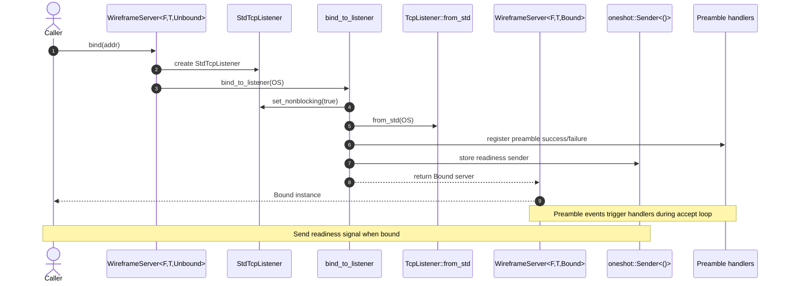

# Server configuration

`WireframeServer` provides a builder API for adjusting runtime behaviour. The
server employs a typestate (from `Unbound` to `Bound`) to ensure that binding
occurs before runtime: unbound servers do not expose `run` methods. This guide
focuses on tuning the exponential backoff used when accepting connections fails.

```rust,no_run
use wireframe::{app::WireframeApp, server::WireframeServer};

# #[tokio::main]
# async fn main() -> Result<(), wireframe::server::ServerError> {
let server = WireframeServer::new(|| WireframeApp::default())
    .bind(([127, 0, 0, 1], 0).into())?;
server.run().await?;
# Ok(())
# }
```

## Binding flow

The sequence below details how a server transitions from an unbound to a bound
state when binding to an address.



Readiness is signalled after all worker tasks have been spawned in
`WireframeServer::run_with_shutdown`, immediately before the accept loop begins.

## Accept loop backoff

The accept loop retries failed `accept()` calls using exponential backoff.
`accept_backoff(cfg)` sets both bounds using a `BackoffConfig` value. The
builder normalizes the supplied configuration via `BackoffConfig::normalized`,
so out-of-range values are adjusted rather than preserved:

- `initial_delay` – starting delay for the first retry, clamped to at least 1
  millisecond.
- `max_delay` – maximum delay for retries, never less than `initial_delay`.

### Behaviour

- If `initial_delay` exceeds `max_delay`, the values are swapped.
- `max_delay` is raised to match `initial_delay` when required.

### Example

```rust
use std::time::Duration;

use wireframe::{app::WireframeApp, server::{WireframeServer, BackoffConfig}};

let cfg = BackoffConfig {
    initial_delay: Duration::from_millis(5),
    max_delay: Duration::from_millis(500),
};

let server = WireframeServer::new(|| WireframeApp::default())
    .accept_backoff(cfg);
```

## Preamble handling

Servers that expect a preamble can bound how long they wait for it and decide
what to do when decoding fails. `preamble_timeout(Duration)` wraps
`read_preamble` in a timeout; values below 1 ms are clamped to 1 ms, and
omitting the setter leaves the read unbounded. When decoding fails or times
out, an optional failure handler runs before the connection is closed. The
handler is asynchronous and receives both the error and the mutable
`TcpStream`, allowing a response to be written back to the client.

```rust,no_run
use std::time::Duration;

use futures::FutureExt;
use tokio::io::AsyncWriteExt;
use wireframe::{app::WireframeApp, server::WireframeServer};

let server = WireframeServer::new(|| WireframeApp::default())
    .preamble_timeout(Duration::from_secs(2))
    .on_preamble_decode_failure(|_err, stream| {
        async move {
            stream.write_all(b"preamble required").await?;
            Ok(())
        }
        .boxed()
    });
```
