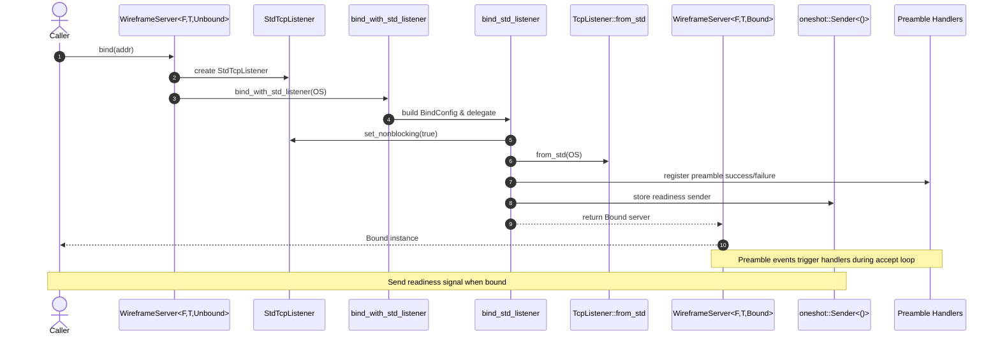

# Server configuration

`WireframeServer` provides a builder API for adjusting runtime behaviour. The
server employs a typestate (from `Unbound` to `Bound`) to ensure that binding
occurs before runtime: unbound servers do not expose `run` methods. This guide
focuses on tuning the exponential backoff used when accepting connections fails.

```rust,no_run
use wireframe::{app::WireframeApp, server::WireframeServer};

# #[tokio::main]
# async fn main() -> Result<(), wireframe::server::ServerError> {
let server = WireframeServer::new(|| WireframeApp::default())
    .bind(([127, 0, 0, 1], 0).into())?;
server.run().await?;
# Ok(())
# }
```

## Binding flow

The sequence below details how a server transitions from an unbound to a bound
state when binding to an address.



## Accept loop backoff

The accept loop retries failed `accept()` calls using exponential backoff.
`accept_backoff(cfg)` sets both bounds using a `BackoffConfig` value. The
builder normalises the supplied configuration via `BackoffConfig::normalised`,
so out-of-range values are adjusted rather than preserved:

- `initial_delay` – starting delay for the first retry, clamped to at least 1
  millisecond.
- `max_delay` – maximum delay for retries, never less than `initial_delay`.

### Behaviour

- If `initial_delay` exceeds `max_delay`, the values are swapped.
- `max_delay` is raised to match `initial_delay` when required.

### Example

```rust
use std::time::Duration;

use wireframe::{app::WireframeApp, server::{WireframeServer, BackoffConfig}};

let cfg = BackoffConfig {
    initial_delay: Duration::from_millis(5),
    max_delay: Duration::from_millis(500),
};

let server = WireframeServer::new(|| WireframeApp::default())
    .accept_backoff(cfg);
```
