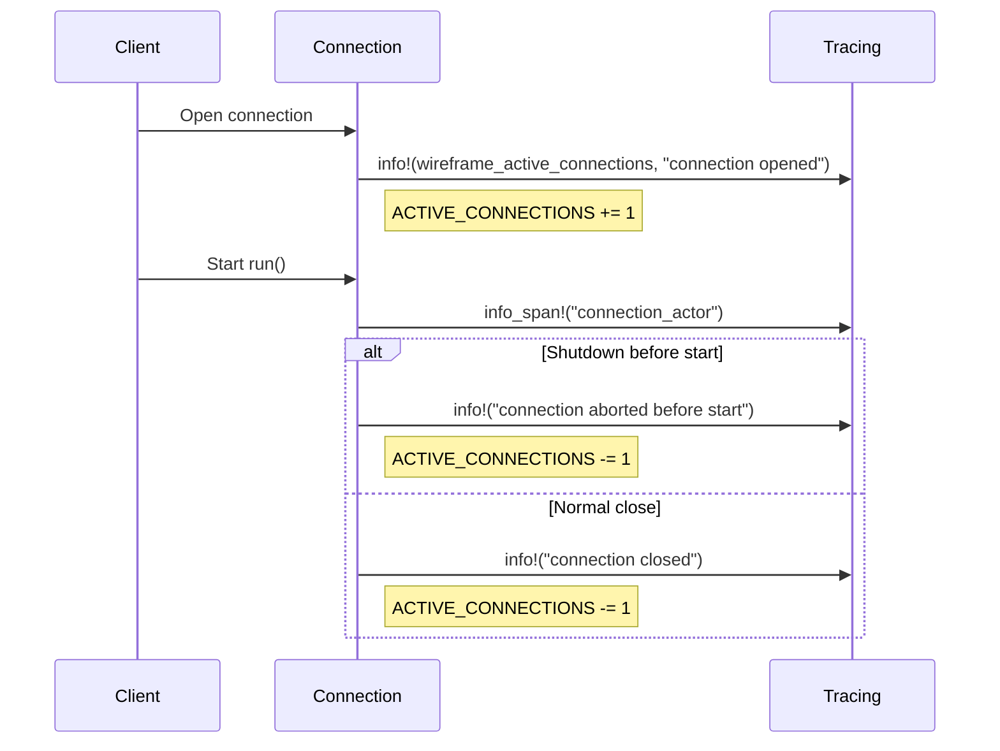

# The road to Wireframe 1.0 - Feature-set, Philosophy and Capability Maturity

## I. Introduction: The `wireframe` Philosophy

The `wireframe` library began with a simple premise: to provide a fast, safe,
and ergonomic toolkit for building request-response servers over custom binary
protocols. Its success to date is rooted in a core philosophy that prioritizes
protocol-agnosticism, developer experience, and the full power of Rust's safety
and performance guarantees.

However, the landscape of network services is far richer than simple
request-response. Modern protocols—from database wire formats and IoT message
brokers to real-time gaming and gRPC—demand fully asynchronous, bidirectional
communication. To meet these needs and mature into a comprehensive solution for
network programming, `wireframe` must evolve.

This document outlines the road to `wireframe` 1.0. It is a vision built upon
three pillars of new functionality: **asynchronous duplex messaging**,
**multi-packet streaming responses**, and **transparent message
fragmentation**. More than just a list of features, this is a statement of
capability maturity. It details a cohesive strategy for hardening the library
with production-grade resilience, first-class observability, and a rigorous
quality assurance process. The result will be a framework that is not only
powerful and flexible but also exceptionally robust, debuggable, and a pleasure
to use.

## II. The Core Feature Set: A Duplex Frame Highway

The central ambition for `wireframe` 1.0 is to transform it from a one-way
street into a fully duplex, multi-lane highway for frames. This requires a
fundamental expansion of the core architecture to handle messages that are
server-initiated, multi-part, or larger than a single network packet.

### A. Asynchronous, Bidirectional Messaging

The strict "one frame in, one frame out" model is the primary limitation to be
addressed. The 1.0 architecture will embrace a fully asynchronous,
bidirectional communication model where any participant—client or server—can
originate frames at any time. This is achieved through two tightly integrated
features: server-initiated pushes and streaming responses.

#### The Unified `Response` Enum and Declarative Handler Model

To provide a clean, unified API, the handler return type will evolve. A more
ergonomic, declarative approach replaces the previous imperative model.
Handlers will return an enhanced `Response` enum, giving developers clear and
efficient ways to express their intent.

```Rust
pub enum Response<F = Frame, E = MyProtocolError> {
    /// A single frame, as before.
    Single(F),
    /// An optimized path for a small, known set of frames.
    Vec(Vec<F>),
    /// A declarative, potentially unbounded stream of frames.
    Stream(Pin<Box<dyn futures::Stream<Item = Result<F, WireframeError<E>>> + Send + 'static>>),
    /// An explicit signal that the response is complete (e.g., after a push).
    Empty,
}
```

This design is powered by the `async-stream` crate, which allows developers to
write imperative-looking logic that generates a declarative `Stream` object. It
provides the best of both worlds: the intuitive feel of a `for` loop for
generating frames with minimal API complexity. The project recommends
`async-stream` as the canonical method for constructing `Response::Stream`
values.

```Rust
// Example of a declarative handler using async-stream
async fn handle_large_query(req: Request) -> io::Result<Response<MyFrame>> {
    let stream = async_stream::try_stream! {
        // Yield headers
        yield create_header_frame();
        // Yield data rows from a source
        for row in database::fetch_rows(&req.query) {
            yield create_row_frame(row)?;
        }
        // Yield a final completion frame
        yield create_completion_frame();
    };
    Ok(Response::Stream(Box::pin(stream)))
}
```

See `examples/async_stream.rs` for a runnable demonstration of this pattern.

#### The Connection Actor

The underlying engine for this duplex communication is the
"actor-per-connection" model. Each TCP connection is managed by a dedicated,
isolated asynchronous task. 11 This serializes all I/O for a given connection,
eliminating the need for complex locking and making the system easier to reason
about.

The core of this actor is a `tokio::select!` loop that multiplexes frames from
multiple sources onto the outbound socket. To ensure that time-sensitive
control messages (like heartbeats or session notifications) are not delayed by
large data transfers, this loop will be explicitly prioritized using
`select!(biased;)`.

The polling order will be:

1. **Graceful Shutdown Signal:** Highest priority, to ensure the server can
   terminate cleanly.

2. **High-Priority Push Channel:** For urgent, unsolicited messages.

3. **Low-Priority Push Channel:** For standard background messages.

4. **Handler Response Stream:** For frames belonging to the current
   request-response cycle.

### B. Transparent Message Fragmentation & Re-assembly

Many real-world protocols split large logical messages into smaller physical
frames. `wireframe` 1.0 will handle this automatically through a new middleware
layer, the `FragmentAdapter`.

#### The `FragmentAdapter` and `FragmentStrategy`

This feature is designed for pluggability. The `FragmentAdapter` is a
`FrameProcessor` that sits between the raw I/O and the main router. It contains
the generic logic for splitting large outbound frames and re-assembling inbound
fragments.

The protocol-specific rules—how to parse a fragment header, determine the
payload length, and identify the final fragment—are provided by the user via a
`FragmentStrategy` trait. This keeps the core library completely agnostic of
any specific wire format.

The `FragmentStrategy` trait will be enhanced to be more expressive and
context-aware:

```Rust
/// Metadata decoded from a single fragment's header.
pub struct FragmentMeta {
    pub payload_len: usize,
    pub total_message_len: Option<usize>, // Hint for pre-allocation
    pub is_final: bool,
    pub msg_id: Option<u64>, // For multiplexing
    pub seq: Option<u64>,    // For ordering
}

pub trait FragmentStrategy: 'static + Send + Sync {
    type Frame: FrameLike;

    /// Determines the max payload size for a given logical frame.
    fn max_fragment_payload(&self, frame: &Self::Frame) -> usize;

    /// Parses a header, returning its metadata and length.
    fn decode_header(&self, src: &mut BytesMut) -> io::Result<Option<(FragmentMeta, usize)>>;

    /// Encodes a header for a fragment of a given logical frame.
    fn encode_header(&self, dst: &mut BytesMut, frame: &Self::Frame,...);
}
```

#### Robust Re-assembly for Modern Protocols

A critical enhancement to the initial design is support for multiplexing. The
re-assembly logic will not assume that fragments arrive sequentially. By using
a concurrent hash map (e.g., `dashmap::DashMap`) keyed by `msg_id`, the
`FragmentAdapter` can re-assemble multiple logical messages concurrently on the
same connection. This is essential for supporting modern protocols like HTTP/2
or gRPC.

## III. Capability Maturity: From Functional to Production-Grade

A feature-complete library is not necessarily a mature one. The road to
`wireframe` 1.0 is paved with a deep commitment to the cross-cutting concerns
that define production-ready software: hardening, ergonomics, observability,
and quality assurance.

### A. Hardening and Resilience

#### Graceful Shutdown

A robust network service must be able to shut down cleanly. `wireframe` will
adopt a canonical, proactive shutdown pattern using
`tokio_util::sync::CancellationToken` and `tokio_util::task::TaskTracker`.

- A single `CancellationToken` will be created at server startup.

- This token will be cloned and passed into every connection actor and
  user-spawned task.

- All `select!` loops will prioritize a `token.cancelled()` branch to initiate a
  clean exit.

- A `TaskTracker` will be used to `await` the completion of all tasks before the
  server process exits, preventing orphaned tasks and resource leaks.

#### Comprehensive Resource Management

Rust's ownership model and `Drop` trait are the foundation of resource safety.
33

`wireframe` will build upon this with several key patterns:

- **RAII for All Handles:** All handles that represent a connection or stream
  will have well-defined `Drop` semantics to ensure clean termination, even in
  the case of panics or early returns.

- **Leak-Proof Registries:** Any global or shared registry (like the
  `SessionRegistry` for push handles) will use `Arc<T>` and `Weak<T>` pointers.
  This prevents the registry from artificially keeping connection resources
  alive after a client disconnects, eliminating a common source of memory leaks
  in long-running servers.

- **DoS Protection:** The framework will provide built-in, configurable
  protections against resource exhaustion attacks:

  - **Rate Limiting:** An asynchronous, token-bucket-based rate limiter will be
    available on a per-connection basis to throttle high-frequency message
    pushes.

  - **Memory Caps:** The fragmentation layer will enforce a strict
    `max_message_size` to prevent a single client from consuming excessive
    memory.

  - **Timeouts:** The re-assembly logic will include a non-optional,
    configurable timeout to automatically purge partial messages that are
    abandoned or sent too slowly.

#### Advanced Error Handling

To provide developers with more control, `wireframe` will adopt a more
expressive error-handling strategy.

- **Typed Errors:** A generic `WireframeError<E>` enum will distinguish between
  unrecoverable transport-level I/O errors and recoverable, protocol-specific
  logical errors. This allows the framework and user code to react more
  intelligently to failures.

- **Dead Letter Queues (DLQ):** For applications where dropping messages is
  unacceptable, the push mechanism will offer an optional DLQ pattern. 54 If a
  push fails due to a full queue, the frame can be routed to a separate "dead
  letter" channel for later inspection, logging, or reprocessing, enhancing the
  system's overall resilience.

### B. First-Class Developer Ergonomics

A powerful library that is difficult to use will not be used. `wireframe` 1.0
is committed to an API that is intuitive, flexible, and idiomatic.

- **Fluent Builder API:** All configuration will be done through a fluent
  builder pattern (`WireframeApp::new().with_feature_x().with_config_y()`),
  which is readable and self-documenting.

- **Trait-Based Extensibility:** Instead of a collection of disparate callback
  closures, protocol-specific logic will be encapsulated within a single,
  cohesive `WireframeProtocol` trait. This promotes better organization,
  reusability, and makes the framework easier to extend.

- **Idiomatic Asynchronous APIs:** The library will consistently favor
  declarative, stream-based APIs over imperative, sink-based ones. This aligns
  with the broader async Rust ecosystem and leads to code that is easier to
  compose and reason about.

### C. Pervasive Observability

A production system is a black box without good instrumentation. `wireframe`
1.0 will treat observability as a first-class feature, integrating the
`tracing` crate throughout its core.

- **Structured Logging and Tracing:** The entire lifecycle of a connection,
  request, and response will be wrapped in `tracing::span!`s. 83 This provides
  invaluable, context-aware diagnostic information that correlates events
  across asynchronous boundaries. Key events—such as frame receipt,
  back-pressure application, and connection termination—will be logged with
  structured data.

- **Metrics and OpenTelemetry:** The structured data from `tracing` can be
  consumed by subscribers that export it as metrics. 88 This enables the
  creation of vital operational dashboards to monitor key health indicators:

  - `wireframe_active_connections` (Gauge)

  - `wireframe_push_queue_depth_total` (Histogram)

  - `wireframe_frames_pushed_total` (Counter)

  - `wireframe_messages_assembled_total` (Counter)

  - `wireframe_reassembly_errors_total` (Counter)

Metrics are emitted using the optional `metrics` feature. See
[`wireframe::metrics`] for a Prometheus recorder example. All instrumentation
is gated behind this feature so users can opt out if metrics are unnecessary.



### D. A Comprehensive Quality Assurance Strategy

To guarantee the correctness and stability of these new, complex features,
`wireframe` will adopt a multi-layered testing strategy that goes beyond
traditional unit and integration tests.

- **Performance Benchmarking:** The `criterion` crate will be used to establish
  performance baselines and prevent regressions. 92 Both micro-benchmarks (for
  individual components) and macro-benchmarks (for end-to-end throughput) will
  be implemented.

- **Stateful Property Testing:** For validating complex, stateful protocol
  conversations (like fragmentation and re-assembly), `proptest` will be used.
  This technique generates thousands of random-but-valid sequences of
  operations to uncover edge cases that manual tests would miss.

- **Concurrency Verification:** The `loom` crate will be used for permutation
  testing of concurrency hotspots, such as the connection actor's `select!`
  loop.

  `loom` deterministically explores all possible interleavings of concurrent
  operations, providing a strong guarantee against data races and deadlocks.

## IV. The Roadmap to 1.0

The development of these features will proceed in a phased, iterative manner,
ensuring that a stable foundation is in place before building more complex
components.

<!-- markdownlint-disable MD013 -->

| Phase                       | Focus                                                        | Key Deliverables                                                                                                                            |
| 1. Foundational Mechanics   | Implement the core, non-public machinery.                    | Internal actor loop with select!(biased!), dual-channel push plumbing, basic FragmentAdapter logic.                                         |
| 2. Public APIs & Ergonomics | Expose functionality to users in a clean, idiomatic way.     | Fluent WireframeApp builder, WireframeProtocol trait, enhanced Response enum, FragmentStrategy trait, SessionRegistry with Weak references. |
| 3. Production Hardening     | Add features for resilience and security.                    | CancellationToken-based graceful shutdown, re-assembly timeouts, per-connection rate limiting, optional Dead Letter Queue.                  |
| 4. Maturity and Polish      | Focus on observability, advanced testing, and documentation. | Full tracing instrumentation, criterion benchmarks, loom and proptest test suites, comprehensive user guides and API documentation.         |

<!-- markdownlint-enable MD013 -->

## V. Conclusion

The road to `wireframe` 1.0 is an ambitious one. It represents a significant
evolution from a simple routing library to a comprehensive, production-grade
framework for building sophisticated, asynchronous network services. By wedding
a powerful new feature-set—duplex messaging, streaming, and fragmentation—with
a deep commitment to the principles of resilience, observability, and developer
ergonomics, `wireframe` will provide the Rust community with a best-in-class
tool for tackling the challenges of modern network programming.
