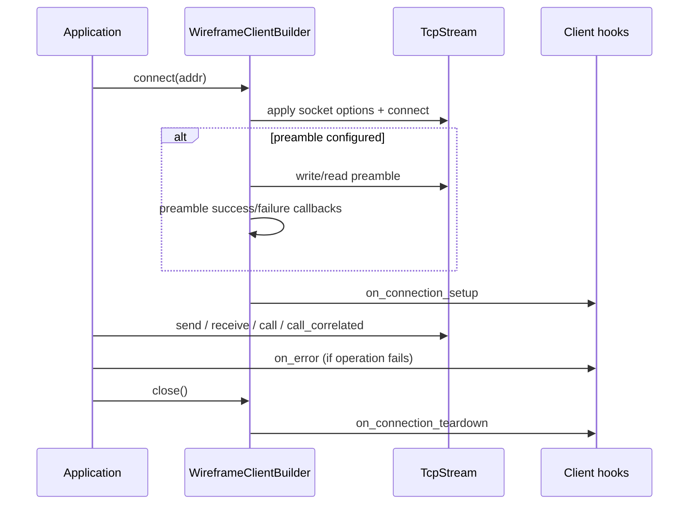

# Wireframe library guide

Wireframe is a Rust library for building asynchronous binary protocol servers
with pluggable routing, middleware, and connection utilities.[^1] The guide
below walks through the components that exist today and explains how they work
together when assembling an application.

## API discovery and imports

Wireframe uses progressive discovery for public APIs:

- `wireframe::` root is intentionally small and stable, exposing canonical
  `Result` and `WireframeError`.
- `wireframe::<module>::...` is the default path for specialized APIs.
- `wireframe::prelude::*` is an optional convenience import for common
  workflows.

## Conceptual model and vocabulary

Wireframe uses layer-specific terms. Keep these boundaries explicit so
transport concerns do not leak into routing or domain logic.

| Layer                 | Canonical term | Meaning                                                                                                                   |
| --------------------- | -------------- | ------------------------------------------------------------------------------------------------------------------------- |
| Transport             | Frame          | The wire unit produced and consumed by `FrameCodec`.                                                                      |
| Routing envelope      | Envelope       | The routable wrapper that carries `id`, optional `correlation_id`, and payload bytes (`Packet` is the trait abstraction). |
| Domain payload        | Message        | The typed value encoded into and decoded from payload bytes.                                                              |
| Transport subdivision | Fragment       | A bounded slice of large payload bytes plus fragmentation metadata.                                                       |

Vocabulary rules:

- Use `frame` for wire-format codec units only.
- Use `envelope` for routable wrappers and instances; use `packet` when
  discussing the `Packet` trait abstraction or `PacketParts`.
- Use `message` for typed application payloads implementing
  `wireframe::message::EncodeWith`/`wireframe::message::DecodeWith` (or
  `wireframe::message::Message` for bincode-compatible types).
- Use `fragment` only for transport-level split/reassembly units.

For invariants and naming rules used across internal modules, see the
[developers' guide](developers-guide.md).

## Quick start: building an application

A `WireframeApp` collects route handlers and middleware. Each handler is stored
as an `Arc` pointing to an async function that receives a packet reference and
returns `()`. The builder caches these registrations until `handle_connection`
constructs the middleware chain for an accepted stream.[^2]

```no_run
use std::sync::Arc;
use wireframe::app::{Envelope, Handler, WireframeApp};

async fn ping(_env: &Envelope) {}

fn build_app() -> wireframe::Result<WireframeApp> {
    let handler: Handler<Envelope> = Arc::new(|env: &Envelope| {
        let _ = env; // inspect payload here
        Box::pin(ping(env))
    });

    WireframeApp::new()?
        .route(1, handler)?
        .wrap(wireframe::middleware::from_fn(|req, next| async move {
            let mut response = next.call(req).await?;
            response.frame_mut().extend_from_slice(b" pong");
            Ok(response)
        }))
}
```

The snippet below wires the builder into a Tokio runtime, decodes inbound
payloads, and emits a serialized response. It showcases the typical `main`
function for a microservice that listens on localhost and responds to a `Ping`
message with a `Pong` payload.[^2][^10][^15]

```rust,no_run
use std::{net::SocketAddr, sync::Arc};

use wireframe::{
    app::{Envelope, Handler, WireframeApp},
    middleware,
    message::Message,
    server::{ServerError, WireframeServer},
};

#[derive(bincode::Encode, bincode::BorrowDecode, Debug)]
struct Ping {
    body: String,
}

#[derive(bincode::Encode, bincode::BorrowDecode, Debug, PartialEq)]
struct Pong {
    body: String,
}

async fn ping(env: &Envelope) {
    log::info!("received correlation id: {:?}", env.clone().into_parts().correlation_id());
}

fn build_app() -> wireframe::Result<WireframeApp> {
    let handler: Handler<Envelope> = Arc::new(|env: &Envelope| Box::pin(ping(env)));

    WireframeApp::new()?
        .route(1, handler)?
        .wrap(middleware::from_fn(|req, next| async move {
            let ping = Ping::from_bytes(req.frame()).map(|(msg, _)| msg).ok();
            let mut response = next.call(req).await?;

            if let Some(ping) = ping {
                let payload = Pong {
                    body: format!("pong {}", ping.body),
                }
                .to_bytes()
                .expect("encode Pong message");
                response.frame_mut().clear();
                response.frame_mut().extend_from_slice(&payload);
            }

            Ok(response)
        }))
}

fn app_factory() -> WireframeApp {
    build_app().expect("configure Wireframe application")
}

#[tokio::main]
async fn main() -> Result<(), ServerError> {
    let addr: SocketAddr = "127.0.0.1:4000".parse().expect("valid socket address");
    let server = WireframeServer::new(app_factory).bind(addr)?;
    server.run().await
}
```

Route identifiers must be unique; the builder returns
`wireframe::WireframeError::DuplicateRoute` when a handler is registered twice,
keeping the dispatch table unambiguous.[^2][^5] The crate-level
`wireframe::Result<T>` alias always resolves to this canonical
`wireframe::WireframeError` surface, so setup-time and streaming failures share
one error contract.[^5] New applications default to the bundled bincode
serializer, a length-delimited codec capped at 1024 bytes per frame, and a 100
ms read timeout. Clamp the length-delimited limit with `buffer_capacity`
(length-delimited only), swap codecs with `with_codec`, and override the
serializer with `with_serializer` when a different encoding strategy is
required.[^3][^4] Use `memory_budgets(...)` to set explicit per-connection
buffering caps for inbound assembly paths. Custom protocols implement
`FrameCodec` to describe their framing rules. Changing frame budgets with
`buffer_capacity` or swapping codecs with `with_codec` clears fragmentation
settings, so call `enable_fragmentation()` (or `fragmentation(Some(cfg))`)
again when transport fragmentation is required.

Once a stream is accepted—either from a manual accept loop or via
`WireframeServer`—`handle_connection(stream)` builds (or reuses) the middleware
chain, wraps the transport in the configured frame codec (length-delimited by
default), enforces per-frame read timeouts, and writes responses. Serialization
helpers `send_response` and `send_response_framed` (or
`send_response_framed_with_codec` for custom codecs) return typed `SendError`
variants when encoding or I/O fails, and the connection closes after ten
consecutive deserialization errors.[^6][^7]

### Custom frame codecs

Custom protocols supply a `FrameCodec` implementation to describe their framing
rules. The codec owns the Tokio `Decoder` and `Encoder` types, while Wireframe
uses the trait surface to map frames to payload bytes and correlation data.

A codec implementation must:

- Define a `Frame` type and paired decoder/encoder implementations that return
  `std::io::Error` on failure.
- Return only the logical payload bytes from `frame_payload` so metadata parsing
  and deserialization run against the right buffer.
- Wrap outbound payloads with `wrap_payload(&self, Bytes)`, adding any protocol
  headers or metadata required by the wire format.
- Provide `correlation_id` when the protocol stores it outside the payload;
  Wireframe only uses this hook when the deserialized envelope is missing a
  correlation identifier.
- Report `max_frame_length`, which clamps inbound frames and determines the
  budget used by `enable_fragmentation`.

Install a custom codec with `with_codec`. The builder disables fragmentation
when codecs or the length-delimited frame budget change, so explicitly call
`enable_fragmentation()` (or `fragmentation(Some(cfg))`) afterwards when
transport fragmentation is required. Wireframe clones the codec per connection,
so stateful codecs should ensure `Clone` produces an independent state (for
example, reset sequence counters) when per-connection isolation is required.
When a framed stream is already available, use
`send_response_framed_with_codec`, so responses pass through
`FrameCodec::wrap_payload`.

Assume `MyCodec` implements `FrameCodec`:

```rust,no_run
use std::sync::Arc;

use wireframe::app::{Envelope, Handler, WireframeApp};

struct MyCodec;

let handler: Handler<Envelope> = Arc::new(|_: &Envelope| Box::pin(async {}));

let app = WireframeApp::new()?
    .with_codec(MyCodec)
    .route(1, handler)?;
```

See `examples/hotline_codec.rs` and `examples/mysql_codec.rs` for complete
implementations.

#### Codec accessor

Retrieve the configured codec from a `WireframeApp` instance:

```rust,no_run
use wireframe::app::WireframeApp;
use wireframe::codec::examples::HotlineFrameCodec;

let codec = HotlineFrameCodec::new(4096);
let app = WireframeApp::new()?.with_codec(codec);
let codec_ref = app.codec(); // &HotlineFrameCodec
```

#### Testing custom codecs with `wireframe_testing`

The `wireframe_testing` crate provides codec-aware driver functions that handle
frame encoding and decoding transparently:

```rust,no_run
use wireframe::app::WireframeApp;
use wireframe::codec::examples::HotlineFrameCodec;
use wireframe_testing::{drive_with_codec_payloads, drive_with_codec_frames};

let codec = HotlineFrameCodec::new(4096);
let payload: Vec<u8> = vec![0x01, 0x02, 0x03];

// Payload-level: returns decoded response payloads as byte vectors.
let app = WireframeApp::new()?.with_codec(codec.clone());
let payloads =
    drive_with_codec_payloads(app, &codec, vec![payload.clone()]).await?;

// Frame-level: returns decoded codec frames for metadata inspection.
let app = WireframeApp::new()?.with_codec(codec.clone());
let frames =
    drive_with_codec_frames(app, &codec, vec![payload]).await?;
```

Available codec-aware driver functions:

- `drive_with_codec_payloads` / `drive_with_codec_payloads_with_capacity` —
  owned app, returns payload bytes.
- `drive_with_codec_payloads_mut` /
  `drive_with_codec_payloads_with_capacity_mut` — mutable app reference,
  returns payload bytes.
- `drive_with_codec_frames` / `drive_with_codec_frames_with_capacity` — owned
  app, returns decoded `F::Frame` values.

Supporting helpers for composing custom test patterns:

- `encode_payloads_with_codec` — encode payloads to wire bytes.
- `decode_frames_with_codec` — decode wire bytes to frames.
- `extract_payloads` — extract payload bytes from decoded frames.

#### Codec test fixtures

The `wireframe_testing` crate provides fixture functions for generating
Hotline-framed wire bytes covering common test scenarios — valid frames,
invalid frames, incomplete (truncated) frames, and frames with correlation
metadata. These fixtures construct raw bytes directly, so they can represent
malformed data that the encoder would reject:

```rust,no_run
use wireframe::codec::examples::HotlineFrameCodec;
use wireframe_testing::{
    valid_hotline_wire, oversized_hotline_wire,
    truncated_hotline_header, correlated_hotline_wire,
    decode_frames_with_codec,
};

let codec = HotlineFrameCodec::new(4096);

// Valid frame — decodes cleanly.
let wire = valid_hotline_wire(b"hello", 7);
let frames = decode_frames_with_codec(&codec, wire).unwrap();

// Oversized frame — rejected with "payload too large".
let wire = oversized_hotline_wire(4096);
assert!(decode_frames_with_codec(&codec, wire).is_err());

// Truncated header — rejected with "bytes remaining on stream".
let wire = truncated_hotline_header();
assert!(decode_frames_with_codec(&codec, wire).is_err());

// Correlated frames — all share the same transaction ID.
let wire = correlated_hotline_wire(42, &[b"a", b"b"]);
let frames = decode_frames_with_codec(&codec, wire).unwrap();
```

Available fixture functions:

- `valid_hotline_wire` / `valid_hotline_frame` — well-formed frames.
- `oversized_hotline_wire` — payload exceeds `max_frame_length`.
- `mismatched_total_size_wire` — header with incorrect `total_size`.
- `truncated_hotline_header` / `truncated_hotline_payload` — incomplete data.
- `correlated_hotline_wire` — frames sharing a transaction ID.
- `sequential_hotline_wire` — frames with incrementing transaction IDs.

#### Feeding partial frames and fragments

Real networks rarely deliver a complete codec frame in a single TCP read. The
main crate now exposes these drivers through `wireframe::testkit` behind the
opt-in `testkit` feature, while `wireframe_testing` keeps source-compatible
re-exports for existing callers.

**Chunked-write drivers** encode payloads via a codec, concatenate the wire
bytes, and write them in configurable chunk sizes (including one byte at a
time):

```rust,no_run
use std::num::NonZeroUsize;
use wireframe::app::WireframeApp;
use wireframe::codec::examples::HotlineFrameCodec;
use wireframe::testkit::drive_with_partial_frames;

let codec = HotlineFrameCodec::new(4096);
let app = WireframeApp::new()?.with_codec(codec.clone());
let chunk = NonZeroUsize::new(1).expect("non-zero");
let payloads =
    drive_with_partial_frames(app, &codec, vec![vec![1, 2, 3]], chunk)
        .await?;
```

Available chunked-write driver functions:

- `drive_with_partial_frames` / `drive_with_partial_frames_with_capacity` —
  owned app, returns payload bytes.
- `drive_with_partial_frames_mut` — mutable app reference, returns payload
  bytes.
- `drive_with_partial_codec_frames` — owned app, returns decoded `F::Frame`
  values.

**Fragment-feeding drivers** accept a raw payload, fragment it with a
`Fragmenter`, encode each fragment into a codec frame, and feed the frames
through the app:

```rust,no_run
use std::num::NonZeroUsize;
use wireframe::app::WireframeApp;
use wireframe::codec::examples::HotlineFrameCodec;
use wireframe::fragment::Fragmenter;
use wireframe::testkit::drive_with_fragments;

let codec = HotlineFrameCodec::new(4096);
let app = WireframeApp::new()?.with_codec(codec.clone());
let fragmenter = Fragmenter::new(NonZeroUsize::new(20).unwrap());
let payloads =
    drive_with_fragments(app, &codec, &fragmenter, vec![0; 100]).await?;
```

Available fragment-feeding driver functions:

- `drive_with_fragments` / `drive_with_fragments_with_capacity` — owned
  app, returns payload bytes.
- `drive_with_fragments_mut` — mutable app reference, returns payload
  bytes.
- `drive_with_fragment_frames` — owned app, returns decoded `F::Frame`
  values.
- `drive_with_partial_fragments` — fragment AND feed in chunks,
  exercising both fragmentation and partial-frame buffering simultaneously.

#### Asserting reassembly outcomes

The `wireframe::testkit::reassembly` module provides non-panicking assertion
helpers for both transport fragment reassembly and protocol message assembly.
The API is built around lightweight snapshot structs, so the same helper can be
used from `rstest` tests and `rstest-bdd` step definitions. Existing
`wireframe_testing::reassembly` imports remain valid as compatibility
re-exports.

```rust,no_run
use wireframe::message_assembler::MessageKey;
use wireframe::testkit::{
    MessageAssemblySnapshot,
    TestResult,
    assert_message_assembly_completed_for_key,
};

# fn check(snapshot: MessageAssemblySnapshot<'_>) -> TestResult {
assert_message_assembly_completed_for_key(snapshot, MessageKey(7), b"done")?;
# Ok(())
# }
```

Available message-assembly assertion helpers:

- `assert_message_assembly_incomplete` — verify the latest assembly is still
  awaiting more frames.
- `assert_message_assembly_completed` — verify the latest assembly completed
  with a specific body.
- `assert_message_assembly_completed_for_key` — verify the most recent
  completed message for a specific `MessageKey`.
- `assert_message_assembly_error` — verify structured failures such as
  sequence mismatch, duplicate first frame, and budget errors.
- `assert_message_assembly_buffered_count` /
  `assert_message_assembly_total_buffered_bytes` — verify cleanup and memory
  accounting side effects.
- `assert_message_assembly_evicted` — verify timeout-based eviction.

Available fragment-reassembly assertion helpers:

- `assert_fragment_reassembly_absent` — verify no full message has been
  reconstructed yet.
- `assert_fragment_reassembly_completed_len` — verify reconstructed payload
  length.
- `assert_fragment_reassembly_error` — verify reassembly errors including
  `MessageTooLarge` (with or without specific message ID), `IndexMismatch`
  (out-of-order fragments), `MessageMismatch` (fragments from wrong logical
  message), `SeriesComplete` (duplicate or late fragments after completion),
  and `IndexOverflow` (fragment index exceeding limits).
- `assert_fragment_reassembly_buffered_messages` — verify buffered partial
  message count.
- `assert_fragment_reassembly_evicted` — verify timeout-based eviction.

#### Test observability

The `wireframe_testing` crate provides an `ObservabilityHandle` that combines
log capture with metrics recording in a single fixture. This is useful for
asserting that codec errors, recovery policies, and other instrumentation
behave correctly under test.

```rust,no_run
use wireframe_testing::ObservabilityHandle;

let mut obs = ObservabilityHandle::new();
obs.clear();

// Record metrics via a thread-local recorder.
metrics::with_local_recorder(obs.recorder(), || {
    wireframe::metrics::inc_codec_error("framing", "drop");
});

// Take a snapshot and query the captured counter.
obs.snapshot();
assert_eq!(
    obs.counter(
        wireframe::metrics::CODEC_ERRORS,
        &[("error_type", "framing"), ("recovery_policy", "drop")],
    ),
    1
);
```

The handle serializes access to the global logger via a mutex, so tests using
it should run serially (`--test-threads=1` for the affected binary). Metrics
are captured per-thread via `metrics::with_local_recorder`, so metric-emitting
code must run on the same thread as the handle. For async tests, use
`#[tokio::test(flavor = "current_thread")]` or
`tokio::runtime::Runtime::new()?.block_on(...)`.

Available assertion helpers:

- `counter(name, labels)` / `counter_without_labels(name)` — query counter
  values from the most recent snapshot.
- `codec_error_counter(error_type, recovery_policy)` — convenience for the
  `wireframe_codec_errors_total` metric.
- `assert_counter(name, labels, expected)` — assert a counter matches.
- `assert_no_metric(name)` — assert no metric with the given name exists.
- `assert_codec_error_counter(error_type, recovery_policy, expected)` — assert
  a codec error counter matches.
- `assert_log_contains(substring)` — assert any captured log contains a
  substring.
- `assert_log_at_level(level, substring)` — assert a log at a specific level
  contains a substring.

#### Simulating slow readers and writers

Back-pressure tests often need more than partial-frame delivery. The
`wireframe_testing` crate also provides slow-I/O helpers that pace the client
write side, the client read side, or both directions at once.

Use `SlowIoPacing` to define a chunk size and inter-chunk delay, then apply it
through `SlowIoConfig`:

Enable the feature in `Cargo.toml` when importing from the main crate:

```toml
wireframe = { version = "0.3.0", features = ["testkit"] }
```

```rust,no_run
use std::{num::NonZeroUsize, time::Duration};
use wireframe::{
    app::{Envelope, WireframeApp},
    codec::examples::HotlineFrameCodec,
    serializer::{BincodeSerializer, Serializer},
};
use wireframe::testkit::{
    SlowIoConfig, SlowIoPacing, drive_with_slow_codec_payloads,
};

let codec = HotlineFrameCodec::new(4096);
let app = WireframeApp::new()?.with_codec(codec.clone());
let config = SlowIoConfig::new()
    .with_writer_pacing(SlowIoPacing::new(
        NonZeroUsize::new(8).expect("non-zero"),
        Duration::from_millis(5),
    ))
    .with_reader_pacing(SlowIoPacing::new(
        NonZeroUsize::new(32).expect("non-zero"),
        Duration::from_millis(5),
    ))
    .with_capacity(64);

let request = BincodeSerializer.serialize(&Envelope::new(
    1,
    Some(7),
    vec![1, 2, 3],
))?;
let payloads = drive_with_slow_codec_payloads(app, &codec, vec![request], config)
    .await?;

```

Available slow-I/O helper functions:

- `drive_with_slow_frames` — pre-framed bytes, returns raw output bytes.
- `drive_with_slow_payloads` — default length-delimited payloads, returns raw
  output bytes.
- `drive_with_slow_codec_payloads` — codec-aware payloads, returns decoded
  payload byte vectors.
- `drive_with_slow_codec_frames` — codec-aware frames, returns decoded
  `F::Frame` values.

These helpers are designed for deterministic tests under paused Tokio time.
Small duplex capacities should be used together with reader pacing when the
app's outbound writes must hit back-pressure quickly.

#### In-process server/client pair harness

The `wireframe_testing::client_pair` module provides a harness for starting a
real `WireframeServer` and a connected `WireframeClient` inside one test
process. Unlike the `drive_with_*` helpers, which exercise server-side
behaviour over in-memory `tokio::io::duplex` streams, the pair harness
communicates over a real loopback TCP socket so compatibility assertions
exercise the full client/server network path.

Use the pair harness when a downstream crate needs to verify that its protocol
implementation works end-to-end through a real Wireframe server. A shared
`echo_app_factory` provides a ready-made app factory with invocation counting:

```rust,no_run
use std::sync::Arc;
use std::sync::atomic::AtomicUsize;
use wireframe_testing::{
    TestResult,
    echo_app_factory,
    spawn_wireframe_pair,
};

async fn example() -> TestResult<()> {
    let counter = Arc::new(AtomicUsize::new(0));
    let mut pair = spawn_wireframe_pair(
        echo_app_factory(&counter),
        |builder| builder.max_frame_length(2048),
    )
    .await?;

    // pair.client_mut()? returns &mut WireframeClient for
    // request/response operations. Streaming responses borrow the
    // client exclusively, keeping that constraint visible.
    let addr = pair.local_addr();

    pair.shutdown().await?;
    Ok(())
}
```

`spawn_wireframe_pair_default` is a convenience wrapper that connects with
default client settings when no builder customization is needed. If the client
connection fails, the server task is torn down automatically so no orphaned
tasks leak into subsequent tests.

The harness depends on the `wireframe_testing` dev-dependency crate. It does
not require the main-crate `testkit` feature unless the test also uses
`wireframe::testkit` helpers directly.

#### Zero-copy payload extraction

For performance-critical codecs, use `Bytes` instead of `Vec<u8>` for payload
storage and override `frame_payload_bytes` to avoid allocation:

```rust
use bytes::Bytes;
use wireframe::codec::FrameCodec;

pub struct MyFrame {
    pub metadata: u32,
    pub payload: Bytes,  // Use Bytes, not Vec<u8>
}

impl FrameCodec for MyCodec {
    type Frame = MyFrame;
    // ... other associated types ...

    fn frame_payload(frame: &Self::Frame) -> &[u8] {
        &frame.payload
    }

    fn frame_payload_bytes(frame: &Self::Frame) -> Bytes {
        frame.payload.clone()  // Cheap: atomic reference count increment
    }

    fn wrap_payload(&self, payload: Bytes) -> Self::Frame {
        MyFrame {
            metadata: 0,
            payload,  // Store directly, no copy
        }
    }

    // ... other methods ...
}
```

In the decoder, use `BytesMut::freeze()` instead of `.to_vec()`:

```rust
use bytes::BytesMut;
use tokio_util::codec::Decoder;

fn decode(&mut self, src: &mut BytesMut) -> Result<Option<Self::Item>, Self::Error> {
    // ... parse header ...
    let payload = src.split_to(payload_len).freeze();  // Zero-copy
    Ok(Some(MyFrame { metadata, payload }))
}
```

The default `frame_payload_bytes` implementation copies from the
`frame_payload()` slice, ensuring backward compatibility for codecs that use
`Vec<u8>` payloads.

### Codec error handling

The codec layer provides a structured error taxonomy via `CodecError` that
enables recovery policies, structured logging, and proper EOF handling.

**Error categories:**

- `FramingError` - Wire-level frame boundary issues (oversized frames, invalid
  length encoding, incomplete headers, checksum mismatches, empty frames).
- `ProtocolError` - Semantic violations after frame extraction (unknown message
  types, invalid versions).
- `io::Error` - Transport layer failures (connection resets, timeouts).
- `EofError` - End-of-stream conditions with clean/mid-frame/mid-header
  variants.

**Recovery policies:**

Each error type has a default recovery policy:

| Error Type                     | Default Policy |
| ------------------------------ | -------------- |
| `FramingError::OversizedFrame` | Drop           |
| `FramingError::EmptyFrame`     | Drop           |
| Other `FramingError`           | Disconnect     |
| All `ProtocolError`            | Drop           |
| All `io::Error`                | Disconnect     |
| `EofError::CleanClose`         | Disconnect     |
| Other `EofError`               | Disconnect     |

Override recovery policies with a custom `RecoveryPolicyHook`:

```rust
use wireframe::codec::{
    CodecError, CodecErrorContext, RecoveryPolicy, RecoveryPolicyHook,
};

struct StrictRecovery;

impl RecoveryPolicyHook for StrictRecovery {
    fn recovery_policy(&self, _error: &CodecError, _ctx: &CodecErrorContext) -> RecoveryPolicy {
        // Disconnect on any codec error
        RecoveryPolicy::Disconnect
    }
}
```

`CodecErrorContext` provides connection metadata for policy decisions:

```rust
use wireframe::codec::CodecErrorContext;

let ctx = CodecErrorContext::new()
    .with_connection_id(42)
    .with_correlation_id(123)
    .with_codec_state("seq=5");
```

**Protocol hooks for EOF:**

The `WireframeProtocol` trait includes an `on_eof` hook for handling EOF
conditions during frame decoding:

```rust,ignore
use wireframe::{
    codec::EofError,
    hooks::{ConnectionContext, WireframeProtocol},
};

impl WireframeProtocol for MyProtocol {
    type Frame = Vec<u8>;
    type ProtocolError = String;

    fn on_eof(&self, error: &EofError, partial_data: &[u8], _ctx: &mut ConnectionContext) {
        match error {
            EofError::CleanClose => tracing::info!("connection closed cleanly"),
            EofError::MidFrame { bytes_received, expected } => {
                tracing::warn!(
                    received = bytes_received,
                    expected = expected,
                    partial_len = partial_data.len(),
                    "connection closed mid-frame"
                );
            }
            EofError::MidHeader { bytes_received, header_size } => {
                tracing::warn!(
                    received = bytes_received,
                    header_size = header_size,
                    "connection closed mid-header"
                );
            }
        }
    }
}
```

**Metrics:**

When the `metrics` feature is enabled, codec errors increment the
`wireframe_codec_errors_total` counter with `error_type` and `recovery_policy`
labels:

```text
wireframe_codec_errors_total{error_type="framing",recovery_policy="drop"} 5
wireframe_codec_errors_total{error_type="eof",recovery_policy="disconnect"} 2
```

## Packets, payloads, and serialization

Packets drive routing. Implement the `Packet` trait (or use the bundled
`Envelope`) to expose a message identifier, optional correlation id, and raw
payload. `PacketParts` rebuilds packets after middleware has finished editing
frames, and `inherit_correlation` patches mismatched response identifiers while
logging the discrepancy.[^8] Serializers plug into the `Serializer` trait;
`WireframeApp` defaults to `BincodeSerializer` but can run any implementation
that meets the trait bounds.[^4]

When `FrameMetadata::parse` succeeds, the framework extracts identifiers from
metadata without deserializing the payload. If parsing fails, it falls back to
full deserialization.[^9][^6] Serializer integration now uses adapter traits:
`EncodeWith<S>` for encoding and `DecodeWith<S>` for decoding. Existing bincode
message types remain compatible through `Message`, which still provides
`to_bytes` and `from_bytes` helpers.[^10]

### Migration from `Message`-only bounds

If existing code previously relied on `M: Message` for client/server API calls,
no change is required for bincode-compatible types.

- Existing `#[derive(bincode::Encode, bincode::BorrowDecode)]` payloads still
  work in `send`, `receive`, `call`, and `send_response`.
- Serializer implementations should update method signatures to use
  `EncodeWith<Self>` and `DecodeWith<Self>` bounds.
- Custom serializers that rely on legacy `Message`-derived payload encoding
  should also implement `wireframe::serializer::MessageCompatibilitySerializer`.
- Metadata-aware serializers can implement
  `Serializer::deserialize_with_context` to inspect `DeserializeContext`.
- `Serializer` is not object-safe (`Self: Sized` on serializer entry points), so
  using `dyn Serializer` directly is unsupported unless concrete wrappers are
  provided. For migration, keep concrete serializer types in `EncodeWith` /
  `DecodeWith` bounds, retain
  `wireframe::serializer::MessageCompatibilitySerializer` for legacy
  `Message`-based payloads, and use `SerdeMessage` with `SerdeSerializerBridge`
  for Serde-only payloads. When runtime-polymorphic serializer behaviour is
  required, wrap concrete serializer implementations in adapter wrappers that
  expose object-safe APIs and delegate to
  `Serializer::deserialize_with_context` as needed.

Optional Serde bridge support is available behind the feature
`serializer-serde`. Wrap values with `SerdeMessage<T>` (or
`into_serde_message()`) and implement `SerdeSerializerBridge` on the serializer
to reduce per-type adapter boilerplate. This explicit wrapper is required
because blanket Serde adapters would overlap with the default `T: Message`
adapter implementations.

### Fragmentation metadata

`wireframe::fragment` exposes small, copy-friendly structs to describe the
transport-level fragmentation state.[^41]

- `MessageId` uniquely identifies the logical message a fragment belongs to.
- `FragmentIndex` records the fragment's zero-based order.
- `FragmentHeader` bundles the identifier, index, and a boolean that signals
  whether the fragment is the last one in the sequence.
- `FragmentSeries` tracks the next expected fragment index and reports
  mismatches via structured errors.

Protocol implementers can emit a `FragmentHeader` for every physical frame and
feed the header back into `FragmentSeries` to guarantee ordering before a fully
reassembled message is surfaced to handlers. Behavioural tests can reuse the
same types to assert that new codecs obey the transport invariants without
spinning up a full server.[^42][^43]

The standalone `Fragmenter` helper now slices oversized payloads into capped
fragments while stamping the shared `MessageId` and sequential `FragmentIndex`.
Each call returns a `FragmentBatch` that reports whether the message required
fragmentation and yields individual `FragmentFrame` values for serialization or
logging. This keeps transport experiments lightweight while the full adapter
layer evolves. The helper is fallible—`FragmentationError` surfaces encoding
failures or index overflows—so production code should bubble the error up or
log it rather than unwrapping.

```no_run
use std::num::NonZeroUsize;
use wireframe::fragment::Fragmenter;

let fragmenter = Fragmenter::new(NonZeroUsize::new(512).unwrap());
let payload = [0_u8; 1400];
let batch = fragmenter.fragment_bytes(&payload).expect("fragment");
assert_eq!(batch.len(), 3);

for fragment in batch.fragments() {
    tracing::info!(
        msg_id = fragment.header().message_id().get(),
        index = fragment.header().fragment_index().get(),
        final = fragment.header().is_last_fragment(),
        payload_len = fragment.payload().len(),
    );
}
```

A companion `Reassembler` mirrors the helper on the inbound path. It buffers
fragments per `MessageId`, rejects out-of-order fragments, and enforces a
maximum assembled size while exposing `purge_expired` to clear stale partial
messages after a configurable timeout. When the final fragment arrives, it
returns a `ReassembledMessage` that can be decoded into the original type.

```rust
use std::{num::NonZeroUsize, time::Duration};
use wireframe::fragment::{
    FragmentHeader,
    FragmentIndex,
    MessageId,
    Reassembler,
};

let mut reassembler =
    Reassembler::new(NonZeroUsize::new(512).expect("non-zero capacity"), Duration::from_secs(30));

let header = FragmentHeader::new(MessageId::new(9), FragmentIndex::zero(), true);
let complete = reassembler
    .push(header, [0_u8; 12])
    .expect("fragments accepted")
    .expect("single fragment completes the message");

// Decode when ready:
// let message: MyType = complete.decode().expect("decode");
```

### Request parts and streaming bodies

`wireframe::request` exposes `RequestParts` to separate routing metadata from
streaming request payloads.[^45]

- `RequestParts::id()` returns the message identifier for routing.
- `RequestParts::correlation_id()` returns the optional correlation identifier.
- `RequestParts::metadata()` returns protocol-defined header bytes.

This type pairs with `RequestBodyStream` for incremental consumption of large
request payloads. Handlers can choose between buffered (existing) and streaming
consumption; the streaming path is opt-in.

```rust
use wireframe::request::RequestParts;

let parts = RequestParts::new(42, Some(123), vec![0x01, 0x02]);
assert_eq!(parts.id(), 42);
assert_eq!(parts.correlation_id(), Some(123));
assert_eq!(parts.metadata(), &[0x01, 0x02]);
```

Unlike `PacketParts` (which carries the raw payload for envelope
reconstruction), `RequestParts` carries only protocol-defined metadata required
to interpret the streaming body. The body itself is consumed through a separate
stream, enabling back-pressure and incremental processing.[^46] When
`MessageAssembler` is configured, this split happens after any transport
fragment reassembly, so handlers and protocol extractors see protocol-level
metadata rather than lower-level fragment state.

### Message assembler hook

Wireframe exposes a protocol-facing `MessageAssembler` hook that parses
per-frame headers into `FrameHeader::First` and `FrameHeader::Continuation`
values. It returns a `ParsedFrameHeader` that includes the header length so the
remaining bytes can be treated as the body chunk.

Register an assembler with `WireframeApp::with_message_assembler`:

```rust,no_run
use wireframe::{
    app::WireframeApp,
    message_assembler::{
        FrameHeader,
        FirstFrameHeader,
        MessageAssembler,
        MessageKey,
        ParsedFrameHeader,
    },
};

struct DemoAssembler;

impl MessageAssembler for DemoAssembler {
    fn parse_frame_header(
        &self,
        _payload: &[u8],
    ) -> Result<ParsedFrameHeader, std::io::Error> {
        Ok(ParsedFrameHeader::new(
            FrameHeader::First(FirstFrameHeader {
                message_key: MessageKey(1),
                metadata_len: 0,
                body_len: 0,
                total_body_len: None,
                is_last: true,
            }),
            0,
        ))
    }
}

let _app = WireframeApp::new()
    .expect("builder")
    .with_message_assembler(DemoAssembler);
```

When configured, this hook now runs on the inbound connection path after
transport fragmentation reassembly and before handler dispatch. Incomplete
assemblies remain buffered per message key until completion or timeout eviction.

The assembler's output drives the handler-facing request shape:

- fully assembled messages continue through the buffered request path; and
- streaming-capable messages surface as `RequestParts` plus
  `RequestBodyStream` / `StreamingBody`.

Message-assembly parsing and continuity failures are treated as inbound
deserialization failures and follow the existing failure threshold policy.

`WireframeApp::message_assembler` returns the configured hook as an
`Option<&Arc<dyn MessageAssembler>>` if direct access is required.

### Per-connection memory budgets

`MemoryBudgets` configures explicit per-connection byte caps for inbound
buffering and assembly:

- bytes buffered per message;
- bytes buffered per connection; and
- bytes buffered across in-flight assemblies.

Configure budgets through the app builder:

```rust,no_run
use std::num::NonZeroUsize;
use wireframe::app::{BudgetBytes, MemoryBudgets, WireframeApp};

let budgets = MemoryBudgets::new(
    BudgetBytes::new(NonZeroUsize::new(16 * 1024).expect("non-zero")),
    BudgetBytes::new(NonZeroUsize::new(64 * 1024).expect("non-zero")),
    BudgetBytes::new(NonZeroUsize::new(48 * 1024).expect("non-zero")),
);

let _app = WireframeApp::new()
    .expect("builder creation should not fail")
    .memory_budgets(budgets)
    .read_timeout_ms(250);
```

When budgets are configured, the message assembly subsystem enforces them at
frame acceptance time. Frames that would cause the total buffered bytes to
exceed the per-connection or in-flight budget are rejected, the offending
partial assembly is freed, and the failure is surfaced through the existing
deserialization-failure policy (`InvalidData`). The effective per-message limit
is the minimum of the fragmentation `max_message_size` and the configured
`bytes_per_message`. Single-frame messages that complete immediately are never
counted against aggregate budgets, since they do not buffer.

If `memory_budgets(...)` is not configured explicitly, Wireframe derives the
same three fields from `buffer_capacity`, so the protection model remains
active even on the default path.

Wireframe provides a three-tier protection model for inbound memory budgets:

1. **Per-frame enforcement** — frames that would cause total buffered bytes to
   exceed the per-connection or in-flight budget are rejected, the offending
   partial assembly is freed, and the failure is surfaced through the existing
   deserialization-failure policy (`InvalidData`).
2. **Soft-limit read pacing** — when buffered assembly bytes reach the
   soft-pressure threshold (80% of the smaller aggregate cap from
   `bytes_per_connection` and `bytes_in_flight`), the inbound connection loop
   briefly pauses socket reads before polling the next frame. This propagates
   back-pressure to senders while allowing progress on in-flight assemblies.
3. **Hard-cap connection abort** — if total buffered bytes strictly exceed the
   aggregate cap (100% of the smaller of `bytes_per_connection` and
   `bytes_in_flight`), the connection is terminated immediately with
   `InvalidData`. This is a defence-in-depth safety net; under normal
   operation, per-frame enforcement prevents this state from being reached.

#### Derived budget defaults

When `memory_budgets(...)` is not called on the builder, Wireframe derives
sensible defaults automatically from `buffer_capacity` (the codec's
`max_frame_length()`). The derived values use the same multiplier pattern as
fragmentation defaults:

| Budget field           | Multiplier           | Default (1024-byte frame) |
| ---------------------- | -------------------- | ------------------------- |
| `bytes_per_message`    | `frame_budget × 16`  | 16 KiB                    |
| `bytes_per_connection` | `frame_budget × 64`  | 64 KiB                    |
| `bytes_in_flight`      | `frame_budget × 64`  | 64 KiB                    |

All three protection tiers (per-frame enforcement, soft-limit read pacing, and
hard-cap connection abort) are active with derived defaults. Changing
`buffer_capacity` adjusts derived budgets proportionally. Calling
`.memory_budgets(...)` overrides the derived defaults entirely.

#### Message key multiplexing (8.2.3)

The `MessageAssemblyState` type manages multiple concurrent message assemblies
keyed by `MessageKey`. This enables interleaved frame streams where frames from
different logical messages arrive on the same connection:

```rust
use std::{num::NonZeroUsize, time::Duration};
use wireframe::message_assembler::{
    ContinuationFrameHeader,
    EnvelopeId,
    EnvelopeRouting,
    FirstFrameHeader,
    FirstFrameInput,
    FrameSequence,
    MessageAssemblyState,
    MessageKey,
};

let mut state = MessageAssemblyState::new(
    NonZeroUsize::new(1_048_576).expect("non-zero size"), // 1 mebibyte (MiB) max message
    Duration::from_secs(30),                               // 30s timeout for partial assemblies
);

// First frame for message key=1
let first1 = FirstFrameHeader {
    message_key: MessageKey(1),
    metadata_len: 0,
    body_len: 5,
    total_body_len: Some(15),
    is_last: false,
};
let routing1 = EnvelopeRouting { envelope_id: EnvelopeId(1), correlation_id: None };
let input1 = FirstFrameInput::new(&first1, routing1, vec![], b"hello")
    .expect("header lengths match");
state.accept_first_frame(input1)?;

// First frame for message key=2 (interleaved)
let first2 = FirstFrameHeader {
    message_key: MessageKey(2),
    metadata_len: 0,
    body_len: 5,
    total_body_len: None,
    is_last: false,
};
let routing2 = EnvelopeRouting { envelope_id: EnvelopeId(2), correlation_id: None };
let input2 = FirstFrameInput::new(&first2, routing2, vec![], b"world")
    .expect("header lengths match");
state.accept_first_frame(input2)?;

// Continuation for key=1 completes its message
let cont1 = ContinuationFrameHeader {
    message_key: MessageKey(1),
    sequence: Some(FrameSequence(1)),
    body_len: 10,
    is_last: true,
};
let msg1 = state.accept_continuation_frame(&cont1, b" completed")?
    .expect("message 1 should complete");
assert_eq!(msg1.body(), b"hello completed");
```

#### Continuity validation (8.2.4)

The `MessageSeries` type validates frame ordering when protocols supply
sequence numbers via `ContinuationFrameHeader::sequence`. It detects:

- **Out-of-order frames**: sequence gaps produce
  `MessageSeriesError::SequenceMismatch`
- **Duplicate frames**: already-processed sequences produce
  `MessageSeriesError::DuplicateFrame`
- **Frames after completion**: produce `MessageSeriesError::SeriesComplete`

For protocols that do not supply sequence numbers, the series accepts frames in
any order (ordering validation is skipped).

```rust
use wireframe::message_assembler::{
    ContinuationFrameHeader,
    FirstFrameHeader,
    FrameSequence,
    MessageKey,
    MessageSeries,
    MessageSeriesError,
    MessageSeriesStatus,
};

let first = FirstFrameHeader {
    message_key: MessageKey(1),
    metadata_len: 0,
    body_len: 10,
    total_body_len: None,
    is_last: false,
};
let mut series = MessageSeries::from_first_frame(&first);

// Accept continuation with sequence 1
let cont1 = ContinuationFrameHeader {
    message_key: MessageKey(1),
    sequence: Some(FrameSequence(1)),
    body_len: 5,
    is_last: false,
};
assert_eq!(series.accept_continuation(&cont1), Ok(MessageSeriesStatus::Incomplete));

// Attempting sequence 3 (gap) fails
let cont3 = ContinuationFrameHeader {
    message_key: MessageKey(1),
    sequence: Some(FrameSequence(3)), // Expected 2
    body_len: 5,
    is_last: false,
};
assert!(matches!(
    series.accept_continuation(&cont3),
    Err(MessageSeriesError::SequenceMismatch { .. })
));

// Accept sequence 2, then try sequence 1 again (duplicate)
let cont2 = ContinuationFrameHeader {
    message_key: MessageKey(1),
    sequence: Some(FrameSequence(2)),
    body_len: 5,
    is_last: false,
};
assert_eq!(series.accept_continuation(&cont2), Ok(MessageSeriesStatus::Incomplete));

let dup = ContinuationFrameHeader {
    message_key: MessageKey(1),
    sequence: Some(FrameSequence(1)), // Already seen
    body_len: 5,
    is_last: false,
};
assert!(matches!(
    series.accept_continuation(&dup),
    Err(MessageSeriesError::DuplicateFrame { .. })
));

// Complete the series, then try to add more (SeriesComplete)
let final_cont = ContinuationFrameHeader {
    message_key: MessageKey(1),
    sequence: Some(FrameSequence(3)),
    body_len: 5,
    is_last: true,
};
assert_eq!(series.accept_continuation(&final_cont), Ok(MessageSeriesStatus::Complete));

let extra = ContinuationFrameHeader {
    message_key: MessageKey(1),
    sequence: Some(FrameSequence(4)),
    body_len: 5,
    is_last: false,
};
assert!(matches!(
    series.accept_continuation(&extra),
    Err(MessageSeriesError::SeriesComplete)
));
```

### Streaming request body consumption

Handlers can opt into streaming request bodies using the `StreamingBody`
extractor or by accepting a `RequestBodyStream` directly. The framework creates
a bounded channel and forwards body chunks as they arrive; back-pressure
propagates automatically when the handler consumes slower than the network
delivers. Routing and correlation metadata stay available immediately through
`RequestParts`, so handlers can begin work before the full body is assembled.

```rust,no_run
use tokio::io::AsyncReadExt;
use wireframe::request::{RequestBodyReader, RequestBodyStream, RequestParts};

async fn handle_upload(parts: RequestParts, body: RequestBodyStream) {
    let mut reader = RequestBodyReader::new(body);
    let mut buf = Vec::new();
    reader.read_to_end(&mut buf).await.expect("read body");

    log::info!(
        "received {} bytes for request {}",
        buf.len(),
        parts.id()
    );
}
```

The `RequestBodyReader` adapter implements `AsyncRead`, allowing protocol
crates to reuse existing parsers. For raw stream access, use the
`RequestBodyStream` directly with `StreamExt` methods:

```rust,no_run
use bytes::Bytes;
use futures::StreamExt;
use wireframe::request::{RequestBodyStream, RequestParts};

async fn handle_stream(parts: RequestParts, mut body: RequestBodyStream) {
    while let Some(result) = body.next().await {
        match result {
            Ok(chunk) => log::debug!("received {} bytes", chunk.len()),
            Err(e) => log::error!("stream error: {e}"),
        }
    }
}
```

The `StreamingBody` extractor wraps the stream with convenience methods:

```rust,no_run
use wireframe::{
    extractor::StreamingBody,
    request::RequestParts,
};

async fn with_extractor(parts: RequestParts, body: StreamingBody) {
    // Convert to AsyncRead
    let reader = body.into_reader();

    // Or access the raw stream
    // let stream = body.into_stream();
}
```

Back-pressure is enforced via bounded channels: when the internal buffer fills,
the framework pauses reading from the socket until the handler drains pending
chunks. This prevents memory exhaustion under slow consumer conditions. When
the request arrived through `MessageAssembler`, the same per-connection memory
budgets continue to govern partial buffered state before chunks reach the
handler. The `body_channel` helper creates channels with configurable capacity:

```rust
use wireframe::request::body_channel;

// Create a channel with capacity for 8 chunks
let (tx, rx) = body_channel(8);
// tx: connection sends chunks
// rx: handler consumes via RequestBodyStream
```

See [ADR 0002][adr-0002-ref] for the complete design rationale.

## Working with requests and middleware

Every inbound frame becomes a `ServiceRequest`. Middleware can inspect or
mutate the byte buffer through `frame` and `frame_mut`, adjust correlation
identifiers, or wrap the remainder of the pipeline using `Transform`. The
`Next` continuation calls the inner service, returning a `ServiceResponse`
containing the frame that will be serialized back to the client.[^11]

The `middleware::from_fn` helper adapts async functions into middleware
components, enabling payload decoding, invocation of the inner service, and
response editing before the response is serialized. `HandlerService` rebuilds a
packet from the request bytes, invokes the registered handler, and by default
returns the original payload; replies are crafted in middleware (or custom
packet types with interior mutability). Decode typed payloads via the `Message`
helpers, then write the encoded response into
`ServiceResponse::frame_mut()`.[^10][^12]

```rust
use std::convert::Infallible;

use wireframe::{
    app::Envelope,
    message::Message,
    middleware::{from_fn, HandlerService, Next, ServiceRequest, ServiceResponse},
};

#[derive(bincode::Encode, bincode::BorrowDecode)]
struct Ping(u8);

#[derive(bincode::Encode, bincode::BorrowDecode)]
struct Pong(u8);

async fn decode_and_respond(
    mut req: ServiceRequest,
    next: Next<'_, HandlerService<Envelope>>,
) -> Result<ServiceResponse, Infallible> {
    let ping = Ping::from_bytes(req.frame()).map(|(msg, _)| msg).ok();
    let mut response = next.call(req).await?;

    if let Some(Ping(value)) = ping {
        let bytes = Pong(value + 1)
            .to_bytes()
            .expect("encode Pong");
        response.frame_mut().clear();
        response.frame_mut().extend_from_slice(&bytes);
    }

    Ok(response)
}

let middleware = from_fn(decode_and_respond);
```

Advanced integrations can adopt the `wireframe::extractor` module, which
defines `MessageRequest`, `Payload`, and `FromMessageRequest` for building
Actix-style extractors in custom middleware or services. These types expose
shared state, peer addresses, and payload cursors for frameworks that want to
layer additional ergonomics on top of the core primitives.[^13]

## Connection lifecycle

`WireframeApp` supports optional setup and teardown callbacks that run once per
connection. Setup can return arbitrary state retained until teardown executes
after the stream finishes processing.[^2] During `handle_connection` the
framework caches middleware chains, enforces read timeouts, and records metrics
for inbound frames, serialization failures, and handler errors before logging
warnings.[^6][^7] `PacketParts::inherit_correlation` ensures response packets
carry the correct correlation identifier even when middleware omits it.[^8]

Immediate responses are available through `send_response` and
`send_response_framed`, both of which report serialization or I/O problems via
`SendError`.[^6][^5]

```rust,no_run
use tokio::io::{self, AsyncReadExt, AsyncWriteExt};

use wireframe::{
    app::{SendError, WireframeApp},
    message::Message,
};

#[derive(bincode::Encode, bincode::BorrowDecode, Debug, PartialEq)]
struct Ready(&'static str);

#[tokio::main]
async fn main() -> Result<(), SendError> {
    let app = WireframeApp::default();
    let (mut client, mut server) = io::duplex(64);

    let ready = Ready("ready");
    app.send_response(&mut server, &ready).await?;
    server.shutdown().await?;

    let mut buffer = Vec::new();
    client.read_to_end(&mut buffer).await?;
    let (decoded, _) = Ready::from_bytes(&buffer).expect("decode Ready frame");
    assert_eq!(decoded, ready);

    Ok(())
}
```

## Message fragmentation

`WireframeApp` keeps transport fragmentation disabled by default. Enable it
explicitly with `enable_fragmentation()` or provide a bespoke
`FragmentationConfig` using `fragmentation(Some(cfg))`. When enabled, payloads
that exceed the frame budget are split into fragments carrying a
`FragmentHeader` (`message_id`, `fragment_index`, `is_last_fragment`) wrapped
with the `FRAG` marker. The connection reassembles fragments before invoking
handlers, so handlers continue to work with complete `Envelope` values.[^6]

Layering order is fixed. Outbound processing runs serializer → fragmentation →
codec wrapping. Inbound processing runs codec decode → fragment reassembly →
deserialization.

Fragmented messages enforce two guards: `max_message_size` caps the total
reassembled payload, and `reassembly_timeout` evicts stale partial messages.
Customize or disable fragmentation via the builder:

```rust
use std::{num::NonZeroUsize, time::Duration};
use wireframe::{
    app::WireframeApp,
    fragment::FragmentationConfig,
};

// Assume `handler` is defined elsewhere; any Handler compatible with WireframeApp works.
let cfg = FragmentationConfig::for_frame_budget(
    1024,
    NonZeroUsize::new(16 * 1024).unwrap(),
    Duration::from_secs(30),
).expect("frame budget too small for fragments");

let app = WireframeApp::new()?
    .fragmentation(Some(cfg))
    .route(42, handler)?;
```

Call `fragmentation(None)` to keep fragmentation disabled after explicit
configuration (for example, when the transport already supports large frames or
fragmentation is delegated to an upstream gateway). The `ConnectionActor`
mirrors the same behaviour for push traffic and streaming responses through
`enable_fragmentation`, ensuring client-visible frames follow the same format.

On the server side, a unified `FramePipeline` applies the same fragmentation
logic to all outbound `Envelope` values — handler responses, streaming frames,
and multi-packet channels — before serialization and codec wrapping. This
guarantees that a single connection-scoped `FragmentationState` manages both
outbound fragmentation and inbound reassembly.

## Protocol hooks

Install a custom protocol with `with_protocol`. `protocol_hooks()` converts the
stored implementation into `ProtocolHooks`, which the connection actor consumes
when draining responses and push queues.[^2][^7] `WireframeProtocol` exposes
callbacks for connection setup, per-frame mutation, command completion,
protocol errors, and optional end-of-stream frames. The connection actor
invokes these hooks around every outbound frame and when response streams end
or emit errors.[^14]

## Running servers

`WireframeServer::new` clones the application factory per worker, defaults the
worker count to the host CPU total (never below one), supports a readiness
signal, and normalizes accept-loop backoff settings through
`accept_backoff`.[^15][^16] Servers start in an unbound state; call `bind` or
`bind_existing_listener` to transition into the `Bound` typestate, inspect the
bound address, or rebind later.[^17]

`run` awaits Ctrl+C, while `run_with_shutdown` cancels all worker tasks when
the supplied future resolves.[^18] Each worker runs `accept_loop`, which clones
the factory, rewinds leftover preamble bytes, and hands the stream to the
application. Transient accept failures trigger exponential backoff capped by
the configured maximum delay.[^18][^19] Preamble hooks support asynchronous
success handlers and asynchronous failure callbacks that receive the stream,
enabling replies or decode-error logging before the application runs. An
optional `preamble_timeout` caps how long `read_preamble` waits; timeouts use
the failure callback path.[^20]

`spawn_connection_task` wraps each accepted stream in `read_preamble` and
`RewindStream`, records connection panics, and logs failures without crashing
worker tasks.[^20][^37][^38] `ServerError` surfaces bind and accept failures as
typed errors so callers can react appropriately.[^21]

## Client runtime

`WireframeClient` provides a first-class client runtime that mirrors the
server's framing and serialization layers, with a builder that configures the
serializer, codec settings, and socket options before connecting.[^44] Use
`ClientCodecConfig` to align `max_frame_length` with the server's
`buffer_capacity`, and apply `SocketOptions` when TCP tuning is required, such
as `TCP_NODELAY` or buffer size adjustments.

### Client configuration reference

| Surface              | API                                          | Default                                                 | Use when                                                            |
| -------------------- | -------------------------------------------- | ------------------------------------------------------- | ------------------------------------------------------------------- |
| Serializer           | `WireframeClient::builder().serializer(...)` | `BincodeSerializer`                                     | Server and client need a non-default serialization contract.        |
| Frame codec settings | `codec_config(ClientCodecConfig)`            | 4-byte big-endian prefix and 1024-byte max frame length | Server `buffer_capacity` or protocol limits differ from defaults.   |
| Socket tuning        | `socket_options(SocketOptions)`              | OS defaults                                             | Low-latency tuning (`TCP_NODELAY`) or keepalive policy is required. |
| Preamble payload     | `with_preamble(T)`                           | Disabled                                                | Protocol negotiation must happen before framed payload traffic.     |
| Preamble timeout     | `preamble_timeout(Duration)`                 | Disabled unless configured                              | Connection setup should fail fast on stalled preamble exchange.     |
| Setup hook           | `on_connection_setup(...)`                   | Disabled                                                | Per-connection state is needed for metrics or lifecycle coupling.   |
| Teardown hook        | `on_connection_teardown(...)`                | Disabled                                                | Close should flush counters or release stateful resources.          |
| Error hook           | `on_error(...)`                              | Disabled                                                | Transport and decode failures must be routed to observability.      |
| Before-send hook     | `before_send(...)`                           | Disabled                                                | Inspect or mutate serialized bytes before every outgoing frame.     |
| After-receive hook   | `after_receive(...)`                         | Disabled                                                | Inspect or mutate raw bytes after every incoming frame is read.     |
| Tracing config       | `tracing_config(TracingConfig)`              | INFO connect/close, DEBUG data ops, timing off          | Customize tracing span levels and per-command timing.               |
| Pool connect         | `connect_pool(addr, ClientPoolConfig)`       | Disabled                                                | Warm socket reuse or bounded socket fan-out is required.            |
| Pool size            | `ClientPoolConfig::pool_size(n)`             | `4`                                                     | More than one warm physical socket should be maintained.            |
| Per-socket admission | `max_in_flight_per_socket(n)`                | `1`                                                     | More than one caller may queue work against the same warm socket.   |
| Idle recycle         | `idle_timeout(Duration)`                     | `600s`                                                  | Idle sockets should be replaced before they become stale.           |

```rust
use std::{net::SocketAddr, time::Duration};

use wireframe::{
    app::Envelope,
    client::{ClientCodecConfig, SocketOptions},
    correlation::CorrelatableFrame,
    message::Message,
    WireframeClient,
};

#[derive(bincode::Encode, bincode::BorrowDecode)]
struct Login {
    username: String,
}

#[derive(bincode::Encode, bincode::BorrowDecode, Debug, PartialEq)]
struct LoginAck {
    username: String,
}

let addr: SocketAddr = "127.0.0.1:7878".parse().expect("valid socket address");
let codec = ClientCodecConfig::default().max_frame_length(2048);
let socket = SocketOptions::default()
    .nodelay(true)
    .keepalive(Some(Duration::from_secs(30)));

let mut client = WireframeClient::builder()
    .codec_config(codec)
    .socket_options(socket)
    .connect(addr)
    .await?;

let login = Login {
    username: "guest".to_string(),
};
let request = Envelope::new(1, None, login.to_bytes()?);
let response: Envelope = client.call_correlated(request).await?;
let (ack, _) = LoginAck::from_bytes(response.payload_bytes())?;
assert_eq!(ack.username, "guest");
assert!(response.correlation_id().is_some());
```

For screen readers: the following sequence diagram shows the client lifecycle
for connect, optional preamble exchange, message I/O, error handling, and
teardown.



Run the client example against the echo server:

```plaintext
# terminal 1
cargo run --example echo --features examples

# terminal 2
cargo run --example client_echo_login --features examples
```

### Client pools

Use `connect_pool` when one warm socket is too little, but opening a new TCP
connection for every request is too expensive. `WireframeClientPool` keeps a
bounded set of warm sockets, preserves preamble state on reuse, recycles idle
sockets after the configured timeout, and can schedule blocked logical sessions
fairly through `PoolHandle`.

```rust,no_run
use std::{net::SocketAddr, time::Duration};

use wireframe::client::{ClientPoolConfig, PoolFairnessPolicy, WireframeClient};

#[derive(bincode::Encode, bincode::Decode)]
struct Ping(u8);

#[derive(bincode::Encode, bincode::Decode, Debug, PartialEq)]
struct Pong(u8);

# #[tokio::main]
# async fn main() -> Result<(), wireframe::client::ClientError> {
let addr: SocketAddr = "127.0.0.1:7878".parse().expect("valid socket address");
let pool = WireframeClient::builder()
    .connect_pool(
        addr,
        ClientPoolConfig::default()
            .pool_size(2)
            .max_in_flight_per_socket(2)
            .idle_timeout(Duration::from_secs(30))
            .fairness_policy(PoolFairnessPolicy::RoundRobin),
    )
    .await?;

let lease = pool.acquire().await?;
let pong: Pong = lease.call(&Ping(1)).await?;
assert_eq!(pong, Pong(1));

pool.close().await;
# Ok(())
# }
```

Pooled leases forward the common request methods instead of exposing a mutable
reference to a long-lived `WireframeClient`. That keeps actual socket I/O
serialized per physical connection while still allowing multiple callers to be
admitted against the same warm slot. Treat `max_in_flight_per_socket` as an
admission budget, not as a guarantee of parallel writes on one TCP stream.

Create a `PoolHandle` when one logical session needs repeated pooled access and
that session should participate in the configured fairness policy over time:

```rust,no_run
# use std::net::SocketAddr;
use wireframe::client::{ClientPoolConfig, PoolFairnessPolicy, PoolHandle, WireframeClient};

#[derive(bincode::Encode, bincode::Decode)]
struct Ping(u8);

#[derive(bincode::Encode, bincode::Decode, Debug, PartialEq)]
struct Pong(u8);

# #[tokio::main]
# async fn main() -> Result<(), wireframe::client::ClientError> {
let addr: SocketAddr = "127.0.0.1:7878".parse().expect("valid socket address");
let pool = WireframeClient::builder()
    .connect_pool(
        addr,
        ClientPoolConfig::default()
            .pool_size(1)
            .fairness_policy(PoolFairnessPolicy::RoundRobin),
    )
    .await?;

let mut session_a: PoolHandle<_, _, _> = pool.handle();
let mut session_b = pool.handle();

let pong_a: Pong = session_a.call(&Ping(1)).await?;
let pong_b: Pong = session_b.call(&Ping(2)).await?;

assert_eq!(pong_a, Pong(1));
assert_eq!(pong_b, Pong(2));
# Ok(())
# }
```

Use `pool.handle()` instead of repeated `pool.acquire()` when a long-lived
workflow should receive fair turns relative to other workflows. Fairness
policies order blocked handles; they do not create a second queue outside the
pool or bypass its back-pressure. If all permits are busy, the waiting handle
still blocks until capacity returns.

Continue using `PooledClientLease` for explicit split-phase work such as
`send()` followed later by `receive()`. `PoolHandle` does not pin a logical
session to one socket and does not demultiplex arbitrary responses across
shared handles.

Preamble callbacks and setup hooks run per physical socket creation. Warm reuse
keeps the existing preamble state; idle recycle closes the old socket and
creates a fresh one, which reruns preamble and setup.

### Client preamble exchange

The client builder supports an optional preamble exchange before framing
begins. Use `with_preamble` to send a preamble immediately after TCP connect,
and register callbacks for success or failure scenarios.[^47]

```rust
use std::{net::SocketAddr, time::Duration};

use futures::FutureExt;
use wireframe::{
    preamble::read_preamble,
    WireframeClient,
};

#[derive(bincode::Encode, bincode::BorrowDecode)]
struct ClientHello {
    version: u16,
}

#[derive(bincode::BorrowDecode)]
struct ServerAck {
    accepted: bool,
}

let addr: SocketAddr = "127.0.0.1:7878".parse().expect("valid socket address");

let client = WireframeClient::builder()
    .with_preamble(ClientHello { version: 1 })
    .preamble_timeout(Duration::from_secs(5))
    .on_preamble_success(|_preamble, stream| {
        async move {
            // Read server acknowledgement
            let (ack, leftover) = read_preamble::<_, ServerAck>(stream)
                .await
                .map_err(|e| std::io::Error::new(std::io::ErrorKind::InvalidData, e.to_string()))?;
            if !ack.accepted {
                return Err(std::io::Error::new(
                    std::io::ErrorKind::ConnectionRefused,
                    "server rejected preamble",
                ));
            }
            Ok(leftover) // Return any leftover bytes for framing layer
        }
        .boxed()
    })
    .on_preamble_failure(|err, _stream| {
        async move {
            eprintln!("Preamble exchange failed: {err}");
            Ok(())
        }
        .boxed()
    })
    .connect(addr)
    .await?;
```

The success callback receives the sent preamble and a mutable reference to the
TCP stream, enabling bidirectional preamble negotiation. Any bytes read beyond
the server's response must be returned as "leftover" bytes so they can be
replayed before the framing layer begins. The failure callback runs when the
preamble exchange fails (timeout, I/O error, or encode error) and can log
diagnostics or send an error response before the connection closes. In the
current implementation, callback read failures surface as
`ClientError::PreambleRead`, timeout expiry surfaces as
`ClientError::PreambleTimeout`, and write-side failures from
`write_preamble(...)` are wrapped by `ClientError::PreambleEncode` because the
helper returns `bincode::EncodeError`.

### Client lifecycle hooks

The client builder supports lifecycle hooks that mirror the server's hook
system, enabling consistent instrumentation across both client and server.[^48]

- **Setup hook** (`on_connection_setup`): Invoked once after the TCP connection
  is established and preamble exchange (if configured) succeeds. Returns
  connection-specific state stored for the connection's lifetime.
- **Teardown hook** (`on_connection_teardown`): Invoked when `close()` is
  called. Receives the state produced by the setup hook for cleanup.
- **Error hook** (`on_error`): Invoked when errors occur during send, receive,
  or call operations. Receives a reference to the error for logging or metrics.

```rust
use std::{net::SocketAddr, sync::Arc};
use std::sync::atomic::{AtomicUsize, Ordering};

use wireframe::client::WireframeClient;

struct SessionState {
    request_count: AtomicUsize,
}

let addr: SocketAddr = "127.0.0.1:7878".parse().expect("valid socket address");

let client = WireframeClient::builder()
    .on_connection_setup(|| async {
        SessionState {
            request_count: AtomicUsize::new(0),
        }
    })
    .on_connection_teardown(|state: SessionState| async move {
        println!(
            "Session ended after {} requests",
            state.request_count.load(Ordering::SeqCst)
        );
    })
    .on_error(|err| async move {
        eprintln!("Client error: {err}");
    })
    .connect(addr)
    .await?;

// Use the client...

client.close().await; // Teardown hook invoked here
```

The setup hook runs after connection establishment (and preamble exchange if
configured). The teardown hook only runs if a setup hook was configured and
successfully produced state. The error hook is independent and can be
configured without a setup hook.

### Client request hooks

The client builder supports **request hooks** that fire on every outgoing and
incoming frame, enabling symmetric instrumentation with the server middleware
stack.[^52]

- **Before-send hook** (`before_send`): Invoked after serialization, before
  each frame is written to the transport. Receives a `&mut Vec<u8>` of the
  serialized bytes, allowing inspection or mutation (e.g., prepending an
  authentication token, incrementing a metrics counter).
- **After-receive hook** (`after_receive`): Invoked after each frame is read
  from the transport, before deserialization. Receives a `&mut BytesMut` of the
  raw frame bytes, allowing inspection or mutation before the deserializer
  processes them.

Multiple hooks of the same kind may be registered; they execute in registration
order. Hooks are synchronous `Fn` closures—users who need mutable state should
capture an `Arc<AtomicUsize>` or `Arc<Mutex<_>>` in the closure.

```rust
use std::{net::SocketAddr, sync::Arc};
use std::sync::atomic::{AtomicUsize, Ordering};

use wireframe::client::WireframeClient;

let addr: SocketAddr = "127.0.0.1:7878".parse().expect("valid socket address");

let send_counter = Arc::new(AtomicUsize::new(0));
let recv_counter = Arc::new(AtomicUsize::new(0));
let sc = send_counter.clone();
let rc = recv_counter.clone();

let mut client = WireframeClient::builder()
    .before_send(move |_bytes: &mut Vec<u8>| {
        sc.fetch_add(1, Ordering::SeqCst);
    })
    .after_receive(move |_bytes: &mut bytes::BytesMut| {
        rc.fetch_add(1, Ordering::SeqCst);
    })
    .connect(addr)
    .await?;
```

Request hooks fire on all message paths: `send`, `send_envelope`,
`receive_envelope`, `call_correlated`, `call_streaming`, and `ResponseStream`
polling. Clients configured without request hooks behave identically to clients
that have none registered.

### Outbound streaming sends

The client supports sending large request bodies as multiple frames using
`send_streaming`. The caller provides a protocol-defined frame header and an
`AsyncRead` body source; the helper reads chunks, prepends the header to each
chunk, and emits framed packets over the transport.

```rust,no_run
use std::net::SocketAddr;
use wireframe::client::{SendStreamingConfig, WireframeClient};

# #[tokio::main]
# async fn main() -> Result<(), wireframe::client::ClientError> {
let addr: SocketAddr = "127.0.0.1:7878".parse().expect("valid address");
let mut client = WireframeClient::builder().connect(addr).await?;

let header = [0xCA, 0xFE, 0xBA, 0xBE];
let body = vec![0u8; 4096];
let config = SendStreamingConfig::default()
    .with_chunk_size(512)
    .with_timeout(std::time::Duration::from_secs(5));

let outcome = client.send_streaming(&header, &body[..], config).await?;
println!("sent {} frames", outcome.frames_sent());
# Ok(())
# }
```

`SendStreamingConfig` controls chunking and timeout behaviour:

- `with_chunk_size(usize)` — maximum body bytes per frame. When not set, the
  chunk size is derived as `max_frame_length - header.len()`.
- `with_timeout(Duration)` — timeout for the entire operation. If the timeout
  elapses, `std::io::ErrorKind::TimedOut` is returned and no further frames are
  emitted. Any frames already sent remain sent; callers must assume the
  operation may have been partially successful.

`SendStreamingOutcome` reports the number of frames emitted via
`frames_sent()`. The error hook is invoked on all failure paths, consistent
with other client send methods.[^53]

### Client tracing

The client emits `tracing` spans around every operation. Span levels and
per-command timing are configurable via `TracingConfig`, which is passed to the
builder with `tracing_config()`. When no `tracing` subscriber is installed, all
instrumentation is zero-cost.

Default span levels: `INFO` for lifecycle operations (`connect`, `close`) and
`DEBUG` for data operations (`send`, `receive`, `call`, `call_streaming`).
Per-command timing is disabled by default.

```rust
use std::net::SocketAddr;

use tracing::Level;
use wireframe::client::{TracingConfig, WireframeClient};

let addr: SocketAddr = "127.0.0.1:7878".parse().expect("valid socket address");

// Enable timing for connect and call, set all spans to TRACE level.
let config = TracingConfig::default()
    .with_all_levels(Level::TRACE)
    .with_connect_timing(true)
    .with_call_timing(true);

let mut client = WireframeClient::builder()
    .tracing_config(config)
    .connect(addr)
    .await?;
```

When timing is enabled for an operation, a `DEBUG`-level event recording
`elapsed_us` is emitted when the operation completes (on both success and error
paths). Streaming responses emit per-frame `DEBUG` events with
`stream.frames_received` and a termination event with `stream.frames_total`.

Clients configured without `tracing_config()` use the default configuration and
behave identically to the pre-tracing API.

### Client message API with correlation identifiers

The client provides envelope-aware messaging APIs that work with the `Packet`
trait, supporting automatic correlation ID generation and validation. These
methods complement the basic `send`, `receive`, and `call` methods that operate
on raw `Message` types.

**Correlation ID generation**: Each client maintains an atomic counter for
generating unique correlation IDs. The `next_correlation_id` method returns the
next ID, which is useful when managing correlation manually.

**Envelope-aware methods**:

- `send_envelope<P: Packet>(envelope: P)` — Sends an envelope, auto-generating
  a correlation ID if not present. Returns the correlation ID used.
- `receive_envelope<P: Packet>()` — Receives and deserializes the next frame as
  the specified packet type.
- `call_correlated<P: Packet>(request: P)` — Sends a request with auto-
  generated correlation ID, receives the response, and validates that the
  response's correlation ID matches the request. Returns
  `ClientError::CorrelationMismatch` if the IDs differ.

```rust,no_run
use std::net::SocketAddr;

use wireframe::{
    app::{Envelope, Packet},
    client::{ClientError, WireframeClient},
};

# async fn example() -> Result<(), ClientError> {
let addr: SocketAddr = "127.0.0.1:7878".parse().expect("valid socket address");
let mut client = WireframeClient::builder()
    .connect(addr)
    .await?;

// Create an envelope without a correlation ID.
let request = Envelope::new(1, None, vec![1, 2, 3]);

// call_correlated auto-generates a correlation ID, sends the request,
// receives the response, and validates the correlation ID matches.
let response: Envelope = client.call_correlated(request).await?;

// The response's correlation ID matches the auto-generated request ID.
assert!(response.correlation_id().is_some());
# Ok(())
# }
```

For more control over correlation, use `send_envelope` and `receive_envelope`
separately:

```rust,no_run
use wireframe::app::{Envelope, Packet};
# use wireframe::client::{ClientError, WireframeClient};
# async fn example(client: &mut WireframeClient) -> Result<(), ClientError> {

// Auto-generate correlation ID when sending.
let envelope = Envelope::new(1, None, b"payload".to_vec());
let correlation_id = client.send_envelope(envelope).await?;

// Receive the response.
let response: Envelope = client.receive_envelope().await?;

// Manually verify correlation if needed.
assert_eq!(response.correlation_id(), Some(correlation_id));
# Ok(())
# }
```

The `CorrelationMismatch` error provides diagnostic information when validation
fails:

```rust,ignore
use wireframe::client::ClientError;

match client.call_correlated(request).await {
    Ok(response) => {
        // Handle successful response.
    }
    Err(ClientError::CorrelationMismatch { expected, received }) => {
        eprintln!(
            "Correlation mismatch: expected {:?}, received {:?}",
            expected, received
        );
    }
    Err(e) => {
        // Handle other errors.
    }
}
```

### Client request/response error mapping

Client request/response operations (`receive`, `call`, `receive_envelope`, and
`call_correlated`) map transport and decode failures to `WireframeError`
variants exposed through `ClientError::Wireframe`:

- Transport failures map to `WireframeError::Io`.
- Decode failures map to `WireframeError::Protocol` with
  `ClientProtocolError::Deserialize`.

```rust,ignore
use wireframe::{
    ClientError,
    ClientProtocolError,
    WireframeError,
};

match client.call(&request).await {
    Ok(response) => {
        // Handle successful response.
    }
    Err(ClientError::Wireframe(WireframeError::Io(err))) => {
        eprintln!("transport failure: {err}");
    }
    Err(ClientError::Wireframe(WireframeError::Protocol(
        ClientProtocolError::Deserialize(err),
    ))) => {
        eprintln!("decode failure: {err}");
    }
    Err(other) => {
        // Handle serialize/preamble/correlation failures.
        eprintln!("other client error: {other}");
    }
}
```

## Push queues and connection actors

Background work interacts with connections through `PushQueues`. The fluent
builder configures high- and low-priority capacities, optional rate limits, and
an optional dead-letter queue with tunable logging cadence for dropped
frames.[^23] Queue construction validates capacities and rate limits, clamping
rates to the supported range.[^24] `PushHandle` exposes async
`push_high_priority` and `push_low_priority` helpers that honour the rate
limiter before awaiting channel capacity, while `try_push` implements
policy-controlled drops with optional warnings and dead-letter forwarding.[^26]
Cloneable handles downgrade to `Weak` references for registration in a session
registry.[^25]

`PushQueues::recv` prefers high-priority frames but eventually drains the
low-priority queue; `close` lets tests release resources when no actor is
running.[^27] The connection actor consumes these queues, an optional streaming
response, and a cancellation token.

`FairnessConfig` and `FairnessTracker` limit consecutive high-priority frames
and optionally enforce a time slice. Resetting the tracker after low-priority
work keeps fairness predictable.[^28][^29] `ConnectionActor::run` polls the
shutdown token, push queues, and response stream using a biased `select!` loop,
invokes protocol hooks, records metrics for outbound frames, and returns a
`WireframeError` when the response stream hits an I/O problem.[^30][^33] Active
connection counts are tracked with a guard that increments on creation and
decrements on drop; the `active_connection_count()` helper exposes the current
gauge.[^31] Interleaved high- and low-priority push behaviour is validated by
the test suite: the shared rate limiter enforces symmetrical throughput caps
across both queues, and `FairnessConfig` prevents low-priority starvation
during sustained high-priority bursts.

## Session management

`ConnectionId` wraps a `u64` identifier with helpers for construction,
formatting, and retrieval. `SessionRegistry` stores weak references to
`PushHandle` instances keyed by `ConnectionId`, automatically pruning dead
entries during lookups. Helpers insert and remove handles, bulk-prune stale
entries, or return live handle/identifier pairs for background tasks that need
to enumerate active sessions.[^40]

## Streaming responses

The `Response` enum models several reply styles: a single frame, a vector of
frames, a streamed response, a channel-backed multi-packet response, or an
empty reply. `into_stream` converts any variant into a boxed `FrameStream`,
ready to install on a connection actor with `set_response` so streaming output
can be interleaved with push traffic. `WireframeError` distinguishes transport
failures from protocol-level errors emitted by streaming
responses.[^34][^35][^31]

When constructing imperative streams, the `async-stream` crate integrates
smoothly. The example below yields five frames and converts them into a
`Response::Stream` value:[^36]

```rust
use async_stream::try_stream;
use wireframe::response::Response;

#[derive(bincode::Encode, bincode::BorrowDecode, Debug, PartialEq)]
struct Frame(u32);

fn stream_response() -> Response<Frame> {
    let frames = try_stream! {
        for value in 0..5 {
            yield Frame(value);
        }
    };
    Response::Stream(Box::pin(frames))
}
```

`Response::MultiPacket` exposes a different surface: callers hand ownership of
the receiving half of a `tokio::sync::mpsc` channel to the connection actor,
retain the sender, and push frames whenever back-pressure allows. The
`Response::with_channel` helper constructs the pair and returns the sender
alongside a `Response::MultiPacket`, making the ergonomic tuple pattern
documented in ADR 0001 trivial to adopt. The library awaits channel capacity
before accepting each frame, so producers can rely on the `send().await` future
to coordinate flow control with the peer.

```rust
use tokio::spawn;
use wireframe::response::{Frame, Response};

async fn multi_packet() -> (tokio::sync::mpsc::Sender<Frame>, Response<Frame>) {
    let (sender, response) = Response::with_channel(16);

    spawn({
        let mut producer = sender.clone();
        async move {
            // Back-pressure: `send` awaits whenever the channel is full.
            for chunk in [b"alpha".as_slice(), b"beta".as_slice()] {
                let frame = Frame::from(chunk);
                if producer.send(frame).await.is_err() {
                    return; // connection dropped; stop producing
                }
            }

            // Dropping the last sender releases the channel and triggers the
            // terminator. Explicitly drop when the stream should end.
            drop(producer);
        }
    });

    (sender, response)
}
```

Multi-packet responders rely on the protocol hook `stream_end_frame` to emit a
terminator when the producer side of the channel closes naturally. The
connection actor records why the channel ended (`drained`, `disconnected`, or
`shutdown`), stamps the stored `correlation_id` on the terminator frame, and
routes it through the standard `before_send` instrumentation so telemetry and
higher-level lifecycle hooks observe a consistent end-of-stream signal.
Dropping all senders closes the channel; the actor logs the termination reason
and forwards the terminator through the same hooks used for regular frames so
existing observability continues to work.

## Consuming streaming responses on the client

The client library supports consuming `Response::Stream` and
`Response::MultiPacket` server responses through the `call_streaming` and
`receive_streaming` methods on `WireframeClient`. These methods return a
`ResponseStream` that yields typed data frames until the protocol's
end-of-stream terminator arrives. `ResponseStream` holds an exclusive mutable
borrow of `WireframeClient` while it exists, so the client cannot perform other
I/O operations until the stream is dropped or fully consumed (`None` is
observed).

For protocols where every frame is meaningful, a manual `StreamExt::next` loop
remains the clearest option. For multiplexed protocols that interleave data
frames with notices, progress updates, or other control frames, prefer
`StreamingResponseExt::typed_with`. It maps each frame into
`Result<Option<Item>, ClientError>`, yielding `Some(item)` values in order
while silently skipping `None`.

### Terminator detection with `is_stream_terminator`

Protocol implementations must override `Packet::is_stream_terminator` to teach
the client how to recognize the server's end-of-stream marker. The default
implementation returns `false`; protocols override it to match their terminator
format:

```rust
use wireframe::app::{Packet, PacketParts};
use wireframe::correlation::CorrelatableFrame;

#[derive(bincode::BorrowDecode, bincode::Encode)]
struct MyEnvelope {
    id: u32,
    correlation_id: Option<u64>,
    payload: Vec<u8>,
}

impl CorrelatableFrame for MyEnvelope {
    fn correlation_id(&self) -> Option<u64> { self.correlation_id }
    fn set_correlation_id(&mut self, cid: Option<u64>) {
        self.correlation_id = cid;
    }
}

// Message is auto-implemented via the blanket impl for Encode + BorrowDecode types.

impl Packet for MyEnvelope {
    fn id(&self) -> u32 { self.id }
    fn into_parts(self) -> PacketParts {
        PacketParts::new(self.id, self.correlation_id, self.payload)
    }
    fn from_parts(parts: PacketParts) -> Self {
        Self {
            id: parts.id(),
            correlation_id: parts.correlation_id(),
            payload: parts.into_payload(),
        }
    }
    // An envelope with id == 0 signals end-of-stream.
    fn is_stream_terminator(&self) -> bool { self.id == 0 }
}
```

This mirrors the server's `stream_end_frame` hook symmetrically: the server
*produces* terminators; the client *detects* them.[^49]

### High-level API: `call_streaming`

`call_streaming` sends a request, auto-generates a correlation identifier if
needed, and returns a `ResponseStream`. The stream yields data frames as
`Result<P, ClientError>` and terminates with `None` when the terminator
arrives: because the stream borrows the `WireframeClient` mutably, this call
also prevents other client I/O until the stream is dropped or drained.

```rust,no_run
use futures::StreamExt;
use std::net::SocketAddr;
use wireframe::{app::Envelope, client::{ClientError, WireframeClient}};

# #[tokio::main]
# async fn main() -> Result<(), ClientError> {
let addr: SocketAddr = "127.0.0.1:9000".parse().expect("valid address");
let mut client = WireframeClient::builder().connect(addr).await?;

let request = Envelope::new(1, None, vec![]);
let mut stream = client.call_streaming::<Envelope>(request).await?;

while let Some(result) = stream.next().await {
    let frame = result?;
    println!("received: {:?}", frame);
}
// Stream terminated — all data frames consumed.
# Ok(())
# }
```

### Helper-based typed consumption with `typed_with`

`StreamingResponseExt::typed_with` adapts a `ResponseStream` into a stream of
domain items. This is useful when only some protocol frames should be exposed
to the caller:

```rust,no_run
use futures::TryStreamExt;
use std::net::SocketAddr;
use wireframe::{
    app::{Packet, PacketParts},
    client::{ClientError, StreamingResponseExt, WireframeClient},
    correlation::CorrelatableFrame,
};

#[derive(bincode::BorrowDecode, bincode::Encode)]
struct MyEnvelope {
    id: u32,
    correlation_id: Option<u64>,
    payload: Vec<u8>,
}

impl CorrelatableFrame for MyEnvelope {
    fn correlation_id(&self) -> Option<u64> { self.correlation_id }
    fn set_correlation_id(&mut self, cid: Option<u64>) {
        self.correlation_id = cid;
    }
}

impl Packet for MyEnvelope {
    fn id(&self) -> u32 { self.id }
    fn into_parts(self) -> PacketParts {
        PacketParts::new(self.id, self.correlation_id, self.payload)
    }
    fn from_parts(parts: PacketParts) -> Self {
        Self {
            id: parts.id(),
            correlation_id: parts.correlation_id(),
            payload: parts.into_payload(),
        }
    }
    fn is_stream_terminator(&self) -> bool { self.id == 0 }
}

#[derive(Debug, PartialEq, Eq)]
struct Row(Vec<u8>);

# #[tokio::main]
# async fn main() -> Result<(), ClientError> {
let addr: SocketAddr = "127.0.0.1:9000".parse().expect("valid address");
let mut client = WireframeClient::builder().connect(addr).await?;

let request = MyEnvelope {
    id: 1,
    correlation_id: None,
    payload: vec![],
};

let rows: Vec<Row> = client
    .call_streaming::<MyEnvelope>(request)
    .await?
    .typed_with(|frame| match frame.id {
        1 => Ok(Some(Row(frame.payload))),
        2 => Ok(None),
        other => Err(ClientError::from(std::io::Error::new(
            std::io::ErrorKind::InvalidData,
            format!("unexpected frame id {other}"),
        ))),
    })
    .try_collect()
    .await?;

println!("received {} rows", rows.len());
# Ok(())
# }
```

Because the helper wraps `ResponseStream` rather than replacing it, transport
failures and correlation mismatches still surface as `ClientError` values from
the underlying stream. The helper also does not change the exclusive
`&mut WireframeClient` borrow: while the typed stream is alive, other client
I/O remains blocked.

### Low-level API: `receive_streaming`

When the caller has already sent a request via `send_envelope`, the
`receive_streaming` method accepts the known correlation identifier and returns
a `ResponseStream` without re-sending. As with `call_streaming`, that stream
holds an exclusive mutable borrow of `WireframeClient` until dropped or fully
consumed:

```rust,no_run
use futures::StreamExt;
use std::net::SocketAddr;
use wireframe::{app::Envelope, client::{ClientError, WireframeClient}};

# #[tokio::main]
# async fn main() -> Result<(), ClientError> {
let addr: SocketAddr = "127.0.0.1:9000".parse().expect("valid address");
let mut client = WireframeClient::builder().connect(addr).await?;

let request = Envelope::new(1, None, vec![]);
let cid = client.send_envelope(request).await?;
let mut stream = client.receive_streaming::<Envelope>(cid);

while let Some(result) = stream.next().await {
    let frame = result?;
    println!("received: {:?}", frame);
}
# Ok(())
# }
```

### Back-pressure

Back-pressure propagates naturally through Transmission Control Protocol (TCP)
flow control. If the client reads slowly, the client's TCP receive buffer
fills. As that receive window shrinks, the server's TCP send buffer fills
because bytes cannot be flushed quickly enough. Once the send buffer is full,
write operations suspend, and the server stops polling its response stream or
channel until the client drains data. No explicit flow-control messages are
required.[^50]

Interleaved high- and low-priority push behaviour is validated against this
streaming path as part of roadmap item `11.3.2`. The parity suite confirms
fairness-driven low-priority progress and shared cross-priority rate limiting
without changing the public `WireframeClient` interface.

### Error handling

`ResponseStream` validates the correlation identifier on every frame. If a
frame carries a different identifier, the stream yields
`ClientError::StreamCorrelationMismatch` and terminates. Transport errors and
decode failures are surfaced through `ClientError::Wireframe`.[^51]

### Client troubleshooting

- Codec length mismatch:
  if small requests succeed but larger ones fail once payload size crosses a
  threshold, suspect a frame-budget mismatch between client and server. The
  client usually reports `ClientError::Wireframe(WireframeError::Io(_))`
  because the peer closes the connection after rejecting the oversized frame.
  Check the client `ClientCodecConfig::max_frame_length`, the server
  `buffer_capacity`, and any server-side frame-limit logs together. The fix is
  to align both ends to the same maximum frame length.
- Preamble timeout:
  `ClientError::PreambleTimeout` means the handshake stalled before framed
  traffic began. Reduce ambiguity by setting an explicit
  `preamble_timeout(Duration)` and verify that the server actually reads or
  replies during the preamble phase.
- Preamble read or decode failure:
  `ClientError::PreambleRead(_)` means the success callback could not read or
  decode the server's acknowledgement bytes. This usually indicates the wrong
  preamble type, malformed server bytes, or callback logic that reads the
  response incorrectly. Confirm both sides use the same preamble schema and
  that `on_preamble_success` returns any leftover bytes it consumed.
- Preamble encode or write failure:
  `ClientError::PreambleEncode(_)` means the client failed before handshake
  completion while serializing or writing the preamble. In the current client
  flow, `write_preamble(...)` wraps write-side I/O in `bincode::EncodeError`,
  so there is no separate user-visible `PreambleWrite` branch to match against.
- TLS or wrong-protocol port mismatch:
  pointing a plain `WireframeClient` at a port that expects Transport Layer
  Security (TLS), Hypertext Transfer Protocol (HTTP), or another protocol
  usually surfaces as `ClientError::Wireframe(WireframeError::Io(_))` after the
  first request because the bytes returned are not valid Wireframe frames.
  Verify the host and port, confirm whether a TLS terminator is required, and
  remember that built-in client TLS configuration is still future work.
- Correlation mismatch errors:
  `ClientError::CorrelationMismatch` and
  `ClientError::StreamCorrelationMismatch` mean the response did not preserve
  the request correlation identifier. Verify that the server echoes or stamps
  the expected `correlation_id` for `call_correlated` and streaming responses.
- Streaming API contention:
  `ResponseStream` holds `&mut WireframeClient`; do not issue additional client
  I/O until the stream is drained or dropped.
- Transport disconnects:
  treat `ClientError::Wireframe(WireframeError::Io(_))` as a network-level or
  peer-closure failure and apply a reconnect or retry policy at the call site.

## Versioning and graceful deprecation

Phase out older message versions without breaking clients:

- Accept versions N and N-1 on ingress; rewrite legacy payloads in middleware so
  downstream handlers see the current schema.[^10][^12]
- Emit version N on egress so clients observe a single schema.
- Publish metrics and logs describing legacy usage to support operator
  dashboards.[^33][^8]
- Remove adapters once the sunset window ends.

```rust
use std::sync::Arc;
use wireframe::{
    app::{Envelope, Handler, WireframeApp},
    middleware,
    message::Message,
    Result,
};

#[derive(bincode::Encode, bincode::BorrowDecode)]
struct MsgV1 {
    id: u64,
    name: String,
}

#[derive(bincode::Encode, bincode::BorrowDecode)]
struct MsgV2 {
    id: u64,
    display_name: String,
}

impl From<MsgV1> for MsgV2 {
    fn from(v1: MsgV1) -> Self {
        Self {
            id: v1.id,
            display_name: v1.name,
        }
    }
}

async fn handle_v2(_env: &Envelope) {}

fn build_app() -> Result<WireframeApp> {
    let handler: Handler<Envelope> = Arc::new(|env: &Envelope| Box::pin(handle_v2(env)));

    WireframeApp::new()?
        .route(42, handler)?
        .wrap(middleware::from_fn(|mut req, next| async move {
            if let Ok((legacy, _)) = MsgV1::from_bytes(req.frame()) {
                let upgraded = MsgV2::from(legacy);
                let bytes = upgraded.to_bytes().expect("encode MsgV2");
                req.frame_mut().clear();
                req.frame_mut().extend_from_slice(&bytes);
            }

            let mut response = next.call(req).await?;
            if let Ok((legacy, _)) = MsgV1::from_bytes(response.frame()) {
                let upgraded = MsgV2::from(legacy);
                let bytes = upgraded.to_bytes().expect("encode MsgV2");
                response.frame_mut().clear();
                response.frame_mut().extend_from_slice(&bytes);
            }

            Ok(response)
        }))
}
```

## Metrics and observability

When the optional `metrics` feature is enabled, Wireframe updates the
`wireframe_connections_active` gauge, frame counters tagged by direction, error
counters tagged by kind, and a counter for panicking connection tasks. All
helpers become no-ops when the feature is disabled so instrumentation can stay
in place.[^33] `handle_connection`, the connection actor, and the panic wrapper
call these helpers to maintain consistent telemetry.[^6][^7][^31][^20]

## Additional utilities

- `read_preamble` decodes up to 1 KiB using bincode, returning the decoded
  value plus any leftover bytes that must be replayed before normal frame
  processing.[^37]
- `RewindStream` replays leftover bytes before delegating reads and writes to
  the underlying stream, keeping the framing layer transparent.[^38]
- `panic::format_panic` renders panic payloads for consistent logging across
  `log` and `tracing` consumers.[^39]

[^1]: Implemented in `src/lib.rs` (lines 2-33).
[^2]: Implemented in `src/app/builder.rs` (lines 66-209).
[^3]: Implemented in `src/app/builder.rs` (lines 100-121, 347-360).
[^4]: Implemented in `src/app/builder.rs` (lines 326-344).
[^5]: Implemented in `src/error.rs` (lines 1-68).
[^6]: Implemented in `src/app/inbound_handler.rs` (lines 41-205).
[^7]: Implemented in `src/app/inbound_handler.rs` (lines 207-289).
[^8]: Implemented in `src/app/envelope.rs` (lines 11-172).
[^9]: Implemented in `src/frame/metadata.rs` (lines 1-40).
[^10]: Implemented in `src/message.rs` (lines 4-41).
[^11]: Implemented in `src/middleware.rs` (lines 13-206).
[^12]: Implemented in `src/middleware.rs` (lines 252-347).
[^13]: Implemented in `src/extractor.rs` (lines 1-236).
[^14]: Implemented in `src/hooks.rs` (lines 18-175).
[^15]: Implemented in `src/server/config/mod.rs` (lines 47-152).
[^16]: Implemented in `src/server/runtime.rs` (lines 46-83).
[^17]: Implemented in `src/server/config/binding.rs` (lines 68-214).
[^18]: Implemented in `src/server/runtime.rs` (lines 90-233).
[^19]: Implemented in `src/server/runtime.rs` (lines 240-333).
[^20]: Implemented in `src/server/config/preamble.rs` (lines 14-135) and
    `src/server/connection_spawner.rs` (lines 1-222).
[^21]: Implemented in `src/server/error.rs` (lines 7-18).
[^23]: Implemented in `src/push/queues/mod.rs` (lines 41-190).
[^24]: Implemented in `src/push/queues/errors.rs` (lines 7-28).
[^25]: Implemented in `src/push/queues/handle.rs` (lines 84-225).
[^26]: Implemented in `src/push/queues/handle.rs` (lines 198-295).
[^27]: Implemented in `src/push/queues/mod.rs` (lines 255-318).
[^28]: Implemented in `src/connection.rs` (lines 69-205).
[^29]: Implemented in `src/fairness.rs` (lines 1-79).
[^30]: Implemented in `src/connection.rs` (lines 240-441).
[^31]: Implemented in `src/connection.rs` (lines 22-46).
[^33]: Implemented in `src/metrics.rs` (lines 21-111).
[^34]: Implemented in `src/response.rs` (lines 46-151).
[^35]: Implemented in `src/response.rs` (lines 156-209).
[^36]: Demonstrated in `examples/async_stream.rs` (lines 1-23).
[^37]: Implemented in `src/preamble.rs` (lines 1-128).
[^38]: Implemented in `src/rewind_stream.rs` (lines 14-76).
[^39]: Implemented in `src/panic.rs` (lines 1-18).
[^40]: Implemented in `src/session.rs` (lines 13-255).
[^41]: Implemented in `src/fragment/mod.rs` and supporting submodules.
[^42]: Exercised in `tests/features/fragment.feature`.
[^43]: Step definitions in `tests/steps/fragment_steps.rs`.
[^44]: Implemented in `src/client/runtime.rs`, `src/client/builder.rs`,
    `src/client/config.rs`, and `src/client/error.rs`.
[^45]: Implemented in `src/request.rs`.
[^46]: See ADR 0002 for design rationale:
    `docs/adr/0002-streaming-requests-and-shared-message-assembly.md`.
[^47]: Client preamble support implemented in `src/client/builder.rs`
    (lines 288-566) and `src/client/mod.rs` (callback types).
[^48]: Client lifecycle hooks implemented in `src/client/hooks.rs`,
    `src/client/builder.rs` (lifecycle methods), and `src/client/runtime.rs`
    (hook invocation). Behaviour-driven development (BDD) tests in
    `tests/features/client_lifecycle.feature`.

[^49]: Implemented in `src/app/envelope.rs` (`Packet::is_stream_terminator`)
    and `src/client/response_stream.rs` (terminator detection in
    `ResponseStream::poll_next`).
[^50]: See Section 3.1 of the
    [streaming design](multi-packet-and-streaming-responses-design.md) for
    back-pressure architecture.
[^51]: Implemented in `src/client/response_stream.rs` (correlation
    validation) and `src/client/error.rs`
    (`ClientError::StreamCorrelationMismatch`). Once terminated, the stream
    returns `None` per the fused-stream convention.

[^52]: Client request hooks implemented in `src/client/hooks.rs`
    (`BeforeSendHook`, `AfterReceiveHook`, `RequestHooks`),
    `src/client/builder/request_hooks.rs` (builder methods), and
    `src/client/messaging.rs` (hook invocation). BDD tests in
    `tests/features/client_request_hooks.feature`.

[^53]: Implemented in `src/client/send_streaming.rs`. See
    [ADR 0002](adr-002-streaming-requests-and-shared-message-assembly.md),
    Section 4, for design rationale.

[adr-0002-ref]: adr/0002-streaming-requests-and-shared-message-assembly.md
