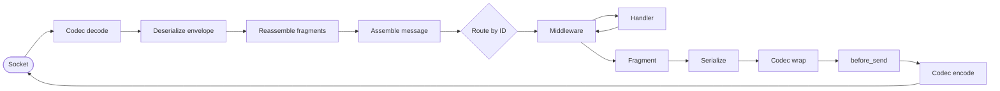
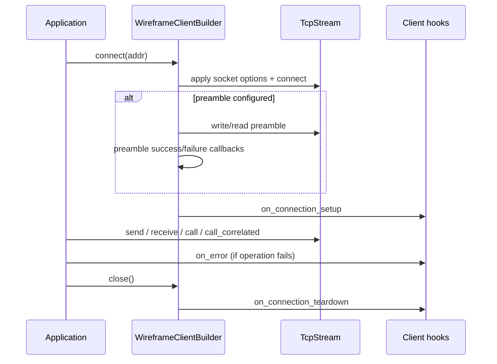

# Wireframe users' guide

This guide is for Rust developers building servers and clients for binary
protocols with Wireframe v0.4.0-alpha1. It starts from an empty project and
builds up to custom wire formats, production operation, and testing. You do not
need to know Tokio deeply to begin, though you will meet `async` code from the
first example.

Every Rust example here is compiled, and most are run, by the project's test
suite, so what you copy is what was tested. If something does not behave as
described, please [open an issue](https://github.com/leynos/wireframe/issues).

## Find your path

Table 1 suggests where to begin. The sections are ordered to be read from top
to bottom, and each builds on the last, but you can also dip in.

| You want to…                           | Start with                                                                                      |
| -------------------------------------- | ----------------------------------------------------------------------------------------------- |
| See it work in two minutes             | [Your first server](#your-first-server)                                                         |
| Understand how the pieces fit          | [How Wireframe thinks](#how-wireframe-thinks)                                                   |
| Serve typed messages on several routes | [Routes and envelopes](#routes-and-envelopes), then [Middleware](#middleware)                   |
| Speak a protocol that already exists   | [Custom frame codecs](#custom-frame-codecs), then [Connection preambles](#connection-preambles) |
| Call a server from Rust                | [The client runtime](#the-client-runtime)                                                       |
| Send messages larger than a frame      | [Large messages](#large-messages)                                                               |
| Test without opening sockets           | [Testing your protocol](#testing-your-protocol)                                                 |
| Go to production                       | [Running servers](#running-servers), then [Observability](#observability)                       |
| Stream replies or push to clients      | [Streaming responses and server pushes](#streaming-responses-and-server-pushes)                 |
| Fix something that is going wrong      | [Troubleshooting](#troubleshooting)                                                             |
| Upgrade from v0.3.0                    | The [migration guide](v0-4-0-migration-guide.md)                                                |

_Table 1: Where to begin, by goal._

## Before you begin

Wireframe needs Rust 1.95 or newer, and runs on Tokio. Both crates declare that
minimum to Cargo, so an older toolchain refuses to build them, and every change
to this repository is checked against it. Add Wireframe to `Cargo.toml`,
pinning the exact version during the alpha because one alpha may change what
the last one offered:

<!-- tested-example: guide-dependencies -->
```toml
[dependencies]
wireframe = "=0.4.0-alpha1"
tokio = { version = "1", features = ["macros", "rt-multi-thread"] }
bincode = "2"
async-trait = "0.1"
```

`bincode` lets you derive encodable messages, and `async-trait` is what you
will write middleware with. Table 2 lists the optional Cargo features.

| Feature              | Default | Adds                                            |
| -------------------- | ------- | ----------------------------------------------- |
| `metrics`            | Yes     | Emits counters through the `metrics` facade.    |
| `serializer-bincode` | Yes     | The default `BincodeSerializer`.                |
| `serializer-serde`   | No      | The optional Serde bridge.                      |
| `pool`               | No      | Client connection pools through `connect_pool`. |
| `testkit`            | No      | Test drivers in `wireframe::testkit`.           |

_Table 2: Cargo features for applications._

The remaining features (`test-support`, `examples`, `advanced-tests`, and
`benchmark-counters`) exist for this repository's own tests and benchmarks.

## Your first server

This complete program starts a server on a free local port, sends it a message
from a client, and prints the reply:

<!-- tested-example: guide-first-server -->
```rust
use std::{convert::Infallible, error::Error, sync::Arc};

use async_trait::async_trait;
use wireframe::{
    app::{Envelope, Handler, WireframeApp},
    client::WireframeClient,
    message::Message,
    middleware::{HandlerService, Service, ServiceRequest, ServiceResponse, Transform},
    server::WireframeServer,
};

const GREET: u32 = 1;

#[derive(bincode::Encode, bincode::BorrowDecode)]
struct Greeting {
    name: String,
}

#[derive(bincode::Encode, bincode::BorrowDecode)]
struct Reply {
    text: String,
}

struct Greeter;

struct GreeterService<S> {
    inner: S,
}

#[async_trait]
impl<S> Service for GreeterService<S>
where
    S: Service<Error = Infallible> + Send + Sync + 'static,
{
    type Error = Infallible;

    async fn call(&self, request: ServiceRequest) -> Result<ServiceResponse, Infallible> {
        let greeting = Greeting::from_bytes(request.frame()).map(|(greeting, _)| greeting);
        let mut response = self.inner.call(request).await?;
        if let Ok(greeting) = greeting {
            let reply = Reply {
                text: format!("Hello, {}!", greeting.name),
            };
            *response.frame_mut() = reply.to_bytes().expect("a short reply encodes");
        }
        Ok(response)
    }
}

#[async_trait]
impl Transform<HandlerService<Envelope>> for Greeter {
    type Output = HandlerService<Envelope>;

    async fn transform(&self, service: HandlerService<Envelope>) -> Self::Output {
        let id = service.id();
        HandlerService::from_service(id, GreeterService { inner: service })
    }
}

#[tokio::main]
async fn main() -> Result<(), Box<dyn Error>> {
    let handler: Handler<Envelope> = Arc::new(|_envelope: &Envelope| Box::pin(async {}));
    let app: WireframeApp = WireframeApp::new()?.route(GREET, handler)?.wrap(Greeter)?;

    let server = WireframeServer::from_app(app).bind("127.0.0.1:0".parse()?)?;
    let address = server.local_addr().expect("a bound server has an address");
    let shutdown = server.spawn().await?;

    let mut client = WireframeClient::builder().connect(address).await?;
    let greeting = Greeting {
        name: "Wireframe".into(),
    };
    let request = Envelope::new(GREET, None, greeting.to_bytes()?);
    let response: Envelope = client.call_correlated(request).await?;
    let (reply, _) = Reply::from_bytes(response.payload_bytes())?;
    println!("{}", reply.text);

    client.close().await;
    shutdown.stop();
    shutdown.drained().await?;
    Ok(())
}
```

Save it as `src/main.rs` and `cargo run` it. You should see
`Hello, Wireframe!`. There is a fair amount going on, so here it is in order:

1. **Messages.** `Greeting` and `Reply` are ordinary structs. Deriving bincode's
   traits is enough for Wireframe to provide `to_bytes` and `from_bytes`.
2. **Route.** `route(GREET, handler)` says that message ID 1 goes to this
   handler. The ID travels beside the payload, so it is not part of either type.
3. **Handler.** A handler registered with `route` receives `&Envelope` and
   returns a boxed future of `()`. It can observe the request, but it does not
   produce the reply. Ours does nothing.
4. **Middleware.** `Greeter` wraps the route. It decodes the request, calls the
   inner service, and replaces the response bytes. This is where a `route`
   reply comes from, and it is the part most people find surprising at first.
   When one handler should build its own reply, use
   [a response-producing route](#response-producing-routes) instead.
5. **Server.** Port 0 asks the operating system for any free port. `spawn` runs
   the server in the background and returns a handle for shutting it down.
6. **Client.** `call_correlated` stamps a correlation identifier on the request,
   sends it, reads the reply, and checks that the identifier came back.

Without `Greeter`, the program would still run: the default response repeats
the request's payload, so an unwrapped `route` is an echo. That makes a good
first experiment, and it is why the `echo` example in `examples/` is so short.

Next, [How Wireframe thinks](#how-wireframe-thinks) gives you the vocabulary
for everything else.

## How Wireframe thinks

Wireframe uses a separate word for what you are holding at each layer, and
these words are used consistently in the API and in this guide. Table 3 defines
them.

| Layer                 | Term     | Meaning                                                                               |
| --------------------- | -------- | ------------------------------------------------------------------------------------- |
| Transport             | Frame    | The unit on the wire, produced and consumed by a `FrameCodec`.                        |
| Routing               | Envelope | A wrapper carrying a message ID, an optional correlation ID, and payload bytes.       |
| Domain                | Message  | The typed value you encode into, and decode from, payload bytes.                      |
| Transport subdivision | Fragment | A bounded slice of a large payload, plus the metadata needed to put it back together. |

_Table 3: The four layers and their terms._

`Packet` is the trait an envelope implements, and `Envelope` is the type
bundled with Wireframe. You can bring your own.

For screen readers: the following flowchart shows an inbound frame passing
through decoding, envelope deserialization, reassembly, and routing into
middleware and the handler, and the reply passing back out through
serialization and encoding.

<!-- tested-example: guide-request-journey -->

```mermaid
flowchart LR
    Socket([Socket]) --> Decode[Codec decode]
    Decode --> Envelope[Deserialize envelope]
    Envelope --> Reassemble[Reassemble fragments]
    Reassemble --> Assemble[Assemble message]
    Assemble --> Route{Route by ID}
    Route --> Middleware[Middleware]
    Middleware --> Handler[Handler]
    Handler --> Middleware
    Middleware --> Fragment[Fragment]
    Fragment --> Serialize[Serialize]
    Serialize --> Wrap[Codec wrap]
    Wrap --> Hook[before_send]
    Hook --> Encode[Codec encode]
    Encode --> Socket
```

_Figure 1: One request's journey through a Wireframe connection._

Three facts follow from this, and they explain most of the API:

- **A `route` handler observes, and middleware answers.** Its signature returns
  `()`, and its future cannot borrow the envelope, so copy out what you need
  before the `async` block. Such a request sends exactly one response, even if
  it is empty. A handler registered with `route_response` returns the reply
  itself, which may be one frame, several, a stream, or nothing.
- **The order is fixed.** Reassembly happens before routing, so handlers only
  ever see whole messages. On the way out, fragmentation happens before
  serialization, so each fragment is its own frame.
- **An application is immutable once it runs.** You configure a `WireframeApp`
  builder, and the server prepares it once and shares the result among all
  connections. Each connection keeps its own framing, queues, and buffers, and
  serves one request at a time.

### Where to import things from

The crate root is deliberately small: `Result`, `WireframeError`, and
`NoProtocolError`. Other items live in a module named for their domain, such as
`wireframe::app` or `wireframe::client`. For convenience,
`wireframe::prelude::*` gathers the most common ones.

## Routes and envelopes

### Registering routes

`route` maps a message ID to a handler, and returns an error if the ID is
already taken, which keeps the dispatch table unambiguous. IDs are unique across
`route` and [`route_response`](#response-producing-routes):

<!-- tested-example: guide-routes -->
```rust
use std::sync::Arc;

use wireframe::{
    WireframeError,
    app::{Envelope, Handler, Packet, WireframeApp},
};

const LOGIN: u32 = 1;
const TELEMETRY: u32 = 2;

fn handler(name: &'static str) -> Handler<Envelope> {
    Arc::new(move |envelope: &Envelope| {
        // The returned future is 'static, so copy what it needs out of the borrow.
        let id = envelope.id();
        Box::pin(async move { println!("{name} handled message {id}") })
    })
}

fn main() -> wireframe::Result<()> {
    let app: WireframeApp = WireframeApp::new()?
        .route(LOGIN, handler("login"))?
        .route(TELEMETRY, handler("telemetry"))?;

    let refused = app.route(LOGIN, handler("impostor"));
    assert!(matches!(refused, Err(WireframeError::DuplicateRoute(LOGIN))));
    Ok(())
}
```

A frame with no matching route is logged and dropped without a response. A
frame that fails to decode counts towards a failure limit: a connection closes
after ten failures with no successfully dispatched message in between.

### Custom envelopes

To give handlers your own type rather than `Envelope`, implement `Packet` (and
`CorrelatableFrame`, which it requires) on it, and name it in the application's
parameters.

This changes what handlers see, not what travels on the wire. A connection
still decodes the serializer's `Envelope`, rebuilds your type from its parts
for the handler, and sends the reply as an `Envelope`, which is also what a
response-producing route returns. To change the layout on the wire, write a
[custom frame codec](#custom-frame-codecs) as well:

<!-- tested-example: guide-custom-envelope -->
```rust
use std::sync::Arc;

use wireframe::{
    app::{Handler, Packet, PacketParts, WireframeApp},
    correlation::CorrelatableFrame,
    serializer::BincodeSerializer,
};

#[derive(bincode::Encode, bincode::BorrowDecode)]
struct Stroke {
    opcode: u16,
    tag: Option<u64>,
    payload: Vec<u8>,
}

impl CorrelatableFrame for Stroke {
    fn correlation_id(&self) -> Option<u64> { self.tag }

    fn set_correlation_id(&mut self, tag: Option<u64>) { self.tag = tag; }
}

impl Packet for Stroke {
    fn id(&self) -> u32 { u32::from(self.opcode) }

    fn into_parts(self) -> PacketParts {
        PacketParts::new(u32::from(self.opcode), self.tag, self.payload)
    }

    fn from_parts(parts: PacketParts) -> Self {
        Self {
            opcode: u16::try_from(parts.id()).unwrap_or(u16::MAX),
            tag: parts.correlation_id(),
            payload: parts.into_payload(),
        }
    }
}

type StrokeApp = WireframeApp<BincodeSerializer, (), Stroke>;

fn main() -> wireframe::Result<()> {
    let draw: Handler<Stroke> = Arc::new(|stroke: &Stroke| {
        let opcode = stroke.opcode;
        Box::pin(async move { println!("drawing opcode {opcode}") })
    });
    let _app = StrokeApp::new()?.route(107, draw)?;
    Ok(())
}
```

### Correlation identifiers

A correlation identifier ties a response to its request. `None` means the frame
is not part of an exchange, such as an unsolicited event, so prefer `None` to
`Some(0)` when there is no identifier. `PacketParts::inherit_correlation` fills
in a missing identifier from the request and logs a mismatch, which is how a
reply keeps the right identifier even if middleware forgets about it.

## Middleware

Middleware is how you read typed requests and write typed replies, and it is
also the place for concerns that span routes, such as counting or
authentication.

### Writing a `Transform`

`wrap` accepts a `Transform` whose output is a `HandlerService`. Two types do
the work: the `Transform` runs once when the application is prepared, and wraps
each route's service in your `Service`, which then runs for every request:

<!-- tested-example: guide-middleware-transform -->
```rust
use std::{
    convert::Infallible,
    sync::{
        Arc,
        atomic::{AtomicUsize, Ordering},
    },
};

use async_trait::async_trait;
use wireframe::{
    app::{Envelope, Handler, Packet, WireframeApp},
    middleware::{HandlerService, Service, ServiceRequest, ServiceResponse, Transform},
};

/// Counts every request that passes through, on any route.
struct Tally {
    tallied: Arc<AtomicUsize>,
}

struct TallyService<S> {
    inner: S,
    tallied: Arc<AtomicUsize>,
}

#[async_trait]
impl<S> Service for TallyService<S>
where
    S: Service<Error = Infallible> + Send + Sync + 'static,
{
    type Error = Infallible;

    async fn call(&self, request: ServiceRequest) -> Result<ServiceResponse, Infallible> {
        self.tallied.fetch_add(1, Ordering::Relaxed);
        self.inner.call(request).await
    }
}

#[async_trait]
impl<E: Packet> Transform<HandlerService<E>> for Tally {
    type Output = HandlerService<E>;

    async fn transform(&self, service: HandlerService<E>) -> Self::Output {
        let id = service.id();
        let tallied = Arc::clone(&self.tallied);
        HandlerService::from_service(
            id,
            TallyService {
                inner: service,
                tallied,
            },
        )
    }
}

fn main() -> wireframe::Result<()> {
    let tallied = Arc::new(AtomicUsize::new(0));
    let handler: Handler<Envelope> = Arc::new(|_: &Envelope| Box::pin(async {}));
    let _app: WireframeApp = WireframeApp::new()?
        .route(1, handler)?
        .wrap(Tally { tallied })?;
    Ok(())
}
```

Each middleware layer wraps the application's routes, and the first `wrap` call
ends up outermost, so it sees the request first and the response last. To
reply, call the inner service and then replace `response.frame_mut()`, as
[the first server](#your-first-server) does. A service can edit the incoming
bytes through `request.frame_mut()` too. `ServiceRequest` and `ServiceResponse`
also expose the correlation identifier.

### What `from_fn` is for

`middleware::from_fn` turns an async function into a `Transform`, which is
handy for composing services of your own and for testing. However, it produces
a different service type from the `HandlerService` that `wrap` requires, so
**it cannot be passed to `WireframeApp::wrap`**. For routed middleware, write a
`Transform` as above.

<!-- tested-example: guide-middleware-from-fn -->
```rust
use std::convert::Infallible;

use wireframe::{
    app::Envelope,
    message::Message,
    middleware::{HandlerService, Next, ServiceRequest, ServiceResponse, from_fn},
};

#[derive(bincode::Encode, bincode::BorrowDecode)]
struct Ping(u8);

#[derive(bincode::Encode, bincode::BorrowDecode)]
struct Pong(u8);

async fn decode_and_respond(
    request: ServiceRequest,
    next: Next<'_, HandlerService<Envelope>>,
) -> Result<ServiceResponse, Infallible> {
    let ping = Ping::from_bytes(request.frame()).map(|(message, _)| message).ok();
    let mut response = next.call(request).await?;

    if let Some(Ping(value)) = ping {
        *response.frame_mut() = Pong(value.wrapping_add(1)).to_bytes().expect("encode Pong");
    }
    Ok(response)
}

let _middleware = from_fn(decode_and_respond);
```

### Versioning a message

Middleware is also a tidy way to retire an old message format without breaking
its clients. Accept versions N and N-1 on the way in, rewrite the older one so
that handlers only ever see the current schema, send only version N out, and
count legacy traffic so that you know when it is safe to remove the adapter:

<!-- tested-example: guide-middleware-versions -->
```rust
use std::convert::Infallible;

use async_trait::async_trait;
use wireframe::{
    app::Envelope,
    message::Message,
    middleware::{HandlerService, Service, ServiceRequest, ServiceResponse, Transform},
};

#[derive(bincode::Encode, bincode::BorrowDecode)]
struct PointV1 {
    id: u64,
    name: String,
}

/// Version 2 adds a field, so a version 1 payload is too short to decode as this.
#[derive(bincode::Encode, bincode::BorrowDecode)]
struct PointV2 {
    id: u64,
    display_name: String,
    intensity: u32,
}

struct UpgradePoints;

struct UpgradeService<S> {
    inner: S,
}

#[async_trait]
impl<S> Service for UpgradeService<S>
where
    S: Service<Error = Infallible> + Send + Sync + 'static,
{
    type Error = Infallible;

    async fn call(&self, mut request: ServiceRequest) -> Result<ServiceResponse, Infallible> {
        if PointV2::from_bytes(request.frame()).is_err()
            && let Ok((v1, _)) = PointV1::from_bytes(request.frame())
        {
            let v2 = PointV2 {
                id: v1.id,
                display_name: v1.name,
                intensity: 0,
            };
            *request.frame_mut() = v2.to_bytes().expect("encode PointV2");
        }
        self.inner.call(request).await
    }
}

#[async_trait]
impl Transform<HandlerService<Envelope>> for UpgradePoints {
    type Output = HandlerService<Envelope>;

    async fn transform(&self, service: HandlerService<Envelope>) -> Self::Output {
        let id = service.id();
        HandlerService::from_service(id, UpgradeService { inner: service })
    }
}
```

Note the order of the checks. Bincode happily decodes a prefix, so trying the
older format first could misread a newer message.

## Packets, payloads, and serialization

A serializer converts envelopes to and from bytes. `WireframeApp` uses
`BincodeSerializer` by default. To use another, install it with
`.serializer(s)` on the builder, or start from
`WireframeApp::with_serializer(s)`.

Message types use the adapter traits `EncodeWith<S>` and `DecodeWith<S>`. Any
type deriving bincode's traits implements `Message`, which provides `to_bytes`
and `from_bytes`, and this is usually all you need. For Serde types, enable the
`serializer-serde` feature, wrap values in `SerdeMessage<T>` (or call
`into_serde_message()`), and implement `SerdeSerializerBridge` on your
serializer.

A few details matter if you write your own serializer:

- Implement `MessageCompatibilitySerializer` if it should accept `Message`
  payloads.
- `Serializer` is not object-safe, so `dyn Serializer` is unavailable. If you
  need runtime polymorphism, wrap concrete serializers in your own adapter.
- Implement `Serializer::deserialize_with_context` to inspect metadata through
  `DeserializeContext`.
- `FrameMetadata::parse` can extract routing information cheaply. After a
  successful parse the framework still fully deserializes, unless
  `should_deserialize_after_parse` returns `false`. If parsing fails, it falls
  back to full deserialization, except when a decode limit was exceeded.
  `BincodeSerializer::parse` itself performs a full decode.

### Limits on what a peer can make you decode

The bundled bincode decoders apply a fixed 16 MiB limit (`MAX_FRAME_LENGTH`) to
peer-provided container lengths. This bounds the work and allocation a declared
length can cause. It is separate from your configured frame size, which still
decides which frames are accepted. Reassembled messages use the same 16 MiB
limit, even if their configured size limit is larger.

An inbound `Envelope` frame must contain exactly one value, so trailing bytes
are a decoding error. The limit relies on bincode's accounting, and is not a
general allocator quota, so protocols with further resource needs should
validate peer input themselves.

## Custom frame codecs

The default codec is a 4-byte big-endian length prefix, with a 1024-byte
maximum frame. To change the limit, use `buffer_capacity`; to change the
format, implement `FrameCodec`.

Changing either clears anything derived from the old framing. `buffer_capacity`
and `with_codec` both clear the fragmentation configuration, and `with_codec`
also removes hooks installed with `with_protocol`, the push-queue template, and
the session registry, because the frame type may change. Call `with_codec`
first, then configure the rest.

### Writing a `FrameCodec`

A codec supplies a frame type and a Tokio decoder and encoder. This one uses
two bytes of length and four bytes of tag:

<!-- tested-example: guide-frame-codec -->
```rust
use std::{io, sync::Arc};

use bytes::{Buf, BufMut, Bytes, BytesMut};
use tokio_util::codec::{Decoder, Encoder};
use wireframe::{
    app::{Envelope, Handler, WireframeApp},
    codec::FrameCodec,
    serializer::BincodeSerializer,
};

const HEADER_LEN: usize = 6;

#[derive(Debug, Clone)]
struct TaggedFrame {
    tag: u32,
    payload: Bytes,
}

#[derive(Clone)]
struct TagCodec {
    max_frame_length: usize,
}

struct TagDecoder {
    max_frame_length: usize,
}

impl Decoder for TagDecoder {
    type Item = TaggedFrame;
    type Error = io::Error;

    fn decode(&mut self, src: &mut BytesMut) -> io::Result<Option<TaggedFrame>> {
        if src.len() < HEADER_LEN {
            return Ok(None);
        }
        let len = usize::from(u16::from_be_bytes([src[0], src[1]]));
        // Your decoder is what enforces the frame limit.
        if len > self.max_frame_length {
            return Err(io::Error::new(io::ErrorKind::InvalidData, "frame too large"));
        }
        if src.len() < HEADER_LEN + len {
            src.reserve(HEADER_LEN + len - src.len());
            return Ok(None);
        }
        src.advance(2);
        let tag = src.get_u32();
        let payload = src.split_to(len).freeze();
        Ok(Some(TaggedFrame { tag, payload }))
    }
}

struct TagEncoder;

impl Encoder<TaggedFrame> for TagEncoder {
    type Error = io::Error;

    fn encode(&mut self, frame: TaggedFrame, dst: &mut BytesMut) -> io::Result<()> {
        let len = u16::try_from(frame.payload.len())
            .map_err(|_| io::Error::new(io::ErrorKind::InvalidInput, "payload too large"))?;
        dst.reserve(HEADER_LEN + frame.payload.len());
        dst.put_u16(len);
        dst.put_u32(frame.tag);
        dst.extend_from_slice(&frame.payload);
        Ok(())
    }
}

impl FrameCodec for TagCodec {
    type Frame = TaggedFrame;
    type Decoder = TagDecoder;
    type Encoder = TagEncoder;

    fn decoder(&self) -> TagDecoder {
        TagDecoder {
            max_frame_length: self.max_frame_length,
        }
    }

    fn encoder(&self) -> TagEncoder { TagEncoder }

    fn frame_payload(frame: &TaggedFrame) -> &[u8] { &frame.payload }

    fn frame_payload_bytes(frame: &TaggedFrame) -> Bytes { frame.payload.clone() }

    fn wrap_payload(&self, payload: Bytes) -> TaggedFrame { TaggedFrame { tag: 0, payload } }

    fn correlation_id(frame: &TaggedFrame) -> Option<u64> { Some(u64::from(frame.tag)) }

    fn max_frame_length(&self) -> usize { self.max_frame_length }
}

fn main() -> wireframe::Result<()> {
    let codec = TagCodec {
        max_frame_length: 4096,
    };
    let echo: Handler<Envelope> = Arc::new(|_: &Envelope| Box::pin(async {}));
    let app: WireframeApp<_, _, Envelope, TagCodec> = WireframeApp::<BincodeSerializer>::new()?
        .with_codec(codec)
        .route(1, echo)?;
    assert_eq!(app.codec().max_frame_length(), 4096);
    Ok(())
}
```

When you write a codec, keep these rules in mind:

- `frame_payload` returns only the logical payload, without protocol headers.
- `wrap_payload` adds any headers the wire format needs.
- `correlation_id` is for protocols that store it outside the payload. Wireframe
  uses it only when the deserialized envelope lacks an identifier.
- `max_frame_length` sizes buffers and derives budgets and fragmentation
  defaults, but **your decoder must enforce the limit**.
- Wireframe clones the codec per connection, so make sure `Clone` produces
  independent state if the codec holds any, such as sequence counters.

See `examples/hotline_codec.rs`, `examples/mysql_codec.rs`, and
`examples/resp_codec.rs` for real protocols. The Hotline and MySQL codecs are
also available from `wireframe::codec::examples`.

### Zero-copy payloads

Storing the payload as `Bytes`, as `TaggedFrame` does, and overriding
`frame_payload_bytes` avoids copying it. The clone only increments a reference
count. In the decoder, use `BytesMut::split_to(...).freeze()` rather than
`.to_vec()`. The default `frame_payload_bytes` copies from the `frame_payload`
slice, so codecs using `Vec<u8>` keep working.

### Codec errors

`CodecError` classifies failures as `Framing`, `Protocol`, `Io`, or `Eof`, the
last of which distinguishes a clean close from a close in the middle of a frame
or header. Unless you install a [recovery policy](#codec-recovery-policies),
**any decoder error closes the connection**.

Return structured errors from your own decoder, because two features depend on
them. The `wireframe_codec_errors_total` metric labels each failure by its
category, and the protocol's [`on_eof` hook](#when-a-peer-vanishes-mid-frame)
runs only for a decoder that reports truncation as `CodecError::Eof`.

## Connection preambles

Some protocols begin with a handshake before any frames, such as a magic number
and version. The server reads and decodes a preamble first, then hands anything
left over to the codec:

<!-- tested-example: guide-server-preamble -->
```rust
use std::time::Duration;

use futures::FutureExt;
use tokio::io::AsyncWriteExt;
use wireframe::{app::WireframeApp, client::WireframeClient, server::WireframeServer};

#[derive(bincode::Encode, bincode::BorrowDecode, Debug, Clone, PartialEq)]
struct Hello {
    magic: [u8; 4],
    version: u16,
}

const MAGIC: [u8; 4] = *b"WIRE";

fn build_app() -> WireframeApp {
    WireframeApp::default()
}

#[tokio::main]
async fn main() -> Result<(), Box<dyn std::error::Error>> {
    let server = WireframeServer::new(build_app)
        .with_preamble::<Hello>()
        .preamble_timeout(Duration::from_secs(2))
        .on_preamble_decode_success(|hello: &Hello, stream| {
            let accepted = hello.magic == MAGIC;
            async move {
                stream.write_all(&[u8::from(accepted)]).await?;
                if accepted {
                    Ok(())
                } else {
                    // An error here closes the connection, so write first.
                    Err(std::io::Error::other("unknown protocol"))
                }
            }
            .boxed()
        })
        .bind("127.0.0.1:0".parse()?)?;
    let address = server.local_addr().expect("a bound server has an address");
    let shutdown = server.spawn().await?;

    let client = WireframeClient::builder()
        .with_preamble(Hello {
            magic: MAGIC,
            version: 3,
        })
        .connect(address)
        .await?;
    client.close().await;

    shutdown.stop();
    shutdown.drained().await?;
    Ok(())
}
```

Keep these in mind:

- **Call `with_preamble` first**, because it clears any hooks registered
  earlier.
- **A success handler that returns an error closes the connection.** The server
  writes nothing on your behalf, so send any rejection message before returning.
- **`on_preamble_decode_failure`** receives decode errors and timeouts, along
  with the stream, so that you can reply or log before the connection closes.
- **There is always a deadline.** The read is bounded by
  `DEFAULT_PREAMBLE_TIMEOUT` (10 seconds) by default. `preamble_timeout`
  replaces that, and `disable_preamble_timeout` removes it. `Duration::ZERO`
  clamps to 1 ms. The deadline covers only the read.
- **An empty preamble reads nothing.** Without `with_preamble`, or with a type
  that encodes to no bytes, the connection goes straight to your application. A
  client may then stay silent and wait for the server to speak first, through
  [a push](#server-connections-and-push-queues).
- **Preambles are small.** Decoding is limited to 1 KiB.

The [preamble validator guide](preamble-validator.md) goes further, and
[Client preamble exchange](#client-preamble-exchange) covers the other end.

## Connection lifecycle and state

### Setup and teardown

`on_connection_setup` runs once per connection and produces state, and
`on_connection_teardown` receives that state when the stream finishes. Setting
up changes the application's state type, and it resets any teardown hook, so
register setup first:

<!-- tested-example: guide-lifecycle-hooks -->
```rust
use std::sync::{
    Arc,
    atomic::{AtomicUsize, Ordering},
};

use wireframe::{
    app::{Envelope, WireframeApp},
    serializer::BincodeSerializer,
};

struct Link {
    connected_at: std::time::Instant,
}

type LinkApp = WireframeApp<BincodeSerializer, Link, Envelope>;

fn build_app(closed: Arc<AtomicUsize>) -> wireframe::Result<LinkApp> {
    let app: WireframeApp = WireframeApp::new()?;
    app.on_connection_setup(|| async {
        Link {
            connected_at: std::time::Instant::now(),
        }
    })?
    .on_connection_teardown(move |link: Link| {
        let closed = Arc::clone(&closed);
        async move {
            println!("connection lasted {:?}", link.connected_at.elapsed());
            closed.fetch_add(1, Ordering::Relaxed);
        }
    })
}

fn main() -> wireframe::Result<()> {
    let _app = build_app(Arc::new(AtomicUsize::new(0)))?;
    Ok(())
}
```

Teardown runs exactly once when both hooks are registered and setup has
produced state, whether the connection ended cleanly, with a decode, protocol,
or transport error, or because a handler panicked. The transport is released
first, so teardown may wait for the peer to notice. A handler panic is raised
again after teardown, so it is still logged and counted.

Some endings cannot run it to completion: setup that failed or never finished,
a connection task that is cancelled, a teardown callback that itself panics,
which is not retried, and a build with `panic = "abort"`. Put a resource that
must be released even then behind a `Drop` guard.

### Sharing state with handlers

Setup state reaches teardown, but it is **not passed to handlers or
middleware**. To share state with a handler, capture it when you build the
closure:

<!-- tested-example: guide-shared-state -->
```rust
use std::sync::{
    Arc,
    atomic::{AtomicU64, Ordering},
};

use wireframe::{
    app::{Envelope, Handler, WireframeApp},
    message::Message,
};

#[derive(bincode::Encode, bincode::BorrowDecode)]
struct Login {
    username: String,
}

fn build_app(logins: Arc<AtomicU64>) -> wireframe::Result<WireframeApp> {
    let handler: Handler<Envelope> = Arc::new(move |envelope: &Envelope| {
        // Decode before the future, which cannot borrow the envelope.
        let login = Login::from_bytes(envelope.payload_bytes()).map(|(login, _)| login);
        let logins = Arc::clone(&logins);
        Box::pin(async move {
            if let Ok(login) = login {
                let count = logins.fetch_add(1, Ordering::Relaxed) + 1;
                println!("{} is login {count}", login.username);
            }
        })
    });

    let app: WireframeApp = WireframeApp::new()?.route(1, handler)?;
    Ok(app)
}

fn main() -> wireframe::Result<()> {
    let _app = build_app(Arc::new(AtomicU64::new(0)))?;
    Ok(())
}
```

Handlers own their decoding, so validation that several routes share belongs in
an ordinary function, or in middleware. A handler receives only the envelope;
the peer's address is available to protocol hooks, through `ConnectionContext`,
but not to handlers.

### Writing a response directly

`send_response` writes one encoded message to a stream, using the application's
serializer and a length-delimited frame. It lives on the `WireframeApp` builder
rather than on `PreparedApp`, so it is for code that manages its own stream,
not for handlers:

<!-- tested-example: guide-send-response -->
```rust
use tokio::io::{self, AsyncReadExt, AsyncWriteExt};
use wireframe::{
    app::{SendError, WireframeApp},
    message::Message,
};

#[derive(bincode::Encode, bincode::BorrowDecode, Debug, PartialEq)]
struct Ready {
    status: u8,
}

const LENGTH_PREFIX: usize = 4;

#[tokio::main]
async fn main() -> Result<(), SendError> {
    let app: WireframeApp = WireframeApp::default();
    let (mut client, mut server) = io::duplex(64);

    let ready = Ready { status: 1 };
    app.send_response(&mut server, &ready).await?;
    server.shutdown().await?;

    let mut buffer = Vec::new();
    client.read_to_end(&mut buffer).await?;
    let frame = buffer.get(LENGTH_PREFIX..).expect("a length-prefixed frame");
    let (decoded, _) = Ready::from_bytes(frame).expect("decode Ready");
    assert_eq!(decoded, ready);
    Ok(())
}
```

`send_response_framed` writes raw bytes to an existing `Framed` stream, and
`send_response_framed_with_codec` does so through `FrameCodec::wrap_payload`.
All three report failures through `SendError`, and all three bypass
`before_send`. The `Display` output of each variant begins with a stable prefix
you may match on: `serialization error:`, `I/O error:`, or `codec error:`. The
text after the prefix is not part of that contract.

### Driving accepted streams yourself

If you accept streams yourself rather than using `WireframeServer`, prepare the
application once and reuse it. Preparation consumes the builder and builds each
route's middleware chain a single time, so you must register everything first:

<!-- tested-example: guide-prepared-app -->
```rust
use tokio::io::duplex;
use wireframe::app::{PreparedApp, WireframeApp};

#[tokio::main]
async fn main() -> Result<(), Box<dyn std::error::Error>> {
    let prepared: PreparedApp = WireframeApp::new()?.prepare().await?;
    let (client, server) = duplex(64);
    drop(client);
    prepared.handle_connection_result(server).await?;
    Ok(())
}
```

`prepare` returns `PrepareError` if a push-queue template has an unusable
capacity or rate, so the problem surfaces before any connection exists.
`handle_connection_result` returns stream and handler I/O errors, and
`handle_connection` logs them instead. Both need a serializer that is
`'static`. The older `WireframeApp::handle_connection` methods are deprecated
because they rebuild the chains for every connection.

## Large messages

Wireframe has two separate mechanisms, and they are easy to confuse:

- **Fragmentation** is transport-level. Wireframe splits an envelope that will
  not fit in a frame, using its own `FRAG` format, and rejoins it at the other
  end. Both ends need to be Wireframe servers or to speak that format.
- **Message assembly** is protocol-level. Your protocol already defines first
  and continuation frames, and you teach Wireframe to parse them.

### Fragmentation

Fragmentation is off by default. Turn it on with `enable_fragmentation()`,
which derives limits from the frame budget, or supply a `FragmentationConfig`:

<!-- tested-example: guide-fragmentation-config -->
```rust
use std::{num::NonZeroUsize, sync::Arc, time::Duration};

use wireframe::{
    app::{Envelope, Handler, WireframeApp},
    fragment::FragmentationConfig,
};

fn main() -> Result<(), Box<dyn std::error::Error>> {
    let config = FragmentationConfig::for_frame_budget(
        1024,
        NonZeroUsize::new(16 * 1024).expect("non-zero"),
        Duration::from_secs(30),
    )
    .expect("the frame budget has room for fragments");

    let handler: Handler<Envelope> = Arc::new(|_: &Envelope| Box::pin(async {}));
    let _app: WireframeApp = WireframeApp::new()?
        .fragmentation(Some(config))
        .route(42, handler)?;
    Ok(())
}
```

Payloads larger than `fragment_payload_cap` (the frame budget less some
overhead) are split into fragments, and handlers only ever see the complete
message. Four limits protect the reassembling side:

- `max_message_size` caps the reassembled payload. Exceeding it counts as a
  deserialization failure.
- `reassembly_timeout` evicts stale partial messages.
- `max_concurrent_partials` limits incomplete messages per connection.
- `max_buffered_bytes` caps their total size.

Exceeding either of the last two closes the connection immediately.
`for_frame_budget` sets them to `min(frame_budget, 64)` partial messages and
the larger of `frame_budget × 64` and `max_message_size` bytes. Call
`fragmentation(None)` to disable fragmentation again, for example when a
gateway handles it upstream. The `WireframeClient` has no fragmentation support
of its own, so a client talking to a fragmenting server sees `FRAG` payloads.

To work with fragments directly, `Fragmenter` splits and `Reassembler` rejoins:

<!-- tested-example: guide-fragmenter -->
```rust
use std::{num::NonZeroUsize, time::Duration};

use wireframe::fragment::{FragmentHeader, FragmentIndex, Fragmenter, MessageId, Reassembler};

let fragmenter = Fragmenter::new(NonZeroUsize::new(512).expect("non-zero"));
let batch = fragmenter.fragment_bytes([7_u8; 1400]).expect("fragment");
assert_eq!(batch.len(), 3);
assert!(batch.fragments().last().expect("a fragment").header().is_last_fragment());

let limit = NonZeroUsize::new(4096).expect("non-zero");
let mut reassembler = Reassembler::new(limit, Duration::from_secs(30), None, None);
let id = MessageId::new(9);

let first = FragmentHeader::new(id, FragmentIndex::zero(), false);
assert!(reassembler.push(first, [1_u8; 8]).expect("accepted").is_none());

let last = FragmentHeader::new(id, FragmentIndex::new(1), true);
let whole = reassembler
    .push(last, [2_u8; 8])
    .expect("accepted")
    .expect("the final fragment completes the message");
assert_eq!(whole.payload().len(), 16);
```

An empty input produces one final fragment with an empty payload, so a batch is
never empty. `purge_expired` clears stale partial messages from a standalone
`Reassembler`.

### Message assembly

If your protocol has its own multi-frame format, implement `MessageAssembler`
to parse each frame's header. Once configured, it must parse every inbound
payload, including single-frame messages, and it runs after any fragment
reassembly:

<!-- tested-example: guide-message-assembler -->
```rust
use wireframe::{
    app::WireframeApp,
    message_assembler::{FirstFrameHeader, FrameHeader, MessageAssembler, MessageKey, ParsedFrameHeader},
};

struct DemoAssembler;

impl MessageAssembler for DemoAssembler {
    fn parse_frame_header(&self, _payload: &[u8]) -> Result<ParsedFrameHeader, std::io::Error> {
        Ok(ParsedFrameHeader::new(
            FrameHeader::First(FirstFrameHeader {
                message_key: MessageKey(1),
                metadata_len: 0,
                body_len: 0,
                total_body_len: None,
                is_last: true,
            }),
            0,
        ))
    }
}

let app: WireframeApp = WireframeApp::new().expect("builder");
let app = app.with_message_assembler(DemoAssembler);
assert!(app.message_assembler().is_some());
```

`message_assembler` lends you the assembler, and the application keeps
ownership of it. To share one with code that outlives the application, keep it
in an `Arc` of your own, and install a small type that forwards to it.

Incomplete messages stay buffered per `MessageKey` until they complete or time
out. When one completes, the handler receives one buffered `Envelope` whose
payload is the metadata followed by the body, with no marker between the two.
Parsing and ordering failures count as deserialization failures, towards the
same limit as other inbound failures.

To use the state machine directly, `MessageAssemblyState` handles interleaved
messages:

<!-- tested-example: guide-message-assembly-state -->
```rust
use std::{num::NonZeroUsize, time::Duration};

use wireframe::message_assembler::{
    ContinuationFrameHeader,
    EnvelopeId,
    EnvelopeRouting,
    FirstFrameHeader,
    FirstFrameInput,
    FrameSequence,
    MessageAssemblyState,
    MessageKey,
};

fn main() -> Result<(), Box<dyn std::error::Error>> {
    let mut state = MessageAssemblyState::new(
        NonZeroUsize::new(1_048_576).expect("non-zero"),
        Duration::from_secs(30),
    );

    // The first frame of message 1.
    let first_one = FirstFrameHeader {
        message_key: MessageKey(1),
        metadata_len: 0,
        body_len: 5,
        total_body_len: Some(15),
        is_last: false,
    };
    let routing = EnvelopeRouting {
        envelope_id: EnvelopeId(1),
        correlation_id: None,
    };
    state.accept_first_frame(FirstFrameInput::new(&first_one, routing, vec![], b"hello")?)?;

    // The first frame of message 2 arrives in between.
    let first_two = FirstFrameHeader {
        message_key: MessageKey(2),
        metadata_len: 0,
        body_len: 5,
        total_body_len: None,
        is_last: false,
    };
    let routing = EnvelopeRouting {
        envelope_id: EnvelopeId(2),
        correlation_id: None,
    };
    state.accept_first_frame(FirstFrameInput::new(&first_two, routing, vec![], b"world")?)?;

    // A continuation completes message 1.
    let last_one = ContinuationFrameHeader {
        message_key: MessageKey(1),
        sequence: Some(FrameSequence(1)),
        body_len: 10,
        is_last: true,
    };
    let message = state
        .accept_continuation_frame(&last_one, b" completed")?
        .expect("message 1 is complete");
    assert_eq!(message.body(), b"hello completed");
    Ok(())
}
```

`MessageSeries` validates the order of one message's frames when your protocol
supplies sequence numbers:

<!-- tested-example: guide-message-series -->
```rust
use wireframe::message_assembler::{
    ContinuationFrameHeader,
    FirstFrameHeader,
    FrameSequence,
    MessageKey,
    MessageSeries,
    MessageSeriesError,
    MessageSeriesStatus,
};

fn continuation(sequence: u32, is_last: bool) -> ContinuationFrameHeader {
    ContinuationFrameHeader {
        message_key: MessageKey(1),
        sequence: Some(FrameSequence(sequence)),
        body_len: 5,
        is_last,
    }
}

let first = FirstFrameHeader {
    message_key: MessageKey(1),
    metadata_len: 0,
    body_len: 10,
    total_body_len: None,
    is_last: false,
};
let mut series = MessageSeries::from_first_frame(&first);

assert_eq!(series.accept_continuation(&continuation(1, false)), Ok(MessageSeriesStatus::Incomplete));
assert!(matches!(
    series.accept_continuation(&continuation(3, false)),
    Err(MessageSeriesError::SequenceMismatch { .. })
));
assert_eq!(series.accept_continuation(&continuation(2, false)), Ok(MessageSeriesStatus::Incomplete));
assert!(matches!(
    series.accept_continuation(&continuation(1, false)),
    Err(MessageSeriesError::DuplicateFrame { .. })
));
assert_eq!(series.accept_continuation(&continuation(3, true)), Ok(MessageSeriesStatus::Complete));
assert!(matches!(
    series.accept_continuation(&continuation(4, false)),
    Err(MessageSeriesError::SeriesComplete)
));
```

The first sequenced frame sets the baseline at any value, so a gap before it
goes undetected. Once a series is tracking sequences, an unsequenced frame is
rejected with `MissingSequence`. Other errors include `KeyMismatch` and
`SequenceOverflow`. Protocols that supply no sequence numbers skip these order
checks.

#### Declared total body length

`FirstFrameHeader::total_body_len` is binding, not a hint. If you set it, the
assembler enforces it:

- `DeclaredTotalTooSmall`: a first frame carries more body than it declares.
- `DeclaredTotalExceeded`: a continuation would pass the total, and is rejected
  before its bytes are buffered.
- `DeclaredTotalMismatch`: the completed body is not the declared length.

A rejected continuation or completion also removes its partial assembly, so a
mismatched message never reaches a handler. An exact total is also the cheapest
way to reject an oversized message early. Leave it as `None` to opt out. The
decision is recorded in
[ADR 015](adrs/adr-0015-declared-total-body-length-is-authoritative.md).

### Per-connection memory budgets

`MemoryBudgets` caps inbound buffering per connection:

<!-- tested-example: guide-memory-budgets -->
```rust
use std::num::NonZeroUsize;

use wireframe::app::{BudgetBytes, MemoryBudgets, WireframeApp};

let bytes = |count: usize| BudgetBytes::new(NonZeroUsize::new(count).expect("non-zero"));
let budgets = MemoryBudgets::new(bytes(16 * 1024), bytes(64 * 1024), bytes(48 * 1024));

let _app: WireframeApp = WireframeApp::new()
    .expect("builder")
    .memory_budgets(budgets);
```

The arguments are bytes per message, per connection, and in flight. Without an
explicit call, Wireframe derives them from `buffer_capacity`, as Table 4 shows.

| Budget                 | Derived value       | With a 1024-byte frame |
| ---------------------- | ------------------- | ---------------------- |
| `bytes_per_message`    | `frame_budget × 16` | 16 KiB                 |
| `bytes_per_connection` | `frame_budget × 64` | 64 KiB                 |
| `bytes_in_flight`      | `frame_budget × 64` | 64 KiB                 |

_Table 4: Default memory budgets._

The budgets protect a connection in three stages. The first applies only with a
`MessageAssembler`, and the others measure whatever fragment and assembly bytes
are held. A default application buffers neither, so these stages have nothing
to do.

1. **Per-frame rejection.** A frame that would exceed the connection or
   in-flight budget is rejected, its partial assembly is freed, and the failure
   counts as a deserialization failure. The effective per-message limit is the
   smaller of `max_message_size` and `bytes_per_message`. A single-frame
   message that completes immediately is not counted, because it never buffers.
2. **Read pacing.** At 80% of the smaller aggregate cap, the connection pauses
   briefly before reading the next frame, passing back-pressure to the sender.
3. **Hard cap.** Above 100% of that cap, the connection closes with
   `InvalidData`. Fragment and assembly bytes are combined for this, so the
   total can exceed the cap even if each layer is within its own limit.

## Protocol hooks

`WireframeProtocol` gathers callbacks for a protocol. Install an implementation
with `with_protocol`, after any `with_codec` call. It must use
`ProtocolError = ()`, and its frame type must be the codec's frame, which is
`Bytes` for the default codec:

<!-- tested-example: guide-protocol-hooks -->
```rust
use bytes::{Bytes, BytesMut};
use wireframe::{
    app::WireframeApp,
    hooks::{ConnectionContext, WireframeProtocol},
};

struct Stamped;

impl WireframeProtocol for Stamped {
    type Frame = Bytes;
    type ProtocolError = ();

    fn before_send(&self, frame: &mut Bytes, _context: &mut ConnectionContext) {
        let mut stamped = BytesMut::from(frame.as_ref());
        stamped.extend_from_slice(b"!");
        *frame = stamped.freeze();
    }
}

let app: WireframeApp = WireframeApp::new().expect("builder");
let _app = app.with_protocol(Stamped);
```

Every hook has a default that does nothing, so implement only what you need.
Table 5 shows when the server calls each one.

| Hook                  | When it runs on a server connection                                                                   |
| --------------------- | ----------------------------------------------------------------------------------------------------- |
| `on_connection_setup` | Once, before the first frame is read, with a `PushHandle` for this connection.                        |
| `before_send`         | Once for every outbound frame: replies and their fragments, streamed frames, terminators, and pushes. |
| `on_command_end`      | After a completed reply's final frame is written, including ordinary `route` replies.                 |
| `stream_end_frame`    | To build the frame that ends a streamed or multi-packet reply.                                        |
| `handle_error`        | When a streamed reply yields a protocol error; the connection then closes without a terminator.       |
| `on_eof`              | When the peer vanishes part-way through a frame.                                                      |

_Table 5: Protocol hooks and when they run._

`before_send` sees the frame after the codec has wrapped it and just before it
is encoded. Whatever it writes must still fit `max_frame_length`. The default
codec rejects an oversized frame, which fails the send and ends the connection,
whereas a custom codec must enforce the limit itself. The
[direct response helpers](#writing-a-response-directly) bypass it.

`ConnectionContext` belongs to one connection, and offers its `connection_id()`
and `peer_addr()`. It cannot yet hold your own data, and state inside your
`WireframeProtocol` value is shared by every connection, so key anything
per-connection by the identifier.

**`on_command_end` is not a cleanup guarantee.** It does not run for a reply
that was cancelled, or whose terminator could not be written. Use connection
teardown for what must happen on close.

To supply callbacks without a whole protocol, when driving a
[`ConnectionActor`](#the-connection-actor) yourself, fill in
`CustomProtocolHooks` and convert it with `.into()`. `ProtocolHooks` is an enum
of `None`, `Protocol`, and `Custom`.

### When a peer vanishes mid-frame

A peer that disconnects between frames has simply finished. One that
disconnects inside a frame has lost something, and `on_eof` tells you what: an
`EofError::MidHeader` or `EofError::MidFrame`, along with the bytes that did
arrive. The built-in codecs support it. A custom decoder opts in by returning
`CodecError::Eof` from `decode_eof`, and should leave the incomplete bytes in
the buffer, so that the hook receives them:

<!-- tested-example: guide-decode-eof -->
```rust
use std::io;

use bytes::{Buf, BytesMut};
use tokio_util::codec::Decoder;
use wireframe::codec::{CodecError, EofError};

const HEADER: usize = 2;

struct ShortFrames;

impl Decoder for ShortFrames {
    type Item = Vec<u8>;
    type Error = io::Error;

    fn decode(&mut self, buffer: &mut BytesMut) -> Result<Option<Vec<u8>>, io::Error> {
        let Some(&[high, low]) = buffer.first_chunk::<HEADER>() else {
            return Ok(None);
        };
        // Two bytes cannot declare more than 64 KiB, which is this format's limit.
        let length = usize::from(u16::from_be_bytes([high, low]));
        if buffer.len() < HEADER + length {
            return Ok(None);
        }
        buffer.advance(HEADER);
        Ok(Some(buffer.split_to(length).to_vec()))
    }

    fn decode_eof(&mut self, buffer: &mut BytesMut) -> Result<Option<Vec<u8>>, io::Error> {
        if let Some(frame) = self.decode(buffer)? {
            return Ok(Some(frame));
        }
        let received = buffer.len();
        match buffer.first_chunk::<HEADER>() {
            // A clean close at a frame boundary.
            None if received == 0 => Ok(None),
            None => Err(CodecError::Eof(EofError::MidHeader {
                bytes_received: received,
                header_size: HEADER,
            })
            .into()),
            Some(header) => Err(CodecError::Eof(EofError::MidFrame {
                bytes_received: received - HEADER,
                expected: usize::from(u16::from_be_bytes(*header)),
            })
            .into()),
        }
    }
}

let mut whole = BytesMut::from(&[0, 2, 7, 7][..]);
assert_eq!(ShortFrames.decode_eof(&mut whole).expect("decodes"), Some(vec![7, 7]));

let mut cut_short = BytesMut::from(&[0, 5, 7][..]);
let error = ShortFrames.decode_eof(&mut cut_short).expect_err("truncated");
let reason = error.get_ref().and_then(|inner| inner.downcast_ref::<CodecError>());
assert!(matches!(reason, Some(CodecError::Eof(EofError::MidFrame { .. }))));
assert_eq!(cut_short.len(), 3, "the bytes are left for `on_eof`");
```

A frame the decoder rejects as malformed is a different matter. It reaches
[the recovery policy](#codec-recovery-policies), and neither `on_eof` nor
`handle_error`.

## Running servers

### Configuring and starting

`WireframeServer` starts unbound. `bind` or `bind_existing_listener` gives you
a server that can report its `local_addr` and run. Prefer `from_app` if you
already have an application. `WireframeServer::new` takes a factory instead,
which it calls **once per server run**, not once per connection. Either way,
the application is prepared before the server reports readiness, and failures
arrive as `ServerError` values:

<!-- tested-example: guide-server-configuration -->
```rust
use std::time::Duration;

use tokio::sync::oneshot;
use wireframe::{
    app::WireframeApp,
    server::{BackoffConfig, WireframeServer},
};

fn build_app() -> WireframeApp {
    WireframeApp::default().read_timeout_ms(250)
}

#[tokio::main]
async fn main() -> Result<(), Box<dyn std::error::Error>> {
    let backoff = BackoffConfig {
        initial_delay: Duration::from_millis(10),
        max_delay: Duration::from_secs(1),
    };
    let (ready_sender, ready) = oneshot::channel();
    let (stop, stopped) = oneshot::channel::<()>();

    let server = WireframeServer::new(build_app)
        .workers(4)
        .accept_backoff(backoff)
        .ready_signal(ready_sender)
        .bind("127.0.0.1:0".parse()?)?;
    assert_eq!(server.worker_count(), 4);

    let running = tokio::spawn(server.run_with_shutdown(async {
        drop(stopped.await);
    }));

    ready.await?;
    stop.send(()).expect("the server is waiting for shutdown");
    running.await??;
    Ok(())
}
```

Each worker runs an accept loop. The default count follows
`std::thread::available_parallelism`, which respects CPU quotas, and is never
below one. Any `accept` failure makes that worker back off exponentially and
retry, up to `max_delay`. A panic in a connection task is caught, logged, and
counted, and other connections carry on.

Per-connection state belongs in `on_connection_setup`, because the application
is shared among all connections.

### Shutting down

There are three ways to stop a server:

- `run` serves until Ctrl+C.
- `run_with_shutdown` serves until the future you give it completes. Dropping
  the returned future also cancels the accept loops and, in time, releases the
  listener, so keep it alive for as long as the server should run.
- `spawn` runs in the background and returns a cloneable `ServerShutdown`.
  `stop()` requests shutdown and is safe to call repeatedly, and
  `drained().await` waits for it to finish. `ServerError::AbnormalTermination`
  reports an unexpected supervisor exit. Dropping the last clone also requests
  shutdown, so keep one if you care about the outcome.

**Shutdown ends idle connections and lets active requests finish.** Every
connection observes the stop. One that is waiting for input closes at once,
whether or not its peer has gone, and an unfinished preamble is abandoned.

- **A running handler** is not interrupted, so one that never returns holds up
  `drained()`. There is no deadline for this, so bound slow handlers, or wrap
  the wait in `tokio::time::timeout`.
- **A streamed reply** keeps going while its producer and its peer make
  progress. A producer that yields nothing for 30 seconds has its reply
  cancelled, and a write that would block is abandoned.
- **Queued pushes** may be discarded. See
  [closing and shutdown](#pushes-closing-and-shutdown).

### Limits at a glance

Table 6 summarizes the server's defaults.

| Setting                  | Default                 | What it does                                                                           |
| ------------------------ | ----------------------- | -------------------------------------------------------------------------------------- |
| `buffer_capacity`        | 1024 bytes              | The largest frame; a larger one is a decoder error, which closes the connection.       |
| `read_timeout_ms`        | 100 ms                  | A housekeeping interval: on expiry, stale partial messages are purged.                 |
| Deserialization failures | 10                      | Closes the connection; a fully dispatched message resets the count.                    |
| `preamble_timeout`       | 10 seconds              | Bounds a preamble read; on expiry, the failure handler runs and the connection closes. |
| Decode limit             | 16 MiB                  | Bounds peer-declared container lengths in bundled decoders; fixed.                     |
| Memory budgets           | 16, 64, 64 × frame size | See [memory budgets](#per-connection-memory-budgets).                                  |
| Fragmentation            | Off                     | See [fragmentation](#fragmentation).                                                   |

_Table 6: Server limits and their defaults._

**`read_timeout_ms` does not close idle connections**, despite its name. A
quiet peer stays connected until it disconnects or the process exits. Bound
idle time at the protocol level, such as with a heartbeat, or in front of the
server.

There is no built-in Transport Layer Security (TLS), so terminate it upstream.

## Observability

### Logs

Wireframe emits through both `tracing` and `log`. Connection diagnostics, such
as unrouted messages and rejected frames, go through `log`, while `tracing`
events are also forwarded to any installed `log` logger. Wireframe does not
install anything itself, so without a logger or subscriber these messages are
lost. Install one early in start-up:

<!-- tested-example: guide-tracing-subscriber -->
```rust,no_run
fn main() {
    tracing_subscriber::fmt().init();
    // Start the application here.
}
```

This needs `tracing-subscriber` in your own dependencies. Its default features
include the bridge that receives `log` records.

### Metrics

With the default `metrics` feature, Wireframe records through the
[`metrics`](https://crates.io/crates/metrics) facade, so any recorder your
application installs receives them. With the feature off, the helpers do
nothing, so instrumentation can stay in place. Prometheus takes two steps,
because the exporter is your dependency:

<!-- tested-example: guide-prometheus-dependency -->
```toml
[dependencies]
metrics-exporter-prometheus = "0.18"
```

<!-- tested-example: guide-prometheus-recorder -->
```rust,no_run
use std::time::Duration;

use metrics_exporter_prometheus::PrometheusBuilder;

fn main() -> Result<(), Box<dyn std::error::Error>> {
    let prometheus = PrometheusBuilder::new().install_recorder()?;

    // `install_recorder` does not start the exporter's upkeep task, and without
    // it histogram storage grows until a scrape renders it.
    let upkeep_handle = prometheus.clone();
    std::thread::spawn(move || {
        loop {
            std::thread::sleep(Duration::from_secs(5));
            upkeep_handle.run_upkeep();
        }
    });

    // Start the application after installing the recorder, and serve this text
    // however suits your application.
    let _scrape_output = prometheus.render();
    Ok(())
}
```

`PrometheusBuilder::build` and `install` start the upkeep task for you, so use
those if you would rather let the exporter own it. Table 7 lists the server
metrics. Label values are from fixed sets, so application data never becomes a
label.

| Metric                                                    | Kind      | Records                                                  |
| --------------------------------------------------------- | --------- | -------------------------------------------------------- |
| `wireframe_frames_processed_total`                        | Counter   | Frames, by direction.                                    |
| `wireframe_errors_total`                                  | Counter   | Errors, by kind.                                         |
| `wireframe_connection_panics_total`                       | Counter   | Panicking connection tasks.                              |
| `wireframe_decode_rejections_total`                       | Counter   | Decode limit rejections, by path and reason.             |
| `wireframe_preamble_rejections_total`                     | Counter   | Rejected preambles.                                      |
| `wireframe_app_response_sends_total`                      | Counter   | Response send attempts, by `outcome`.                    |
| `wireframe_application_preparations_total`                | Counter   | Preparation attempts, by `outcome`.                      |
| `wireframe_application_preparation_duration_seconds`      | Histogram | Preparation time, by `outcome`.                          |
| `wireframe_prepared_connection_uses_total`                | Counter   | Connections handled by a `PreparedApp`.                  |
| `wireframe_server_startup_failures_total`                 | Counter   | Failed server starts.                                    |
| `wireframe_server_startup_duration_seconds`               | Histogram | Server start time.                                       |
| `wireframe_server_accept_loops_exited_total`              | Counter   | Accept loops that have exited.                           |
| `wireframe_server_supervisor_cancellations_total`         | Counter   | Supervisor cancellations.                                |
| `wireframe_server_supervisor_abnormal_terminations_total` | Counter   | Unexpected supervisor exits.                             |
| `wireframe_connections_active`                            | Gauge     | Accepted connections, and actors you run yourself.       |
| `wireframe_codec_errors_total`                            | Counter   | Decoder failures, by `error_type` and `recovery_policy`. |
| `wireframe_response_cancellations_total`                  | Counter   | Streamed replies cut short, by `reason`.                 |
| `wireframe_push_writes_abandoned_total`                   | Counter   | Pushed frames dropped before delivery, by `reason`.      |
| `wireframe_push_rate_limited_total`                       | Counter   | `try_push` calls refused by the rate limit.              |
| `wireframe_push_drops_total`                              | Counter   | Pushes lost to a drop policy, by `policy` and `outcome`. |

_Table 7: Server metrics._

A connection counts in `wireframe_connections_active` from `accept` until its
task ends, so the gauge covers the preamble and teardown, and is released after
a panic.

The `recovery_policy` label of `wireframe_codec_errors_total` is the policy
that was applied, rather than the one a hook asked for. The cancellation and
abandonment `reason` labels are `idle_grace_expired` and `shutdown`. The
`outcome` of `wireframe_push_drops_total` is `no_dlq`, `dlq_full`, or
`dlq_closed`, and a frame that the dead-letter queue accepted is not counted.

The `outcome` of `wireframe_app_response_sends_total` is one of `success`,
`serialization_failure`, `codec_rejected`, or `transport_failure`. A failed
send also logs a warning with a matching `category`, along with a `stage` of
`serialize` or `write`, so that logs and metrics can be correlated.

## The client runtime

`WireframeClient` uses the same framing and serialization layers as the server,
so both ends of a protocol share one definition.

### Connecting and calling

Align the frame limit with the server's `buffer_capacity`, because the two are
configured separately and a mismatch fails only once a message crosses the
smaller one:

<!-- tested-example: guide-client-connect -->
```rust,no_run
use std::time::Duration;

use wireframe::{
    app::Envelope,
    client::{ClientCodecConfig, SocketOptions, WireframeClient},
    correlation::CorrelatableFrame,
    message::Message,
};

#[derive(bincode::Encode, bincode::BorrowDecode)]
struct Login {
    username: String,
}

#[derive(bincode::Encode, bincode::BorrowDecode)]
struct LoginAck {
    username: String,
}

#[tokio::main]
async fn main() -> Result<(), Box<dyn std::error::Error>> {
    let socket = SocketOptions::default()
        .nodelay(true)
        .keepalive(Some(Duration::from_secs(30)));

    let mut client = WireframeClient::builder()
        .codec_config(ClientCodecConfig::default().max_frame_length(2048))
        .socket_options(socket)
        .connect("127.0.0.1:7878".parse()?)
        .await?;

    let login = Login {
        username: "guest".to_string(),
    };
    let request = Envelope::new(1, None, login.to_bytes()?);
    let response: Envelope = client.call_correlated(request).await?;
    let (ack, _) = LoginAck::from_bytes(response.payload_bytes())?;
    assert_eq!(ack.username, "guest");
    assert!(response.correlation_id().is_some());

    // Dropping the client without `close` skips the teardown hook.
    client.close().await;
    Ok(())
}
```

To try it against a real server, run the echo example and its login client from
a clone of the repository, in two terminals:

<!-- tested-example: guide-run-client-example -->
```bash
cargo run --example echo --features examples
cargo run --example client_echo_login --features examples
```

Table 8 lists what you can configure on the builder.

| Surface            | API                                    | Default                                        | Use when                                             |
| ------------------ | -------------------------------------- | ---------------------------------------------- | ---------------------------------------------------- |
| Serializer         | `serializer(...)`                      | `BincodeSerializer`                            | The protocol uses another encoding.                  |
| Frame codec        | `codec_config(ClientCodecConfig)`      | 4-byte big-endian prefix, 1024-byte frames     | The server's limit differs from the default.         |
| Socket tuning      | `socket_options(SocketOptions)`        | Operating system defaults                      | You need `TCP_NODELAY` or a keepalive policy.        |
| Preamble           | `with_preamble(T)`                     | Disabled                                       | The protocol negotiates before framed traffic.       |
| Preamble timeout   | `preamble_timeout(Duration)`           | Disabled                                       | A stalled handshake should fail fast.                |
| Setup hook         | `on_connection_setup(...)`             | Disabled                                       | You keep per-connection state.                       |
| Teardown hook      | `on_connection_teardown(...)`          | Disabled                                       | Closing should flush or release something.           |
| Error hook         | `on_error(...)`                        | Disabled                                       | Failures should reach your observability.            |
| Before-send hook   | `before_send(...)`                     | Disabled                                       | You inspect or change bytes before they are written. |
| After-receive hook | `after_receive(...)`                   | Disabled                                       | You inspect or change bytes after they are read.     |
| Tracing            | `tracing_config(TracingConfig)`        | INFO connect and close, DEBUG data; timing off | You want other span levels, or per-command timing.   |
| Pool               | `connect_pool(addr, ClientPoolConfig)` | Disabled; needs the `pool` feature             | You want reusable sockets and bounded fan-out.       |

_Table 8: Client builder configuration._

Call `with_preamble` before `preamble_timeout`, or the timeout is ignored.

For screen readers: the following sequence diagram shows the client lifecycle:
connect, optional preamble exchange, message exchange, error handling, and
teardown.

<!-- tested-example: guide-client-lifecycle -->

```mermaid
sequenceDiagram
    participant App as Application
    participant Builder as WireframeClientBuilder
    participant Stream as TcpStream
    participant Hooks as Client hooks
    App->>Builder: connect(addr)
    Builder->>Stream: apply socket options + connect
    alt preamble configured
        Builder->>Stream: write/read preamble
        Builder->>Builder: preamble success/failure callbacks
    end
    Builder->>Hooks: on_connection_setup
    App->>Stream: send / receive / call / call_correlated
    App->>Hooks: on_error (if operation fails)
    App->>Builder: close()
    Builder->>Hooks: on_connection_teardown
```

_Figure 2: The client connection lifecycle._

### Correlated messages

The client works at two levels. `send`, `receive`, and `call` handle message
types directly. The envelope-aware methods work with any `Packet`, and generate
correlation identifiers from a per-client counter, which `next_correlation_id`
also exposes:

- `send_envelope` sends, generating an identifier if none is set, and returns
  it.
- `receive_envelope` reads the next frame as a packet.
- `call_correlated` does both, and returns `ClientError::CorrelationMismatch`
  if the identifiers differ.

Use `send_envelope` and `receive_envelope` separately when you want more
control:

<!-- tested-example: guide-client-correlation -->
```rust,no_run
use wireframe::{
    app::Envelope,
    client::{ClientError, WireframeClient},
    correlation::CorrelatableFrame,
};

#[tokio::main]
async fn main() -> Result<(), Box<dyn std::error::Error>> {
    let mut client = WireframeClient::builder()
        .connect("127.0.0.1:7878".parse()?)
        .await?;

    let correlation_id = client.send_envelope(Envelope::new(1, None, b"payload".to_vec())).await?;
    let response: Envelope = client.receive_envelope().await?;
    assert_eq!(response.correlation_id(), Some(correlation_id));

    let outcome: Result<Envelope, ClientError> = client.call_correlated(Envelope::new(1, None, vec![])).await;
    match outcome {
        Ok(response) => println!("{} bytes", response.payload_bytes().len()),
        Err(ClientError::CorrelationMismatch { expected, received }) => {
            eprintln!("expected {expected:?}, received {received:?}");
        }
        Err(other) => eprintln!("request failed: {other}"),
    }
    Ok(())
}
```

### Client preamble exchange

`with_preamble` sends a preamble immediately after connecting. To read the
server's answer, use `on_preamble_success`, which must return any bytes it read
beyond that answer so that they can be replayed to the framing layer:

<!-- tested-example: guide-client-preamble -->
```rust,no_run
use std::time::Duration;

use futures::FutureExt;
use wireframe::{client::WireframeClient, preamble::read_preamble};

#[derive(bincode::Encode, bincode::BorrowDecode)]
struct ClientHello {
    version: u16,
}

#[derive(bincode::BorrowDecode)]
struct ServerAck {
    accepted: bool,
}

#[tokio::main]
async fn main() -> Result<(), Box<dyn std::error::Error>> {
    let client = WireframeClient::builder()
        .with_preamble(ClientHello { version: 1 })
        .preamble_timeout(Duration::from_secs(5))
        .on_preamble_success(|_preamble, stream| {
            async move {
                let (ack, leftover) = read_preamble::<_, ServerAck>(stream)
                    .await
                    .map_err(std::io::Error::other)?;
                if !ack.accepted {
                    return Err(std::io::Error::new(
                        std::io::ErrorKind::ConnectionRefused,
                        "server rejected preamble",
                    ));
                }
                Ok(leftover)
            }
            .boxed()
        })
        .on_preamble_failure(|error, _stream| {
            async move {
                eprintln!("preamble exchange failed: {error}");
                Ok(())
            }
            .boxed()
        })
        .connect("127.0.0.1:7878".parse()?)
        .await?;
    client.close().await;
    Ok(())
}
```

Failures surface as `ClientError::PreambleTimeout` when the deadline passes,
`ClientError::PreambleRead` when your callback cannot read or decode the
answer, and `ClientError::PreambleEncode` when encoding or writing fails.
`ClientError::PreambleWrite` exists, but the current client never returns it.

### Lifecycle and request hooks

Lifecycle hooks mirror the server's. Setup runs after connecting and any
preamble, and its state goes to teardown when you call `close()`. Dropping a
client without calling `close()` skips teardown. Register setup first, because
it resets the teardown hook.

The error hook sees failures from `send`, `receive`, and `call` operations. It
does not see failures from connecting or from the preamble, because the client
does not exist yet, or errors yielded by a `ResponseStream`.

Request hooks run on bytes. They are synchronous, so capture an `Arc` for any
mutable state, and several of a kind run in the order they were registered:

<!-- tested-example: guide-client-hooks -->
```rust,no_run
use std::sync::{
    Arc,
    atomic::{AtomicUsize, Ordering},
};

use wireframe::client::WireframeClient;

struct Session {
    requests: AtomicUsize,
}

#[tokio::main]
async fn main() -> Result<(), Box<dyn std::error::Error>> {
    let sent = Arc::new(AtomicUsize::new(0));
    let received = Arc::new(AtomicUsize::new(0));
    let (sent_counter, received_counter) = (Arc::clone(&sent), Arc::clone(&received));

    let client = WireframeClient::builder()
        .on_connection_setup(|| async {
            Session {
                requests: AtomicUsize::new(0),
            }
        })
        .on_connection_teardown(|session: Session| async move {
            println!("session ended after {} requests", session.requests.load(Ordering::SeqCst));
        })
        .on_error(|error| {
            let message = error.to_string();
            async move { eprintln!("client error: {message}") }
        })
        .before_send(move |_bytes: &mut Vec<u8>| {
            sent_counter.fetch_add(1, Ordering::SeqCst);
        })
        .after_receive(move |_bytes: &mut bytes::BytesMut| {
            received_counter.fetch_add(1, Ordering::SeqCst);
        })
        .connect("127.0.0.1:7878".parse()?)
        .await?;

    client.close().await;
    Ok(())
}
```

Request hooks fire on `send`, `send_envelope`, `call`, `call_correlated`, the
request in `call_streaming`, `receive`, `receive_envelope`, and
`ResponseStream` polling. Frames from `send_streaming` bypass `before_send`.

### Tracing the client

The client emits `tracing` spans around connection and message operations:
`INFO` for `connect` and `close`, and `DEBUG` for `send`, `receive`, `call`, and
`call_streaming`. `send_streaming` and `receive_streaming` create no spans.
Without a subscriber these cost next to nothing:

<!-- tested-example: guide-client-tracing -->
```rust,no_run
use tracing::Level;
use wireframe::client::{TracingConfig, WireframeClient};

#[tokio::main]
async fn main() -> Result<(), Box<dyn std::error::Error>> {
    let config = TracingConfig::default()
        .with_all_levels(Level::TRACE)
        .with_connect_timing(true)
        .with_call_timing(true);

    let client = WireframeClient::builder()
        .tracing_config(config)
        .connect("127.0.0.1:7878".parse()?)
        .await?;
    client.close().await;
    Ok(())
}
```

With timing enabled, an operation emits a `DEBUG` event carrying `elapsed_us`,
on success and on failure. For `call_streaming`, that time ends when the
request has been written, not when the stream ends. Streams also emit
`stream.frames_received` per frame, and `stream.frames_total` when a terminator
arrives.

### Sending large bodies

`send_streaming` sends a body as many frames, prepending your protocol's header
to each chunk:

<!-- tested-example: guide-client-send-streaming -->
```rust,no_run
use std::time::Duration;

use wireframe::client::{SendStreamingConfig, WireframeClient};

#[tokio::main]
async fn main() -> Result<(), Box<dyn std::error::Error>> {
    let mut client = WireframeClient::builder()
        .connect("127.0.0.1:7878".parse()?)
        .await?;

    let header = [0xCA, 0xFE, 0xBA, 0xBE];
    let body = vec![0_u8; 4096];
    let config = SendStreamingConfig::default()
        .with_chunk_size(512)
        .with_timeout(Duration::from_secs(5));

    let outcome = client.send_streaming(&header, &body[..], config).await?;
    println!("sent {} frames", outcome.frames_sent());
    Ok(())
}
```

Without `with_chunk_size`, chunks fill `max_frame_length` less the header, and
an oversized chunk is clamped to that. A chunk size of zero, or a header at
least as long as `max_frame_length`, returns `InvalidInput`. `with_timeout`
bounds the whole operation. On expiry you get
`ClientError::Wireframe(WireframeError::Io(_))` with kind `TimedOut`, and
frames already sent remain sent, so assume partial success. The write side is
then shut down, so do not reuse that connection.

### Reading streamed replies

A server reply can span many frames, ending in a terminator. Teach the client
to recognize yours by overriding `Packet::is_stream_terminator`. **The bundled
`Envelope` has no terminator**, so a stream of `Envelope` values only ends when
the connection does, with an `UnexpectedEof` error.

`call_streaming` sends a request and returns a `ResponseStream`:

<!-- tested-example: guide-client-call-streaming -->
```rust
use futures::{SinkExt, StreamExt};
use tokio::net::TcpListener;
use tokio_util::codec::{Framed, LengthDelimitedCodec};
use wireframe::{
    app::{Packet, PacketParts},
    client::WireframeClient,
    correlation::CorrelatableFrame,
    message::Message,
};

/// An envelope whose message ID 0 means "end of stream".
#[derive(bincode::Encode, bincode::BorrowDecode)]
struct Row {
    id: u32,
    correlation_id: Option<u64>,
    payload: Vec<u8>,
}

impl CorrelatableFrame for Row {
    fn correlation_id(&self) -> Option<u64> { self.correlation_id }

    fn set_correlation_id(&mut self, id: Option<u64>) { self.correlation_id = id; }
}

impl Packet for Row {
    fn id(&self) -> u32 { self.id }

    fn into_parts(self) -> PacketParts {
        PacketParts::new(self.id, self.correlation_id, self.payload)
    }

    fn from_parts(parts: PacketParts) -> Self {
        Self {
            id: parts.id(),
            correlation_id: parts.correlation_id(),
            payload: parts.into_payload(),
        }
    }

    fn is_stream_terminator(&self) -> bool { self.id == 0 }
}

#[tokio::main]
async fn main() -> Result<(), Box<dyn std::error::Error>> {
    // To keep the wire format in plain sight, this stand-in for a server speaks
    // the same framing with plain Tokio.
    let listener = TcpListener::bind("127.0.0.1:0").await?;
    let address = listener.local_addr()?;
    tokio::spawn(async move {
        let (socket, _) = listener.accept().await.expect("a connection");
        let mut framed = Framed::new(socket, LengthDelimitedCodec::new());
        let bytes = framed.next().await.expect("a request").expect("a frame");
        let (request, _) = Row::from_bytes(&bytes).expect("a valid request");
        for (id, body) in [(1, "first"), (1, "second"), (0, "")] {
            let row = Row {
                id,
                correlation_id: request.correlation_id,
                payload: body.as_bytes().to_vec(),
            };
            let encoded = row.to_bytes().expect("a row encodes");
            framed
                .send(bytes::Bytes::from(encoded))
                .await
                .expect("the client is listening");
        }
    });

    let mut client = WireframeClient::builder().connect(address).await?;
    let request = Row {
        id: 1,
        correlation_id: None,
        payload: vec![],
    };

    let mut rows = client.call_streaming::<Row>(request).await?;
    let mut bodies = Vec::new();
    while let Some(row) = rows.next().await {
        bodies.push(String::from_utf8(row?.payload)?);
    }
    assert_eq!(bodies, ["first", "second"]);
    Ok(())
}
```

If you have already sent the request with `send_envelope`, `receive_streaming`
takes its correlation identifier and returns the same kind of stream. The
stream borrows the client exclusively, so **no other client I/O can happen
until it is drained or dropped**.

The stream checks the identifier on every data frame, yielding
`ClientError::StreamCorrelationMismatch` and ending if one differs. The
terminator is not checked, so any terminator ends the stream cleanly. Transport
and decode failures arrive as `ClientError::Wireframe`.

For protocols that interleave data with notices,
`StreamingResponseExt::typed_with` maps each frame to
`Result<Option<Item>, ClientError>`: `Some` yields an item, `None` skips the
frame, and an error ends the stream:

<!-- tested-example: guide-client-typed-with -->
```rust,no_run
use futures::TryStreamExt;
use wireframe::{
    app::{Packet, PacketParts},
    client::{ClientError, StreamingResponseExt, WireframeClient},
    correlation::CorrelatableFrame,
};

#[derive(bincode::BorrowDecode, bincode::Encode)]
struct Frame {
    id: u32,
    correlation_id: Option<u64>,
    payload: Vec<u8>,
}

impl CorrelatableFrame for Frame {
    fn correlation_id(&self) -> Option<u64> { self.correlation_id }

    fn set_correlation_id(&mut self, id: Option<u64>) { self.correlation_id = id; }
}

impl Packet for Frame {
    fn id(&self) -> u32 { self.id }

    fn into_parts(self) -> PacketParts {
        PacketParts::new(self.id, self.correlation_id, self.payload)
    }

    fn from_parts(parts: PacketParts) -> Self {
        Self {
            id: parts.id(),
            correlation_id: parts.correlation_id(),
            payload: parts.into_payload(),
        }
    }

    fn is_stream_terminator(&self) -> bool { self.id == 0 }
}

struct Row(Vec<u8>);

#[tokio::main]
async fn main() -> Result<(), Box<dyn std::error::Error>> {
    let mut client = WireframeClient::builder()
        .connect("127.0.0.1:9000".parse()?)
        .await?;
    let request = Frame {
        id: 1,
        correlation_id: None,
        payload: vec![],
    };

    let rows: Vec<Row> = client
        .call_streaming::<Frame>(request)
        .await?
        .typed_with(|frame| match frame.id {
            1 => Ok(Some(Row(frame.payload))),
            2 => Ok(None), // A progress notice, which this caller ignores.
            other => Err(ClientError::from(std::io::Error::new(
                std::io::ErrorKind::InvalidData,
                format!("unexpected frame id {other}"),
            ))),
        })
        .try_collect()
        .await?;

    println!("received {} rows", rows.len());
    Ok(())
}
```

Back-pressure comes from TCP flow control: if you read slowly, the receive
window shrinks and the sender's writes eventually wait. No flow-control
messages are involved.

### Client pools

Enable the `pool` feature to use `connect_pool`. A pool keeps a bounded set of
reusable sockets, each **opened on first use**, so `connect_pool` and `acquire`
can succeed with the server down, and the first operation is what reports it:

<!-- tested-example: guide-client-pool -->
```rust,no_run
use std::time::Duration;

use wireframe::client::{ClientPoolConfig, PoolFairnessPolicy, PoolHandle, WireframeClient};

#[derive(bincode::Encode, bincode::Decode, Debug, PartialEq)]
struct Ping(u8);

#[derive(bincode::Encode, bincode::Decode, Debug, PartialEq)]
struct Pong(u8);

#[tokio::main]
async fn main() -> Result<(), wireframe::client::ClientError> {
    let address = "127.0.0.1:7878".parse().expect("a valid address");
    let pool = WireframeClient::builder()
        .connect_pool(
            address,
            ClientPoolConfig::default()
                .pool_size(2)
                .max_in_flight_per_socket(2)
                .idle_timeout(Duration::from_secs(30))
                .fairness_policy(PoolFairnessPolicy::RoundRobin),
        )
        .await?;

    // A lease suits one piece of work.
    let lease = pool.acquire().await?;
    let pong: Pong = lease.call(&Ping(1)).await?;
    assert_eq!(pong, Pong(1));
    drop(lease);

    // A handle suits a long-lived session that should take fair turns.
    let mut session: PoolHandle<_, _, _> = pool.handle();
    let pong: Pong = session.call(&Ping(2)).await?;
    assert_eq!(pong, Pong(2));

    pool.close().await;
    Ok(())
}
```

Table 9 lists the settings. The `Fifo` fairness policy serves waiting handles
in the order they blocked, whereas `RoundRobin`, the default, rotates among
them.

| Setting                    | Default      | Meaning                                                 |
| -------------------------- | ------------ | ------------------------------------------------------- |
| `pool_size`                | 4            | Sockets to maintain.                                    |
| `max_in_flight_per_socket` | 1            | Callers admitted per socket, not parallel writes on it. |
| `max_waiters`              | 64           | Acquisitions that may wait; 0 is treated as 1.          |
| `idle_timeout`             | 600 s        | Replace a socket idle for this long.                    |
| `fairness_policy`          | `RoundRobin` | How blocked handles take turns.                         |

_Table 9: Client pool settings._

Some behaviour worth knowing:

- **Leases forward requests** rather than exposing a client. Socket I/O stays
  serialized per connection. `max_in_flight_per_socket` is an admission budget.
- **Use a lease for split-phase work**, such as `send` followed by `receive`.
  The slot is reserved until `receive` finishes, and calling `call` on that
  lease in between fails and discards the socket. `PoolHandle` does not pin a
  session to one socket, and does not demultiplex responses.
- **Interrupted work discards the socket**, so a late response cannot reach the
  next caller. This covers a cancelled operation and a lease dropped before its
  reply was read. The next operation reconnects.
- **Preambles and setup hooks run per socket.** Reuse keeps preamble state, and
  replacing a socket runs them again.
- **Slots rotate.** Each acquisition starts one slot further round and skips
  full slots. If all are full, it waits.
- **Saturation is immediate.** Once `max_waiters` is reached, `acquire` returns
  `ClientError::PoolSaturated { limit }`. No socket is affected, so retrying
  later is fine.
- **Closing** rejects new acquisitions with `ClientError::PoolClosed`, resolves
  queued ones the same way, and waits for the scheduler task. Existing leases
  are not revoked, and keep their sockets alive until dropped. If the scheduler
  died, you get `ClientError::SchedulerFailed`. Neither error means a socket is
  dirty, and neither is retried automatically.

### Client pool metrics

Table 10 lists the metrics, all with fixed labels, so they never identify slots
or callers.

| Metric                                               | Kind      | Labels and meaning                                                                            |
| ---------------------------------------------------- | --------- | --------------------------------------------------------------------------------------------- |
| `wireframe_pool_acquisitions_total`                  | Counter   | `mode` (`immediate`, `permit_race`), `outcome` (`granted`, `exhausted`, `shutdown`, `error`). |
| `wireframe_pool_permit_races_started_total`          | Counter   | A blocked race began, because every slot was busy.                                            |
| `wireframe_pool_permit_races_total`                  | Counter   | `outcome` (`granted`, `shutdown`, `error`, `cancelled`).                                      |
| `wireframe_pool_permit_race_duration_seconds`        | Histogram | Time spent blocked, by the same `outcome`.                                                    |
| `wireframe_pool_connection_discards_total`           | Counter   | Sockets discarded, by `reason`. Watch this for socket churn.                                  |
| `wireframe_pool_scheduler_failures_total`            | Counter   | Abnormal scheduler exits.                                                                     |
| `wireframe_pool_bookkeeping_poison_recoveries_total` | Counter   | Recoveries from poisoned internal locks.                                                      |

_Table 10: Client pool metrics._

A rising `exhausted` rate means work is arriving faster than permits can serve
it. Dropping your own `acquire()` future does not end a race, which still
records `granted`, so `cancelled` appears only when a pool and all its handles
are dropped without `close()` in the middle of a race. Compare started and
finished races to find any that stay active.

## Streaming responses and server pushes

A request does not have to produce exactly one frame, and a server does not
have to wait to be asked. This section covers replies made of many frames,
frames the server sends unprompted, and what happens when a frame cannot be
decoded.

One limitation to plan around: **streaming request bodies are not delivered to
handlers yet**, so a handler always receives a whole, buffered message.
[Issue 876][issue-876] tracks that, and
[Streaming request bodies](#streaming-request-bodies) shows what exists today.

[issue-876]: https://github.com/leynos/wireframe/issues/876

### Response-producing routes

`route_response` registers a handler that returns a `Response`. Table 11 lists
what that can be.

| Variant                 | Sends                                               |
| ----------------------- | --------------------------------------------------- |
| `Response::Single`      | One frame.                                          |
| `Response::Vec`         | Each frame in the vector.                           |
| `Response::Empty`       | Nothing.                                            |
| `Response::Stream`      | Each frame a stream yields, then your terminator.   |
| `Response::MultiPacket` | Each frame sent to a channel, then your terminator. |

_Table 11: The kinds of response._

For a handler that only computes a reply, this takes less code than middleware:

<!-- tested-example: guide-response-route -->
```rust
use std::sync::Arc;

use wireframe::{
    app::{Envelope, ResponseHandler, WireframeApp},
    client::WireframeClient,
    response::Response,
    server::WireframeServer,
};

const SUM: u32 = 1;

fn sum() -> ResponseHandler<Envelope> {
    Arc::new(|request: &Envelope| {
        let total = request.payload_bytes().iter().copied().fold(0, u8::wrapping_add);
        Box::pin(async move { Response::Single(Envelope::new(SUM, None, vec![total])) })
    })
}

#[tokio::main]
async fn main() -> Result<(), Box<dyn std::error::Error>> {
    let app: WireframeApp = WireframeApp::new()?.route_response(SUM, sum())?;
    let server = WireframeServer::from_app(app).bind("127.0.0.1:0".parse()?)?;
    let address = server.local_addr().expect("a bound server has an address");
    let shutdown = server.spawn().await?;

    let mut client = WireframeClient::builder().connect(address).await?;
    let request = Envelope::new(SUM, None, vec![1, 2, 3]);
    let response: Envelope = client.call_correlated(request).await?;
    assert_eq!(response.payload_bytes(), [6]);

    client.close().await;
    shutdown.stop();
    shutdown.drained().await?;
    Ok(())
}
```

Unlike a `route` handler, this one's future may borrow the request. Frames are
`Envelope` values whatever request type you use. Each inherits the request's
correlation identifier; a frame that names a different one is overwritten, with
a warning. If the request has none, frames keep their own.

A streamed reply ends on the wire only if your protocol says how. Install a
`WireframeProtocol` whose `stream_end_frame` returns a terminator, or a client
will wait for one that never comes. `async-stream` is a convenient way to write
the stream, and goes in your own dependencies:

<!-- tested-example: guide-response-route-stream -->
```rust
use std::sync::Arc;

use bytes::Bytes;
use wireframe::{
    app::{Envelope, ResponseHandler, WireframeApp},
    codec::{FrameCodec, LengthDelimitedFrameCodec},
    hooks::{ConnectionContext, WireframeProtocol},
    response::{FrameStream, Response},
    serializer::{BincodeSerializer, Serializer},
};

const ROWS: u32 = 1;
const END_OF_STREAM: u32 = 0;

struct Rows;

impl WireframeProtocol for Rows {
    type Frame = Bytes;
    type ProtocolError = ();

    fn stream_end_frame(&self, _context: &mut ConnectionContext) -> Option<Bytes> {
        // A terminator is a complete codec frame, because it is written as it is.
        let end = Envelope::new(END_OF_STREAM, None, vec![]);
        let payload = BincodeSerializer.serialize(&end).ok()?;
        Some(LengthDelimitedFrameCodec::new(1024).wrap_payload(Bytes::from(payload)))
    }
}

fn rows() -> ResponseHandler<Envelope> {
    Arc::new(|_request: &Envelope| {
        Box::pin(async {
            let frames: FrameStream<Envelope, ()> = Box::pin(async_stream::try_stream! {
                for row in ["first", "second"] {
                    yield Envelope::new(ROWS, None, row.as_bytes().to_vec());
                }
            });
            Response::Stream(frames)
        })
    })
}

fn main() -> wireframe::Result<()> {
    let app: WireframeApp = WireframeApp::new()?.route_response(ROWS, rows())?;
    let _app = app.with_protocol(Rows);
    Ok(())
}
```

A client reads this with [`call_streaming`](#reading-streamed-replies). Some
behaviour to rely on:

- **Replies are serial.** A connection finishes one reply before it dispatches
  the next request. At most one further request is read ahead.
- **Back-pressure reaches the producer.** Each write is awaited before the
  stream is polled again, so a slow peer slows the stream, and a bounded
  channel makes its senders wait.
- **The terminator is not stamped.** It skips fragmentation and serialization,
  and keeps whatever correlation identifier you gave it. `before_send` still
  sees it, and may change it.
- **A protocol error ends the connection.** If the stream yields one,
  `handle_error` receives it, and no terminator is sent.
- **A silent producer is bounded once the peer cannot be observed.** After the
  peer closes its sending half, or a further request has been read ahead, each
  wait for the next frame is limited to 30 seconds. On expiry the reply is
  cancelled without a terminator, and the connection closes.

Middleware wraps these routes too, but the reply travels separately from the
response bytes. `frame()` is therefore empty after the handler runs, and
editing it changes nothing. Middleware that answers without calling the
handler, or returns a new `ServiceResponse`, replaces the whole reply.

### Building streams and channels

`into_stream` turns any `Response` into a `FrameStream`, which is also a handy
way to test a producer by itself:

<!-- tested-example: guide-response-stream -->
```rust
use async_stream::try_stream;
use futures::TryStreamExt;
use wireframe::response::{FrameStream, Response};

#[derive(Debug, PartialEq)]
struct Frame(u32);

#[tokio::main]
async fn main() {
    let frames: FrameStream<Frame> = Box::pin(try_stream! {
        for value in 0..3 {
            yield Frame(value);
        }
    });
    let response = Response::Stream(frames);

    let collected: Vec<Frame> = response.into_stream().try_collect().await.expect("frames");
    assert_eq!(collected, [Frame(0), Frame(1), Frame(2)]);
}
```

`Response::with_channel` returns a sender and a `Response::MultiPacket`. The
sender waits for room in the channel, which bounds the producer against
whatever is consuming the response. Dropping the last sender ends it:

<!-- tested-example: guide-response-channel -->
```rust
use futures::TryStreamExt;
use wireframe::response::Response;

#[derive(Debug, PartialEq)]
struct Vertex(u32);

#[tokio::main]
async fn main() {
    let (sender, response) = Response::<Vertex>::with_channel(2);

    let producer = tokio::spawn(async move {
        for value in 1..=5 {
            if sender.send(Vertex(value)).await.is_err() {
                return; // The receiver has gone, so stop producing.
            }
        }
    });

    let frames: Vec<Vertex> = response.into_stream().try_collect().await.expect("frames");
    producer.await.expect("the producer finished");
    assert_eq!(frames.len(), 5);
}
```

`Response`, `FrameStream`, and `ConnectionActor` default their protocol error to
`NoProtocolError`, so name the parameter only when a stream carries protocol
failures of its own. `WireframeError` then distinguishes transport failures
from protocol ones. A `route_response` handler is one such case: it uses `()`,
to match the protocol installed with `with_protocol`.

### The connection actor

Every server connection owns a private `ConnectionActor`, which merges its
replies and pushes, and you configure it through the application. Drive one
yourself only if you have a transport Wireframe does not manage. `run` then
collects frames into a `Vec`, and it is up to you to write them somewhere, so
back-pressure reaches your socket only if your write path provides it:

<!-- tested-example: guide-connection-actor -->
```rust
use futures::{StreamExt, stream};
use tokio_util::sync::CancellationToken;
use wireframe::{
    app::{Envelope, Packet},
    connection::ConnectionActor,
    push::PushQueues,
};

#[tokio::main]
async fn main() {
    let (queues, handle) = PushQueues::<Envelope>::builder()
        .high_capacity(8)
        .low_capacity(8)
        .build()
        .expect("valid capacities");

    handle.push_low_priority(Envelope::new(30, None, vec![])).await.expect("queued");
    handle.push_high_priority(Envelope::new(10, None, vec![])).await.expect("queued");

    let reply = stream::iter(vec![Ok(Envelope::new(20, Some(1), vec![]))]).boxed();
    let mut actor: ConnectionActor<Envelope, ()> =
        ConnectionActor::new(queues, handle, Some(reply), CancellationToken::new());

    let mut out = Vec::new();
    actor.run(&mut out).await.expect("the actor drains");
    let mut ids: Vec<u32> = out.iter().map(Envelope::id).collect();
    ids.sort_unstable();
    assert_eq!(ids, [10, 20, 30]);
}
```

Pass a `FairnessConfig` to `set_fairness` to stop sustained high-priority
traffic from starving low-priority frames, and call `enable_fragmentation` to
fragment its output, which is the outbound half only. An actor you drive runs
the hooks you give it through `with_hooks`, and differs from a server
connection in one respect: it stamps its terminator with the request's
identifier if you use `set_multi_packet_with_correlation`, and plain
`set_multi_packet` leaves frames with their own. A frame with a different
identifier from the request is overwritten, with a warning.

A multi-packet channel can end as `drained`, `disconnected`, or `shutdown`. The
first two send the terminator through `before_send`. On `shutdown`, the actor
logs the reason and sends none.

`active_connection_count()` counts accepted connections and the actors you
drive, as `wireframe_connections_active` does.

### Server connections and push queues

Every server connection has push queues, so a server can send frames that no
request asked for. The handle for a connection reaches you in two ways: your
protocol receives it in `on_connection_setup`, and a
[session registry](#session-registry) lets any task look it up:

<!-- tested-example: guide-server-push -->
```rust
use std::{sync::Arc, time::Duration};

use bytes::Bytes;
use wireframe::{
    app::{Envelope, WireframeApp},
    client::WireframeClient,
    codec::{FrameCodec, LengthDelimitedFrameCodec},
    push::PushQueues,
    serializer::{BincodeSerializer, Serializer},
    server::WireframeServer,
    session::SessionRegistry,
};

const NEWS: u32 = 7;

#[tokio::main]
async fn main() -> Result<(), Box<dyn std::error::Error>> {
    let registry = Arc::new(SessionRegistry::<Bytes>::new());
    let app: WireframeApp = WireframeApp::new()?
        .with_push_queues(PushQueues::<Bytes>::builder().high_capacity(8).low_capacity(32))
        .with_session_registry(Arc::clone(&registry));

    let server = WireframeServer::from_app(app).bind("127.0.0.1:0".parse()?)?;
    let address = server.local_addr().expect("a bound server has an address");
    let shutdown = server.spawn().await?;

    // This client sends nothing. It waits to be told.
    let mut client = WireframeClient::builder().connect(address).await?;
    while registry.active_ids().is_empty() {
        tokio::time::sleep(Duration::from_millis(5)).await;
    }

    // A push is a codec frame, so serialize the envelope and wrap it.
    let news = Envelope::new(NEWS, None, b"hello".to_vec());
    let payload = Bytes::from(BincodeSerializer.serialize(&news).expect("an envelope encodes"));
    let frame = LengthDelimitedFrameCodec::new(1024).wrap_payload(payload);
    for (_id, handle) in registry.active_handles() {
        handle.push_low_priority(frame.clone()).await?;
    }

    let received: Envelope = client.receive_envelope().await?;
    assert_eq!(received.payload_bytes(), b"hello");

    client.close().await;
    shutdown.stop();
    shutdown.drained().await?;
    Ok(())
}
```

`with_push_queues` takes a template that is cloned for each connection, so each
has its own capacity, rate limit, and dead-letter routing, and one busy
connection never delays another. An unusable template fails when the
application is prepared. Pushes are written alongside replies, and between the
frames of a streamed one, with high priority first, and each passes through
`before_send`.

Pushes too large for the codec are refused with `PushError::FrameTooLarge` when
you queue them. A `before_send` hook that enlarges a frame afterwards is not
checked again until the frame is encoded, when it ends the connection.

#### Pushes, closing, and shutdown

- **When a client closes cleanly**, the connection tries to write what is
  already queued, high priority first. It does not wait for producers still
  holding a reservation, whose pushes fail with `PushError::Closed`. A write
  that fails, or that the peer accepts nothing of for 30 seconds, abandons the
  frames behind it.
- **When the server stops**, frames not yet written may be discarded, and later
  pushes fail with `PushError::Closed`. While a handler is running, its
  connection accepts pushes until it has delivered one batch, and even those
  may be abandoned if the peer is not reading.

An accepted push is therefore not a delivery receipt. If a message must arrive,
have your protocol acknowledge it.

### Push queues

`PushQueues` holds outbound frames at two priorities. Capacities default to 1,
and rate limiting is **on** by default at 100 pushes per second, so configure
both:

<!-- tested-example: guide-push-queues -->
```rust
use tokio::sync::mpsc;
use wireframe::push::PushQueues;

let (dead_letters, _dead_letter_receiver) = mpsc::channel(8);
let (_queues, _handle) = PushQueues::<u8>::builder()
    .high_capacity(8)
    .low_capacity(8)
    .rate(Some(100))
    .dlq(Some(dead_letters))
    .build()
    .expect("valid configuration");

// `unlimited` removes the rate limit.
let (_queues, _handle) = PushQueues::<u8>::builder()
    .high_capacity(8)
    .low_capacity(8)
    .unlimited()
    .build()
    .expect("valid configuration");
```

`build` rejects a zero capacity (`PushConfigError::InvalidCapacity`), and a
rate of zero or above `MAX_PUSH_RATE` (`PushConfigError::InvalidRate`).

`push_high_priority` and `push_low_priority` wait for channel capacity, then
for the rate limit. `try_push` shares that limit but never waits. It returns
`PushError::RateLimited` if there is room but no permit, and otherwise applies a
`PushPolicy` to a full queue, optionally warning and forwarding to the
dead-letter queue (DLQ). **`DropIfFull` without a DLQ loses frames, and tells
the producer it succeeded.** `wireframe_push_drops_total` is how you find out.

If the DLQ is itself full or closed, a throttled `DLQ dropped frames` warning
reports how many frames were lost since the last report, along with the DLQ's
state and the frame's priority, policy, and Rust type, but never its contents.
`dlq_log_every_n` and `dlq_log_interval` set the cadence. Only frames that the
DLQ accepted reach its receiver, and you must consume them from there to
inspect them.

The older `WireframeApp::with_push_dlq` is deprecated, and its sink receives
nothing. Give the queue template a `dlq` sender instead.

When you own the queues yourself, `PushQueues::recv` always prefers the
high-priority queue, so it can starve the low-priority one. Fairness exists
only inside `ConnectionActor`. `close` releases resources when no actor is
running.

### Compile-time queue and session configuration

All of the queue builder's setters except `dlq` are `const fn`, so a chain can
run inside a `const fn`, although the builder itself is created at run time.
The frame parameter needs only `Send + 'static`:

<!-- tested-example: guide-const-push-builder -->
```rust
use std::time::Duration;

use wireframe::push::PushQueuesBuilder;

const fn configure<F: Send + 'static>(builder: PushQueuesBuilder<F>) -> PushQueuesBuilder<F> {
    builder
        .high_capacity(8)
        .low_capacity(4)
        .rate(Some(64))
        .dlq_log_interval(Duration::from_secs(5))
}

let builder = configure(PushQueuesBuilder::<Vec<u8>>::default());
drop(builder);
```

`ConnectionId::{new, as_u64}`, `LengthDelimitedFrameCodec::max_frame_length`,
`WireframeError::{from_io, from_codec}`, and `WireframeError::is_clean_close`
are `const` too. See also
[Compile-time configuration](#compile-time-configuration).

### Session registry

`SessionRegistry` stores weak references to `PushHandle` values by
`ConnectionId`, so a background task can find a connection without keeping it
alive. Server connections add themselves before `on_connection_setup` runs, and
leave when their task ends, however it ends. Share a registry with
`with_session_registry`, or take the application's own from
`session_registry()` before you hand the application to the server.

Identifiers start at 1, increase, and are never reused. Use the one a
connection publishes, from `ConnectionContext::connection_id` or
`active_handles`, rather than choosing one. If you keep entries of your own,
prefer a separate registry. `insert` returns `false` instead of displacing a
live entry, and `allocate_and_publish` claims an identifier and inserts in one
step. Dead entries are pruned on lookup and by `active_handles`. `prune`
removes them without collecting handles. Its `DashMap` holds per-bucket locks
while it does this, so busy systems may prefer running it from a maintenance
task:

<!-- tested-example: guide-session-registry -->
```rust
use wireframe::{
    push::PushQueues,
    session::{ConnectionId, SessionRegistry},
};

let (queues, handle) = PushQueues::<u8>::builder()
    .high_capacity(1)
    .low_capacity(1)
    .build()
    .expect("valid capacities");

let registry: SessionRegistry<u8> = SessionRegistry::default();
let id = ConnectionId::new(42);
assert!(registry.insert(id, &handle));
assert!(registry.get(&id).is_some());

drop((queues, handle));
assert!(registry.get(&id).is_none(), "a closed connection leaves no handle behind");
```

### Streaming request bodies

`RequestParts` separates routing metadata from a body, and `RequestBodyStream`
is a stream of chunks. A bounded `body_channel` connects a sender to a reader,
which `RequestBodyReader` adapts to `AsyncRead`. The server does not create a
body channel for a handler, so you own both ends, and back-pressure applies
between your own two parties:

<!-- tested-example: guide-request-body -->
```rust
use bytes::Bytes;
use tokio::io::AsyncReadExt;
use wireframe::request::{RequestBodyReader, RequestParts, body_channel};

#[tokio::main]
async fn main() -> std::io::Result<()> {
    let parts = RequestParts::new(42, Some(123), vec![0x01, 0x02]);
    assert_eq!(parts.id(), 42);
    assert_eq!(parts.correlation_id(), Some(123));
    assert_eq!(parts.metadata(), &[0x01, 0x02]);

    let (sender, stream) = body_channel(8);
    tokio::spawn(async move {
        for chunk in [&b"hello "[..], &b"world"[..]] {
            if sender.send(Ok(Bytes::from_static(chunk))).await.is_err() {
                return;
            }
        }
    });

    let mut reader = RequestBodyReader::new(stream);
    let mut body = Vec::new();
    reader.read_to_end(&mut body).await?;
    assert_eq!(body, b"hello world");
    Ok(())
}
```

[ADR 002](adrs/adr-0002-streaming-requests-and-shared-message-assembly.md)
records the design for streaming requests.

### Codec recovery policies

A decoder failure closes the connection unless you install a
`RecoveryPolicyHook`. With one, you choose what happens to each failure:

<!-- tested-example: guide-recovery-hook -->
```rust
use std::time::Duration;

use wireframe::{
    app::WireframeApp,
    codec::{CodecError, CodecErrorContext, RecoveryConfig, RecoveryPolicy, RecoveryPolicyHook},
};

struct Patient;

impl RecoveryPolicyHook for Patient {
    fn recovery_policy(&self, error: &CodecError, _context: &CodecErrorContext) -> RecoveryPolicy {
        match error {
            CodecError::Protocol(_) => RecoveryPolicy::Quarantine,
            other => other.default_recovery_policy(),
        }
    }

    fn quarantine_duration(&self, _error: &CodecError, _context: &CodecErrorContext) -> Duration {
        Duration::from_secs(5)
    }

    fn on_error(&self, error: &CodecError, context: &CodecErrorContext, applied: RecoveryPolicy) {
        tracing::warn!(%error, peer = ?context.peer_address, ?applied, "undecodable frame");
    }
}

let app: WireframeApp = WireframeApp::new().expect("builder");
let _app = app
    .with_recovery_hook(Patient)
    .recovery_config(RecoveryConfig::default().max_consecutive_drops(3));
```

`Drop` discards the frame and reads on, `Quarantine` pauses before reading on,
and `Disconnect` closes the connection. If you do not override
`recovery_policy`, it uses `default_recovery_policy`, as shown in Table 12.

| Error                          | Default policy |
| ------------------------------ | -------------- |
| `FramingError::OversizedFrame` | Drop           |
| `FramingError::EmptyFrame`     | Drop           |
| Other `FramingError`           | Disconnect     |
| Any `ProtocolError`            | Drop           |
| Any I/O error                  | Disconnect     |
| Any `EofError`                 | Disconnect     |

_Table 12: The policies from `default_recovery_policy`._

Your choice is escalated to `Disconnect` in three cases, because reading on
could not help:

- the failure came from `decode_eof`, so the peer has stopped sending;
- the decoder consumed nothing, so it would fail on the same bytes again; or
- there have been more consecutive drops than `max_consecutive_drops` (10 by
  default), a count that restarts whenever a frame decodes.

The second case means recovery depends on the decoder: it must consume a bad
frame before reporting it. **The built-in codec does not consume an oversized
frame**, so that failure always disconnects.

`on_error` and the metric report the policy that was applied. A failure still
buffered when a connection ends for another reason is reported as `Disconnect`,
without asking the hook for a policy. `CodecErrorContext` carries the peer's
address on a server connection, and its other fields stay empty there. The hook
is shared by every connection, and the pause comes from its
`quarantine_duration`, so `RecoveryConfig::quarantine_duration` has no effect.

## Testing your protocol

Networks deliver bytes in whatever pieces they like, and your tests should too.
There are two places to look:

- **`wireframe::testkit`**, behind the `testkit` feature, holds drivers and
  assertions you can use from the main crate.
- **The `wireframe_testing` crate** adds codec fixtures, an observability
  harness, a client and server pair, and allocation counting. It re-exports the
  testkit, and enables that feature for you.

<!-- tested-example: guide-testing-dependencies -->
```toml
[dev-dependencies]
wireframe = { version = "=0.4.0-alpha1", features = ["testkit"] }
wireframe_testing = "=0.4.0-alpha1"
```

### Partial frames and slow peers

The chunked drivers encode payloads, then write them in pieces as small as one
byte:

<!-- tested-example: guide-testing-partial-frames -->
```rust
use std::{num::NonZeroUsize, sync::Arc};

use wireframe::{
    app::{Envelope, Handler, WireframeApp},
    codec::LengthDelimitedFrameCodec,
    serializer::{BincodeSerializer, Serializer},
    testkit::drive_with_partial_frames,
};

#[tokio::main]
async fn main() -> Result<(), Box<dyn std::error::Error + Send + Sync>> {
    let echo: Handler<Envelope> = Arc::new(|_: &Envelope| Box::pin(async {}));
    let app: WireframeApp = WireframeApp::new()?.route(1, echo)?;
    let request = BincodeSerializer.serialize(&Envelope::new(1, Some(7), b"hi".to_vec()))?;

    let codec = LengthDelimitedFrameCodec::new(1024);
    let one_byte = NonZeroUsize::new(1).expect("non-zero");
    let replies = drive_with_partial_frames(app, &codec, vec![request.clone()], one_byte).await?;
    assert_eq!(replies, [request]);
    Ok(())
}
```

The slow-I/O helpers pace reads and writes separately, and are designed for
paused Tokio time:

<!-- tested-example: guide-testing-slow-io -->
```rust
use std::{num::NonZeroUsize, sync::Arc, time::Duration};

use wireframe::{
    app::{Envelope, Handler, WireframeApp},
    codec::LengthDelimitedFrameCodec,
    serializer::{BincodeSerializer, Serializer},
    testkit::{SlowIoConfig, SlowIoPacing, drive_with_slow_codec_payloads},
};

#[tokio::main(flavor = "current_thread", start_paused = true)]
async fn main() -> Result<(), Box<dyn std::error::Error + Send + Sync>> {
    let echo: Handler<Envelope> = Arc::new(|_: &Envelope| Box::pin(async {}));
    let app: WireframeApp = WireframeApp::new()?.route(1, echo)?;
    let request = BincodeSerializer.serialize(&Envelope::new(1, Some(7), b"slow".to_vec()))?;

    let pace = |bytes: usize| {
        SlowIoPacing::new(NonZeroUsize::new(bytes).expect("non-zero"), Duration::from_millis(5))
    };
    let config = SlowIoConfig::new()
        .with_writer_pacing(pace(8))
        .with_reader_pacing(pace(32))
        .with_capacity(64);

    let codec = LengthDelimitedFrameCodec::new(1024);
    let replies = drive_with_slow_codec_payloads(app, &codec, vec![request.clone()], config).await?;
    assert_eq!(replies, [request]);
    Ok(())
}
```

Small capacities combined with reader pacing make an application's writes hit
back-pressure quickly. Table 13 lists the drivers. Many also have a
`_with_capacity` form, and `_mut` forms that borrow the application.

| Function family                   | From                | Feeds                               | Returns          |
| --------------------------------- | ------------------- | ----------------------------------- | ---------------- |
| `drive_with_partial_frames`       | `testkit`           | Payloads, in chunks                 | Payload bytes    |
| `drive_with_partial_codec_frames` | `testkit`           | Payloads, in chunks                 | Decoded frames   |
| `drive_with_fragments`            | `testkit`           | A payload, fragmented               | Payload bytes    |
| `drive_with_fragment_frames`      | `testkit`           | A payload, fragmented               | Decoded frames   |
| `drive_with_partial_fragments`    | `testkit`           | Fragments, in chunks                | Payload bytes    |
| `drive_with_slow_frames`          | `testkit`           | Pre-framed bytes, paced             | Raw output bytes |
| `drive_with_slow_payloads`        | `testkit`           | Default-framed payloads, paced      | Raw output bytes |
| `drive_with_slow_codec_payloads`  | `testkit`           | Codec payloads, paced               | Payload bytes    |
| `drive_with_slow_codec_frames`    | `testkit`           | Codec payloads, paced               | Decoded frames   |
| `drive_with_codec_payloads`       | `wireframe_testing` | Payloads                            | Payload bytes    |
| `drive_with_codec_frames`         | `wireframe_testing` | Payloads                            | Decoded frames   |
| `prepare_and_drive_with_frames`   | `wireframe_testing` | Raw frames, prepared once           | Raw output bytes |
| `drive_prepared_with_frames`      | `wireframe_testing` | Raw frames, reusing a `PreparedApp` | Raw output bytes |

_Table 13: In-memory test drivers._

`encode_payloads_with_codec`, `decode_frames_with_codec`, and
`extract_payloads` help you compose your own patterns.

To keep driving one application across several calls, or to size the in-memory
duplex stream yourself, use the mutable variants that take `&mut WireframeApp`
and a capacity. `wireframe_testing::drive_with_frame_with_capacity_mut` feeds
one frame and `wireframe_testing::drive_with_frames_with_capacity_mut` feeds
several. Like the other raw-frame drivers, they write your bytes verbatim, so
each frame must already carry the codec's length prefix: four big-endian bytes
for the default `LengthDelimitedFrameCodec`.

### Malformed input

The fixtures in `wireframe_testing` construct raw Hotline-framed bytes
directly, so they can represent data an encoder would refuse to produce:

<!-- tested-example: guide-testing-fixtures -->
```rust
use wireframe::codec::examples::HotlineFrameCodec;
use wireframe_testing::{
    correlated_hotline_wire,
    decode_frames_with_codec,
    oversized_hotline_wire,
    truncated_hotline_header,
    valid_hotline_wire,
};

let codec = HotlineFrameCodec::new(4096);

let wire = valid_hotline_wire(b"hello", 7);
assert_eq!(decode_frames_with_codec(&codec, &wire).expect("decodes").len(), 1);

let wire = oversized_hotline_wire(4096);
assert!(decode_frames_with_codec(&codec, &wire).is_err());

let wire = truncated_hotline_header();
assert!(decode_frames_with_codec(&codec, &wire).is_err());

let wire = correlated_hotline_wire(42, &[b"a", b"b"]);
assert_eq!(decode_frames_with_codec(&codec, &wire).expect("decodes").len(), 2);
```

The others are `valid_hotline_frame`, `mismatched_total_size_wire`,
`truncated_hotline_payload`, and `sequential_hotline_wire`.

### Asserting on reassembly

`wireframe::testkit::reassembly` offers assertions that return a `Result`
rather than panicking, so the same helper works in `rstest` tests and in
`rstest-bdd` steps:

<!-- tested-example: guide-testing-reassembly -->
```rust
use wireframe::{
    message_assembler::MessageKey,
    testkit::{MessageAssemblySnapshot, TestResult, assert_message_assembly_completed_for_key},
};

fn check(snapshot: MessageAssemblySnapshot<'_>) -> TestResult {
    assert_message_assembly_completed_for_key(snapshot, MessageKey(7), b"done")?;
    Ok(())
}
```

For message assembly, there are `assert_message_assembly_incomplete`,
`_completed`, `_completed_for_key`, `_error`, `_buffered_count`,
`_total_buffered_bytes`, and `_evicted`. For fragments, there are
`assert_fragment_reassembly_absent`, `_completed_len`, `_completed_bytes`,
`_error`, `_buffered_messages`, and `_evicted`. Existing
`wireframe_testing::reassembly` imports keep working.

### Logs and metrics

`ObservabilityHandle` captures logs and metrics in one fixture:

<!-- tested-example: guide-testing-observability -->
```rust
use wireframe_testing::ObservabilityHandle;

let mut observability = ObservabilityHandle::new();
observability.clear();

metrics::with_local_recorder(observability.recorder(), || {
    wireframe::metrics::inc_codec_error("framing", "drop");
});

observability.snapshot();
assert_eq!(
    observability.counter(
        wireframe::metrics::CODEC_ERRORS,
        &[("error_type", "framing"), ("recovery_policy", "drop")],
    ),
    1
);
```

Metrics are captured per thread, so the code under test must run on the same
thread as the handle. In async tests, use
`#[tokio::test(flavor = "current_thread")]`. This needs `metrics` in your own
dev-dependencies.

The assertion helpers `assert_counter`, `assert_no_metric`,
`assert_codec_error_counter`, `assert_histogram_recorded`,
`assert_log_contains`, and `assert_log_at_level` **return a `Result` without
panicking**, so propagate them with `?`, or the test asserts nothing. `counter`,
`counter_without_labels`, and `codec_error_counter` read values from the
latest snapshot.

### A real client and server

`wireframe_testing::client_pair` starts a real `WireframeServer` and a connected
`WireframeClient` over a loopback socket, for tests that need the whole
network path. `echo_app_factory` supplies a ready-made application with route 1
and invocation counting:

<!-- tested-example: guide-testing-pair -->
```rust
use std::sync::{Arc, atomic::AtomicUsize};

use wireframe_testing::{TestResult, echo_app_factory, spawn_wireframe_pair};

#[tokio::main]
async fn main() -> TestResult<()> {
    let counter = Arc::new(AtomicUsize::new(0));
    let mut pair = spawn_wireframe_pair(
        echo_app_factory(&counter),
        |builder| builder.max_frame_length(2048),
    )
    .await?;

    assert!(pair.local_addr().port() > 0);

    pair.shutdown().await?;
    Ok(())
}
```

`pair.client_mut()` gives you the client. `spawn_wireframe_pair_default` uses
default client settings. If the client cannot connect, the server is torn down,
so nothing leaks into later tests.

### Counting allocations

`wireframe_testing::benchmark_alloc_support` helps you keep allocation budgets.
Rust permits one `#[global_allocator]` per binary, and a library cannot install
it for you, so a benchmark binary opts in:

<!-- tested-example: guide-allocator -->
```rust,no_run
use std::alloc::System;

use wireframe_testing::benchmark_alloc_support::{INSTRUMENTED_SYSTEM, StatsAlloc, count_allocations};

#[global_allocator]
static GLOBAL_ALLOCATOR: &StatsAlloc<System> = &INSTRUMENTED_SYSTEM;

fn main() -> Result<(), Box<dyn std::error::Error>> {
    let count = count_allocations(|| {
        let buffer: Vec<u8> = vec![0; 1024];
        std::hint::black_box(buffer.len());
        Ok(())
    })?;
    println!("{count} allocations");
    Ok(())
}
```

`count_allocations` opens a window, runs your closure, and closes the window
even on error. `count_allocations_or_panic` is for binaries that treat a failed
measurement as fatal. `count_allocation_traffic` also reports the bytes
requested, as an `AllocationTraffic`; growing a buffer adds only the growth, so
this does not measure copying. `allocation_count`, `reset_allocation_count`, and
`is_allocation_counting_enabled` work on the current count. Call
`verify_allocation_harness` once before measuring, so that a misconfigured
binary fails rather than recording zeros.

The value includes reallocations, and everything running in the window, such as
the runtime and harness. Compare values across runs of the same binary rather
than treating them as absolute costs.

### Counting copied bytes

The `benchmark-counters` feature counts the payload bytes that Wireframe
copies. It exists for this repository's baselines, and costs an atomic
increment at each copy, so leave it off in applications. With the feature
disabled, the functions in `wireframe::benchmark_counters` remain and report
zero. `snapshot` returns a `CopiedBytes` with four fields, `serialized`,
`handoff`, `framed`, and `deserialized`, and `reset` clears them. The counters
belong to the process, so run one measurement at a time.

## Compile-time configuration

Much of the configuration can run in a `const` context, so a value can be
computed by the compiler and checked in a `static` or `const` item. This
matters when a value must exist before `main` runs, and it turns some
configuration mistakes into compile errors. It covers:

- **Application builder.** `WireframeApp::codec`, `fragmentation`,
  `memory_budgets`, and `recovery_config`, plus `Envelope::new` and
  `PacketParts::new`.
- **Codec errors.** `CodecError::is_clean_close`, `error_type`, and
  `default_recovery_policy`, and the `RecoveryConfig` methods
  `max_consecutive_drops`, `quarantine_duration`, and `log_dropped_frames`.
- **Top-level errors.** `WireframeError::from_io`, `from_codec`, and
  `is_clean_close`.
- **Error context.** `CodecErrorContext` with `with_connection_id`,
  `with_peer_address`, and `with_correlation_id`.
- **Codec parameters.** `HotlineFrameCodec::new` and `MysqlFrameCodec::new`.
  Their `max_frame_length` is a trait method, and so stays a run-time read.
- **Message assembly.** `ParsedFrameHeader::new`, `FirstFrameHeader`,
  `FrameHeader`, `MessageKey`, `EnvelopeId`, `CorrelationId`,
  `EnvelopeRouting`, and `AssembledMessage::new`.
- **Requests and middleware.** `RequestParts::new`, `id`, `correlation_id`, and
  `metadata_mut`, as well as `FrameContainer`, `FromFn::new`, `Next::new`, and
  the correlation accessors on `ServiceRequest` and `ServiceResponse`.
- **Connection and queue tuning.** `ConnectionActor::set_fairness` and
  `enable_fragmentation`, and the queue builder setters.
- **Fragment metadata.** Constructors and accessors. `FragmentFrame`,
  `FragmentParts`, and `ReassembledMessage` own `Vec<u8>` values, so these can
  be called in a `const fn`, but generally not from a `const` item.

This example builds a recovery policy, an error context, and a codec, then
asserts on the policy without any run-time call:

<!-- tested-example: guide-const-config -->
```rust
use std::{
    net::{Ipv4Addr, SocketAddr, SocketAddrV4},
    time::Duration,
};

use wireframe::codec::{
    examples::HotlineFrameCodec,
    CodecError,
    CodecErrorContext,
    EofError,
    RecoveryConfig,
    RecoveryPolicy,
};

const CLEAN_CLOSE: CodecError = CodecError::Eof(EofError::CleanClose);
const RECOVERY_POLICY: RecoveryPolicy = CLEAN_CLOSE.default_recovery_policy();
const IS_CLEAN_CLOSE: bool = CLEAN_CLOSE.is_clean_close();

// `RecoveryConfig::default()` is not a `const fn`, so a const item spells the
// fields out; the builder methods are `const` and chain from there.
const RECOVERY_CONFIG: RecoveryConfig = RecoveryConfig {
    max_consecutive_drops: 0,
    quarantine_duration: Duration::ZERO,
    log_dropped_frames: false,
}
.max_consecutive_drops(3)
.quarantine_duration(Duration::from_secs(5))
.log_dropped_frames(true);

const ERROR_CONTEXT: CodecErrorContext = CodecErrorContext {
    connection_id: None,
    peer_address: None,
    correlation_id: None,
    codec_state: None,
}
.with_connection_id(7)
.with_peer_address(SocketAddr::V4(SocketAddrV4::new(Ipv4Addr::LOCALHOST, 8080)))
.with_correlation_id(9);

const HOTLINE_CODEC: HotlineFrameCodec = HotlineFrameCodec::new(1024);

const _: () = assert!(matches!(RECOVERY_POLICY, RecoveryPolicy::Disconnect));
const _: () = assert!(IS_CLEAN_CLOSE);
```

A `const fn` cannot run a destructor, which sets the main limit.
`CodecErrorContext` holds an `Option<String>`, and `WireframeError` has a
destructor, so a `const fn` may borrow or return these, but it can never drop
one. This is why `from_io` takes its payload by value and returns the result.

Client configuration works the same way. Most builder setters and socket
shorthands are `const`, along with `TracingConfig`'s setters and
`SendStreamingConfig::with_chunk_size` and `with_timeout`:

<!-- tested-example: guide-const-client -->
```rust
use std::time::Duration;

use wireframe::client::{SocketOptions, TracingConfig, WireframeClientBuilder};

const fn configure(
    builder: WireframeClientBuilder,
    socket_options: SocketOptions,
    tracing: TracingConfig,
) -> WireframeClientBuilder {
    builder
        .socket_options(socket_options)
        .tracing_config(tracing)
        .nodelay(true)
        .keepalive(Some(Duration::from_secs(30)))
        .reuseaddr(true)
}

let builder = configure(
    WireframeClientBuilder::new(),
    SocketOptions::default(),
    TracingConfig::default().with_connect_timing(true),
);
drop(builder);
```

Setters that clamp their input, such as `ClientCodecConfig::max_frame_length`,
`ClientPoolConfig::pool_size`, and `idle_timeout`, are ordinary functions, as
is every `Default::default`. `connect` and `connect_pool` perform I/O, so they
stay at run time. `reuseport` exists only on Unix outside Solaris, illumos, and
Cygwin. The trybuild fixtures in `tests/ui/` keep these promises honest.

## Troubleshooting

### My server does not reply as I expect

- **The reply is my own request.** That is the default for `route`, which echoes
  the request's payload. Write the reply in [middleware](#middleware), or use
  [`route_response`](#response-producing-routes).
- **Middleware sees an empty response.** The route uses `route_response`, whose
  reply travels separately.
- **`wrap(from_fn(...))` does not compile.** `wrap` requires a `Transform` that
  outputs a `HandlerService`, [as described here](#what-from_fn-is-for).
- **`WireframeApp::new()` needs type annotations.** Annotate the binding, as in
  `let app: WireframeApp = WireframeApp::new()?;`, so that its default
  parameters apply.
- **My handler will not compile because of a lifetime.** A `route` handler's
  future is `'static`, so copy data out of the envelope before the `async`
  block.
- **My hooks, pushes, or registry stopped working.** `with_codec` removes the
  protocol, the push-queue template, and the session registry, so call it first.
- **Fragmentation stopped working.** `buffer_capacity` and `with_codec` clear
  it, so configure it afterwards.
- **`on_eof` never fires.** It needs a decoder that reports truncation as
  `CodecError::Eof`, and does not run for a clean close. See
  [When a peer vanishes mid-frame](#when-a-peer-vanishes-mid-frame).
- **My recovery hook asked for `Drop`, but the connection closed.** The decoder
  probably consumed nothing. See [recovery policies](#codec-recovery-policies).
- **My client is disconnected before it sends anything.** If you configured a
  preamble, the server waits for it under the 10-second
  [preamble deadline](#connection-preambles).
- **I see no warnings.** You need a `log` logger or a `tracing` subscriber, as
  described in [Logs](#logs).
- **Shutdown hangs.** It waits for running handlers, as described in
  [Shutting down](#shutting-down).

### My client gets an error

- **Small requests work and larger ones fail.** Suspect a frame-budget
  mismatch. The client usually reports
  `ClientError::Wireframe(WireframeError::Io(_))`, because the peer closes the
  connection after rejecting the frame. Align
  `ClientCodecConfig::max_frame_length` with the server's `buffer_capacity`.
- **`ClientError::PreambleTimeout`.** The handshake stalled before framed
  traffic began. Check that the server actually reads or replies during the
  preamble.
- **`ClientError::PreambleRead(_)`.** Your success callback could not read or
  decode the answer, usually because of a schema mismatch. Check too that it
  returns any leftover bytes it consumed.
- **`ClientError::PreambleEncode(_)`.** Serializing or writing the preamble
  failed. Write failures are wrapped in `bincode::EncodeError`, so they appear
  here too.
- **The wrong protocol is on that port.** A port expecting TLS, Hypertext
  Transfer Protocol (HTTP), or something else usually produces
  `ClientError::Wireframe(WireframeError::Io(_))` after the first request, or a
  decode error if the reply happens to resemble a frame. Check the host and
  port, and remember that built-in client TLS is future work.
- **`CorrelationMismatch` or `StreamCorrelationMismatch`.** The reply did not
  preserve the request's identifier, so check that the server echoes or stamps
  it.
- **My stream never ends.** The bundled `Envelope` has no terminator, so the
  client needs its own type, as
  [Reading streamed replies](#reading-streamed-replies) describes. The server
  needs a protocol with a `stream_end_frame`.
- **Other calls are blocked.** A `ResponseStream` borrows the client
  exclusively until drained or dropped.
- **`connect_pool` succeeded, then the first call failed.** Pool sockets open
  on first use.
- **Transport disconnects.** Treat
  `ClientError::Wireframe(WireframeError::Io(_))` as a network or peer failure,
  and apply your own reconnect or retry policy. To match on these:

<!-- tested-example: guide-client-error-mapping -->
```rust
use wireframe::{
    WireframeError,
    client::{ClientError, ClientProtocolError},
};

fn describe(error: &ClientError) -> String {
    match error {
        ClientError::Wireframe(WireframeError::Io(error)) => format!("transport failure: {error}"),
        ClientError::Wireframe(WireframeError::Protocol(ClientProtocolError::Deserialize(error))) => {
            format!("decode failure: {error}")
        }
        other => format!("other client error: {other}"),
    }
}
```

## Where to go next

- The [API reference](https://docs.rs/wireframe) documents every public type.
- The `examples/` directory has complete programs, which the
  [README](../README.md#examples) lists.
- The [design document](rust-binary-router-library-design.md) explains the
  architecture and why.
- The [`wireframe_testing` guide](wireframe-testing-crate.md) goes deeper on
  test helpers.
- The
  [production resilience guide](hardening-wireframe-a-guide-to-production-resilience.md)
  covers hardening.
- The [developers' guide](developers-guide.md) is the place to start
  contributing, and the [roadmap](roadmap.md) shows what is coming.
