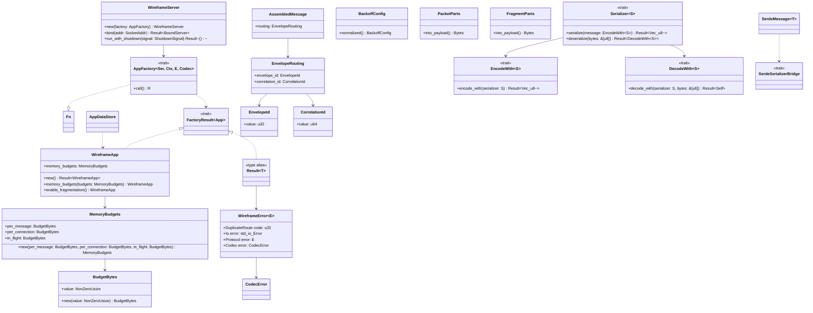
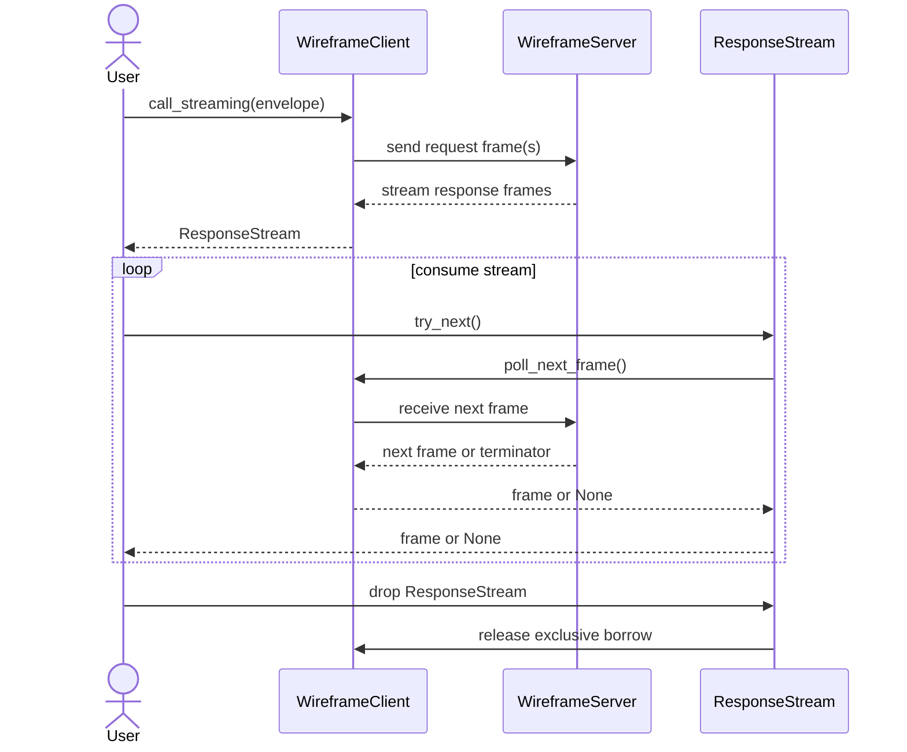
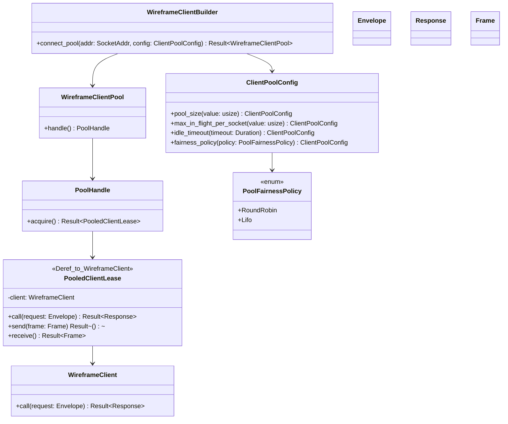
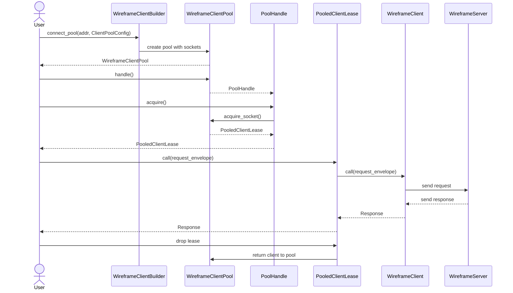

# v0.2.0 to v0.3.0 migration guide

This guide summarizes the breaking changes and new capabilities that must be
addressed when migrating from wireframe v0.2.0 to v0.3.0.

## Contents

### Breaking changes

- [Cargo feature changes](#cargo-feature-changes)
- [Unified error surface](#unified-error-surface)
- [Root re-exports removed](#root-re-exports-removed)
- [Payload accessor renames](#payload-accessor-renames)
- [BackoffConfig spelling update](#backoffconfig-spelling-update)
- [Serializer trait bounds](#serializer-trait-bounds)
- [WireframeApp construction](#wireframeapp-construction)
- [Server factory trait](#server-factory-trait)
- [AppDataStore module](#new-appdatastore-module)
- [Message assembler type additions](#message-assembler-type-additions)

### New capabilities

- [Memory budget configuration](#memory-budget-configuration)
- [Codec improvements](#codec-improvements)
- [Testkit module](#testkit-module)
- [wireframe\_testing additions](#wireframe_testing-additions)
- [Client: streaming, pooling, hooks, tracing](#client-new-capabilities)

Server and protocol type overview for v0.3.0: unified error surface,
WireframeApp configuration, server factory traits, message assembler types, and
serializer trait bounds.



*Class diagram: overview of server and protocol types changed in v0.3.0.
`WireframeError<E>` unifies the error surface with four variants; `Result<T>`
aliases it. `WireframeApp` gains `memory_budgets` and `enable_fragmentation`
builder methods, with `MemoryBudgets` grouping three `BudgetBytes` dimensions.
`WireframeServer` binds an `AppFactory` (blanket-implemented for closures
satisfying `FactoryResult`) and runs with a shutdown signal. `AssembledMessage`
carries `EnvelopeRouting` with typed `EnvelopeId` and `CorrelationId` wrappers.
`Serializer<S>` now requires `EncodeWith<S>` and `DecodeWith<S>` bounds;
`SerdeMessage<T>` bridges Serde types via `SerdeSerializerBridge`.*

## Cargo feature changes

Three features are new. One is removed.

- New feature: `pool` – connection pooling via `bb8`. Required for
  `WireframeClientPool` and its supporting types.
- New feature: `testkit` – downstream testing utilities. Replaces ad-hoc
  test scaffolding. See [Testkit module](#testkit-module).
- New feature: `serializer-serde` – Serde bridge for `SerdeMessage` and
  `IntoSerdeMessage`.
- Removed feature: `test-helpers`. Use `test-support` instead (announced in
  the [v0.1.0 → v0.2.0 migration guide](v0-1-0-to-v0-2-0-migration-guide.md);
  the deprecated alias is now gone).

```toml
# Before
[dependencies]
wireframe = { version = "0.2.0", features = ["test-helpers"] }

# After
[dependencies]
wireframe = { version = "0.3.0", features = ["test-support"] }

# For pooling
wireframe = { version = "0.3.0", features = ["pool"] }

# For testing utilities
wireframe = { version = "0.3.0", features = ["testkit"] }
```

## Unified error surface

`wireframe` now exposes one canonical error type: `wireframe::WireframeError<E>`,
defined in `wireframe::error`. The two previous error types are gone.

- `wireframe::app::error::WireframeError` is removed.
- `wireframe::response::WireframeError` is removed.
- `wireframe::Result<T>` now resolves to `wireframe::error::Result<T>` and is
  re-exported at the crate root.

```rust
// Before
use wireframe::app::error::WireframeError as AppError;
use wireframe::response::WireframeError as StreamError;

// After
use wireframe::WireframeError;
use wireframe::Result;
```

The unified `WireframeError<E>` carries four variants:

- `DuplicateRoute(u32)` – setup-time route conflict.
- `Io(std::io::Error)` – transport failure.
- `Protocol(E)` – protocol-defined logical error.
- `Codec(CodecError)` – codec-layer error with structured context.

## Root re-exports removed

The crate root now exposes only `wireframe::Result<T>` and
`wireframe::WireframeError<E>`. Every other type is still available through its
owning public module – those modules are all `pub mod` at the crate root and
their contents have not been removed from the public API. What changed is that
the convenience re-exports at the crate root are gone. Update import paths to
reference the module directly rather than the root shorthand.

The most common moves:

| Removed root path | New path |
| --- | --- |
| `wireframe::BincodeSerializer`, `wireframe::Serializer` | `wireframe::serializer::{BincodeSerializer, Serializer}` |
| `wireframe::ConnectionActor` | `wireframe::connection::ConnectionActor` |
| `wireframe::CorrelatableFrame` | `wireframe::correlation::CorrelatableFrame` |
| `wireframe::ConnectionContext`, `wireframe::ProtocolHooks`, `wireframe::WireframeProtocol` | `wireframe::hooks::{ConnectionContext, ProtocolHooks, WireframeProtocol}` |
| `wireframe::ClientCodecConfig`, `wireframe::ClientError`, `wireframe::WireframeClient` | `wireframe::client::{...}` |
| `wireframe::CodecError`, `wireframe::DefaultRecoveryPolicy`, `wireframe::RecoveryConfig` | `wireframe::codec::{...}` |
| `wireframe::FrameStream`, `wireframe::Response` | `wireframe::response::{FrameStream, Response}` |
| `wireframe::ConnectionId`, `wireframe::SessionRegistry` | `wireframe::session::{ConnectionId, SessionRegistry}` |
| `wireframe::RequestParts`, `wireframe::RequestBodyStream` | `wireframe::request::{RequestParts, RequestBodyStream}` |

The full list of moved types is in the
[v0.1.0 → v0.2.0 migration guide](v0-1-0-to-v0-2-0-migration-guide.md).
That list now takes effect.

`wireframe::prelude::*` provides an optional convenience import for
high-frequency types. It is intentionally small; prefer direct module imports
for specialized APIs.

```rust
// Convenience import
use wireframe::prelude::*;

// Explicit equivalent
use wireframe::{
    app::{Envelope, Handler, Middleware, WireframeApp},
    error::{Result, WireframeError},
    message::{DecodeWith, EncodeWith, Message},
    response::Response,
    serializer::{BincodeSerializer, Serializer},
};
```

## Payload accessor renames

The consuming payload methods were renamed to follow Rust idioms. The old names
are gone.

- `PacketParts::payload(self)` → `PacketParts::into_payload(self)`
- `FragmentParts::payload(self)` → `FragmentParts::into_payload(self)`

```rust
// Before
let packet_payload = packet_parts.payload();
let fragment_payload = fragment_parts.payload();

// After
let packet_payload = packet_parts.into_payload();
let fragment_payload = fragment_parts.into_payload();
```

## BackoffConfig spelling update

The configuration builder method was updated to the en-GB-oxendict `-ize`
suffix. The old spelling is gone.

- Old name: `BackoffConfig::normalised`
- New name: `BackoffConfig::normalized`

```rust
use std::time::Duration;

use wireframe::server::BackoffConfig;

let config = BackoffConfig {
    initial_delay: Duration::from_millis(50),
    max_delay: Duration::from_secs(5),
}
.normalized();
```

## Serializer trait bounds

`Serializer::serialize` and `Serializer::deserialize` now require message types
to implement `EncodeWith<S>` and `DecodeWith<S>` respectively.

Any type implementing `wireframe::message::Message` (i.e. deriving
`bincode::Encode` and `bincode::BorrowDecode`) receives these impls via blanket
implementations and requires no change.

Custom serializer implementations must implement `EncodeWith<S>` and
`DecodeWith<S>` for their message types rather than relying on
`bincode::Encode` bounds directly.

```rust
// Before – custom serializer impl relied on bincode bounds directly
impl<M: bincode::Encode> EncodeHelper<M> for MySerializer { ... }

// After – implement EncodeWith<S> for message types
impl EncodeWith<MySerializer> for MyMessage {
    fn encode_with(
        &self,
        serializer: &MySerializer,
    ) -> Result<Vec<u8>, Box<dyn Error + Send + Sync>> {
        serializer.serialize(self)
    }
}
```

A `SerdeSerializerBridge` trait (behind the `serializer-serde` feature) and
the `SerdeMessage<T>` wrapper provide a path for Serde-derived types without
implementing `bincode::Encode`.

## WireframeApp construction

`WireframeApp::new()` now returns `Result<Self>` for forward compatibility.
The call currently always succeeds, but the return type must be handled.

```rust
// Before
let app = WireframeApp::new();

// After
let app = WireframeApp::new()?;
// or
let app = WireframeApp::new().expect("app construction failed");
```

## Server factory trait

The server previously required factories to be bare `Fn() -> WireframeApp`
closures. The requirement is now expressed through two public traits:

- `AppFactory<Ser, Ctx, E, Codec>` – the factory trait. Blanket-implemented
  for any `Fn() -> R where R: FactoryResult`.
- `FactoryResult<App>` – marks valid return types. Implemented for both
  `WireframeApp` and `Result<WireframeApp, _>`.

Factories returning `WireframeApp` directly continue to work without change.
The new `Result<WireframeApp, _>` return path enables factories to surface
initialization errors without panicking.

```rust
use wireframe::server::WireframeServer;

// Infallible factory – closure returning WireframeApp; unchanged from v0.2.0
WireframeServer::new(|| build_app())
    .bind(addr)?
    .run_with_shutdown(shutdown_signal)
    .await?;

// Fallible factory (new capability) – closure may return Result; init errors
// propagate without panicking inside the factory
WireframeServer::new(|| build_app_or_fail())
    .bind(addr)?
    .run_with_shutdown(shutdown_signal)
    .await?;
```

## Memory budget configuration

Per-connection inbound buffering limits are now configurable on `WireframeApp`.
Two new types are exported from `wireframe::app`:

- `MemoryBudgets` – groups three byte-cap dimensions: per-message, per-
  connection, and aggregate in-flight.
- `BudgetBytes` – non-zero byte-count wrapper used by `MemoryBudgets`.

Two new builder methods on `WireframeApp`:

- `memory_budgets(MemoryBudgets)` – set explicit limits. When set, the runtime
  enforces a soft read-pacing threshold at 75% of the limit and aborts the
  connection on breach.
- `enable_fragmentation()` – enable fragmentation with codec-derived defaults,
  replacing the previous manual `fragmentation(Some(config))` call for common
  cases.

```rust
use std::num::NonZeroUsize;

use wireframe::app::{BudgetBytes, MemoryBudgets, WireframeApp};

let per_msg  = BudgetBytes::new(NonZeroUsize::new(64 * 1024).unwrap());
let per_conn = BudgetBytes::new(NonZeroUsize::new(512 * 1024).unwrap());
let in_flight = BudgetBytes::new(NonZeroUsize::new(256 * 1024).unwrap());

let app = WireframeApp::new()?
    .memory_budgets(MemoryBudgets::new(per_msg, per_conn, in_flight))
    .enable_fragmentation();
```

When `memory_budgets` is not set, the runtime applies derived defaults scaled
from the frame codec's `max_frame_length`. Soft-pressure read pacing and hard-
cap enforcement are both active by default.

## New: AppDataStore module

`wireframe::app_data_store::AppDataStore` is now a standalone module rather
than an embedded type. Import paths must be updated.

```rust
// Before – AppDataStore was embedded in the app module
use wireframe::app::AppDataStore;

// After
use wireframe::app_data_store::AppDataStore;
```

## Message assembler type additions

Two newtypes are now exported from `wireframe::message_assembler`:

- `EnvelopeId(u32)` – typed wrapper for envelope identifiers.
- `CorrelationId(u64)` – typed wrapper for correlation identifiers.

`AssembledMessage` now carries routing metadata via an `EnvelopeRouting` field.
Code constructing `AssembledMessage` directly must be updated to supply this
field.

## Codec improvements

`FrameCodec` gains one new method with a default implementation:

```rust
fn frame_payload_bytes(frame: &Self::Frame) -> Bytes {
    Bytes::copy_from_slice(Self::frame_payload(frame))
}
```

The default copies the slice returned by `frame_payload` into a new `Bytes`
buffer. Codecs whose frame type stores the payload as `Bytes` internally can
override the method to avoid that allocation.

`LengthDelimitedFrameCodec` overrides `frame_payload_bytes` to return
`frame.clone()` – a reference-count increment rather than a copy.

No existing codec implementation is required to change. The method is purely
additive.

```rust
// Override in a custom codec when Frame wraps Bytes directly.
impl FrameCodec for MyCodec {
    type Frame = Bytes;

    fn frame_payload(frame: &Bytes) -> &[u8] { frame }

    fn frame_payload_bytes(frame: &Bytes) -> Bytes { frame.clone() }

    fn wrap_payload(&self, payload: Bytes) -> Bytes { payload }

    fn max_frame_length(&self) -> usize { self.limit }
}
```

## Testkit module

Testing infrastructure overview: the wireframe::testkit module (drive helpers,
slow-IO simulation, assembly assertions) and the wireframe_testing companion
crate (WireframePair, ObservabilityHandle, HotlineFixtures).

```mermaid
classDiagram
    class TestkitModule {
        <<module wireframe::testkit>>
    }

    class WireframeApp {
    }

    class TestSerializer {
    }

    class TestResult~T~ {
        <<type alias>>
    }

    class TestError {
    }

    class SlowIoConfig {
        +payload_chunk_size: usize
        +frame_delay: Duration
    }

    class SlowIoPacing {
        +interval: Duration
    }

    class MessageAssemblySnapshot {
    }

    class FragmentReassemblySnapshot {
    }

    class TestkitHelpers {
        +drive_with_partial_frames(app: WireframeApp, frames: Vec~Bytes~)
        +drive_with_fragments(app: WireframeApp, fragments: Vec~Bytes~)
        +drive_with_fragment_frames(app: WireframeApp, frames: Vec~Bytes~)
        +drive_with_slow_frames(app: WireframeApp, config: SlowIoConfig)
        +drive_with_slow_payloads(app: WireframeApp, config: SlowIoConfig)
        +assert_message_assembly_completed(snapshot: MessageAssemblySnapshot)
        +assert_fragment_reassembly_error(snapshot: FragmentReassemblySnapshot)
    }

    class WireframePair {
        +client_mut() WireframeClient_ref_mut
        +local_addr() SocketAddr
        +shutdown() TestResult~()~
    }

    class WireframeClient {
    }

    class ObservabilityHandle {
        +new() ObservabilityHandle
        +clear() void
        +recorder() MetricsRecorder
        +snapshot() void
        +codec_error_counter(kind: &str, action: &str) u64
    }

    class Labels {
        +with_label(key: &str, value: &str) Labels
    }

    class MetricsRecorder {
    }

    class HotlineFrameCodec {
    }

    class HotlineFixtures {
        +valid_hotline_wire(payload: Bytes, transaction_id: u32) Bytes
        +valid_hotline_frame(payload: Bytes, transaction_id: u32) HotlineFrame
        +oversized_hotline_wire(max_frame_length: usize) Bytes
        +mismatched_total_size_wire(payload: Bytes) Bytes
        +truncated_hotline_header() Bytes
        +truncated_hotline_payload(payload_len: usize) Bytes
        +correlated_hotline_wire(transaction_id: u32, payloads: Vec~Bytes~) Bytes
        +sequential_hotline_wire(base_transaction_id: u32, payloads: Vec~Bytes~) Bytes
        +new_test_codec() HotlineFrameCodec
    }

    class HotlineFrame {
    }

    class Bytes {
    }

    class WireframeTestingCrate {
        <<crate wireframe_testing>>
    }

    TestkitModule --> WireframeApp
    TestkitModule --> TestSerializer
    TestkitModule --> TestResult
    TestkitModule --> TestError
    TestkitModule --> SlowIoConfig
    TestkitModule --> SlowIoPacing
    TestkitModule --> MessageAssemblySnapshot
    TestkitModule --> FragmentReassemblySnapshot
    TestkitModule --> TestkitHelpers

    WireframeTestingCrate --> WireframePair
    WireframeTestingCrate --> ObservabilityHandle
    WireframeTestingCrate --> Labels
    WireframeTestingCrate --> HotlineFixtures

    WireframePair --> WireframeClient

    ObservabilityHandle --> MetricsRecorder
    ObservabilityHandle --> Labels

    HotlineFixtures --> HotlineFrame
    HotlineFixtures --> HotlineFrameCodec
    HotlineFixtures --> Bytes
```



*Class diagram: two complementary testing layers. The `wireframe::testkit`
module (behind the `testkit` feature) provides in-process drive helpers for
partial frames, fragments, and slow I/O, plus `TestSerializer`, `TestResult`,
`TestError`, and assembly snapshot assertion helpers. The `wireframe_testing`
companion crate provides `WireframePair` (real loopback server–client pair),
`ObservabilityHandle` (log + metrics capture with atomic snapshot semantics),
`Labels`, and `HotlineFixtures` (codec regression fixtures and `new_test_codec`).*

`wireframe::testkit` (behind the `testkit` Cargo feature) provides optional
test utilities for downstream protocol crates. The module is not available in
normal builds.

Capabilities include:

- Frame and fragment drive helpers (`drive_with_partial_frames`,
  `drive_with_fragments`, `drive_with_fragment_frames`, and variants) for
  feeding partial or fragmented data into an in-process app.
- Slow I/O simulation (`drive_with_slow_frames`, `drive_with_slow_payloads`,
  `SlowIoConfig`, `SlowIoPacing`) for back-pressure testing without needing
  real network delay.
- Assembly assertion helpers (`assert_message_assembly_completed`,
  `assert_fragment_reassembly_error`, and the full `MessageAssemblySnapshot` /
  `FragmentReassemblySnapshot` families) for verifying assembly and
  reassembly outcomes without panicking.
- `TestSerializer` – a minimal serializer for use in tests.
- `TestResult` and `TestError` – ergonomic result types for test functions.

```toml
[dev-dependencies]
wireframe = { version = "0.3.0", features = ["testkit"] }
```

## wireframe_testing additions

The `wireframe_testing` companion crate gained three new areas of test
infrastructure. These are relevant to protocol crates that already depend on
`wireframe_testing` in `dev-dependencies`.

### In-process server–client pair harness

`wireframe_testing::client_pair` provides `WireframePair`, a test harness that
starts a real `WireframeServer` bound to a loopback TCP listener and connects a
`WireframeClient` inside the same test process. Both sides communicate over a
real loopback socket, keeping compatibility assertions honest while remaining
fast and deterministic.

```rust
use wireframe::app::WireframeApp;
use wireframe_testing::{TestResult, client_pair::spawn_wireframe_pair};

async fn example() -> TestResult<()> {
    let mut pair = spawn_wireframe_pair(
        || WireframeApp::default(),
        |builder| builder.max_frame_length(2048),
    )
    .await?;

    let addr = pair.local_addr();
    assert!(addr.port() > 0);

    pair.shutdown().await?;
    Ok(())
}
```

`WireframePair::client_mut()` exposes the connected `WireframeClient` for
request/response assertions. The pair's `Drop` implementation sends a shutdown
signal and waits up to 100 milliseconds for the server task before aborting it.

`spawn_wireframe_pair_default` is a convenience variant that uses
`WireframeClientBuilder::new()` without any builder customization.

### Observability harness

`wireframe_testing::observability` provides `ObservabilityHandle`, a unified
guard that combines log capture with metrics recording.

```rust
use wireframe_testing::ObservabilityHandle;

let mut obs = ObservabilityHandle::new();
obs.clear();

metrics::with_local_recorder(obs.recorder(), || {
    wireframe::metrics::inc_codec_error("framing", "drop");
});

obs.snapshot();
assert_eq!(
    obs.codec_error_counter("framing", "drop"),
    1
);
```

`obs_handle()` is an `rstest` fixture that constructs a handle directly.
`Labels` provides a builder for label pairs used with `ObservabilityHandle::
counter`.

The handle's `snapshot()` method drains counters atomically. Query after
`snapshot()`; earlier values are not retained.

Metric-emitting code must run on the same thread as the handle. Async tests
should use `#[tokio::test(flavor = "current_thread")]`.

### Codec-aware test helpers

A family of codec-aware helpers handles the encode → transport → decode
pipeline so test authors pass raw payloads and receive decoded frames without
manual framing.

- `drive_with_codec_frames(app, codec, payloads)` – encode payloads with
  `codec`, drive the server, and return decoded response frames.
- `drive_with_codec_payloads(app, codec, payloads)` – as above but returns
  decoded payload byte vectors.
- `decode_frames_with_codec(codec, bytes)` – decode a raw byte sequence
  into typed frames using the codec's decoder.
- `encode_payloads_with_codec(codec, payloads)` – encode payload vectors
  into wire bytes.
- `extract_payloads(codec, frames)` – extract payload bytes from a slice
  of decoded frames.

Hotline protocol fixtures are available for codec regression tests:

- `valid_hotline_wire(payload, transaction_id)` – well-formed wire bytes.
- `valid_hotline_frame(payload, transaction_id)` – a typed `HotlineFrame`
  without the wire-encode/decode cycle.
- `oversized_hotline_wire(max_frame_length)` – triggers the
  `"payload too large"` decoder error.
- `mismatched_total_size_wire(payload)` – triggers `"invalid total size"`.
- `truncated_hotline_header()` – fewer than 20 bytes; produces a
  `"bytes remaining"` error at EOF.
- `truncated_hotline_payload(payload_len)` – header claims more payload
  than present; produces a `"bytes remaining"` error at EOF.
- `correlated_hotline_wire(transaction_id, payloads)` – multiple frames
  sharing one transaction identifier.
- `sequential_hotline_wire(base_transaction_id, payloads)` – frames with
  incrementing transaction identifiers.

`new_test_codec()` returns a `HotlineFrameCodec` at the standard
`TEST_MAX_FRAME` limit for use in parametrized tests.

## Client: new capabilities

The wireframe client now covers three domains that had no prior API surface:
streaming, connection pooling, and structured observability.

Client API type overview: WireframeClientBuilder construction paths,
WireframeClient streaming methods, ResponseStream and TypedResponseStream
iteration, outbound streaming types, and TracingConfig with hook closures.

```mermaid
classDiagram
    class WireframeClient {
        +call(request: Envelope) Result~Response~
        +call_streaming(request: Envelope) Result~ResponseStream~
        +receive_streaming(correlation_id: CorrelationId) Result~ResponseStream~
        +send_streaming(header: FrameHeader, reader: AsyncRead, config: SendStreamingConfig) Result~SendStreamingOutcome~
    }

    class ResponseStream {
        <<futures::Stream>>
        -client: &mut WireframeClient
        +try_next() Result~Option~Frame~~
    }

    class StreamingResponseExt {
        <<trait>>
        +typed_with(mapper: Mapper) TypedResponseStream
    }

    class TypedResponseStream~S, Mapper, P, Item~ {
        <<futures::Stream>>
        -inner: S
        -mapper: Mapper
        +try_next() Result~Option~Item~~
    }

    class SendStreamingConfig {
        +chunk_size: Option~usize~
        +timeout: Option~Duration~
        +with_chunk_size(size: usize) SendStreamingConfig
        +with_timeout(timeout: Duration) SendStreamingConfig
    }

    class SendStreamingOutcome {
        +frames_sent() usize
        +bytes_sent() usize
    }

    class WireframeClientBuilder {
        +before_send(f: FnMutableVecU8) WireframeClientBuilder
        +after_receive(f: FnMutableBytesMut) WireframeClientBuilder
        +tracing_config(config: TracingConfig) WireframeClientBuilder
        +connect(addr: SocketAddr) Result~WireframeClient~
        +connect_pool(addr: SocketAddr, config: ClientPoolConfig) Result~WireframeClientPool~
    }

    class TracingConfig {
        +with_all_levels(level: Level) TracingConfig
        +with_all_timing(enabled: bool) TracingConfig
        +with_call_level(level: Level) TracingConfig
        +with_send_timing(enabled: bool) TracingConfig
        +with_streaming_level(level: Level) TracingConfig
    }

    class FnMutableVecU8 {
        <<closure>>
        +call(bytes: Vec_u8_ref_mut)
    }

    class FnMutableBytesMut {
        <<closure>>
        +call(bytes: BytesMut_ref_mut)
    }

    class Envelope {
    }

    class FrameHeader {
    }

    class Frame {
    }

    class AsyncRead {
        <<trait>>
    }

    class Response {
    }

    class ClientPoolConfig {
    }

    class WireframeClientPool {
    }

    WireframeClient --> ResponseStream
    WireframeClient --> SendStreamingConfig
    WireframeClient --> SendStreamingOutcome

    ResponseStream --> WireframeClient

    StreamingResponseExt <|.. ResponseStream
    StreamingResponseExt --> TypedResponseStream
    TypedResponseStream --> ResponseStream

    WireframeClientBuilder --> WireframeClient
    WireframeClientBuilder --> WireframeClientPool
    WireframeClientBuilder --> ClientPoolConfig
    WireframeClientBuilder --> TracingConfig
    WireframeClientBuilder --> FnMutableVecU8
    WireframeClientBuilder --> FnMutableBytesMut

    SendStreamingConfig --> SendStreamingOutcome
```



*Class diagram: `WireframeClientBuilder` is the entry point for all client
construction – it connects to a `WireframeClient` or a `WireframeClientPool`,
and accepts `TracingConfig`, `before_send`, and `after_receive` hooks. A
`WireframeClient` produces a `ResponseStream` for inbound streaming (which
implements `StreamingResponseExt`, enabling conversion to a
`TypedResponseStream`) and drives `send_streaming` via `SendStreamingConfig`,
yielding a `SendStreamingOutcome`.*

### Streaming responses

> **Scope note.** This section covers the **client-side consumption** API:
> how a `WireframeClient` receives and iterates over multi-frame server
> responses. Server-side multi-packet response production – where handlers
> return a `(mpsc::Sender, Response)` tuple and use helpers such as
> `Response::with_channel` – is a distinct concern governed by
> [ADR 0001](adr-001-multi-packet-streaming-response-api.md).

`WireframeClient` gains two new call methods for multi-frame responses:

- `call_streaming(envelope)` – assigns a correlation identifier, sends the
  request, and returns a `ResponseStream` that yields typed frames until the
  server sends a stream terminator.
- `receive_streaming(correlation_id)` – the lower-level variant for callers
  that have already sent the request via `send` or `send_envelope` and hold
  the correlation identifier. Returns a `ResponseStream` that validates every
  inbound frame against that identifier.

`ResponseStream` implements `futures::Stream` with `Item = Result<P,
ClientError>`. It holds an exclusive borrow of the client for the duration of
the stream, preventing concurrent sends. The terminator frame is consumed
internally and the stream returns `None` once it arrives.

```rust
use std::net::SocketAddr;

use futures::StreamExt;
use wireframe::{
    app::Envelope,
    client::{ClientError, WireframeClient},
};

let addr: SocketAddr = "127.0.0.1:9000".parse().unwrap();
let mut client = WireframeClient::builder().connect(addr).await?;

let request = Envelope::new(1, None, vec![]);
let mut stream = client.call_streaming::<Envelope>(request).await?;

while let Some(result) = stream.next().await {
    let frame = result?;
    process_frame(frame);
}
```

Sequence diagram showing the call_streaming lifecycle: sending the request,
iterating frames via try_next until the server sends a terminator, then
releasing the exclusive client borrow when the stream is dropped.



*Sequence diagram: `call_streaming` sends the request and returns a
`ResponseStream` that holds an exclusive borrow of the client. Each `try_next()`
call polls the client for the next server frame; the loop continues until the
server sends a terminator, at which point the stream returns `None`. Dropping
the `ResponseStream` releases the borrow, making the client available for
further calls.*

`StreamingResponseExt` is a trait on any `Stream` of response frames. It
provides `typed_with(mapper)`, which produces a `TypedResponseStream<S, Mapper,
P, Item>` that translates raw frames into domain values and skips control
frames where the mapper returns `Ok(None)`.

```rust
use wireframe::client::StreamingResponseExt;

let typed_stream = raw_stream.typed_with(|frame| {
    if is_data_frame(&frame) {
        Ok(Some(decode_payload(frame)?))
    } else {
        Ok(None) // skip control frames
    }
});
```

### Outbound streaming sends

`WireframeClient::send_streaming` sends a large body as a sequence of
protocol-framed chunks, reading from any `AsyncRead` source.

`SendStreamingConfig` controls chunk sizing and timeout. When chunk size is
not set, it is derived from `max_frame_length - frame_header.len()`.

```rust
use std::time::Duration;

use wireframe::client::SendStreamingConfig;

let config = SendStreamingConfig::default()
    .with_chunk_size(4096)
    .with_timeout(Duration::from_secs(30));

let outcome = client
    .send_streaming(&frame_header, body_reader, config)
    .await?;

println!("sent {} frames", outcome.frames_sent());
```

### Connection pooling

`WireframeClientPool` (behind the `pool` feature) provides warm, reusable
sockets with per-socket in-flight admission control.

Build a pool from `WireframeClientBuilder::connect_pool`. The pool manages
socket lifecycle, idle eviction, and fair waiter scheduling.

```rust
use wireframe::client::{
    ClientPoolConfig, PoolFairnessPolicy, WireframeClientBuilder,
};

let pool = WireframeClientBuilder::new()
    .with_preamble(preamble)
    .connect_pool(
        addr,
        ClientPoolConfig::default()
            .pool_size(4)
            .max_in_flight_per_socket(8)
            .idle_timeout(Duration::from_secs(30))
            .fairness_policy(PoolFairnessPolicy::RoundRobin),
    )
    .await?;

// Acquire a lease and make a request.
let handle = pool.handle();
let lease = handle.acquire().await?;
let response: MyResponse = lease.call(request_envelope).await?;
```

Connection pool type hierarchy: WireframeClientBuilder creates a
WireframeClientPool via ClientPoolConfig, vending PoolHandle instances that
yield PooledClientLease objects delegating to WireframeClient.



*Class diagram: `WireframeClientBuilder` creates a `WireframeClientPool` using a
`ClientPoolConfig` (which selects a `PoolFairnessPolicy`). The pool vends
`PoolHandle` instances; each handle yields a `PooledClientLease` on `acquire()`.
`PooledClientLease` derefs to `WireframeClient`, exposing `call`, `send`, and
`receive` for individual requests.*

Sequence diagram showing the connection pool usage flow: building the pool,
acquiring a PoolHandle, checking out a PooledClientLease, making a request, and
returning the socket to the pool on drop.



*Sequence diagram: `connect_pool` builds the pool and returns it to the caller.
`handle()` produces a cheaply-cloneable `PoolHandle`; `acquire()` checks out a
`PooledClientLease` from the pool, blocking if all sockets are at their
in-flight limit. The lease delegates the call through to the underlying
`WireframeClient`, which exchanges frames with the server. Dropping the lease
returns the socket to the pool for reuse.*

`PoolHandle` is cheaply cloneable. `PooledClientLease` implements `Deref` to
`WireframeClient` for one-off calls via `call`, `send`, and `receive`.

### Request hooks

Two per-frame hook types are now available on `WireframeClientBuilder`. Hooks
fire on every request or response frame, independent of connection lifecycle.

- `before_send(f: impl Fn(&mut Vec<u8>))` – called after serialization, before
  each frame is written to the socket. Use for authentication token prepending,
  request metrics, or frame inspection.
- `after_receive(f: impl Fn(&mut BytesMut))` – called after each frame is read,
  before deserialization. Use for logging, response metrics, or decryption.

Multiple hooks may be registered; they execute in registration order.

```rust
use wireframe::client::WireframeClientBuilder;

let client = WireframeClientBuilder::new()
    .before_send(|bytes: &mut Vec<u8>| {
        bytes.splice(0..0, auth_token());
    })
    .after_receive(|bytes: &mut bytes::BytesMut| {
        record_frame_size(bytes.len());
    })
    .connect(addr)
    .await?;
```

### Structured tracing

`TracingConfig` controls which client operations emit tracing spans, at what
level, and whether per-operation elapsed-time events are recorded.

The default configuration emits `INFO` spans for lifecycle operations (`connect`,
`close`) and `DEBUG` spans for data operations (`send`, `receive`, `call`,
`call_streaming`). Timing is disabled by default.

```rust
use tracing::Level;
use wireframe::client::{TracingConfig, WireframeClientBuilder};

let client = WireframeClientBuilder::new()
    .tracing_config(
        TracingConfig::default()
            .with_all_levels(Level::DEBUG)
            .with_all_timing(true),
    )
    .connect(addr)
    .await?;
```

Individual operations can be configured separately using methods such as
`with_call_level`, `with_send_timing`, and `with_streaming_level`.
