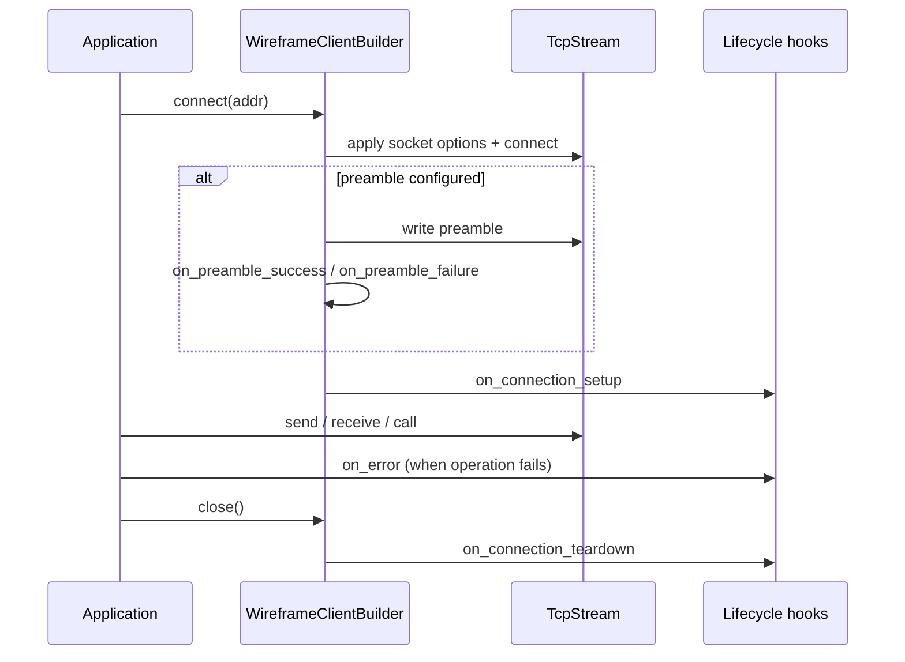

# Client support in Wireframe

This document proposes an initial design for adding client-side protocol
support to `wireframe`. The goal is to reuse the existing framing,
serialization, and message abstractions while providing a small API for
connecting to a server and exchanging messages.

## Motivation

The library currently focuses on server development. However, the core layers
are intentionally generic: transport adaptors, framing, serialization, routing,
and middleware form a pipeline that is largely independent of server-specific
logic. The design document outlines these layers, which process frames from raw
bytes to typed messages and back[^1]. Reusing these pieces enables the
implementation of a lightweight client without duplicating protocol code.

## Core components

### `WireframeClient`

A new `WireframeClient` type manages a single connection to a server. It
mirrors `WireframeServer` but operates in the opposite direction:

- Connect to a `TcpStream`, applying `SocketOptions` before the handshake.
- Optionally, send a preamble using the existing `Preamble` helpers.
- Encode outgoing messages using the selected `Serializer` and
  `tokio_util::codec::LengthDelimitedCodec` (4‑byte big‑endian prefix by
  default; configurable). Configure the codec’s `max_frame_length` on both the
  inbound (decode) and outbound (encode) paths to match the server’s frame
  capacity; otherwise, frames larger than the configured limit will fail.
- Decode incoming frames into typed responses.
- Expose async `send` and `receive` operations.

### Builder pattern

A `WireframeClient::builder()` method configures the client:

```rust
use std::net::SocketAddr;

use wireframe::{
    client::WireframeClient,
    serializer::BincodeSerializer,
};

let addr: SocketAddr = "127.0.0.1:7878".parse()?;
let client = WireframeClient::builder()
    .serializer(BincodeSerializer)
    .max_frame_length(1024)
    .connect(addr)
    .await?;
```

The same `Serializer` trait used by the server is reused here, ensuring
messages are encoded consistently while framing is handled by the
length‑delimited codec.

### Client configuration reference

| Surface          | API                                          | Default                                                     | Use when                                                                   |
| ---------------- | -------------------------------------------- | ----------------------------------------------------------- | -------------------------------------------------------------------------- |
| Serializer       | `WireframeClient::builder().serializer(...)` | `BincodeSerializer`                                         | Client and server must share a non-default encoding contract.              |
| Codec framing    | `codec_config(ClientCodecConfig)`            | 4-byte big-endian length prefix, 1024-byte max frame length | Align with server `buffer_capacity` and protocol frame size limits.        |
| Socket tuning    | `socket_options(SocketOptions)`              | OS defaults                                                 | Enable `TCP_NODELAY`, keepalive, or buffer sizing policies.                |
| Preamble payload | `with_preamble(T)`                           | Disabled                                                    | Protocol requires version or capability negotiation before framed traffic. |
| Preamble timeout | `preamble_timeout(Duration)`                 | No timeout unless configured                                | Fail fast when servers stall during preamble exchange.                     |
| Setup hook       | `on_connection_setup(...)`                   | Disabled                                                    | Store per-connection state for metrics, auth context, or counters.         |
| Teardown hook    | `on_connection_teardown(...)`                | Disabled                                                    | Flush metrics and release per-connection resources on `close()`.           |
| Error hook       | `on_error(...)`                              | Disabled                                                    | Centralize client transport/decode/correlation error reporting.            |
| Tracing config   | `tracing_config(TracingConfig)`              | INFO connect/close, DEBUG data ops, timing off              | Customise tracing span levels and per-command timing.                      |

### Request/response helpers

To keep the API simple, `WireframeClient` offers a `call` method that sends a
message implementing `Message` and waits for the next response frame:

```rust
let request = Login { username: "guest".into() };
let response: LoginAck = client.call(&request).await?;
```

Internally, this uses the `Serializer` to encode the request, sends it through
the length‑delimited codec, then waits for a frame, decodes it, and
deserializes the response type.

#### Request/response error mapping

Client request/response failures are mapped to `WireframeError` variants, so
client and server semantics stay aligned:

- Transport failures (socket closure, read/write failures) surface as
  `ClientError::Wireframe(WireframeError::Io(_))`.
- Decode failures after a frame is received surface as
  `ClientError::Wireframe(WireframeError::Protocol(ClientProtocolError::Deserialize(_)))`.

This mapping applies to `receive`, `call`, and envelope-aware receive/call
methods. Serialization failures remain explicit as `ClientError::Serialize(_)`
because they occur before the transport layer is used.

### Streaming parity validation

Client streaming parity is validated against the server's priority queue and
rate-limiter behaviour by driving `ConnectionActor` output through the client
streaming consumer. This avoids duplicating queue logic in client-only test
harnesses and ensures both sides are exercised under the same behavioural
contracts.

The parity checks cover two guarantees:

- Interleaved high- and low-priority pushes maintain fairness under configured
  `FairnessConfig` thresholds.
- Rate limiting remains cross-priority and symmetric, so one priority cannot
  bypass limits imposed on another.

This validation was added for roadmap item `10.3.2` and does not introduce new
public client API methods.

### Implementation decisions

- `connect` accepts a `SocketAddr` so the client can create a `TcpSocket` and
  apply socket options before connecting.
- `ClientCodecConfig` captures the length prefix format and maximum frame
  length, clamping the frame length to match server bounds (64 bytes to 16 MiB).
- The default `max_frame_length` is 1024 bytes to mirror the server builder’s
  default buffer capacity.

### Connection lifecycle

The client builder exposes lifecycle hooks that mirror the server's hook
system, enabling consistent instrumentation across client and server:

- **Setup hook** (`on_connection_setup`): Runs after TCP connection and
  preamble exchange (if configured) succeed. Returns connection-specific state
  of type `C` stored in the client for the connection's lifetime. The setup
  callback must be an `FnOnce` closure returning a `Future` that produces `C`.

- **Teardown hook** (`on_connection_teardown`): Runs when `close()` is called.
  Receives the state `C` produced by the setup hook. The teardown hook only
  executes if a setup hook was configured and successfully produced state.

- **Error hook** (`on_error`): Runs when errors occur during `send`, `receive`,
  or `call` operations. Receives a reference to the `ClientError` for logging
  or metrics. This hook is independent of the setup/teardown pair.

```rust
use std::sync::atomic::{AtomicUsize, Ordering};

struct SessionState {
    request_count: AtomicUsize,
}

let client = WireframeClient::builder()
    .on_connection_setup(|| async {
        SessionState { request_count: AtomicUsize::new(0) }
    })
    .on_connection_teardown(|state: SessionState| async move {
        println!("Session ended after {} requests",
            state.request_count.load(Ordering::SeqCst));
    })
    .on_error(|err| async move {
        eprintln!("Client error: {err}");
    })
    .connect(addr)
    .await?;

// Use the client...
client.close().await; // Teardown hook invoked here
```

The builder uses a type-changing pattern for `on_connection_setup`: calling it
changes the `C` type parameter from the default `()` to the user's state type.
This ensures type safety—teardown callbacks must accept the exact state type
produced by setup.

For screen readers: the following sequence diagram shows the client connection
lifecycle from connect through teardown.



### Request hooks

The client supports **request hooks** that fire on every outgoing and incoming
frame, providing symmetric instrumentation with the server's `before_send` hook
in `src/hooks.rs`.

- **`before_send`**: `Arc<dyn Fn(&mut Vec<u8>) + Send + Sync>`. Invoked after
  serialization, before each frame is written to the transport. Registered via
  `WireframeClientBuilder::before_send()`. Multiple hooks execute in
  registration order.

- **`after_receive`**: `Arc<dyn Fn(&mut BytesMut) + Send + Sync>`. Invoked
  after each frame is read from the transport, before deserialization.
  Registered via `WireframeClientBuilder::after_receive()`. Multiple hooks
  execute in registration order.

Hooks are stored in a `RequestHooks` struct (analogous to `LifecycleHooks`)
with two fields: `before_send: Vec<BeforeSendHook>` and
`after_receive: Vec<AfterReceiveHook>`.

**Design rationale — synchronous hooks**: The `ResponseStream::poll_next`
implementation is synchronous (`fn poll_next`). Async hooks would require
spawning tasks or blocking within a poll context, which is unsound. The
server's equivalent `before_send` hook in `src/hooks.rs` is also synchronous
(`FnMut`). Frame-level hooks operate on raw bytes in memory and do not require
I/O. Users needing async operations (e.g., fetching a token from a remote
service) should perform them in the lifecycle `on_connection_setup` hook and
store the result in connection state, which the synchronous request hook can
then read via captured `Arc` state.

**Design rationale — `Arc<dyn Fn>` not `Box<dyn FnMut>`**: Hooks are stored
behind shared references. The existing lifecycle hooks use
`Arc<dyn Fn(...) + Send + Sync>`. `Fn` (not `FnMut`) is required because hooks
are invoked through `&self` methods. Users who need mutable state capture an
`Arc<AtomicUsize>` or `Arc<Mutex<_>>` in the closure.

**Design rationale — raw bytes, not typed messages**: Hooks operate on raw
bytes (`&mut Vec<u8>` outgoing, `&mut BytesMut` incoming), not typed messages.
This matches the server's `before_send` hook which operates on the frame type.
Operating on typed messages would require hooks to be generic over every
message type, making storage impossible without type erasure. Raw-byte hooks
can universally inspect or modify the serialized payload.

**Integration points**: `before_send` is wired into `send()` (runtime.rs),
`send_envelope()` (messaging.rs), and `call_streaming()` (streaming.rs).
`after_receive` is wired into `receive_internal()` (messaging.rs) and
`ResponseStream::poll_next()` (response_stream.rs).

### Tracing instrumentation

Every client operation is wrapped in a `tracing` span with structured fields.
Span levels are configurable per-operation via `TracingConfig`, with sensible
defaults: `INFO` for lifecycle operations (connect, close) and `DEBUG` for
high-frequency data operations (send, receive, call, streaming). When no
`tracing` subscriber is installed, all instrumentation is zero-cost.

**Span hierarchy and field conventions:**

| Operation           | Span name                | Structured fields                          |
| ------------------- | ------------------------ | ------------------------------------------ |
| `connect()`         | `client.connect`         | `peer.addr`                                |
| `send()`            | `client.send`            | `frame.bytes`                              |
| `receive()`         | `client.receive`         | `frame.bytes` (deferred), `result`         |
| `send_envelope()`   | `client.send_envelope`   | `correlation_id`, `frame.bytes`            |
| `call()`            | `client.call`            | `result` (deferred)                        |
| `call_correlated()` | `client.call_correlated` | `correlation_id` (deferred), `result`      |
| `call_streaming()`  | `client.call_streaming`  | `correlation_id`, `frame.bytes` (deferred) |
| `close()`           | `client.close`           | (none)                                     |

**Per-frame streaming events**: `ResponseStream` emits `tracing::debug!` events
(not spans) on each received data frame and on stream termination:

- `stream frame received` with `frame.bytes`, `stream.frames_received`, and
  `correlation_id`.
- `stream terminated` with `stream.frames_total` and `correlation_id`.

**Per-command timing**: When enabled via `TracingConfig::with_*_timing(true)`,
an additional `tracing::debug!` event recording `elapsed_us` is emitted when
the operation completes. Timing events fire on both success and error paths.
Timing is disabled by default for all operations.

**Design rationale — `Span::enter()` in async methods**: Client methods take
`&mut self` (exclusive single-task access). Guards are created and dropped
within the same method body, covering `.await` points sequentially. This
pattern is explicitly documented as safe by the `tracing` crate when no
spawning or concurrent access occurs within the span's lifetime.

**Design rationale — `dynamic_span!` macro**: The `tracing` crate requires
compile-time level constants in `span!` macros. To support user-configurable
levels per operation, a `macro_rules!` macro in `tracing_helpers.rs` matches on
the five `Level` variants, delegating to the corresponding
`tracing::<level>_span!` macro per branch. Each branch has static metadata
while branch selection is dynamic.

**Design rationale — `ResponseStream` events, not spans**: Creating spans
inside `poll_next` is problematic because it is synchronous and called many
times. Events are lightweight and appropriate for per-frame diagnostics.

### Preamble support

The client builder now supports an optional preamble exchange. Use
`with_preamble` to send a typed preamble after TCP connect completes:

```rust
use std::time::Duration;
use futures::FutureExt;

#[derive(bincode::Encode)]
struct ClientHello { version: u16 }

let client = WireframeClient::builder()
    .with_preamble(ClientHello { version: 1 })
    .preamble_timeout(Duration::from_secs(5))
    .on_preamble_success(|_preamble, stream| {
        async move {
            // Read server response, return leftover bytes
            Ok(Vec::new())
        }
        .boxed()
    })
    .on_preamble_failure(|err, _stream| {
        async move {
            eprintln!("Preamble failed: {err}");
            Ok(())
        }
        .boxed()
    })
    .connect(addr)
    .await?;
```

The success callback runs after the preamble is written successfully and can
read the server's response (using `read_preamble` from the preamble module).
Any bytes read beyond the server's response must be returned as "leftover"
bytes for the framing layer to replay. The failure callback runs when the
preamble exchange fails due to timeout, I/O error, or encoding error.

## Runnable echo-login example

```rust
#[tokio::main]
async fn main() -> Result<(), Box<dyn std::error::Error>> {
    use wireframe::{
        app::Envelope,
        client::WireframeClient,
        message::Message,
    };

    #[derive(bincode::Encode, bincode::BorrowDecode)]
    struct LoginRequest {
        username: String,
    }

    #[derive(bincode::Encode, bincode::BorrowDecode)]
    struct LoginAck {
        username: String,
    }

    let mut client = WireframeClient::builder()
        .connect("127.0.0.1:7878".parse()?)
        .await?;

    let request = LoginRequest {
        username: "guest".to_string(),
    };
    let envelope = Envelope::new(1, None, request.to_bytes()?);
    let response: Envelope = client.call_correlated(envelope).await?;
    let (ack, _) = LoginAck::from_bytes(response.payload_bytes())?;
    assert_eq!(ack.username, "guest");
    Ok(())
}
```

Run it with the existing echo server example:

```plaintext
# terminal 1
cargo run --example echo --features examples

# terminal 2
cargo run --example client_echo_login --features examples
```

### Troubleshooting

- Frame length mismatches: if the server rejects frames or the client reports
  transport I/O errors on larger payloads, ensure
  `ClientCodecConfig::max_frame_length` matches server `buffer_capacity`.
- Preamble failures: `PreambleTimeout`, `PreambleRead`, and `PreambleWrite`
  indicate negotiation faults before framing starts. Validate timeout settings
  and callback logic.
- Correlation mismatch: `ClientError::CorrelationMismatch` indicates the
  response envelope did not preserve the request correlation identifier.
- Streaming borrow contention: `ResponseStream` holds `&mut WireframeClient`,
  so parallel `send`/`receive` calls must wait until the stream is dropped or
  drained.
- Disconnects during calls: `ClientError::Wireframe(WireframeError::Io(_))`
  usually means peer closure or transport interruption; retry policies should
  treat these as network faults.

## Decision record for 10.4.1

- Decision: treat login acknowledgement in the echo example as the echoed login
  payload decoded as `LoginAck`.
- Rationale: roadmap item 10.4.1 explicitly targets the existing `echo` server.
  The echo server does not synthesize new response payloads, so decoding the
  echoed payload as the acknowledgement provides a runnable, typed, end-to-end
  demonstration without introducing server-only behaviour.

## Future work

This initial design focuses on a basic request/response workflow. Future
extensions might include:

- Middleware support for outgoing and incoming frames.
- Connection pooling for protocols that open multiple simultaneous connections.
- Helper traits for streaming or multiplexed protocols.

By leveraging the existing abstractions for framing and serialization, client
support can share most of the server’s implementation while providing a small
ergonomic API.

[^1]: See
      [wireframe router design](rust-binary-router-library-design.md#implementation-details).
