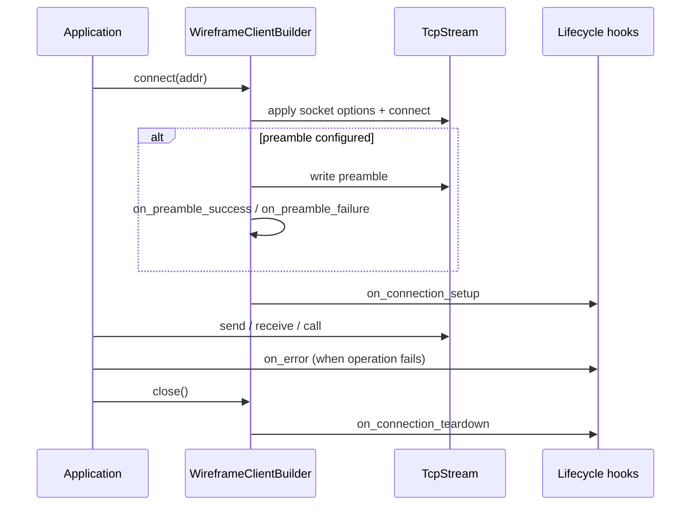
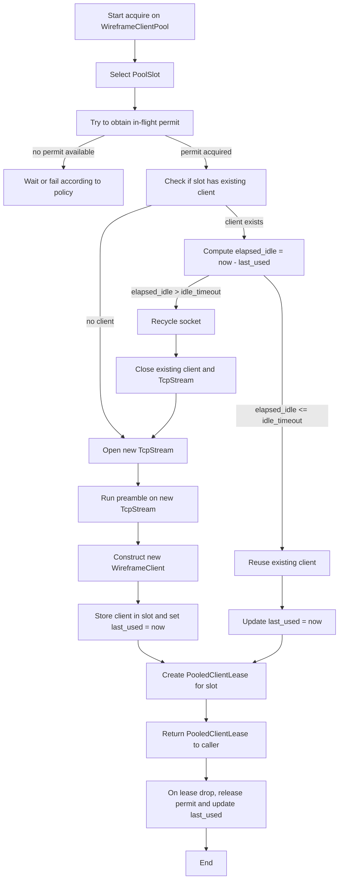

# Client support in Wireframe

This document proposes an initial design for adding client-side protocol
support to `wireframe`. The goal is to reuse the existing framing,
serialization, and message abstractions while providing a small API for
connecting to a server and exchanging messages.

## Motivation

The library currently focuses on server development. However, the core layers
are intentionally generic: transport adaptors, framing, serialization, routing,
and middleware form a pipeline that is largely independent of server-specific
logic. The design document outlines these layers, which process frames from raw
bytes to typed messages and back[^1]. Reusing these pieces enables the
implementation of a lightweight client without duplicating protocol code.

## Core components

### `WireframeClient`

A new `WireframeClient` type manages a single connection to a server. It
mirrors `WireframeServer` but operates in the opposite direction:

- Connect to a `TcpStream`, applying `SocketOptions` before the handshake.
- Optionally, send a preamble using the existing `Preamble` helpers.
- Encode outgoing messages using the selected `Serializer` and
  `tokio_util::codec::LengthDelimitedCodec` (4‑byte big‑endian prefix by
  default; configurable). Configure the codec’s `max_frame_length` on both the
  inbound (decode) and outbound (encode) paths to match the server’s frame
  capacity; otherwise, frames larger than the configured limit will fail.
- Decode incoming frames into typed responses.
- Expose async `send` and `receive` operations.

### Builder pattern

A `WireframeClient::builder()` method configures the client:

```rust
use std::net::SocketAddr;

use wireframe::{
    client::WireframeClient,
    serializer::BincodeSerializer,
};

let addr: SocketAddr = "127.0.0.1:7878".parse()?;
let client = WireframeClient::builder()
    .serializer(BincodeSerializer)
    .max_frame_length(1024)
    .connect(addr)
    .await?;
```

The same `Serializer` trait used by the server is reused here, ensuring
messages are encoded consistently while framing is handled by the
length‑delimited codec.

### Client configuration reference

| Surface          | API                                          | Default                                                     | Use when                                                                   |
| ---------------- | -------------------------------------------- | ----------------------------------------------------------- | -------------------------------------------------------------------------- |
| Serializer       | `WireframeClient::builder().serializer(...)` | `BincodeSerializer`                                         | Client and server must share a non-default encoding contract.              |
| Codec framing    | `codec_config(ClientCodecConfig)`            | 4-byte big-endian length prefix, 1024-byte max frame length | Align with server `buffer_capacity` and protocol frame size limits.        |
| Socket tuning    | `socket_options(SocketOptions)`              | OS defaults                                                 | Enable `TCP_NODELAY`, keepalive, or buffer sizing policies.                |
| Preamble payload | `with_preamble(T)`                           | Disabled                                                    | Protocol requires version or capability negotiation before framed traffic. |
| Preamble timeout | `preamble_timeout(Duration)`                 | No timeout unless configured                                | Fail fast when servers stall during preamble exchange.                     |
| Setup hook       | `on_connection_setup(...)`                   | Disabled                                                    | Store per-connection state for metrics, auth context, or counters.         |
| Teardown hook    | `on_connection_teardown(...)`                | Disabled                                                    | Flush metrics and release per-connection resources on `close()`.           |
| Error hook       | `on_error(...)`                              | Disabled                                                    | Centralize client transport/decode/correlation error reporting.            |
| Tracing config   | `tracing_config(TracingConfig)`              | INFO connect/close, DEBUG data ops, timing off              | Customize tracing span levels and per-command timing.                      |

### Request/response helpers

To keep the API simple, `WireframeClient` offers a `call` method that sends a
message implementing `Message` and waits for the next response frame:

```rust
let request = Login { username: "guest".into() };
let response: LoginAck = client.call(&request).await?;
```

Internally, this uses the `Serializer` to encode the request, sends it through
the length‑delimited codec, then waits for a frame, decodes it, and
deserializes the response type.

#### Request/response error mapping

Client request/response failures are mapped to `WireframeError` variants, so
client and server semantics stay aligned:

- Transport failures (socket closure, read/write failures) surface as
  `ClientError::Wireframe(WireframeError::Io(_))`.
- Decode failures after a frame is received surface as
  `ClientError::Wireframe(WireframeError::Protocol(ClientProtocolError::Deserialize(_)))`.

This mapping applies to `receive`, `call`, and envelope-aware receive/call
methods. Serialization failures remain explicit as `ClientError::Serialize(_)`
because they occur before the transport layer is used.

### Streaming parity validation

Client streaming parity is validated against the server's priority queue and
rate-limiter behaviour by driving `ConnectionActor` output through the client
streaming consumer. This avoids duplicating queue logic in client-only test
harnesses and ensures both sides are exercised under the same behavioural
contracts.

The parity checks cover two guarantees:

- Interleaved high- and low-priority pushes maintain fairness under configured
  `FairnessConfig` thresholds.
- Rate limiting remains cross-priority and symmetric, so one priority cannot
  bypass limits imposed on another.

This validation was added for roadmap item `16.3.2` and does not introduce new
public client API methods.

### In-process server and client pair harness

Roadmap item `17.3.2` adds a reusable harness in `wireframe_testing` that
starts a `WireframeServer` and a connected `WireframeClient` inside one test
process. "In-process" means both sides run in the same process and communicate
over a real loopback TCP socket, keeping compatibility checks honest while
remaining fast and deterministic.

The harness lives in `wireframe_testing::client_pair` rather than the
main-crate `wireframe::testkit` module because the feature is test-only and the
companion crate already owns reusable testing utilities. Placing it there
avoids widening the optional production-crate feature surface without proof
that consumers need it re-exported from `wireframe` itself.

The primary entry point is `spawn_wireframe_pair`, which accepts an app factory
closure and a client-builder configuration closure. Callers that need no client
customization can use `spawn_wireframe_pair_default` instead. The helper
reserves a loopback listener via `unused_listener()`, binds the server through
`WireframeServer::bind_existing_listener`, waits for a readiness signal, and
connects a client. If the client connection fails, the server task is torn down
before the error is returned so that no orphaned tasks or bound listeners leak
into subsequent tests. The returned `WireframePair` exposes the connected
client through `client_mut()` and offers an explicit `shutdown().await` path. A
defensive `Drop` implementation sends the shutdown signal and immediately
aborts the server task if explicit shutdown was skipped.

Streaming responses still borrow the client exclusively through `client_mut()`,
preserving Rust's ownership rules at the call site.

### Implementation decisions

- `connect` accepts a `SocketAddr` so the client can create a `TcpSocket` and
  apply socket options before connecting.
- `ClientCodecConfig` captures the length prefix format and maximum frame
  length, clamping the frame length to match server bounds (64 bytes to 16 MiB).
- The default `max_frame_length` is 1024 bytes to mirror the server builder’s
  default buffer capacity.

### Connection lifecycle

The client builder exposes lifecycle hooks that mirror the server's hook
system, enabling consistent instrumentation across client and server:

- **Setup hook** (`on_connection_setup`): Runs after TCP connection and
  preamble exchange (if configured) succeed. Returns connection-specific state
  of type `C` stored in the client for the connection's lifetime. The setup
  callback must be an `FnOnce` closure returning a `Future` that produces `C`.

- **Teardown hook** (`on_connection_teardown`): Runs when `close()` is called.
  Receives the state `C` produced by the setup hook. The teardown hook only
  executes if a setup hook was configured and successfully produced state.

- **Error hook** (`on_error`): Runs when errors occur during `send`, `receive`,
  or `call` operations. Receives a reference to the `ClientError` for logging
  or metrics. This hook is independent of the setup/teardown pair.

```rust
use std::sync::atomic::{AtomicUsize, Ordering};

struct SessionState {
    request_count: AtomicUsize,
}

let client = WireframeClient::builder()
    .on_connection_setup(|| async {
        SessionState { request_count: AtomicUsize::new(0) }
    })
    .on_connection_teardown(|state: SessionState| async move {
        println!("Session ended after {} requests",
            state.request_count.load(Ordering::SeqCst));
    })
    .on_error(|err| async move {
        eprintln!("Client error: {err}");
    })
    .connect(addr)
    .await?;

// Use the client...
client.close().await; // Teardown hook invoked here
```

The builder uses a type-changing pattern for `on_connection_setup`: calling it
changes the `C` type parameter from the default `()` to the user's state type.
This ensures type safety—teardown callbacks must accept the exact state type
produced by setup.

For screen readers: the following sequence diagram shows the client connection
lifecycle from connect through teardown.


```mermaid
sequenceDiagram
    participant App as Application
    participant Builder as WireframeClientBuilder
    participant TCP as TcpStream
    participant Hooks as Lifecycle hooks
    App->>Builder: connect(addr)
    Builder->>TCP: apply socket options + connect
    alt preamble configured
        Builder->>TCP: write preamble
        Builder->>Builder: on_preamble_success / on_preamble_failure
    end
    Builder->>Hooks: on_connection_setup
    App->>TCP: send / receive / call
    App->>Hooks: on_error (when operation fails)
    App->>Builder: close()
    Builder->>Hooks: on_connection_teardown
```

### Request hooks

The client supports **request hooks** that fire on every outgoing and incoming
frame, providing symmetric instrumentation with the server's `before_send` hook
in `src/hooks.rs`.

- **`before_send`**: `Arc<dyn Fn(&mut Vec<u8>) + Send + Sync>`. Invoked after
  serialization, before each frame is written to the transport. Registered via
  `WireframeClientBuilder::before_send()`. Multiple hooks execute in
  registration order.

- **`after_receive`**: `Arc<dyn Fn(&mut BytesMut) + Send + Sync>`. Invoked
  after each frame is read from the transport, before deserialization.
  Registered via `WireframeClientBuilder::after_receive()`. Multiple hooks
  execute in registration order.

Hooks are stored in a `RequestHooks` struct (analogous to `LifecycleHooks`)
with two fields: `before_send: Vec<BeforeSendHook>` and
`after_receive: Vec<AfterReceiveHook>`.

**Design rationale — synchronous hooks**: The `ResponseStream::poll_next`
implementation is synchronous (`fn poll_next`). Async hooks would require
spawning tasks or blocking within a poll context, which is unsound. The
server's equivalent `before_send` hook in `src/hooks.rs` is also synchronous
(`FnMut`). Frame-level hooks operate on raw bytes in memory and do not require
I/O. Users needing async operations (e.g., fetching a token from a remote
service) should perform them in the lifecycle `on_connection_setup` hook and
store the result in connection state, which the synchronous request hook can
then read via captured `Arc` state.

**Design rationale — `Arc<dyn Fn>` not `Box<dyn FnMut>`**: Hooks are stored
behind shared references. The existing lifecycle hooks use
`Arc<dyn Fn(...) + Send + Sync>`. `Fn` (not `FnMut`) is required because hooks
are invoked through `&self` methods. Users who need mutable state capture an
`Arc<AtomicUsize>` or `Arc<Mutex<_>>` in the closure.

**Design rationale — raw bytes, not typed messages**: Hooks operate on raw
bytes (`&mut Vec<u8>` outgoing, `&mut BytesMut` incoming), not typed messages.
This matches the server's `before_send` hook which operates on the frame type.
Operating on typed messages would require hooks to be generic over every
message type, making storage impossible without type erasure. Raw-byte hooks
can universally inspect or modify the serialized payload.

**Integration points**: `before_send` is wired into `send()` (runtime.rs),
`send_envelope()` (messaging.rs), and `call_streaming()` (streaming.rs).
`after_receive` is wired into `receive_internal()` (messaging.rs) and
`ResponseStream::poll_next()` (response_stream.rs).

### Tracing instrumentation

Every client operation is wrapped in a `tracing` span with structured fields.
Span levels are configurable per-operation via `TracingConfig`, with sensible
defaults: `INFO` for lifecycle operations (connect, close) and `DEBUG` for
high-frequency data operations (send, receive, call, streaming). When no
`tracing` subscriber is installed, all instrumentation is zero-cost.

**Span hierarchy and field conventions:**

| Operation           | Span name                | Structured fields                          |
| ------------------- | ------------------------ | ------------------------------------------ |
| `connect()`         | `client.connect`         | `peer.addr`                                |
| `send()`            | `client.send`            | `frame.bytes`                              |
| `receive()`         | `client.receive`         | `frame.bytes` (deferred), `result`         |
| `send_envelope()`   | `client.send_envelope`   | `correlation_id`, `frame.bytes`            |
| `call()`            | `client.call`            | `result` (deferred)                        |
| `call_correlated()` | `client.call_correlated` | `correlation_id` (deferred), `result`      |
| `call_streaming()`  | `client.call_streaming`  | `correlation_id`, `frame.bytes` (deferred) |
| `close()`           | `client.close`           | (none)                                     |

**Per-frame streaming events**: `ResponseStream` emits `tracing::debug!` events
(not spans) on each received data frame and on stream termination:

- `stream frame received` with `frame.bytes`, `stream.frames_received`, and
  `correlation_id`.
- `stream terminated` with `stream.frames_total` and `correlation_id`.

**Per-command timing**: When enabled via `TracingConfig::with_*_timing(true)`,
an additional `tracing::debug!` event recording `elapsed_us` is emitted when
the operation completes. Timing events fire on both success and error paths.
Timing is disabled by default for all operations.

**Design rationale — async-safe span instrumentation**: `Span::enter()` guards
must not be held across `.await` points because a multi-threaded runtime may
poll the future on a different thread, causing the span to be "entered" on the
wrong thread. Client methods use `tracing::Instrument::instrument(span)` to
wrap async futures so the span is entered only while the future is polled and
exited between polls. For purely synchronous sections,
`Span::in_scope(|| { ... })` is the correct pattern. See the
[`tracing::Instrument`][instrument-docs] trait and the
[`#[tracing::instrument]`][attr-docs] attribute for further guidance.

[instrument-docs]: https://docs.rs/tracing/latest/tracing/trait.Instrument.html
[attr-docs]: https://docs.rs/tracing/latest/tracing/attr.instrument.html

**Design rationale — `dynamic_span!` macro**: The `tracing` crate requires
compile-time level constants in `span!` macros. To support user-configurable
levels per operation, a `macro_rules!` macro in `tracing_helpers.rs` matches on
the five `Level` variants, delegating to the corresponding
`tracing::<level>_span!` macro per branch. Each branch has static metadata
while branch selection is dynamic.

**Design rationale — `ResponseStream` events, not spans**: Creating spans
inside `poll_next` is problematic because it is synchronous and called many
times. Events are lightweight and appropriate for per-frame diagnostics.

### Preamble support

The client builder now supports an optional preamble exchange. Use
`with_preamble` to send a typed preamble after TCP connect completes:

```rust
use std::time::Duration;
use futures::FutureExt;

#[derive(bincode::Encode)]
struct ClientHello { version: u16 }

let client = WireframeClient::builder()
    .with_preamble(ClientHello { version: 1 })
    .preamble_timeout(Duration::from_secs(5))
    .on_preamble_success(|_preamble, stream| {
        async move {
            // Read server response, return leftover bytes
            Ok(Vec::new())
        }
        .boxed()
    })
    .on_preamble_failure(|err, _stream| {
        async move {
            eprintln!("Preamble failed: {err}");
            Ok(())
        }
        .boxed()
    })
    .connect(addr)
    .await?;
```

The success callback runs after the preamble is written successfully and can
read the server's response (using `read_preamble` from the preamble module).
Any bytes read beyond the server's response must be returned as "leftover"
bytes for the framing layer to replay. The failure callback runs when the
preamble exchange fails due to timeout, I/O error, or encoding error. Invalid
acknowledgement bytes from the success callback currently surface as
`PreambleRead`, timeout expiry surfaces as `PreambleTimeout`, and write-side
transport failures inside `write_preamble(...)` are wrapped by `PreambleEncode`
because the helper returns `bincode::EncodeError`.

## Runnable echo-login example

```rust
#[tokio::main]
async fn main() -> Result<(), Box<dyn std::error::Error>> {
    use wireframe::{
        app::Envelope,
        client::WireframeClient,
        message::Message,
    };

    #[derive(bincode::Encode, bincode::BorrowDecode)]
    struct LoginRequest {
        username: String,
    }

    #[derive(bincode::Encode, bincode::BorrowDecode)]
    struct LoginAck {
        username: String,
    }

    let mut client = WireframeClient::builder()
        .connect("127.0.0.1:7878".parse()?)
        .await?;

    let request = LoginRequest {
        username: "guest".to_string(),
    };
    let envelope = Envelope::new(1, None, request.to_bytes()?);
    let response: Envelope = client.call_correlated(envelope).await?;
    let (ack, _) = LoginAck::from_bytes(response.payload_bytes())?;
    assert_eq!(ack.username, "guest");
    Ok(())
}
```

Run it with the existing echo server example:

```plaintext
# terminal 1
cargo run --example echo --features examples

# terminal 2
cargo run --example client_echo_login --features examples
```

### Troubleshooting

- Frame length mismatches: if the server rejects frames or the client reports
  transport I/O errors on larger payloads, ensure
  `ClientCodecConfig::max_frame_length` matches server `buffer_capacity`.
- Preamble failures: `PreambleTimeout` indicates a stalled handshake, and
  `PreambleRead` indicates invalid or misread acknowledgement bytes in the
  success callback. Current write-side transport failures are wrapped by
  `PreambleEncode`, so the docs should not direct users to rely on
  `PreambleWrite` yet.
- TLS or wrong-protocol mismatches: connecting a plain client to a Transport
  Layer Security (TLS) or other non-Wireframe port usually surfaces as
  `ClientError::Wireframe(WireframeError::Io(_))` after the first request.
- Correlation mismatch: `ClientError::CorrelationMismatch` indicates the
  response envelope did not preserve the request correlation identifier.
- Streaming borrow contention: `ResponseStream` holds `&mut WireframeClient`,
  so parallel `send`/`receive` calls must wait until the stream is dropped or
  drained.
- Typed streaming helpers: `StreamingResponseExt::typed_with` is the
  recommended ergonomic layer for multiplexed protocols that need to skip
  control frames while preserving the underlying `ResponseStream` transport and
  borrow semantics.
- Disconnects during calls: `ClientError::Wireframe(WireframeError::Io(_))`
  usually means peer closure or transport interruption; retry policies should
  treat these as network faults.

## Decision record for 16.4.1

- Decision: treat login acknowledgement in the echo example as the echoed login
  payload decoded as `LoginAck`.
- Rationale: roadmap item 16.4.1 explicitly targets the existing `echo` server.
  The echo server does not synthesize new response payloads, so decoding the
  echoed payload as the acknowledgement provides a runnable, typed, end-to-end
  demonstration without introducing server-only behaviour.

## Decision record for 17.2.1

- Decision: ship client pooling as a hybrid of `bb8` and Wireframe-owned slot
  admission.
- Implementation split:
  - each physical socket is backed by a dedicated `bb8` pool with
    `max_size = 1`;
  - `WireframeClientPool` owns multiple such slots, one per physical socket;
  - `PooledClientLease` forwards request methods (`send`, `receive`, `call`,
    `send_envelope`, `receive_envelope`, `call_correlated`) through its slot
    rather than dereferencing to a long-lived mutable `WireframeClient`.
- Rationale: this keeps socket lifecycle, reconnect, and idle recycle on
  battle-tested `bb8` machinery while preserving explicit Wireframe control
  over how many operations may target one warm socket.
- Preamble lifecycle:
  - preamble exchange runs once when `connect_pool` creates each physical
    socket;
  - warm reuse keeps the negotiated socket and does not replay preamble;
  - if a slot is idle past its configured timeout, the next checkout lazily
    recycles the socket and reruns the preamble.
- Admission semantics:
  - `max_in_flight_per_socket` is an admission budget, not a promise of
    parallel writes on one transport;
  - leases may coexist up to that budget, but actual socket I/O remains
    serialized by the slot's single checked-out client connection.
- For screen readers: the following flowchart shows how
  `WireframeClientPool::acquire()` selects a slot, enforces the per-socket
  admission limit, decides between warm reuse and idle recycle, reruns the
  preamble only for recycled or newly opened sockets, and returns a
  `PooledClientLease` whose drop releases the permit and refreshes slot usage
  time.


```mermaid
flowchart TD
    A[Start acquire on WireframeClientPool] --> B[Select PoolSlot]
    B --> C[Try to obtain in-flight permit]
    C -->|no permit available| D[Wait or fail according to policy]
    C -->|permit acquired| E[Check if slot has existing client]
    E -->|no client| F[Open new TcpStream]
    E -->|client exists| G[Compute elapsed_idle = now - last_used]

    G -->|elapsed_idle > idle_timeout| H[Recycle socket]
    G -->|elapsed_idle <= idle_timeout| I[Reuse existing client]

    H --> J[Close existing client and TcpStream]
    J --> F

    F --> K[Run preamble on new TcpStream]
    K --> L[Construct new WireframeClient]
    L --> M[Store client in slot and set last_used = now]

    I --> N[Update last_used = now]

    M --> O[Create PooledClientLease for slot]
    N --> O
    O --> P[Return PooledClientLease to caller]
    P --> Q[On lease drop, release permit and update last_used]
    Q --> R[End]
```

- Follow-up posture: if future roadmap items require deeper multiplex fairness
  or true per-socket concurrent transport use, revisit this boundary and decide
  whether to extend or replace the slot wrapper.

## Decision record for 17.3.1

- Decision: ship streaming-response consumption as a trait plus adaptor stream
  instead of a macro-first API.
- Rationale: `StreamingResponseExt::typed_with` keeps ordinary Rust control
  flow visible, makes the "map frame to optional item" contract explicit, and
  lets downstream protocols skip control frames without reimplementing the same
  `while let Some(result)` loop around `ResponseStream`.
- Constraint preserved: the helper remains additive. It wraps
  `ResponseStream`, so correlation validation, terminator handling, transport
  back-pressure, and the exclusive `&mut WireframeClient` borrow all continue
  to behave exactly as the base streaming API documents.

## Decision record for 17.2.2

- Decision: `PoolHandle` represents the fairness identity of one logical
  session, not affinity to one physical socket.
- Rationale: callers needed a durable identity so repeated pooled acquisition
  by one busy workflow could not crowd out other waiting workflows. Tying the
  handle to fairness instead of socket ownership preserves warm-socket reuse
  without implying transport pinning.
- Scheduling model:
  - `WireframeClientPool` now owns shared inner state plus a handle scheduler;
  - `pool.handle()` registers one stable logical-session ID;
  - blocked `PoolHandle::acquire()` calls queue against that scheduler, which
    obtains a real slot permit before waking the chosen handle.
- Fairness distinction:
  - slot rotation still decides which physical socket to try first across the
    pool's warm connections;
  - handle fairness decides which logical session receives the next lease when
    contention exists.
- Policy set:
  - `PoolFairnessPolicy::RoundRobin` is the default because it gives stable
    logical sessions turns in rotation under repeated contention;
  - `PoolFairnessPolicy::Fifo` is available when callers want blocked handles
    served strictly in arrival order.
- API boundary:
  - `PoolHandle` exposes fair `acquire()` plus safe whole-operation helpers
    such as `call()`;
  - `PooledClientLease` remains the low-level surface for split-phase workflows
    (`send` followed later by `receive`) because the pool still does not
    demultiplex arbitrary responses across shared handles.
- Back-pressure posture:
  - handle fairness is additive above the existing slot-permit budget;
  - the scheduler never bypasses `max_in_flight_per_socket`, serialized socket
    access, or idle recycle behaviour inherited from `17.2.1`.

## Decision record for 17.4.2

- Decision: document only the currently reachable troubleshooting surface for
  client preamble failures.
- Rationale: `ClientError::PreambleWrite` exists in the public enum, but the
  current preamble path calls `write_preamble(...)`, which returns
  `bincode::EncodeError` and therefore reports write-side failures via
  `ClientError::PreambleEncode`. The user guide and design notes should reflect
  current observable behaviour until the implementation exposes a dedicated
  write variant.
- Decision: frame TLS guidance as wrong-protocol troubleshooting, not as a
  built-in client capability.
- Rationale: roadmap item `18.3.1` still tracks first-party TLS guidance or
  middleware, so roadmap item `17.4.2` should help users diagnose a TLS port
  mismatch without implying native TLS transport support already exists.

## Future work

This initial design focuses on a basic request/response workflow. Future
extensions might include:

- Middleware support for outgoing and incoming frames.
- Extended per-socket multiplex control beyond the initial hybrid pool layer.
- Helper traits for streaming or multiplexed protocols.

By leveraging the existing abstractions for framing and serialization, client
support can share most of the server’s implementation while providing a small
ergonomic API.

[^1]: See
      [wireframe router design](rust-binary-router-library-design.md#implementation-details).
