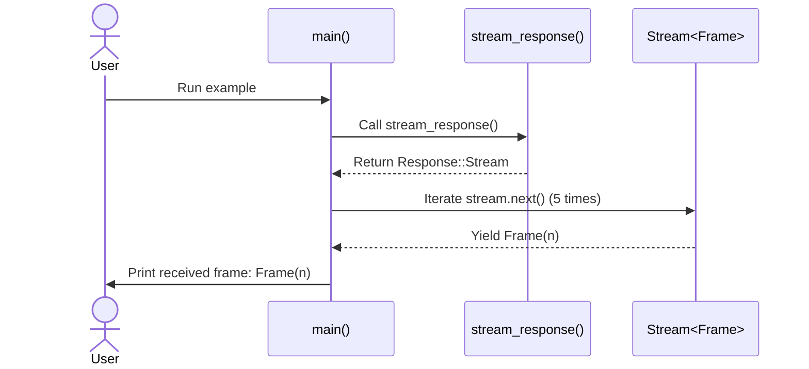
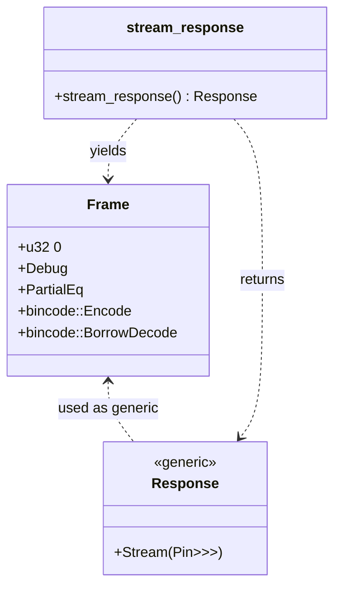

# Async Stream Example

This example demonstrates generating a `Response::Stream` using `async-stream`.
It returns five frames to illustrate the pattern.

```mermaid
sequenceDiagram
    actor User
    participant Main as main()
    participant StreamResp as stream_response()
    participant Stream as Stream<Frame>
    User->>Main: Run example
    Main->>StreamResp: Call stream_response()
    StreamResp-->>Main: Return Response::Stream
    Main->>Stream: Iterate stream.next() (5 times)
    Stream-->>Main: Yield Frame(n)
    Main->>User: Print received frame: Frame(n)
```

```mermaid
classDiagram
    class Frame {
        +u32 0
        +Debug
        +PartialEq
        +bincode::Encode
        +bincode::BorrowDecode
    }
    class Response {
        <<generic>>
        +Stream(Pin<Box<dyn Stream<Item=Result<T, E>>>>)
    }
    Frame <.. Response : used as generic
    class stream_response {
        +stream_response() Response<Frame>
    }
    stream_response ..> Response : returns
    stream_response ..> Frame : yields
```
