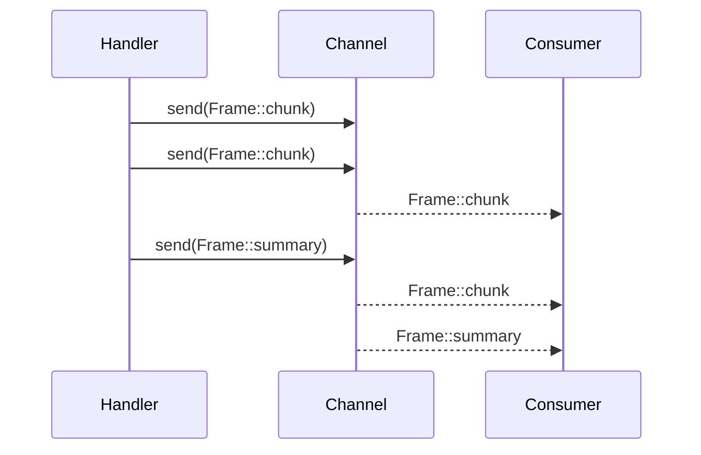

# Multi-Packet Response Example

This example shows how to build a multi-packet response with
`Response::with_channel`. The handler creates a bounded channel, spawns workers
that stream transcript lines as frames, and then emits a summary once every
chunk has been delivered. The consumer converts the response into a stream and
prints each frame as it arrives.

Run the example with `cargo run --example multi_packet`.
