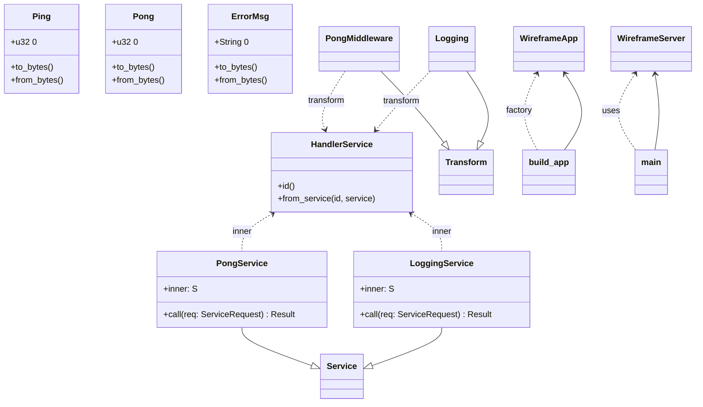

# Ping-Pong Example

This example demonstrates routing, serialization, and middleware usage in a
small ping/pong protocol. The server accepts a `Ping` message containing a
counter and responds with a `Pong` containing the incremented value. Logging
middleware prints each request and response.

